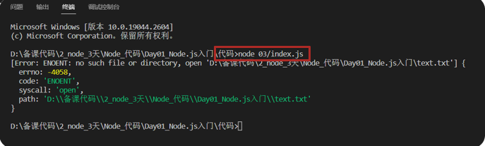
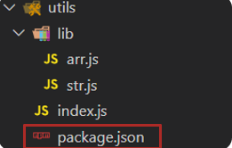

## Node.js入门
### 什么是 Node.js

1. Node.js 是一个独立的 JavaScript 运行环境，能独立执行 JS 代码，因为这个特点，它可以用来编写服务器后端的应用程序

2. Node.js 作用除了编写后端应用程序，也可以对前端代码进行压缩，转译，整合等等，提高前端开发和运行效率

3. Node.js 基于Chrome V8 引擎封装，独立执行 JS 代码，但是语法和浏览器环境的 V8 有所不同，没有 document 和 window 但是都支持 ECMAScript 标准的代码语法

4. Node.js 没有图形化界面，需要使用 cmd 终端命令行（利用一些命令来操控电脑执行某些程序软件）输入，node -v 检查是否安装成功

   ```bash
   node -v
   ```

5. 需求：新建 index.js 文件，编写打印代码和 for 循环打印 3 个 6

   ```js
   /**
    * 目标：编写 js 代码，用 node 命令执行
    * 终端作用：敲击命令，调用对应程序执行
    * 终端打开：目标文件->右键->在集成终端中打开
    * 命令：node xxx.js （注意路径）
    */
   console.log('Hello, World')
   for (let i = 0; i < 3; i++) {
     console.log(6)
   }
   ```
   
6. Node.js 执行目标 JS 文件，需要使用 node xxx.js 命令来执行
### fs模块-读写文件

1. 模块：类似插件，封装了方法和属性供我们使用

2. fs 模块：封装了与本机文件系统进行交互的，方法和属性

3. fs 模块使用语法如下：

   * 加载 fs 模块，得到 fs 对象

     ```js
     const fs = require('fs')
     ```

   * 写入文件内容语法：

     ```js
     fs.writeFile('文件路径', '写入内容', err => {
       // 写入后的回调函数
     })
     ```

   * 读取文件内容的语法：

     ```js
     fs.readFile('文件路径', (err, data) => {
       // 读取后的回调函数
       // data 是文件内容的 Buffer 数据流
     })
     ```

4. 需求：向 test.txt 文件写入内容并读取打印

   ```js
   /**
    * 目标：使用 fs 模块，读写文件内容
    * 语法：
    * 1. 引入 fs 模块
    * 2. 调用 writeFile 写入内容
    * 3. 调用 readFile  读取内容
    */
   // 1. 引入 fs 模块
   const fs = require('fs')
   // 2. 调用 writeFile 写入内容
   // 注意：建议写入字符串内容，会覆盖目标文件所有内容
   fs.writeFile('./text.txt', '欢迎使用 fs 模块读写文件内容', err => {
     if (err) console.log(err)
     else console.log('写入成功')
   })
   // 3. 调用 readFile  读取内容
   fs.readFile('./text.txt', (err, data) => {
     if (err) console.log(err)
     else console.log(data.toString()) // 把 Buffer 数据流转成字符串类型
   })
   ```
### path模块-路径处理

1. 为什么在 Node.js 待执行的 JS 代码中要用绝对路径：

   > Node.js 执行 JS 代码时，代码中的路径都是==以终端所在文件夹出发==查找相对路径，而不是以我们认为的从代码本身出发，会遇到问题，所以在 Node.js 要执行的代码中，访问其他文件，建议使用绝对路径

2. 新建 03 文件夹编写待执行的 JS 代码，访问外层相对路径下的文件，<span style="color: red;">然后在最外层终端路径来执行目标文件，造成问题</span>

   
   

3. 问题原因：就是从代码文件夹出发，使用`../text.txt`解析路径，找不到目标文件，报错了！

4. 解决方案：使用模块内置变量 `__dirname`配合 path.join() 来得到绝对路径使用
>`__dirname`是一个内置变量,可以获取当前模块目录的绝对路径,使用path.join()可以按照平台给出分隔符,连接传入的路径,并且会把路径中已有的分隔符也转化为对应平台的分隔符

   ```js
   const fs = require('fs')
   console.log(__dirname) // D:\备课代码\2_node_3天\Node_代码\Day01_Node.js入门\代码\03
   
   // 1. 加载 path 模块
   const path = require('path')
   // 2. 使用 path.join() 来拼接路径
   const pathStr = path.join(__dirname, '..', 'text.txt')
   console.log(pathStr)
   
   fs.readFile(pathStr, (err, data) => {
     if (err) console.log(err)
     else console.log(data.toString())
   })
   ```

6. 再次执行查看问题就被修复了！以后在 Node.js 要执行的 JS 代码中访问其他文件的路径，都建议使用绝度路径

### 压缩前端html

1. 前端工程化：前端代码压缩，整合，转译，测试，自动部署等等工具的集成统称，为了提高前端开发项目的效率

2. 需求：把准备好的 html 文件里的回车符（\r）和换行符（\n）去掉进行压缩，写入到新 html 中

3. 步骤：

   1. 读取源 html 文件内容
   2. 正则替换字符串
   3. 写入到新的 html 文件中，并运行查看是否能正常打开网页

4. 代码如下：

   ```js
   /**
    * 目标一：压缩 html 里代码
    * 需求：把 public/index.html 里的，回车/换行符去掉，写入到 dist/index.html 中
    *  1.1 读取 public/index.html 内容
    *  1.2 使用正则替换内容字符串里的，回车符\r 换行符\n
    *  1.3 确认后，写入到 dist/index.html 内
    */
   const fs = require('fs')
   const path = require('path')
   // 1.1 读取 public/index.html 内容
   fs.readFile(path.join(__dirname, 'public', 'index.html'), (err, data) => {
     const htmlStr = data.toString()
     // 1.2 使用正则替换内容字符串里的，回车符\r 换行符\n
     const resultStr = htmlStr.replace(/[\r\n]/g, '')
     // 1.3 确认后，写入到 dist/index.html 内
     fs.writeFile(path.join(__dirname, 'dist', 'index.html'), resultStr, err => {
       if (err) console.log(err)
       else console.log('压缩成功')
     })
   })
   ```
### http模块-创建Web服务

1. 需求：引入 http 模块，使用相关语法，创建 Web 服务程序，响应返回给请求方一句提示 ‘hello，world’

2. 步骤：

   1. 引入 http 模块，创建 Web 服务对象
   2. 监听 request 请求事件，对本次请求，做一些响应处理
   3. 启动 Web 服务监听对应端口号
   4. 运行本服务在终端进程中，用浏览器发起请求

3. 注意：本机的域名叫做 localhost

4. 代码如下：

   ```js
   /**
    * 目标：基于 http 模块创建 Web 服务程序
    *  1.1 加载 http 模块，创建 Web 服务对象
    *  1.2 监听 request 请求事件，设置响应头和响应体
    *  1.3 配置端口号并启动 Web 服务
    *  1.4 浏览器请求（http://localhost:3000）测试
    */
   // 1.1 加载 http 模块，创建 Web 服务对象
   const http = require('http')
   const server = http.createServer()
   // 1.2 监听 request 请求事件，设置响应头和响应体
   server.on('request', (req, res) => {
     // 设置响应头-内容类型-普通文本以及中文编码格式
     res.setHeader('Content-Type', 'text/plain;charset=utf-8')
     // 设置响应体内容，结束本次请求与响应
     res.end('欢迎使用 Node.js 和 http 模块创建的 Web 服务')
   })
   // 1.3 配置端口号并启动 Web 服务
   server.listen(3000, () => {
     console.log('Web 服务启动成功了')
   })
   ```
### 案例-浏览时钟

1. 需求：基于 Web 服务，开发提供网页资源的功能，了解下后端的代码工作过程
   

2. 步骤：

   1. 基于 http 模块，创建 Web 服务
   2. 使用 req.url 获取请求资源路径为 /index.html 的时候，读取 index.html 文件内容字符串返回给请求方
   3. 其他路径，暂时返回不存在的提示
   4. 运行 Web 服务，用浏览器发起请求

3. 代码如下：

   ```js
   /**
    * 目标：编写 web 服务，监听请求的是 /index.html 路径的时候，返回 dist/index.html 时钟案例页面内容
    * 步骤：
    *  1. 基于 http 模块，创建 Web 服务
    *  2. 使用 req.url 获取请求资源路径，并读取 index.html 里字符串内容返回给请求方
    *  3. 其他路径，暂时返回不存在提示
    *  4. 运行 Web 服务，用浏览器发起请求
    */
   const fs = require('fs')
   const path = require('path')
   // 1. 基于 http 模块，创建 Web 服务
   const http = require('http')
   const server = http.createServer()
   server.on('request', (req, res) => {
     // 2. 使用 req.url 获取请求资源路径，并读取 index.html 里字符串内容返回给请求方
     if (req.url === '/index.html') {
       fs.readFile(path.join(__dirname, 'dist/index.html'), (err, data) => {
         res.setHeader('Content-Type', 'text/html;charset=utf-8')
         res.end(data.toString())
       })
     } else {
       // 3. 其他路径，暂时返回不存在提示
       res.setHeader('Content-Type', 'text/html;charset=utf-8')
       res.end('你要访问的资源路径不存在')
     }
   })
   server.listen(8080, () => {
     console.log('Web 服务启动了')
   })
   ```
## Node.js模块化
### 模块化简介

1. 在 Node.js 中每个文件都被当做是一个独立的模块，模块内定义的变量和函数都是独立作用域的，因为 Node.js 在执行模块代码时，将使用如下所示的函数封装器对其进行封装

   
​	
2. 而且项目是由多个模块组成的，每个模块之间都是独立的，而且提高模块代码复用性，按需加载，独立作用域
   

3. 但是因为模块内的属性和函数都是私有的，如果对外使用，需要使用标准语法导出和导入才可以，而这个标准叫 CommonJS 标准

4. 需求：定义 utils.js 模块，封装基地址和求数组总和的函数，导入到 index.js 使用查看效果

   

5. 导出语法：

   ```js
   module.exports = {
     对外属性名: 模块内私有变量
   }
   ```

6. 导入语法：

   ```js
   const 变量名 = require('模块名或路径')
   // Node.js 环境内置模块直接写模块名（例如：fs，path，http）
   // 自定义模块：写模块文件路径（例如：./utils.js)
   ```

   > 变量名的值接收的就是目标模块导出的对象

7. 代码实现

   * utils.js：导出

     ```js
     /**
      * 目标：基于 CommonJS 标准语法，封装属性和方法并导出
      */
     const baseURL = 'http://hmajax.itheima.net'
     const getArraySum = arr => arr.reduce((sum, item) => sum += item, 0)
     
     // 导出
     module.exports = {
       url: baseURL,
       arraySum: getArraySum
     }
     ```

   * index.js：导入使用

     ```js
     /**
      * 目标：基于 CommonJS 标准语法，导入工具属性和方法使用
      */
     // 导入
     const obj = require('./utils.js')
     console.log(obj)
     const result = obj.arraySum([5, 1, 2, 3])
     console.log(result)
     ```
>在导入时,如果是node自带的模块,可以直接写模块的名字(如fs,http等),如果是自己写的模块就需要写文件路径了(./utiles.js)
### ECMAScript标准-默认导出和导入

1. CommonJS 规范是 Node.js 环境中默认的，后来官方推出 ECMAScript 标准语法，我们接下来在一个需求中，体验下这个标准中默认导出和导入的语法要如何使用

1. 需求：封装并导出基地址和求数组元素和的函数，导入到 index.js 使用查看效果

1. 导出语法：

   ```js
   export default {
     对外属性名: 模块内私有变量
   }
   ```

1. 导入语法：

   ```js
   import 变量名 from '模块名或路径'
   ```

   > 变量名的值接收的就是目标模块导出的对象

5. 注意：Node.js ==默认只支持 CommonJS 标准语法==，如果想要在当前项目环境下使用 ECMAScript 标准语法，请新建 package.json 文件设置 type: 'module' 来进行设置

   ```json
   { “type”: "module" }
   ```
   
6. 代码实现：

   * utils.js：导出

     ```js
     /**
      * 目标：基于 ECMAScript 标准语法，封装属性和方法并"默认"导出
      */
     const baseURL = 'http://hmajax.itheima.net'
     const getArraySum = arr => arr.reduce((sum, item) => sum += item, 0)
     
     // 默认导出
     export default {
       url: baseURL,
       arraySum: getArraySum
     }
     ```

   * index.js：导入

     ```js
     /**
      * 目标：基于 ECMAScript 标准语法，"默认"导入，工具属性和方法使用
      */
     // 默认导入
     import obj from './utils.js'
     console.log(obj)
     const result = obj.arraySum([10, 20, 30])
     console.log(result)
     ```
### ECMAScript标准-命名导出和导入

1. ECMAScript 标准的语法有很多，常用的就是默认和命名导出和导入

2. 需求：封装并导出基地址和数组求和函数，导入到 index.js 使用查看效果

3. 命名导出语法：

   ```js
   export 修饰定义语句
   ```

4. 命名导入语法：

   ```js
   import { 同名变量 } from '模块名或路径'
   ```

   > 注意：同名变量指的是模块内导出的变量名

5. 代码示例：

   * utils.js 导出

     ```js
     /**
      * 目标：基于 ECMAScript 标准语法，封装属性和方法并"命名"导出
      */
     export const baseURL = 'http://hmajax.itheima.net'
     export const getArraySum = arr => arr.reduce((sum, item) => sum += item, 0)
     
     ```

   * index.js 导入

     ```js
     /**
      * 目标：基于 ECMAScript 标准语法，"命名"导入，工具属性和方法使用
      */
     // 命名导入
     import {baseURL, getArraySum} from './utils.js'
     console.log(obj)
     console.log(baseURL)
     console.log(getArraySum)
     const result = getArraySum([10, 21, 33])
     console.log(result)
     ```

6. 与默认导出如何选择：

   * 按需加载，使用命名导出和导入
   * 全部加载，使用默认导出和导入
### 包的概念

1. 包：将模块，代码，其他资料整合成一个文件夹，这个文件夹就叫包

2. 包分类：

   * 项目包：主要用于编写项目和业务逻辑
   * 软件包：封装工具和方法进行使用

3. 包要求：根目录中，必须有 package.json 文件（记录包的清单信息）

   

   
4. 包使用：在引入一个包文件夹到代码中，默认引入的是包文件节下的 index.js 模块文件里导出的对象，如果没有 index.js 文件，则会引入 package.json 里 main 属性指定的文件模块导出的对象

5. 需求：封装数组求和函数的模块，封装判断用户名和密码长度函数的模块，形成一个软件包，并导入到 index.js 中使用查看效果

6. 代码示例：

   * utils/lib 相关代码在素材里准备好了，只需要自己在 utils/index.js 统一出口进行导出

     ```js
     /**
      * 本文件是，utils 工具包的唯一出口
      * 作用：把所有工具模块方法集中起来，统一向外暴露
      */
     const { getArraySum } = require('./lib/arr.js')
     const { checkUser, checkPwd } = require('./lib/str.js')
     
     // 统一导出所有函数
     module.exports = {
       getArraySum,
       checkUser,
       checkPwd
     }
     
     ```

   * index.js 导入软件包文件夹使用（注意：这次导入的是包文件夹，不是模块文件）

     ```js
     /**
      * 目标：导入 utils 软件包，使用里面封装的工具函数
      */
     const obj = require('./utils')
     console.log(obj)
     const result = obj.getArraySum([10, 20, 30])
     console.log(result)
     ```
### npm软件包管理器

### 讲解

1. npm 简介[链接]([http://dev.nodejs.cn/learn/an-introduction-to-the-npm-package-manager#npm-%E7%AE%80%E4%BB%8B](http://dev.nodejs.cn/learn/an-introduction-to-the-npm-package-manager))： 软件包管理器，用于下载和管理 Node.js 环境中的软件包
   

2. npm 使用步骤：

   3. 初始化清单文件： npm init -y （得到 package.json 文件，有则跳过此命令,-y表示配置都为默认的）

      > 注意 -y 就是所有选项用默认值，所在文件夹不要有中文/特殊符号，建议英文和数字组成，因为 npm 包名限制建议用英文和数字或者下划线中划线

   4. 下载软件包：npm i 软件包名称

   5. 使用软件包

6. 具体使用流程图：
   
### npm安装所有依赖

1. 如何得到需要的所有依赖软件包？

   > 直接在项目目录下，运行终端命令：npm i 即可安装 package.json 里记录的所有包和对应版本到本项目中的 node_modules

   
### npm全局软件包

1. 软件包区别：
   * 本地软件包：当前项目内使用，==封装属性和方法==，存在于 node_modules
   * 全局软件包：本机所有项目使用,==封装命令和工具==，存在于系统设置的位置

1. nodemon 作用：替代 node 命令，检测代码更改，自动重启程序
2. 使用：
   3. 安装：npm i nodemon -g （-g 代表安装到全局环境中）
   4. 运行：nodemon 待执行的目标 js 文件
5. 需求：使用 nodemon 命令来启动素材里准备好的项目，然后修改代码保存后，观察终端重启应用程序
### Node.js概念和常用命令总结

1. Node.js 模块化：把每个文件当做一个模块，独立作用域，按需加载，使用特定标准语法导出和导入使用

   > CommonJS 标准：一般应用在 Node.js 项目环境中
   >
   > ECMAScript 标准：一般应用在前端工程化项目中

   

   

2. Node.js 包：把模块文件，代码文件，其他资料聚合成一个文件夹就是包

   > 项目包：编写项目需求和业务逻辑的文件夹
   >
   > 软件包：封装工具和方法进行使用的文件夹（一般使用 npm 管理）
   >
   > * 本地软件包：作用在当前项目，封装的属性/方法，供项目调用编写业务需求
   > * 全局软件包：作用在所有项目，一般封装的命令/工具，支撑项目运行

   

3. Node.js 常用命令：

   
>删除全局软件包也需要加-g