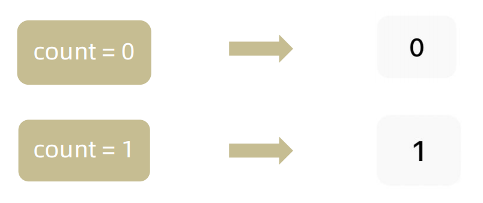

# React介绍
React由Meta公司开发，是一个用于 构建Web和原生交互界面的库
![[Pasted image 20250923162435.png]]
# 开发环境创建
create-react-app是一个快速创建React开发环境的工具，底层由Webpack构件，封装了配置细节，开箱即用
执行命令：
```bash
npx create-react-app <项目名称>
```

1. npx -  Node.js工具命令，查找并执行后续的包命令
2. create-react-app - 核心包（固定写法），用于创建React项目
之后使用npm start 即可启动项目

>创建React项目的更多方式 [https://zh-hans.react.dev/learn/start-a-new-react-project](https://zh-hans.react.dev/learn/start-a-new-react-project)
## 项目结构
>此处只保留了必须的文件和结构

![[Pasted image 20250923164135.png]]
App.js : 项目的根组件
```js
function App() {
  return (
    <div className="App">
      this is App
    </div>
  );
}

export default App;
```
index.js : 程序的入口
```js
import React from 'react'
import ReactDOM from 'react-dom/client' 
import App from './App' // 根组件

const root = ReactDOM.createRoot(document.getElementById('root')) // 渲染App到root节点
root.render(<App />)
```
# JSX基础
## 什么是JSX
> 概念：JSX是JavaScript和XMl(HTML)的缩写，表示在JS代码中编写HTML模版结构，它是React中构建UI的方式

```jsx
const message = 'this is message'

function App(){
  return (
    <div>
      <h1>this is title</h1>
      {message}
    </div>
  )
}
```
优势：

1. HTML的声明式模版写法
2. JavaScript的可编程能力
## JSX的本质
> JSX并不是标准的JS语法，它是 JS的语法扩展，浏览器本身不能识别，需要通过解析工具做解析之后才能在浏览器中使用


## JS表达式
> 在JSX中可以通过 `大括号语法{}` 识别JavaScript中的表达式，比如常见的变量、函数调用、方法调用等等

1. 使用引号传递字符串
2. 使用JS变量
3. 函数调用和方法调用
4. 使用JavaScript对象

>注意：if语句、switch语句、变量声明不属于表达式，不能出现在{}中
```jsx
const message = 'this is message'

function getAge(){
  return 18
}

function App(){
  return (
    <div>
      <h1>this is title</h1>
      {/* 字符串识别 */}
      {'this is str'}
      {/* 变量识别 */}
      {message}
      {/* 函数调用 渲染为函数的返回值 */}
      {getAge()}
	  {/* 使用js对象 */}
      <div style={{ color: 'red' }}>test</div>
    </div>
  )
}
```
## 列表渲染

> 在JSX中可以使用原生js种的`map方法` 实现列表渲染,会把返回的list中的所有都渲染到页面中

```jsx
const list = [
  {id:1001, name:'Vue'},
  {id:1002, name: 'React'},
  {id:1003, name: 'Angular'}
]

function App(){
  return (
    <ul>
      {list.map(item=><li key={item.id}>{item}</li>)}
    </ul>
  )
}
```
>遍历渲染时每一个元素都需要带有一个唯一的key,可以提高react的更新性能
## 条件渲染

> 在React中，可以通过逻辑与运算符&&、三元表达式(?:) 实现基础的条件渲染

1. && : 用于控制单一元素的显示与否,当flag为true则显示,否则不显示
2. 三元表达式 : 控制多个元素的显示

```jsx
const flag = true
const loading = false

function App(){
  return (
    <>
      {flag && <span>this is span</span>}
      {loading ? <span>loading...</span>:<span>this is span</span>}
    </>
  )
}
```
## 复杂条件渲染

> 需求：列表中需要根据文章的状态适配
> 解决方案：自定义函数 + 判断语句

```jsx
const type = 1  // 0|1|3

function getArticleJSX(){
  if(type === 0){
    return <div>无图模式模版</div>
  }else if(type === 1){
    return <div>单图模式模版</div>
  }else(type === 3){
    return <div>三图模式模版</div>
  }
}

function App(){
  return (
    <>
      { getArticleJSX() }
    </>
  )
}
```
# React的事件绑定
>react绑定的回调函数不能直接调用传参,想要传参的话就必须写lambda表达式,在返回值中传参
## 基础实现
> React中的事件绑定，通过语法 `on + 事件名称 = { 事件处理程序 }`，整体上遵循驼峰命名法

```jsx
function App(){
  const clickHandler = ()=>{
    console.log('button按钮点击了')
  }
  return (
    <button onClick={clickHandler}>click me</button>
  )
}
```
## 获取事件对象
> 在事件回调函数中设置形参e即可

```jsx
function App(){
  const clickHandler = (e)=>{
    console.log('button按钮点击了', e)
  }
  return (
    <button onClick={clickHandler}>click me</button>
  )
}
```
## 传递自定义参数
> 语法：事件绑定的位置改造成箭头函数的写法，在执行clickHandler实际处理业务函数的时候传递实参

```jsx
function App(){
  const clickHandler = (name)=>{
    console.log('button按钮点击了', name)
  }
  return (
    <button onClick={()=>clickHandler('jack')}>click me</button>
  )
}
```
>注意：不能直接写函数调用，这里事件绑定需要一个函数引用
## 同时传递事件对象和自定义参数
> 语法：在事件绑定的位置传递事件实参e和自定义参数，clickHandler中声明形参，注意顺序对应

```jsx
function App(){
  const clickHandler = (name,e)=>{
    console.log('button按钮点击了', name,e)
  }
  return (
    <button onClick={(e)=>clickHandler('jack',e)}>click me</button>
  )
}
```
# React组件基础使用
## 组件是什么
概念：一个组件就是一个用户界面的一部分，它可以有自己的逻辑和外观，组件之间可以互相嵌套，也可以服用多次


## 组件基础使用
> 在React中，一个组件就是**首字母大写的函数**，内部存放了组件的逻辑和视图UI, 渲染组件只需要把组件当成标签书写即可

```jsx
// 1. 定义组件
function Button(){
  return <button>click me</button>
}
// 表达式写法也是可以的
const Button = () => <button>click me</button>

// 2. 使用组件
function App(){
  return (
    <div>
      {/* 自闭和 */}
      <Button/>
      {/* 成对标签 */}
      <Button></Button>
    </div>
  )
}
```

# 组件状态管理-useState
## 基础使用
> useState 是一个 React Hook（函数），它允许我们向组件添加一个`状态变量`, 从而控制影响组件的渲染结果
> 和普通JS变量不同的是，状态变量一旦发生变化组件的视图UI也会跟着变化（数据驱动视图）
> 就类似vue把数据添加到了pinia中,需要通过方法修改,具有响应式


调用useState(val)即可获得val的响应式对象和修改方法,返回的是一个数组
```jsx
function App(){
  const [ count, setCount ] = React.useState(0)
  return (
    <div>
      <button onClick={()=>setCount(count+1)}>{ count }</button>
    </div>
  )
}
```
## 状态的修改规则
> 在React中状态被认为是只读的，我们应该始终`替换它而不是修改它`,即==状态不可变== 直接修改状态不能引发视图更新


直接修改count是可以生效的,但是视图不会刷新,即count的值确实发生了变化,但是视图没有刷新,此时如果调用set(count+1)视图会显示count的实际值+1的结果
## 修改对象状态
> 对于对象类型的状态变量，应该始终给set方法一个`全新的对象` 来进行修改

![[Pasted image 20250923195824.png]]
其实还是传进来什么count就会被修改成什么,这里就算写一个数字还是可以正确执行的,这种修改方式实际上是在想要修改当前对象的某个属性时使用的
# 组件的基础样式处理
> React组件基础的样式控制有俩种方式，行内样式和class类名控制

```jsx
<div style={{ color:'red'}}>this is div</div>
```

```css
.foo{
  color: red;
}
```

```jsx
import './index.css'

function App(){
  return (
    <div>
      <span className="foo">this is span</span>
    </div>
  )
}
```
## classnames
想要动态处理css样式的话,可以使用格式字符串写上类名,需要判断是否添加的类名的处理逻辑和元素一致
```jsx
<span
  className={`nav-item ${refType === tab.type && 'active'}`} 
  key={tab.type}
  onClick={()=>handleSort(tab.type)}
>
  {tab.text}
</span>
```
但是这样很不直观并且容易出错,所以可以使用classnames类库进行类名控制
```shell
npm i classnames
```

```jsx
<span
  className={} 
  key={tab.type}
  onClick={classNames('nav-item', { active: tab.type === refType} )}
>
  {tab.text}
</span>
```
这里的active为需要判断的类名,不需要加引号,后边跟的是判断条件,如果还有需要控制的类名则接着往后写{},{}...即可
# React表单控制
## 受控绑定
> 概念：使用React组件的状态（useState）控制表单的状态,即将state绑定到表单的value上

![[Pasted image 20250923220100.png]]
之后再监听change事件实现==双向绑定==的效果
```jsx
function App(){
  const [value, setValue] = useState('')
  return (
    <input 
      type="text" 
      value={value} 
      onChange={e => setValue(e.target.value)}
    />
  )
}
```
## 非受控绑定
> 概念：通过获取DOM的方式获取表单的输入数据

![[Pasted image 20250923222448.png]]
%%直接打印ref对象和打印current属性%%
React中获取和操作DOM需要使用==useRef==钩子,使用方法类似vue,但是react直接获取到的不是DOM对象本身,而是包含DOM对象的一个对象,需要使用current属性访问DOM对象,但是也需要DOM可用时才能访问,即DOM渲染出来之后才能使用
```jsx
function App(){
  const inputRef = useRef(null) // 1.创建ref对象

  const onChange = ()=>{
    console.log(inputRef.current.value) // 3.通过ref对象的current属性获取DOM对象
  }
  
  return (
    <input 
      type="text" 
      ref={inputRef} // 2.与ref对象绑定
      onChange={onChange}
    />
  )
}
```
# uuid
>用于生成唯一id
```shell
npm i uuid
```
安装之后导入(因为原先的命名就叫v4所以建议改名)
```jsx
import { v4 as uuidv4 } from 'uuid'
```
调用uuidv4()就可以获取一个唯一id(82bdf4ac-8a54-4737-a103-27f528d20d48)
# day.js
>时间处理
```shell
npm i dayjs
```
调用format方法
>根据传入的占位符返回格式化后的日期。
>将字符放在方括号中，即可原样返回而不被格式化替换 (例如， `[MM]`)。
```jsx
dayjs().format() 
// 默认返回的是 ISO8601 格式字符串 '2020-04-02T08:02:17-05:00'

dayjs('2019-01-25').format('[YYYYescape] YYYY-MM-DDTHH:mm:ssZ[Z]') 
// 'YYYYescape 2019-01-25T00:00:00-02:00Z'

dayjs('2019-01-25').format('DD/MM/YYYY') 
// '25/01/2019'

dayjs(new Date()).format()
//获取当前时间并格式化
```
# React组件通信
> 概念：组件通信就是`组件之间的数据传递`, 根据组件嵌套关系的不同，有不同的通信手段和方法

![[Pasted image 20250923220123.png]]

1. A-B 父子通信
2. B-C 兄弟通信
3. A-E 跨层通信
# 父子通信-父传子
![[Pasted image 20250923220128.png]]
## 基础实现
**实现步骤**
1. 父组件传递数据 - 在子组件标签上绑定属性 
2. 子组件接收数据 - 子组件通过props参数接收数据
```jsx
function Son(props){ // 参数名可以不是这个,但是一般叫props
  return <div>{ props.name }</div>
}


function App(){
  const name = 'this is app name'
  return (
    <div>
       <Son name={name}/>
    </div>
  )
}
```
## props说明
**props可以传递任意的合法数据**，比如数字、字符串、布尔值、数组、对象、函数、JSX
![[Pasted image 20250923220134.png]]
**props是只读对象**
子组件只能读取props中的数据，不能直接进行修改, 父组件的数据只能由父组件修改 

## 特殊的prop-chilren
> 场景：当我们把内容嵌套在组件的标签内部时，组件会自动在名为children的prop属性中接收该内容

![[Pasted image 20250923220138.png]]
![[Pasted image 20251009215359.png]]
>也就是说,在子组件标签的内部也是可以写jsx的,但是不会直接渲染在子组件内,而是由props的children属性来接受后自己选择在哪里解析渲染
# 父子通信-子传父
![[Pasted image 20250923220143.png]]
> 核心思路：在子组件中调用父组件中的函数并传递参数

```tsx
function Son({ onGetMsg }){
  const sonMsg = 'this is son msg'
  return (
    <div>
      {/* 在子组件中执行父组件传递过来的函数 */}
      <button onClick={()=>onGetMsg(sonMsg)}>send</button>
    </div>
  )
}


function App(){
  const getMsg = (msg)=>console.log(msg)
  
  return (
    <div>
      {/* 传递父组件中的函数到子组件 */}
       <Son onGetMsg={ getMsg }/>
    </div>
  )
}
```
>感觉像是调用了一个绑定了this的函数
# 兄弟组件通信
![[Pasted image 20250923220149.png]]
> 实现思路: 借助 `状态提升` 机制，通过共同的父组件进行兄弟之间的数据传递
> 1. A组件先通过子传父的方式把数据传递给父组件App
> 2. App拿到数据之后通过父传子的方式再传递给B组件

```jsx

// 1. 通过子传父 A -> App
// 2. 通过父传子 App -> B

import { useState } from "react"

function A ({ onGetAName }) {
  // Son组件中的数据
  const name = 'this is A name'
  return (
    <div>
      this is A compnent,
      <button onClick={() => onGetAName(name)}>send</button>
    </div>
  )
}

function B ({ name }) {
  return (
    <div>
      this is B compnent,
      {name}
    </div>
  )
}

function App () {
  const [name, setName] = useState('')
  const getAName = (name) => {
    setName(name)
  }
  return (
    <div>
      this is App
      <A onGetAName={getAName} />
      <B name={name} />
    </div>
  )
}

export default App
```
# 跨层组件通信
![[Pasted image 20250923220155.png]]
**实现步骤：**

1. 使用 `createContext`方法创建一个上下文对象Ctx 
2. 在顶层组件（App）中通过 `Ctx.Provider` 组件提供数据 
3. 在底层组件（B）中通过 `useContext` 钩子函数获取消费数据
>正常一般使用Context会在一个单独文件中调用createContext并导出,在需要使用的地方导入使用
```jsx
// App -> A -> B

import { createContext, useContext } from "react"

// 1. createContext方法创建一个上下文对象

const MsgContext = createContext()

function A () {
  return (
    <div>
      this is A component
      <B />
    </div>
  )
}

function B () {
  // 3. 在底层组件 通过useContext钩子函数使用数据
  const msg = useContext(MsgContext)
  return (
    <div>
      this is B compnent,{msg}
    </div>
  )
}

function App () {
  const msg = 'this is app msg'
  return (
    <div>
      {/* 2. 在顶层组件 通过Provider组件提供数据 */}
      <MsgContext.Provider value={msg}>
        this is App
        <A />
      </MsgContext.Provider>
    </div>
  )
}

export default App
```

# React副作用管理-useEffect
## 概念理解 
useEffect是一个React Hook函数，用于在React组件中创建不是由事件引起而是由渲染本身引起的操作（副作用）, 比 如发送AJAX请求，更改DOM等等 
![[Pasted image 20250923220201.png]]
>说明：上面的组件中没有发生任何的用户事件，组件渲染完毕之后就需要和服务器要数据，整个过程属于“只由渲染引起的操作”
## 基础使用
> 需求：在组件渲染完毕之后，立刻从服务端获取频道列表数据并显示到页面中

![[Pasted image 20250923220214.png]]
说明： 
1. 参数1是一个函数，可以把它叫做副作用函数，在函数内部可以放置要执行的操作 
2. 参数2是一个数组（可选参），在数组里放置依赖项，不同依赖项会影响第一个参数函数的执行，当是一个空数组的时候，副作用函数只会在组件渲染完毕之后执行一次(==空数组不是默认参数,想要之请求一次必须传入一个空数组==)
>接口地址：http://geek.itheima.net/v1_0/channels
## useEffect依赖说明 
useEffect副作用函数的执行时机存在多种情况，根据传入依赖项的不同，会有不同的执行表现

| **依赖项** | **副作用功函数的执行时机**   |
| ------- | ----------------- |
| 没有依赖项   | 组件初始渲染 + 组件更新时执行  |
| 空数组依赖   | 只在初始渲染时执行一次       |
| 添加特定依赖项 | 组件初始渲染 + 依赖项变化时执行 |
>组件更新包括组件状态(state)的变动
>依赖项是指组件内的状态,类似于监听变动
## 清除副作用
> 概念：在useEffect中编写的由渲染本身引起的对接组件外部的操作，社区也经常把它叫做副作用操作，比如在useEffect中开启了一个定时器，我们想在组件卸载时把这个定时器再清理掉，这个过程就是清理副作用

![[Pasted image 20250923220220.png]]

>说明：清除副作用的函数最常见的执行时机是在组件卸载时自动执行

```jsx
import { useEffect, useState } from "react"

function Son () {
  // 1. 渲染时开启一个定时器
  useEffect(() => {
    const timer = setInterval(() => {
      console.log('定时器执行中...')
    }, 1000)

    return () => {
      // 清除副作用(组件卸载时)
      clearInterval(timer)
    }
  }, [])
  return <div>this is son</div>
}

function App () {
  // 通过条件渲染模拟组件卸载
  const [show, setShow] = useState(true)
  return (
    <div>
      {show && <Son />}
      <button onClick={() => setShow(false)}>卸载Son组件</button>
    </div>
  )
}

export default App
```
# 自定义Hook实现
> 概念：自定义Hook是以 `use打头的函数`，通过自定义Hook函数可以用来`实现逻辑的封装和复用`

![[Pasted image 20250923220227.png]]

```jsx
// 封装自定义Hook

// 问题: 布尔切换的逻辑 当前组件耦合在一起的 不方便复用

// 解决思路: 自定义hook

import { useState } from "react"

function useToggle () {
  // 可复用的逻辑代码
  const [value, setValue] = useState(true)

  const toggle = () => setValue(!value)

  // 哪些状态和回调函数需要在其他组件中使用 return
  return {
    value,
    toggle
  }
}

// 封装自定义hook通用思路

// 1. 声明一个以use打头的函数
// 2. 在函数体内封装可复用的逻辑（只要是可复用的逻辑）
// 3. 把组件中用到的状态或者回调return出去（以对象或者数组）
// 4. 在哪个组件中要用到这个逻辑，就执行这个函数，解构出来状态和回调进行使用


function App () {
  const { value, toggle } = useToggle()
  return (
    <div>
      {value && <div>this is div</div>}
      <button onClick={toggle}>toggle</button>
    </div>
  )
}

export default App
```
# React Hooks使用规则

1. 只能在组件中或者其他自定义Hook函数中调用
2. 只能在组件的顶层调用，不能嵌套在if、for、其它的函数中

![[Pasted image 20250923220233.png]]

# 案例-优化B站评论案例
![[Pasted image 20250923220237.png]]
1. 使用请求接口的方式获取评论列表并渲染 
2. 使用自定义Hook函数封装数据请求的逻辑 
3. 把评论中的每一项抽象成一个独立的组件实现渲染

# Redux介绍
> Redux 是React最常用的集中状态管理工具，类似于Vue中的Pinia（Vuex），可以独立于框架运行
> 作用：通过集中管理的方式管理应用的状态

![[Pasted image 20251010190026.png]]
**为什么要使用Redux？**

1. 独立于组件，无视组件之间的层级关系，简化通信问题
2. 单向数据流清晰，易于定位bug
3. 调试工具配套良好，方便调试
# Redux快速体验
## 1. 实现计数器
> 需求：不和任何框架绑定，不使用任何构建工具，使用纯Redux实现计数器

![[Pasted image 20251010190034.png]]
使用步骤：

1. 定义一个 reducer 函数 （根据当前想要做的修改返回一个新的状态）
2. 使用createStore方法传入 reducer函数 生成一个store实例对象
3. 使用store实例的 subscribe方法 订阅数据的变化（数据一旦变化，可以得到通知）
4. 使用store实例的 dispatch方法提交action对象 触发数据变化（告诉reducer你想怎么改数据）
5. 使用store实例的 getState方法 获取最新的状态数据更新到视图中

代码实现：
```html
<button id="decrement">-</button>
<span id="count">0</span>
<button id="increment">+</button>

<script src="https://unpkg.com/redux@latest/dist/redux.min.js"></script>

<script>
  // 定义reducer函数 
  // 内部主要的工作是根据不同的action 返回不同的state
  function counterReducer (state = { count: 0 }, action) {
    switch (action.type) {
      case 'INCREMENT':
        return { count: state.count + 1 }
      case 'DECREMENT':
        return { count: state.count - 1 }
      default:
        return state
    }
  }
  // 使用reducer函数生成store实例
  const store = Redux.createStore(counterReducer)

  // 订阅数据变化
  store.subscribe(() => {
    console.log(store.getState())
    document.getElementById('count').innerText = store.getState().count

  })
  // 增
  const inBtn = document.getElementById('increment')
  inBtn.addEventListener('click', () => {
    store.dispatch({
      type: 'INCREMENT'
    })
  })
  // 减
  const dBtn = document.getElementById('decrement')
  dBtn.addEventListener('click', () => {
    store.dispatch({
      type: 'DECREMENT'
    })
  })
</script>
```

## 2. Redux数据流架构
> Redux的难点是理解它对于数据修改的规则, 下图动态展示了在整个数据的修改中，数据的流向

![[Pasted image 20251010190140.png]]

为了职责清晰，Redux代码被分为三个核心的概念，我们学redux，其实就是学这三个核心概念之间的配合，三个概念分别是:

1. state:  一个对象 存放着我们管理的数据
2. action:  一个对象 用来描述你想怎么改数据
3. reducer:  一个函数 根据action的描述更新state
# Redux与React - 环境准备
> Redux虽然是一个框架无关可以独立运行的插件，但是社区通常还是把它与React绑定在一起使用，以一个计数器案例体验一下Redux + React 的基础使用

## 1. 配套工具
> 在React中使用redux，官方要求安装俩个其他插件 - Redux Toolkit 和 react-redux

1. Redux Toolkit（RTK）- 官方推荐编写Redux逻辑的方式，是一套工具的集合集，简化书写方式

2. react-redux - 用来 链接 Redux 和 React组件 的中间件

![[Pasted image 20251010190127.png]]
## 2. 配置基础环境

1.  使用 CRA 快速创建 React 项目
```bash
npx create-react-app react-redux 
```

2.  安装配套工具
```bash
npm i @reduxjs/toolkit  react-redux 
```

3.  启动项目
```bash
npm run start 
```


## 3. store目录结构设计

![[Pasted image 20251010190119.png]]

1. 通常集中状态管理的部分都会单独创建一个单独的 `store` 目录

2. 应用通常会有很多个子store模块，所以创建一个 `modules` 目录，在内部编写业务分类的子store

3. store中的入口文件 index.js 的作用是组合modules中所有的子模块，并导出store

# Redux与React - 实现counter
## 1. 整体路径熟悉
![[Pasted image 20251010190112.png]]


## 2. 使用React Toolkit 创建 counterStore
counterStore.js
```javascript
import { createSlice } from '@reduxjs/toolkit'

const counterStore = createSlice({
  // 模块名称独一无二
  name: 'counter',
  // 初始数据
  initialState: {
    count: 1
  },
  // 修改数据的同步方法
  reducers: {
    increment (state) {
      state.count++
    },
    decrement(state){
      state.count--
    }
  }
})
// 结构出actionCreater
const { increment,decrement } = counterStore.actions

// 获取reducer函数
const counterReducer = counterStore.reducer

// 导出
export { increment, decrement }
export default counterReducer
```
index.js
```javascript
import { configureStore } from '@reduxjs/toolkit'

import counterReducer from './modules/counterStore'

export default configureStore({
  reducer: {
    // 注册子模块
    counter: counterReducer
  }
})
```
>这个configureStore会返回一个根store,导出使用即可
## 3. 为React注入store
> react-redux负责把Redux和React 链接 起来，内置 Provider组件 通过 store 参数把创建好的store实例注入到应用中，链接正式建立,具体方法就是在项目的index.js中,使用`<Provider>`包裹`<App>`,将根store作为参数传递给Provider就可以了
```jsx
import React from 'react'
import ReactDOM from 'react-dom/client'
import App from './App'
// 导入store
import store from './store'
// 导入store提供组件Provider
import { Provider } from 'react-redux'

ReactDOM.createRoot(document.getElementById('root')).render(
  // 提供store数据
  <Provider store={store}>
    <App />
  </Provider>
)
```
## 4. React组件使用store中的数据
> 在React组件中使用store中的数据，需要用到一个钩子函数 - useSelector，它的作用是把store中的数据映射到组件中，使用样例如下：

![[Pasted image 20251010190202.png]]
## 5. React组件修改store中的数据
> React组件中修改store中的数据需要借助另外一个hook函数 - useDispatch，它的作用是生成提交action对象的dispatch函数，使用样例如下：

![[Pasted image 20251010190208.png]]
# Redux与React - 提交action传参
> 需求：组件中有俩个按钮 `add to 10` 和 `add to 20` 可以直接把count值修改到对应的数字，目标count值是在组件中传递过去的，需要在提交action的时候传递参数

![[Pasted image 20251010190224.png]]
实现方式：在reducers的同步修改方法中添加action对象参数，在调用actionCreater的时候传递参数，参数会被传递到action对象payload属性上

![[Pasted image 20251010190231.png]]

# Redux与React - 异步action处理
**需求理解**
![[Pasted image 20251010190236.png]]

**实现步骤**

1. 创建store的写法保持不变，配置好同步修改状态的方法
2. **单独封装**一个函数，在函数内部return一个新函数，在新函数中
	1. 封装异步请求获取数据
	2. 调用同步actionCreater传入异步数据生成一个action对象，并使用dispatch提交
3. 组件中dispatch的写法保持不变

**代码实现**
> 测试接口地址：  [http://geek.itheima.net/v1_0/channels](http://geek.itheima.net/v1_0/channels')

```javascript
import { createSlice } from '@reduxjs/toolkit'
import axios from 'axios'

const channelStore = createSlice({
  name: 'channel',
  initialState: {
    channelList: []
  },
  reducers: {
    setChannelList (state, action) {
      state.channelList = action.payload
    }
  }
})


// 创建异步
const { setChannelList } = channelStore.actions
const url = 'http://geek.itheima.net/v1_0/channels'
// 封装一个函数 在函数中return一个新函数 在新函数中封装异步
// 得到数据之后通过dispatch函数 触发修改
const fetchChannelList = () => {
  return async (dispatch) => {
    const res = await axios.get(url)
    dispatch(setChannelList(res.data.data.channels))
  }
}

export { fetchChannelList }

const channelReducer = channelStore.reducer
export default channelReducer
```

```jsx
import { useEffect } from 'react'
import { useSelector, useDispatch } from 'react-redux'
import { fetchChannelList } from './store/channelStore'

function App () {
  // 使用数据
  const { channelList } = useSelector(state => state.channel)
  useEffect(() => {
    dispatch(fetchChannelList())
  }, [dispatch])

  return (
    <div className="App">
      <ul>
        {channelList.map(task => <li key={task.id}>{task.name}</li>)}
      </ul>
    </div>
  )
}

export default App
```
# Redux调试 - devtools
> Redux官方提供了针对于Redux的调试工具，支持实时state信息展示，action提交信息查看等
> [Redux DevTools - Microsoft Edge Addons](https://microsoftedge.microsoft.com/addons/detail/redux-devtools/anmpkbapfgpmemgdomlejpgljkoflifc)

![[Pasted image 20251010190246.png]]
# 美团小案例
## 1. 案例演示
![[Pasted image 20251010190251.png]]

> 基本开发思路：使用 RTK（Redux Toolkit）来管理应用状态, 组件负责 数据渲染 和 dispatch action

## 2. 准备并熟悉环境

1.  克隆项目到本地（内置了基础静态组件和模版）
```bash
git clone http://git.itcast.cn/heimaqianduan/redux-meituan.git 
```

2.  安装所有依赖
```bash
npm i 
```

3.  启动mock服务（内置了json-server）
```bash
npm run serve 
```

4.  启动前端服务
```bash
npm run start 
```
## 3. 分类和商品列表渲染
![[Pasted image 20251010190258.png]]
1- 编写store逻辑

```javascript
// 编写store
import { createSlice } from "@reduxjs/toolkit"
import axios from "axios"

const foodsStore = createSlice({
  name: 'foods',
  initialState: {
    // 商品列表
    foodsList: []
  },
  reducers: {
    // 更改商品列表
    setFoodsList (state, action) {
      state.foodsList = action.payload
    }
  }
})

// 异步获取部分
const { setFoodsList } = foodsStore.actions
const fetchFoodsList = () => {
  return async (dispatch) => {
    // 编写异步逻辑
    const res = await axios.get('http://localhost:3004/takeaway')
    // 调用dispatch函数提交action
    dispatch(setFoodsList(res.data))
  }
}

export { fetchFoodsList }

const reducer = foodsStore.reducer

export default reducer
```

2- 组件使用store数据
```jsx
// 省略部分代码
import { useDispatch, useSelector } from 'react-redux'
import { fetchFoodsList } from './store/modules/takeaway'
import { useEffect } from 'react'

const App = () => {
  // 触发action执行
  // 1. useDispatch -> dispatch 2. actionCreater导入进来 3.useEffect
  const dispatch = useDispatch()
  useEffect(() => {
    dispatch(fetchFoodsList())
  }, [dispatch])

  return (
    <div className="home">
      {/* 导航 */}
      <NavBar />

      {/* 内容 */}
      <div className="content-wrap">
        <div className="content">
          <Menu />
          <div className="list-content">
            <div className="goods-list">
              {/* 外卖商品列表 */}
              {foodsList.map(item => {
                return (
                  <FoodsCategory
                    key={item.tag}
                    // 列表标题
                    name={item.name}
                    // 列表商品
                    foods={item.foods}
                  />
                )
              })}
            </div>
          </div>
        </div>
      </div>
      {/* 购物车 */}
      <Cart />
    </div>
  )
}

export default App
```
## 4. 点击分类激活交互实现
![[Pasted image 20251010190307.png]]
1- 编写store逻辑

```javascript
// 编写store

import { createSlice } from "@reduxjs/toolkit"
import axios from "axios"

const foodsStore = createSlice({
  name: 'foods',
  initialState: {
    // 菜单激活下标值
    activeIndex: 0
  },
  reducers: {
    // 更改activeIndex
    changeActiveIndex (state, action) {
      state.activeIndex = action.payload
    }
  }
})

// 导出
const { changeActiveIndex } = foodsStore.actions

export { changeActiveIndex }

const reducer = foodsStore.reducer

export default reducer
```

2- 编写组件逻辑
```jsx
const Menu = () => {
  const { foodsList, activeIndex } = useSelector(state => state.foods)
  const dispatch = useDispatch()
  const menus = foodsList.map(item => ({ tag: item.tag, name: item.name }))
  return (
    <nav className="list-menu">
      {/* 添加active类名会变成激活状态 */}
      {menus.map((item, index) => {
      return (
        <div
          // 提交action切换激活index
          onClick={() => dispatch(changeActiveIndex(index))}
          key={item.tag}
          // 动态控制active显示
          className={classNames(
            'list-menu-item',
            activeIndex === index && 'active'
          )}
          >
          {item.name}
        </div>
      )
    })}
    </nav>
  )
}
```
## 5. 商品列表切换显示
![[Pasted image 20251010190314.png]]

```jsx
<div className="list-content">
  <div className="goods-list">
    {/* 外卖商品列表 */}
    {foodsList.map((item, index) => {
      return (
        activeIndex === index && <FoodsCategory
          key={item.tag}
          // 列表标题
          name={item.name}
          // 列表商品
          foods={item.foods}
        />
      )
    })}
  </div>
</div>
```
## 6. 添加购物车实现
![[Pasted image 20251010190319.png]]
1- 编写store逻辑

```javascript
// 编写store

import { createSlice } from "@reduxjs/toolkit"
import axios from "axios"

const foodsStore = createSlice({
  name: 'foods',
  reducers: {
    // 添加购物车
    addCart (state, action) {
      // 是否添加过？以action.payload.id去cartList中匹配 匹配到了 添加过
      const item = state.cartList.find(item => item.id === action.payload.id)
      if (item) {
        item.count++
      } else {
        state.cartList.push(action.payload)
      }
    }
  }
})

// 导出actionCreater
const { addCart } = foodsStore.actions

export { addCart }

const reducer = foodsStore.reducer

export default reducer
```

2- 编写组件逻辑
```jsx
<div className="goods-count">
  {/* 添加商品 */}
  <span 
    className="plus" 
    onClick={() => dispatch(addCart({
    id,
    picture,
    name,
    unit,
    description,
    food_tag_list,
    month_saled,
    like_ratio_desc,
    price,
    tag,
    count
  }))}></span>
</div>
```
## 7. 统计区域实现
![[Pasted image 20251010190327.png]]

实现思路

1. 基于store中的cartList的length渲染数量
2. 基于store中的cartList累加price * count
3. 购物车cartList的length不为零则高亮

```jsx
// 计算总价 
const totalPrice = cartList.reduce((a, c) => a + c.price * c.count, 0)

{/* fill 添加fill类名购物车高亮*/}
{/* 购物车数量 */}
<div onClick={onShow} className={classNames('icon', cartList.length > 0 && 'fill')}>
  {cartList.length > 0 && <div className="cartCornerMark">{cartList.length}</div>}
</div>
```
## 8. 购物车列表功能实现
![[Pasted image 20251010190332.png]]

1-控制列表渲染
```jsx
const Cart = () => {
  return (
    <div className="cartContainer">
      {/* 添加visible类名 div会显示出来 */}
      <div className={classNames('cartPanel', 'visible')}>
        {/* 购物车列表 */}
        <div className="scrollArea">
          {cartList.map(item => {
            return (
              <div className="cartItem" key={item.id}>
                
                <div className="main">
                  <div className="skuInfo">
                    <div className="name">{item.name}</div>
                  </div>
                  <div className="payableAmount">
                    <span className="yuan">¥</span>
                    <span className="price">{item.price}</span>
                  </div>
                </div>
                <div className="skuBtnWrapper btnGroup">
                  {/* 数量组件 */}
                  <Count
                    count={item.count}
                  />
                </div>
              </div>
            )
          })}
        </div>
      </div>
    </div>
  )
}

export default Cart
```

2- 购物车增减逻辑实现
```javascript
// count增
increCount (state, action) {
  // 关键点：找到当前要修改谁的count id
  const item = state.cartList.find(item => item.id === action.payload.id)
  item.count++
},
// count减
decreCount (state, action) {
  // 关键点：找到当前要修改谁的count id
  const item = state.cartList.find(item => item.id === action.payload.id)
  if (item.count === 0) {
    return
  }
  item.count--
}
```

```jsx
<div className="skuBtnWrapper btnGroup">
  {/* 数量组件 */}
  <Count
    count={item.count}
    onPlus={() => dispatch(increCount({ id: item.id }))}
    onMinus={() => dispatch(decreCount({ id: item.id }))}
    />
</div>
```

3-清空购物车实现
```javascript
// 清除购物车
clearCart (state) {
  state.cartList = []
}
```

```jsx
<div className="header">
  <span className="text">购物车</span>
  <span 
    className="clearCart" 
    onClick={() => dispatch(clearCart())}>
    清空购物车
  </span>
</div>
```
## 9. 控制购物车显示和隐藏
![[Pasted image 20251010190341.png]]

```jsx
// 控制购物车打开关闭的状态
const [visible, setVisible] = useState(false)

const onShow = () => {
  if (cartList.length > 0) {
    setVisible(true)
  }
}


{/* 遮罩层 添加visible类名可以显示出来 */}
<div
	className={
     classNames('cartOverlay', visible && 'visible')
  }
	onClick={() => setVisible(false)}
/>
```

# 路由快速上手
## 1. 什么是前端路由
一个路径 path 对应一个组件 component 当我们在浏览器中访问一个 path 的时候，path 对应的组件会在页面中进行渲染

![[Pasted image 20251205221952.png]]
## 2. 创建路由开发环境
```bash
# 使用CRA创建项目
npm create-react-app react-router-pro

# 安装最新的ReactRouter包
npm i react-router-dom

# 启动项目
npm run start
```

## 3. 快速开始
![[Pasted image 20251205222056.png]]
1. 使用createBrowserRouter创建路由对象
2. 将入口文件中的<APP/>改为`<RouterProvider>`并将router传入(类似RouterView)
```jsx
import React from 'react'
import ReactDOM from 'react-dom/client'

const router = createBrowserRouter([
  {
    path:'/login',
    element: <div>登录</div>
  },
  {
    path:'/article',
    element: <div>文章</div>
  }
])

ReactDOM.createRoot(document.getElementById('root')).render(
  <RouterProvider router={router}/>
)
```

# 抽象路由模块
![[Pasted image 20251205222848.png]]
- page文件夹用于存放视图(类比vue的views),其中每一个视图都是一个文件夹,在文件夹内写index,js和css
- router文件夹用于存放路由,其中是index.js
# 路由导航
## 1. 什么是路由导航
路由系统中的多个路由之间需要进行路由跳转，并且在跳转的同时有可能需要传递参数进行通信
![[Pasted image 20251205223838.png]]
## 2. 声明式导航
> 声明式导航是指通过在模版中通过 `<Link/> ` 组件描述出要跳转到哪里去，比如后台管理系统的左侧菜单通常使用这种方式进行

![[Pasted image 20251205223903.png]]
语法说明：通过给组件的to属性指定要跳转到路由path，组件会被渲染为浏览器支持的a链接，如果需要传参直接通过字符串拼接的方式拼接参数即可
## 3. 编程式导航
编程式导航是指通过 `useNavigate` 钩子得到导航方法，然后通过调用方法以命令式的形式进行路由跳转，比如想在登录请求完毕之后跳转就可以选择这种方式，更加灵活

![[Pasted image 20251205223916.png]]

语法说明：通过调用navigate方法传入地址path实现跳转
# 导航传参
>编程式和声明式都是直接写在路由里,用法是一样的
![[Pasted image 20251205225414.png]]
1. 在路由中凭借query参数或者path参数(path参数类似vue需要在路由配置中配置/:test配置占位符)
2. 在目标组件中分别使用useSearchParams(用什么变量名解构都可以)和useParams获取参数即可
# 嵌套路由配置
## 1. 什么是嵌套路由
在一级路由中又内嵌了其他路由，这种关系就叫做嵌套路由，嵌套至一级路由内的路由又称作二级路由，例如：
![[Pasted image 20251205230546.png]]
## 2. 嵌套路由配置
实现步骤
1. 使用 `children`属性配置路由嵌套关系  
2. 使用 `<Outlet/>` 组件配置二级路由渲染位置(类似于`<routerView>`,react相当于把在根组件的和子组件的路由组件叫不一样的名字)
![[Pasted image 20251205230609.png]]
## 3. 默认二级路由
当访问的是一级路由时，默认的二级路由组件可以得到渲染，只需要在二级路由的位置去掉path，设置index属性为true

![[Pasted image 20251205230625.png]]
## 4. 404路由配置
场景：当浏览器输入url的路径在整个路由配置中都找不到对应的 path，为了用户体验，可以使用 404 兜底组件进行渲染

实现步骤：

1. 准备一个NotFound组件
2. 在路由表数组的末尾，以*号作为路由path配置路由

![[Pasted image 20251205230634.png]]
## 5. 两种路由模式
各个主流框架的路由常用的路由模式有俩种，history模式和hash模式, ReactRouter分别由 createBrowerRouter 和 createHashRouter 函数负责创建

| 路由模式 | url表现 | 底层原理 | 是否需要后端支持 |
| --- | --- | --- | --- |
| history | url/login | history对象 + pushState事件 | 需要 |
| hash | url/#/login | 监听hashChange事件 | 不需要 |
# 项目demo
## 基于CRA创建项目
> CRA是一个底层基于webpack快速创建React项目的脚手架工具

```bash
# 使用npx创建项目
npx create-react-app react-jike

# 进入到项
cd react-jike

# 启动项目
npm start
```
## 调整项目目录结构 
```bash
-src
  -apis           项目接口函数
  -assets         项目资源文件，比如，图片等
  -components     通用组件
  -pages          页面组件
  -store          集中状态管理
  -utils          工具，比如，token、axios 的封装等
  -App.js         根组件
  -index.css      全局样式
  -index.js       项目入口
```

`src/index.js`
```jsx
import React from 'react'
import ReactDOM from 'react-dom/client'
import './index.css'
import App from './App'

const root = ReactDOM.createRoot(document.getElementById('root'))
root.render(
  <React.StrictMode>
    <App />
  </React.StrictMode>
)
```
`src/App.js`
```jsx
function App() {
  return <div>this is App</div>
}

export default App
```
## 使用scss预处理器
> `SASS` 是一种预编译的 CSS，支持一些比较高级的语法，可以提高编写样式的效率，CRA接入scss非常简单只需要我们装一个sass工具

**实现步骤**
1.  安装解析 sass 的包：`npm i sass -D` 
2.  创建全局样式文件：`index.scss` 
## 组件库antd使用
> 我们的项目是一个传统的PC管理后台，有现成的组件库可以使用，帮助我们提升开发效率，其中使用最广的就是antD

[Ant Design - 一套企业级 UI 设计语言和 React 组件库](https://ant.design/index-cn)
**实现步骤**

1. 安装 antd 组件库：`npm i antd`
2. 导入 Button 组件
3. 在 Login 页面渲染 Button 组件进行测试

**测试Button**
`pages/Login/index.jsx`
```jsx
import { Button } from 'antd'

const Login = () => {
  return <div>this is login<Button type='primary'>test</Button></div>
}
export default Login
```
![[Pasted image 20251208223003.png]]
## 配置基础路由
> 单页应用需要对应的路由支持，我们使用 `react-router-dom` 最新版本

**实现步骤**

1. 安装路由包  `npm i react-router-dom`
2. 准备 `Layout`和 `Login`俩个基础组件
3. 配置路由

**代码实现**
`pages/Layout/index.js`
```jsx
const Layout = () => {
  return <div>this is layout</div>
}
export default Layout
```

`pages/Login/index.js`
```jsx
const Login = () => {
  return <div>this is login</div>
}
export default Login
```

`router/index.js`
```jsx
import { createBrowserRouter } from 'react-router-dom'

import Login from '../pages/Login'
import Layout from '../pages/Layout'

const router = createBrowserRouter([
  {
    path: '/',
    element: <Layout />,
  },
  {
    path: '/login',
    element: <Login />,
  },
])

export default router
```

`index.js`
```jsx
import React from 'react'
import ReactDOM from 'react-dom/client'
import './index.scss'
import router from './router'
import { RouterProvider } from 'react-router-dom'

ReactDOM.createRoot(document.getElementById('root')).render(
    <RouterProvider router={router} />
)
```
## 配置别名路径
> 项目背景：在业务开发过程中文件夹的嵌套层级可能会比较深，通过传统的路径选择会比较麻烦也容易出错，设置路径别名可以简化这个过程

### 路径编译配置

1. 安装 `craco` 工具包(用于在CRA脚手架下扩展webpack配置,默认的话没有配置文件)
2. 新建 `craco.config.js` 配置文件
3. 修改 `scripts 命令`为由craco启动
4. 测试是否生效
```bash
npm i @craco/craco -D
```
**配置文件**
```javascript
const path = require('path')

module.exports = {
  // webpack 配置
  webpack: {
    // 配置别名
    alias: {
      // 约定：使用 @ 表示 src 文件所在路径
      '@': path.resolve(__dirname, 'src')
    }
  }
}
```
```json
"scripts": {
  "start": "craco start",
  "build": "craco build",
  "test": "craco test",
  "eject": "react-scripts eject"
}
```
**测试**
```javascript
import { createBrowserRouter } from 'react-router-dom'

import Login from '@/pages/Login'
import Layout from '@/pages/Layout'

const router = createBrowserRouter([
  {
    path: '/',
    element: <Layout />,
  },
  {
    path: '/login',
    element: <Login />,
  },
])

export default router
```
### VsCode提示配置
**实现步骤**

1. 在项目根目录创建 `jsconfig.json` 配置文件
2. 在配置文件中添加以下配置

**代码实现**
```json
{
  "compilerOptions": {
    "baseUrl": "./",
    "paths": {
      "@/*": ["src/*"]
    }
  }
}
```
>说明：VSCode会自动读取`jsconfig.json` 中的配置，让vscode知道@就是src目录
## 登录模块
### 基本结构搭建
![[Pasted image 20251209203244.png]]

**实现步骤**

1. 在 `Login/index.js` 中创建登录页面基本结构
2. 在 Login 目录中创建 index.scss 文件，指定组件样式
3. 将 `logo.png` 和 `login.png` 拷贝到 assets 目录中

**代码实现**
`pages/Login/index.js`

```jsx
import './index.scss'
import { Card, Form, Input, Button } from 'antd'
import logo from '@/assets/logo.png'

const Login = () => {
  return (
    <div className="login">
      <Card className="login-container">
        
        {/* 登录表单 */}
        <Form>
          <Form.Item>
            <Input size="large" placeholder="请输入手机号" />
          </Form.Item>
          <Form.Item>
            <Input size="large" placeholder="请输入验证码" />
          </Form.Item>
          <Form.Item>
            <Button type="primary" htmlType="submit" size="large" block>
              登录
            </Button>
          </Form.Item>
        </Form>
      </Card>
    </div>
  )
}

export default Login
```

`pages/Login/index.scss`
```css
.login {
  width: 100%;
  height: 100%;
  position: absolute;
  left: 0;
  top: 0;
  background: center/cover url('~@/assets/login.png');

  .login-logo {
    width: 200px;
    height: 60px;
    display: block;
    margin: 0 auto 20px;
  }

  .login-container {
    width: 440px;
    height: 360px;
    position: absolute;
    left: 50%;
    top: 50%;
    transform: translate(-50%, -50%);
    box-shadow: 0 0 50px rgb(0 0 0 / 10%);
  }

  .login-checkbox-label {
    color: #1890ff;
  }
}

```

### 表单校验实现

**实现步骤**

1. 为 Form 组件添加 `validateTrigger` 属性，指定校验触发时机的集合,这个配置是对整个表单的每一项生效的,但是触发还是各自有各自的,比如有俩输入框,那个失焦了就会校验,另一个不会
2. **为 Form.Item 组件添加 name 属性**,对应后端字段名
3. 为 Form.Item 组件添加 `rules` 属性，用来添加表单校验规则对象,有多条规则时会依次校验,直到有一条不满足,后边的就不会校验了
	- required: 是否必须
	- pattern: 满足正则匹配(==正则表达式不需要加引号==)
**代码实现**
`page/Login/index.js`
```jsx
const Login = () => {
  return (
    <Form validateTrigger={['onBlur']}>
      <Form.Item
        name="mobile"
        rules={[
          { required: true, message: '请输入手机号' },
          {
            pattern: /^1[3-9]\d{9}$/,
            message: '手机号码格式不对'
          }
        ]}
      >
        <Input size="large" placeholder="请输入手机号" />
      </Form.Item>
      <Form.Item
        name="code"
        rules={[
          { required: true, message: '请输入验证码' },
        ]}
      >
        <Input size="large" placeholder="请输入验证码" maxLength={6} />
      </Form.Item>
    
      <Form.Item>
        <Button type="primary" htmlType="submit" size="large" block>
          登录
        </Button>
      </Form.Item>
    </Form>
  )
}
```
### 获取登录表单数据
**实现步骤**

1. 为 Form 组件添加 `onFinish` 属性，该事件会在点击登录按钮时触发
2. 创建 onFinish 函数，通过函数参数 values 拿到表单值,表单数据会封装到一个对象中
3. Form 组件添加 `initialValues` 属性，来初始化表单值(初始化的表单值也会反映到表单中,即作为默认值渲染到页面上)

**代码实现**
`pages/Login/index.js`
```jsx
// 点击登录按钮时触发 参数values即是表单输入数据
const onFinish = formValue => {
  console.log(formValue)
}

<Form
  onFinish={ onFinish }
>...</Form>
```
![[Pasted image 20251209222612.png]]
### 封装request工具模块
> 业务背景: 前端需要和后端拉取接口数据，axios是使用最广的工具插件，针对于项目中的使用，我们需要做一些简单的封装

**实现步骤**

1. 安装 axios 到项目  
2. 创建 utils/request.js 文件
3. 创建 axios 实例，配置 `baseURL，请求拦截器，响应拦截器` 
4. 在 utils/index.js 中，统一导出request

```bash
npm i axios
```

```javascript
import axios from 'axios'

const http = axios.create({
  baseURL: 'http://geek.itheima.net/v1_0',
  timeout: 5000
})

// 添加请求拦截器
http.interceptors.request.use((config)=> {
    return config
  }, (error)=> {
    return Promise.reject(error)
})

// 添加响应拦截器
http.interceptors.response.use((response)=> {
    // 2xx 范围内的状态码都会触发该函数。
    // 对响应数据做点什么
    return response.data
  }, (error)=> {
    // 超出 2xx 范围的状态码都会触发该函数。
    // 对响应错误做点什么
    return Promise.reject(error)
})

export { http }
```

```javascript
import { request } from './request'
export { request }
```
### 使用Redux管理token
#### 安装Redux相关工具包
```bash
npm i react-redux @reduxjs/toolkit
```
#### 配置Redux
```javascript
import { createSlice } from '@reduxjs/toolkit'
import { http } from '@/utils'
const userStore = createSlice({
  name: 'user',
  // 数据状态
  initialState: {
    token:''
  },
  // 同步修改方法
  reducers: {
    setUserInfo (state, action) {
      state.userInfo = action.payload
    }
  }
})

// 解构出actionCreater
const { setUserInfo } = userStore.actions

// 获取reducer函数
const userReducer = userStore.reducer

// 异步方法封装
const fetchLogin = (loginForm) => {
  return async (dispatch) => {
    const res = await http.post('/authorizations', loginForm)
    dispatch(setUserInfo(res.data.token))
  }
}

export { fetchLogin }

export default userReducer
```

```javascript
import { configureStore } from '@reduxjs/toolkit'

import userReducer from './modules/user'

export default configureStore({
  reducer: {
    // 注册子模块
    user: userReducer
  }
})
```
### 实现登录逻辑
> 业务逻辑：
> 1. 跳转到首页
> 2. 提示用户登录成功

```jsx
import { message } from 'antd'
import useStore from '@/store'
import { fetchLogin } from '@/store/modules/user'
import { useDispatch } from 'react-redux'

const Login = () => {
  const dispatch = useDispatch()
  const navigate = useNavigate()
  const onFinish = async formValue => {
    await dispatch(fetchLogin(formValue))
    navigate('/')
    message.success('登录成功')
  }
  return (
    <div className="login">
     <!-- 省略... -->
    </div>
  )
}

export default Login
```
### token持久化
> 业务背景: Token数据具有一定的时效时间，通常在几个小时，有效时间内无需重新获取，而基于Redux的存储方式又是基于内存的，刷新就会丢失，为了保持持久化，我们需要单独做处理
#### 封装存取方法
```javascript
// 封装存取方法

const TOKENKEY = 'token_key'

function setToken (token) {
  return localStorage.setItem(TOKENKEY, token)
}

function getToken () {
  return localStorage.getItem(TOKENKEY)
}

function clearToken () {
  return localStorage.removeItem(TOKENKEY)
}

export {
  setToken,
  getToken,
  clearToken
}
```
#### 实现持久化逻辑
```javascript
import { getToken, setToken } from '@/utils'
const userStore = createSlice({
  name: 'user',
  // 数据
  initialState: {
    token: getToken() || ''
  },
  // 同步修改方法
  reducers: {
    setUserInfo (state, action) {
      state.token = action.payload
      // 存入本地
      setToken(state.token)
    }
  }
})
```
刷新浏览器，通过Redux调试工具查看token数据
![[Pasted image 20251209222625.png]]

### 请求拦截器注入token
> 业务背景: Token作为用户的数据标识，在接口层面起到了接口权限控制的作用，也就是说后端有很多接口都需要通过查看当前请求头信息中是否含有token数据，来决定是否正常返回数据

![[Pasted image 20251209222630.png]]

> 拼接方式：config.headers.Authorization = `Bearer ${token}}`


`utils/request.js`
```javascript
// 添加请求拦截器
request.interceptors.request.use(config => {
  // if not login add token
  const token = getToken()
  if (token) {
    config.headers.Authorization = `Bearer ${token}`
  }
  return config
})
```
### 路由鉴权实现
> 业务背景：封装 `AuthRoute` 路由鉴权高阶组件，实现未登录拦截，并跳转到登录页面
> 实现思路：判断本地是否有token，如果有，就返回子组件，否则就重定向到登录Login

**实现步骤**

1. 在 components 目录中，创建 `AuthRoute/index.jsx` 文件
2. 登录时，直接渲染相应页面组件
3. 未登录时，重定向到登录页面
4. 将需要鉴权的页面路由配置，替换为 AuthRoute 组件渲染

**代码实现**
`components/AuthRoute/index.jsx`
```jsx
import { getToken } from '@/utils'
import { Navigate } from 'react-router-dom'

const AuthRoute = ({ children }) => {
  const isToken = getToken()
  if (isToken) {
    return <>{children}</>
  } else {
    return <Navigate to="/login" replace />
  }
}

export default AuthRoute
```

`src/router/index.jsx`
```jsx
import { createBrowserRouter } from 'react-router-dom'

import Login from '@/pages/Login'
import Layout from '@/pages/Layout'
import AuthRoute from '@/components/Auth'


const router = createBrowserRouter([
  {
    path: '/',
    element: <AuthRoute><Layout /></AuthRoute>,
  },
  {
    path: '/login',
    element: <Login />,
  },
])

export default router
```
## Layout
### 基本结构和样式reset
#### 结构创建
![[Pasted image 20251210212712.png]]

**实现步骤**

1. 打开 `antd/Layout` 布局组件文档，找到示例：顶部-侧边布局-通栏
2. 拷贝示例代码到我们的 Layout 页面中
3. 分析并调整页面布局

**代码实现**
`pages/Layout/index.js`
```jsx
import { Layout, Menu, Popconfirm } from 'antd'
import {
  HomeOutlined,
  DiffOutlined,
  EditOutlined,
  LogoutOutlined,
} from '@ant-design/icons'
import './index.scss'

const { Header, Sider } = Layout

const items = [
  {
    label: '首页',
    key: '1',
    icon: <HomeOutlined />,
  },
  {
    label: '文章管理',
    key: '2',
    icon: <DiffOutlined />,
  },
  {
    label: '创建文章',
    key: '3',
    icon: <EditOutlined />,
  },
]

const GeekLayout = () => {
  return (
    <Layout>
      <Header className="header">
        <div className="logo" />
        <div className="user-info">
          <span className="user-name">柴柴老师</span>
          <span className="user-logout">
            <Popconfirm title="是否确认退出？" okText="退出" cancelText="取消">
              <LogoutOutlined /> 退出
            </Popconfirm>
          </span>
        </div>
      </Header>
      <Layout>
        <Sider width={200} className="site-layout-background">
          <Menu
            mode="inline"
            theme="dark"
            defaultSelectedKeys={['1']}
            items={items}
            style={{ height: '100%', borderRight: 0 }}></Menu>
        </Sider>
        <Layout className="layout-content" style={{ padding: 20 }}>
          内容
        </Layout>
      </Layout>
    </Layout>
  )
}
export default GeekLayout
```

`pages/Layout/index.scss`
```css
.ant-layout {
  height: 100%;
}

.header {
  padding: 0;
}

.logo {
  width: 200px;
  height: 60px;
  background: url('~@/assets/logo.png') no-repeat center / 160px auto;
}

.layout-content {
  overflow-y: auto;
}

.user-info {
  position: absolute;
  right: 0;
  top: 0;
  padding-right: 20px;
  color: #fff;
  
  .user-name {
    margin-right: 20px;
  }
  
  .user-logout {
    display: inline-block;
    cursor: pointer;
  }
}
.ant-layout-header {
  padding: 0 !important;
}
```

#### 重置浏览器默认样式
>normalize是一个专门用于初始化样式的三方库
```bash
npm install normalize.css
```
安装完直接在入口文件导入样式即可生效

让页面高度设置为视窗高度,这里的#root是index.html中的react根元素id
```css
html,
body {
  margin: 0;
  height: 100%;
}

#root {
  height: 100%;
}
```
### 二级路由配置
**使用步骤**

1. 在 pages 目录中，分别创建：Home（数据概览）/Article（内容管理）/Publish（发布文章）页面文件夹
2. 分别在三个文件夹中创建 index.jsx 并创建基础组件后导出
3. 在`router/index.js` 中配置嵌套子路由，在`Layout`中配置二级路由出口
4. 使用 Link 修改左侧菜单内容，与子路由规则匹配实现路由切换

**代码实现**
`pages/Home/index.js`
```jsx
const Home = () => {
  return <div>Home</div>
}
export default Home
```

`pages/Article/index.js`
```jsx
const Article = () => {
  return <div>Article</div>
}
export default Article
```

`pages/Publish/index.js`
```jsx
const Publish = () => {
  return <div>Publish</div>
}
export default Publish
```

`router/index.js`
```jsx
import { createBrowserRouter } from 'react-router-dom'

import Login from '@/pages/Login'
import Layout from '@/pages/Layout'
import Publish from '@/pages/Publish'
import Article from '@/pages/Article'
import Home from '@/pages/Home'
import { AuthRoute } from '@/components/Auth'

const router = createBrowserRouter([
  {
    path: '/',
    element: (
      <AuthRoute>
        <Layout />
      </AuthRoute>
    ),
    children: [
      {
        index: true,
        element: <Home />,
      },
      {
        path: 'article',
        element: <Article />,
      },
      {
        path: 'publish',
        element: <Publish />,
      },
    ],
  },
  {
    path: '/login',
    element: <Login />,
  },
])

export default router
```

配置二级路由出口
```jsx
<Layout className="layout-content" style={{ padding: 20 }}>
  <Outlet />
</Layout>
```
### 路由菜单点击交互实现
![[Pasted image 20251210214315.png]]
#### 点击菜单跳转路由
传递给Menu组件的items的key属性为对应的路径,之后监听Menu的点击事件,回调函数的第一个参数中就会有对应的key,再进行跳转即可
```jsx
import { Outlet, useNavigate } from 'react-router-dom'

const items = [
  {
    label: '首页',
    key: '/',
    icon: <HomeOutlined />,
  },
  {
    label: '文章管理',
    key: '/article',
    icon: <DiffOutlined />,
  },
  {
    label: '创建文章',
    key: '/publish',
    icon: <EditOutlined />,
  },
]

const GeekLayout = () => {
  const navigate = useNavigate()
  const menuClick = (route) => {
    navigate(route.key)
  }
  return (
      <Menu
        mode="inline"
        theme="dark"
        selectedKeys={selectedKey}
        items={items}
        style={{ height: '100%', borderRight: 0 }}
        onClick={menuClick}
      /> 
  )
}
export default GeekLayout
```
#### 菜单反向高亮
要根据当前路径高亮菜单,需要先获取当前路径,react有一个useLocation钩子,用法类似useNavigate,返回的location对象有pathname属性,即为当前的路径(如'/login'),之后将这个路径传递到Menu的selectedKeys即可
```tsx
const GeekLayout = () => {
  // 省略部分代码
  const location = useLocation()
  const selectedKey = location.pathname
  
  return (
    <Layout>
      <Header className="header">
        <div className="logo" />
        <div className="user-info">
          <span className="user-name">{name}</span>
          <span className="user-logout">
            <Popconfirm title="是否确认退出？" okText="退出" cancelText="取消">
              <LogoutOutlined /> 退出
            </Popconfirm>
          </span>
        </div>
      </Header>
      <Layout>
        <Sider width={200} className="site-layout-background">
          <Menu
            mode="inline"
            theme="dark"
            selectedKeys={selectedKey}
            items={items}
            style={{ height: '100%', borderRight: 0 }}
            onClick={menuClickHandler}></Menu>
        </Sider>
        <Layout className="layout-content" style={{ padding: 20 }}>
          <Outlet />
        </Layout>
      </Layout>
    </Layout>
  )
}
```
### 展示个人信息
![[Pasted image 20251210214324.png]]
**实现步骤**

1. 在Redux的store中编写获取用户信息的相关逻辑
2. 在Layout组件中触发action的执行
3. 在Layout组件使用使用store中的数据进行用户名的渲染

**代码实现**
`store/userStore.js`
```javascript
import { createSlice } from '@reduxjs/toolkit'
import { http } from '@/utils/request'
import { getToken, setToken } from '@/utils'
const userStore = createSlice({
  name: 'user',
  // 数据
  initialState: {
    token: getToken() || '',
    userInfo: {}
  },
  // 同步修改方法
  reducers: {
    setUserToken (state, action) {
      state.token = action.payload
      // 存入本地
      setToken(state.token)
    },
    setUserInfo (state, action) {
      state.userInfo = action.payload
    }
  }
})

// 解构出actionCreater
const { setUserToken, setUserInfo } = userStore.actions

// 获取reducer函数
const userReducer = userStore.reducer

const fetchLogin = (loginForm) => {
  return async (dispatch) => {
    const res = await http.post('/authorizations', loginForm)
    dispatch(setUserToken(res.data.token))
  }
}


const fetchUserInfo = () => {
  return async (dispatch) => {
    const res = await http.get('/user/profile')
    dispatch(setUserInfo(res.data))
  }
}

export { fetchLogin, fetchUserInfo }

export default userReducer
```

`pages/Layout/index.js`
```jsx
// 省略部分代码
import { fetchUserInfo } from '@/store/modules/user'
import { useDispatch, useSelector } from 'react-redux'


const GeekLayout = () => {
  const dispatch = useDispatch()
  const name = useSelector(state => state.user.userInfo.name)
  useEffect(() => {
    dispatch(fetchUserInfo())
  }, [dispatch])
  return (
    <Layout>
      <Header className="header">
        <div className="logo" />
        <div className="user-info">
          <span className="user-name">{name}</span>
          <span className="user-logout">
            <Popconfirm title="是否确认退出？" okText="退出" cancelText="取消">
              <LogoutOutlined /> 退出
            </Popconfirm>
          </span>
        </div>
      </Header>
      <Layout>
        <Sider width={200} className="site-layout-background">
          <Menu
            mode="inline"
            theme="dark"
            defaultSelectedKeys={['1']}
            items={items}
            style={{ height: '100%', borderRight: 0 }}></Menu>
        </Sider>
        <Layout className="layout-content" style={{ padding: 20 }}>
          <Outlet />
        </Layout>
      </Layout>
    </Layout>
  )
}
export default GeekLayout
```

### 退出登录实现

**实现步骤**

1. 为气泡确认框(Popconfirm)添加确认(onConfirm)回调事件
2. 在`store/userStore.js` 中新增退出登录的action函数，在其中删除token
3. 在回调事件中，调用userStore中的退出action
4. 清除用户信息，返回登录页面

**代码实现**
`store/modules/user.js`
```javascript
import { createSlice } from '@reduxjs/toolkit'
import { http } from '@/utils/request'
import { clearToken, getToken, setToken } from '@/utils'
const userStore = createSlice({
  name: 'user',
  // 数据
  initialState: {
    token: getToken() || '',
    userInfo: {}
  },
  // 同步修改方法
  reducers: {
    setUserToken (state, action) {
      state.token = action.payload
      // 存入本地
      setToken(state.token)
    },
    setUserInfo (state, action) {
      state.userInfo = action.payload
    },
    clearUserInfo (state) {
      state.token = ''
      state.userInfo = {}
      clearToken()
    }
  }
})

// 解构出actionCreater
const { setUserToken, setUserInfo, clearUserInfo } = userStore.actions

// 获取reducer函数
const userReducer = userStore.reducer


export { fetchLogin, fetchUserInfo, clearUserInfo }

export default userReducer
```

`pages/Layout/index.js`
```jsx
const GeekLayout = () => {
  // 退出登录
  const loginOut = () => {
    dispatch(clearUserInfo())
    navigator('/login')
  }

  return (
    <Layout>
      <Header className="header">
        <div className="logo" />
        <div className="user-info">
          <span className="user-name">{name}</span>
          <span className="user-logout">
            <Popconfirm 
              title="是否确认退出？" 
              okText="退出" 
              cancelText="取消" 
              onConfirm={loginOut}>
              <LogoutOutlined /> 退出
            </Popconfirm>
          </span>
        </div>
      </Header>
      <Layout>
        <Sider width={200} className="site-layout-background">
          <Menu
            mode="inline"
            theme="dark"
            selectedKeys={selectedKey}
            items={items}
            style={{ height: '100%', borderRight: 0 }}
            onClick={menuClickHandler}></Menu>
        </Sider>
        <Layout className="layout-content" style={{ padding: 20 }}>
          <Outlet />
        </Layout>
      </Layout>
    </Layout>
  )
}
```
![[Pasted image 20251210214355.png]]
### 处理Token失效
> 业务背景：如果用户一段时间不做任何操作，到时之后应该清除所有过期用户信息跳回到登录

```javascript
http.interceptors.response.use((response) => {
  // 2xx 范围内的状态码都会触发该函数。
  // 对响应数据做点什么
  return response.data
}, (error) => {
  // 超出 2xx 范围的状态码都会触发该函数。
  // 对响应错误做点什么
  console.dir(error)
  if (error.response.status === 401) {
    clearToken()
    router.navigate('/login')
    window.location.reload()
  }

  return Promise.reject(error)
})
```
### 首页Home图表展示
![[Pasted image 20251210214401.png]]
#### 图表基础Demo实现
> 图表类业务渲染，我们可以通过下面的顺序来实现
> 1. 跑通基础DEMO
> 2. 按照实际业务需求进行修改

**安装echarts**
```bash
npm i echarts
```
**实现基础Demo**
```jsx
import { useEffect, useRef } from 'react'
import * as echarts from 'echarts'

const Home = () => {
  const chartRef = useRef(null)
  useEffect(() => {
    // 1. 生成实例
    const myChart = echarts.init(chartRef.current)
    // 2. 准备图表参数
    const option = {
      xAxis: {
        type: 'category',
        data: ['Mon', 'Tue', 'Wed', 'Thu', 'Fri', 'Sat', 'Sun']
      },
      yAxis: {
        type: 'value'
      },
      series: [
        {
          data: [120, 200, 150, 80, 70, 110, 130],
          type: 'bar'
        }
      ]
    }
    // 3. 渲染参数
    myChart.setOption(option)
  }, [])

  return (
    <div>
      <div ref={chartRef} style={{ width: '400px', height: '300px' }} />
    </div >
  )
}

export default Home
```

![[Pasted image 20251210214411.png]]

#### 组件封装
基础抽象
```jsx
import { useRef, useEffect } from 'react'
import * as echarts from 'echarts'

const BarChart = () => {
  const chartRef = useRef(null)
  useEffect(() => {
    // 1. 生成实例
    const myChart = echarts.init(chartRef.current)
    // 2. 准备图表参数
    const option = {
      xAxis: {
        type: 'category',
        data: ['Mon', 'Tue', 'Wed', 'Thu', 'Fri', 'Sat', 'Sun']
      },
      yAxis: {
        type: 'value'
      },
      series: [
        {
          data: [120, 200, 150, 80, 70, 110, 130],
          type: 'bar'
        }
      ]
    }
    // 3. 渲染参数
    myChart.setOption(option)
  }, [])
  return <div ref={chartRef} style={{ width: '400px', height: '300px' }}></div>
}

export { BarChart }
```

抽象可变参数
```tsx
import { useRef, useEffect } from 'react'
import * as echarts from 'echarts'

const BarChart = ({ xData, sData, style = { width: '400px', height: '300px' } }) => {
  const chartRef = useRef(null)
  useEffect(() => {
    // 1. 生成实例
    const myChart = echarts.init(chartRef.current)
    // 2. 准备图表参数
    const option = {
      xAxis: {
        type: 'category',
        data: xData
      },
      yAxis: {
        type: 'value'
      },
      series: [
        {
          data: sData,
          type: 'bar'
        }
      ]
    }
    // 3. 渲染参数
    myChart.setOption(option)
  }, [sData, xData])
  return <div ref={chartRef} style={style}></div>
}

export { BarChart }
```

```jsx

import { BarChart } from './BarChart'

const Home = () => {
  return (
    <div>
      <BarChart
        xData={['Vue', 'React', 'Angular']}
        sData={[2000, 5000, 1000]} />

      <BarChart
        xData={['Vue', 'React', 'Angular']}
        sData={[200, 500, 100]}
        style={{ width: '500px', height: '400px' }} />
    </div >
  )
}

export default Home
```
### 封装API模块
**现存问题**
当前的接口请求放到了功能实现的位置，没有在固定的模块内维护，后期查找维护困难
**解决思路**
把项目中的所有接口按照业务模块以函数的形式统一封装到apis模块中
![[Pasted image 20251215202607.png]]
user.js
```js
const { request } = require('@/utils')

export function loginAPI(loginForm) {
  return request.post('/authorizations', loginForm)
}

export function getProfileAPI() {
  return request.get('/user/profile')
}
```
## 发布文章模块
### 实现基础文章发布
![[Pasted image 20251215202145.png]]
#### 创建基础结构

```jsx
import {
  Card,
  Breadcrumb,
  Form,
  Button,
  Radio,
  Input,
  Upload,
  Space,
  Select
} from 'antd'
import { PlusOutlined } from '@ant-design/icons'
import { Link } from 'react-router-dom'
import './index.scss'

const { Option } = Select

const Publish = () => {
  return (
    <div className="publish">
      <Card
        title={
          <Breadcrumb items={[
            { title: <Link to={'/'}>首页</Link> },
            { title: '发布文章' },
          ]}
          />
        }
      >
        <Form
          labelCol={{ span: 4 }}
          wrapperCol={{ span: 16 }}
          initialValues={{ type: 1 }}
        >
          <Form.Item
            label="标题"
            name="title"
            rules={[{ required: true, message: '请输入文章标题' }]}
          >
            <Input placeholder="请输入文章标题" style={{ width: 400 }} />
          </Form.Item>
          <Form.Item
            label="频道"
            name="channel_id"
            rules={[{ required: true, message: '请选择文章频道' }]}
          >
            <Select placeholder="请选择文章频道" style={{ width: 400 }}>
              <Option value={0}>推荐</Option>
            </Select>
          </Form.Item>
          <Form.Item
            label="内容"
            name="content"
            rules={[{ required: true, message: '请输入文章内容' }]}
          ></Form.Item>

          <Form.Item wrapperCol={{ offset: 4 }}>
            <Space>
              <Button size="large" type="primary" htmlType="submit">
                发布文章
              </Button>
            </Space>
          </Form.Item>
        </Form>
      </Card>
    </div>
  )
}

export default Publish
```

`pages/Publish/index.scss`
```css
.publish {
  position: relative;
}

.ant-upload-list {
  .ant-upload-list-picture-card-container,
  .ant-upload-select {
    width: 146px;
    height: 146px;
  }
}
```
#### 准备富文本编辑器
[VaguelySerious/react-quill：一个用于 React 的 Quill 组件。 --- VaguelySerious/react-quill: A Quill component for React.](https://github.com/VaguelySerious/react-quill)
**实现步骤**

1. 安装富文本编辑器 
2. 导入富文本编辑器组件以及样式文件
3. 渲染富文本编辑器组件
4. 调整富文本编辑器的样式

**代码落地**
1-安装 `react-quill`
```bash
npm install react-quill --save
# 上边这个组件库作者已经停止更新,只支持react16-18,如果更新的react需要用下边这个
npm install react-quill-new --save
```
2-导入资源渲染组件
```jsx
import ReactQuill from 'react-quill'
import 'react-quill/dist/quill.snow.css'
//使用新版本React的话,引入方式如下
//import ReactQuill from 'react-quill-new'
//import 'react-quill-new/dist/quill.snow.css'

const Publish = () => {
  return (
    // ...
    <Form
      labelCol={{ span: 4 }}
      wrapperCol={{ span: 16 }}
    >
      <Form.Item
        label="内容"
        name="content"
        rules={[{ required: true, message: '请输入文章内容' }]}
      >
        <ReactQuill
          className="publish-quill"
          theme="snow"
          placeholder="请输入文章内容"
        />
      </Form.Item>
    </Form>
  )
}
```

```css
.publish-quill {
  .ql-editor {
    min-height: 300px;
  }
}
```
#### 频道数据获取
![[Pasted image 20251215202202.png]]
**实现步骤**

1. 使用useState初始化数据和修改数据的方法
2. 在useEffect中调用接口并保存数据
3. 使用数据渲染对应模版

**代码实现**
```jsx
import { http } from '@/utils'

// 频道列表
const [channels, setChannels] = useState([])

// 调用接口
useEffect(() => {
    async function fetchChannels() {
      const res = await http.get('/channels')
      setChannels(res.data.channels)
    }
    fetchChannels()
}, [])

// 模板渲染
return (
 <Form.Item
    label="频道"
    name="channel_id"
    rules={[{ required: true, message: '请选择文章频道' }]}
  >
    <Select placeholder="请选择文章频道" style={{ width: 200 }}>
      {channels.map(item => (
        <Option key={item.id} value={item.id}>
          {item.name}
        </Option>
      ))}
    </Select>
  </Form.Item>
)
```
>Form.Item的name属性即为收集到表单对象中的属性名
#### 发布文章
```jsx
// 发布文章
const onFinish = async (formValue) => {
  const { channel_id, content, title } = formValue
  const params = {
    channel_id,
    content,
    title,
    type: 1,
    cover: {
      type: 1,
      images: []
    }
  }
  await http.post('/mp/articles?draft=false', params)
  message.success('发布文章成功')
}
```

![[Pasted image 20251215202214.png]]
### 上传封面实现
#### 准备上传结构
![[Pasted image 20251215202220.png]]
**Upload组件**
- listType: 决定选择文件框的外观样式
- showUploadList: 显示上传列表
- action: 上传图片的目标地址,图片上传完毕后会直接调用对应的接口
- name: 调用接口时对应的参数名
- onChange: 配置回调函数,在图片上传中会多次触发以显示上传进度,有一参数,其中有当前正在上传的图片的信息和上传状态,还有总共的上传列表
- maxCount: 可以控制最多上传几张图片,为1时会用最后一张替换掉老的
- fileList: 即上传列表,可以手动修改控制
```tsx
<Form.Item label="封面">
  <Form.Item name="type">
    <Radio.Group>
      <Radio value={1}>单图</Radio>
      <Radio value={3}>三图</Radio>
      <Radio value={0}>无图</Radio>
    </Radio.Group>
  </Form.Item>
  <Upload
    listType="picture-card"
    showUploadList
  >
    <div style={{ marginTop: 8 }}>
      <PlusOutlined />
    </div>
  </Upload>
</Form.Item>
```
#### 实现基础上传
**实现步骤**

1. 为 Upload 组件添加 `action 属性`，配置封面图片上传接口地址
2. 为 Upload组件添加 `name属性`, 接口要求的字段名(即请求参数名)
3. 为 Upload 添加 `onChange 属性`，在事件中拿到当前图片数据，并存储到React状态中
>配置了这些属性后,上传图片的==同时==就会==自动==发往服务器,在上传过程中会多次调用onChange方法,onChange方法有一个参数,其中包含当前上传文件文件信息以及上传的文件列表

**代码实现**
```jsx
import { useState } from 'react'

const Publish = () => {
  // 上传图片
  const [imageList, setImageList] = useState([])
  const onUploadChange = (info) => {
      setImageList(info.fileList)
  }
  return (
   	<Form.Item label="封面">
      <Form.Item name="type">
        <Radio.Group>
          <Radio value={1}>单图</Radio>
          <Radio value={3}>三图</Radio>
          <Radio value={0}>无图</Radio>
        </Radio.Group>
      </Form.Item>
      <Upload
        name="image"
        listType="picture-card"
        showUploadList
        action={'http://geek.itheima.net/v1_0/upload'}
        onChange={onUploadChange}
      >
        <div style={{ marginTop: 8 }}>
          <PlusOutlined />
        </div>
      </Upload>
    </Form.Item>
  )
}
```
### 切换图片Type

**实现步骤**

1. 点击单选框时拿到当前的类型value
2. 根据value控制上传组件的显示（大于零时才显示）

>FormItem组件有initialValues属性,需要传入一个对象,里边配置一些表单的初始值,如{type:1}可以使name为"type"的Form.Item组件中的控件默认选中value为1的项
```jsx
const Publish = ()=>{
  // 控制图片Type
  const [imageType, setImageType] = useState(0)

  const onTypeChange = (e) => {
    console.log(e)
    setImageType(e.target.value)
  }
  
  return (
    <FormItem>
      <Radio.Group onChange={onTypeChange}>
        <Radio value={1}>单图</Radio>
        <Radio value={3}>三图</Radio>
        <Radio value={0}>无图</Radio>
      </Radio.Group>
      {imageType > 0 &&
      <Upload
        name="image"
        listType="picture-card"
        showUploadList
        action={'http://geek.itheima.net/v1_0/upload'}
        onChange={onUploadChange}
        >
        <div style={{ marginTop: 8 }}>
          <PlusOutlined />
        </div>
      </Upload>}
    </FormItem>
  )
}
```
![[Pasted image 20251215202232.png]]
### 控制最大上传图片数量
**实现步骤**

通过 maxCount 属性限制图片的上传图片数量
```jsx
{imageType > 0 &&
<Upload
  name="image"
  listType="picture-card"
  className="avatar-uploader"
  showUploadList
  action={'http://geek.itheima.net/v1_0/upload'}
  onChange={onUploadChange}
  maxCount={imageType}
  multiple={imageType > 1}
>
  <div style={{ marginTop: 8 }}>
    <PlusOutlined />
  </div>
</Upload>}
```
### 暂存图片列表实现
**业务描述**
如果当前为三图模式，已经完成了上传，选择单图只显示一张，再切换到三图继续显示三张，该如何实现？

**实现思路**
在上传完毕之后通过ref存储所有图片，需要几张就显示几张，其实也就是把ref当仓库，用多少拿多少

**实现步骤**

1. 通过useRef创建一个暂存仓库，在上传完毕图片的时候把图片列表存入
2. 如果是单图模式，就从仓库里取第一张图，以**数组的形式**存入fileList
3. 如果是三图模式，就把仓库里所有的图片，以**数组的形式**存入fileList

**代码实现**
```jsx
const Publish = () => {
  // 上传图片
  const cacheImageList = useRef([])
  const [imageList, setImageList] = useState([])
  const onUploadChange = (info) => {
      setImageList(info.fileList)
      cacheImageList.current = info.fileList
  }

  // 控制图片Type
  const [imageType, setImageType] = useState(0)

  const onRadioChange = (e) => {
    const type = e.target.value
    setImageType(type)
    if (type === 1) {
      // 单图，截取第一张展示
      const imgList = cacheImageList.current[0] ? [cacheImageList.current[0]] : []
      setImageList(imgList)
    } else if (type === 3) {
      // 三图，取所有图片展示
      setImageList(cacheImageList.current)
    }
  }

  return (
    {imageType > 0 &&
    <Upload
      name="image"
      listType="picture-card"
      className="avatar-uploader"
      showUploadList
      action={'http://geek.itheima.net/v1_0/upload'}
      onChange={onUploadChange}
      maxCount={imageType}
      multiple={imageType > 1}
      fileList={imageList}
      >
      <div style={{ marginTop: 8 }}>
        <PlusOutlined />
      </div>
    </Upload>}
)
}
```

> 注意：需要给Upload组件添加fileList属性，达成受控的目的
### 发布带封面的文章
#### 校验图片类型和数量是否吻合
```jsx
// 发布文章
  const onFinish = async (formValue) => {
    if (imageType !== imageList.length) return message.warning('图片类型和数量不一致')
    const { channel_id, content, title } = formValue
    const params = {
      channel_id,
      content,
      title,
      type: imageType,
      cover: {
        type: imageType,
        images: imageList.map(item => item.response.data.url)
      }
    }
    await http.post('/mp/articles?draft=false', params)
    message.success('发布文章成功')
  }
```
#### 处理图片列表格式为接口格式
```jsx
// 发布文章
const onFinish = async (formValue) => {
  const { channel_id, content, title } = formValue
  const params = {
    channel_id,
    content,
    title,
    type: imageType,
    cover: {
      type: imageType,
      images: imageList.map(item => item.response.data.url)
    }
  }
  await http.post('/mp/articles?draft=false', params)
  message.success('发布文章成功')
}
```
## 文章列表模块
### 静态结构创建
#### 筛选区结构搭建
![[Pasted image 20251215224142.png]]

> 1.  如何让RangePicker日期范围选择框选择中文 
> 2.  Select组件配合Form.Item使用时，如何配置默认选中项
`<Form initialValues={{ status: null }} >` 

**代码实现**
>这里引入的locale是用于控制日历组件的显示语言的
```jsx
import { Link } from 'react-router-dom'
import { Card, Breadcrumb, Form, Button, Radio, DatePicker, Select } from 'antd'
import locale from 'antd/es/date-picker/locale/zh_CN'

const { Option } = Select
const { RangePicker } = DatePicker

const Article = () => {
  return (
    <div>
      <Card
        title={
          <Breadcrumb items={[
            { title: <Link to={'/'}>首页</Link> },
            { title: '文章列表' },
          ]} />
        }
        style={{ marginBottom: 20 }}
      >
        <Form initialValues={{ status: '' }}>
          <Form.Item label="状态" name="status">
            <Radio.Group>
              <Radio value={''}>全部</Radio>
              <Radio value={0}>草稿</Radio>
              <Radio value={2}>审核通过</Radio>
            </Radio.Group>
          </Form.Item>

          <Form.Item label="频道" name="channel_id">
            <Select
              placeholder="请选择文章频道"
              defaultValue="lucy"
              style={{ width: 120 }}
            >
              <Option value="jack">Jack</Option>
              <Option value="lucy">Lucy</Option>
            </Select>
          </Form.Item>

          <Form.Item label="日期" name="date">
            {/* 传入locale属性 控制中文显示*/}
            <RangePicker locale={locale}></RangePicker>
          </Form.Item>

          <Form.Item>
            <Button type="primary" htmlType="submit" style={{ marginLeft: 40 }}>
              筛选
            </Button>
          </Form.Item>
        </Form>
      </Card>
    </div>
  )
}

export default Article
```
#### 表格区域结构
![[Pasted image 20251215224151.png]]
**代码实现**

```jsx
// 导入资源
import { Table, Tag, Space } from 'antd'
import { EditOutlined, DeleteOutlined } from '@ant-design/icons'
import img404 from '@/assets/error.png'

const Article = () => {
  // 准备列数据
  const columns = [
    {
      title: '封面',
      dataIndex: 'cover',
      width: 120,
      render: cover => {
        return 
      }
    },
    {
      title: '标题',
      dataIndex: 'title',
      width: 220
    },
    {
      title: '状态',
      dataIndex: 'status',
      render: data => <Tag color="green">审核通过</Tag>
    },
    {
      title: '发布时间',
      dataIndex: 'pubdate'
    },
    {
      title: '阅读数',
      dataIndex: 'read_count'
    },
    {
      title: '评论数',
      dataIndex: 'comment_count'
    },
    {
      title: '点赞数',
      dataIndex: 'like_count'
    },
    {
      title: '操作',
      render: data => {
        return (
          <Space size="middle">
            <Button type="primary" shape="circle" icon={<EditOutlined />} />
            <Button
              type="primary"
              danger
              shape="circle"
              icon={<DeleteOutlined />}
            />
          </Space>
        )
      }
    }
  ]
  // 准备表格body数据
  const data = [
    {
      id: '8218',
      comment_count: 0,
      cover: {
        images: [],
      },
      like_count: 0,
      pubdate: '2019-03-11 09:00:00',
      read_count: 2,
      status: 2,
      title: 'wkwebview离线化加载h5资源解决方案'
    }
  ]
  return (
    <div>
      {/*        */}
      <Card title={`根据筛选条件共查询到 count 条结果：`}>
        <Table rowKey="id" columns={columns} dataSource={data} />
      </Card>
    </div>
  )
}
```
### 渲染频道数据
频道数据之前获取过,我们可以把它存到redux进行复用,也可以自定义业务hook来实现
**实现步骤**
>新建hooks文件夹存放自定义hook
1. 创建一个use开头的函数
2. 在函数中封装业务逻辑,并return出组件中要用到的状态数据
3. 组件中导入函数执行并结果后状态数据使用

**代码实现**
`hooks/useChannel.js`
```js
import { getChannelAPI } from '@/apis/article'
import { useEffect, useState } from 'react'

function useChannel() {
  const [channelList, setChannelList] = useState([])

  useEffect(() => {
    const getChannelList = async () => {
      const res = await getChannelAPI()
      setChannelList(res.data.channels)
    }
    getChannelList()
  }, [])
  return { channelList }
}

export default useChannel
```
`pages/Article/index.js`
```jsx
const Article = ()=>{
  // 获取频道列表
const { channelList } = useChannel()
  // 渲染模板
return (
    <Form.Item label="频道" name="channel_id" >
        <Select placeholder="请选择频道" style={{ width: 200 }} >
          {channels.map(item => (
            <Option key={item.id} value={item.id}>
              {item.name}
            </Option>
          ))}
        </Select>
    </Form.Item>
  )
}
```

### 渲染表格数据
**Table组件**
- rowKey
- columns: 表格每列对应的元数据,是一个数组,包含多个对象,对象中有如下属性
	- title: 该列表头
	- dataIndex: 对应数据列表中对象的字段名
	- width: 该列所占宽度
	- render: 渲染函数,有一个data参数,是对应数据中的字段值,可以自己选择如何渲染出来
- dataSource: 渲染表格的数据
**实现步骤**

1. 声明列表相关数据管理
2. 使用useState声明参数相关数据管理
3. 调用接口获取数据
4. 使用接口数据渲染模板

**代码实现**
```jsx
const Article = ()=>{
  // 省略部分代码...
  // 文章列表数据管理
  const [article, setArticleList] = useState({
      list: [],
      count: 0
  })
  
  const [params, setParams] = useState({
    page: 1,
    per_page: 4,
    begin_pubdate: null,
    end_pubdate: null,
    status: null,
    channel_id: null
  })
  
  useEffect(() => {
    async function fetchArticleList () {
      const res = await http.get('/mp/articles', { params })
      const { results, total_count } = res.data
      setArticleList({
        list: results,
        count: total_count
      })
    }
    fetchArticleList()
  }, [params])
  
  // 模板渲染
  return (
   <Card title={`根据筛选条件共查询到 ${article.count} 条结果：`}>
      <Table
        dataSource={article.list}
        columns={columns}
      />
   </Card>
  )
}
```
### 筛选功能实现

**实现步骤**

1. 为表单添加`onFinish`属性监听表单提交事件，获取参数
2. 根据接口字段格式要求格式化参数格式
3. 修改`params` 参数并重新使用新参数重新请求数据

**代码实现**
```jsx
// 获取文章列表
  const [list, setList] = useState([])
  const [count, setCount] = useState(0)

  async function getList (reqData = {}) {
    const res = await getArticleListAPI(reqData)
    setList(res.data.results)
    setCount(res.data.total_count)
  }

  useEffect(() => {
    getList()
  }, [])

  // 筛选文章列表
  const onFinish = async (formValue) => {
    console.log(formValue)
    // 1. 准备参数
    const { channel_id, date, status } = formValue
    const reqData = {
      status,
      channel_id,
      begin_pubdate: date[0].format('YYYY-MM-DD'),
      end_pubdate: date[1].format('YYYY-MM-DD'),
    }
    // 2. 使用参数获取新的列表
    getList(reqData)
  }
```
### 分页功能实现
**实现步骤**

1. 为Table组件指定pagination属性来展示分页效果
2. 在分页切换事件中获取到筛选表单中选中的数据
3. 使用当前页数据修改params参数依赖引起接口重新调用获取最新数据

**代码实现**
```jsx
const pageChange = (page) => {
    // 拿到当前页参数 修改params 引起接口更新
    setParams({
      ...params,
      page
    })
}

return (
   <Table rowKey="id" columns={columns} dataSource={article.list} pagination={{
      current: params.page,
      pageSize: params.per_page,
      onChange: pageChange,
      total: article.count
    }} />
)
```
### 删除功能
![[Pasted image 20251215224209.png]]
**实现步骤**

1. 给删除文章按钮绑定点击事件
2. 弹出确认窗口，询问用户是否确定删除文章
3. 拿到参数调用删除接口，更新列表

**代码实现**
```jsx
// 删除回调
const delArticle = async (data) => {
    await http.delete(`/mp/articles/${data.id}`)
    // 更新列表
    setParams({
      page: 1,
      per_page: 10
    })
}

const columns = [
  // ...
  {
      title: '操作',
      render: data => {
        return (
          <Space size="middle">
            <Button type="primary" shape="circle" icon={<EditOutlined />} />
            <Popconfirm
              title="确认删除该条文章吗?"
              onConfirm={() => delArticle(data)}
              okText="确认"
              cancelText="取消"
            >
              <Button
                type="primary"
                danger
                shape="circle"
                icon={<DeleteOutlined />}
              />
            </Popconfirm>
          </Space>
        )
      }
]
```

### 编辑文章跳转
**代码实现**
```jsx
const columns = [
  // ...
  {
    title: '操作',
    render: data => (
      <Space size="middle">
        <Button
          type="primary"
          shape="circle"
          icon={<EditOutlined />}
          onClick={() => navagite(`/publish?id=${data.id}`)} />
        />
      </Space>
    )
  }
]
```

