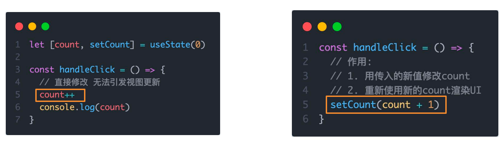

# React介绍
React由Meta公司开发，是一个用于 构建Web和原生交互界面的库
![[Pasted image 20250923162435.png]]
# 开发环境创建
create-react-app是一个快速创建React开发环境的工具，底层由Webpack构件，封装了配置细节，开箱即用
执行命令：
```bash
npx create-react-app <项目名称>
```

1. npx -  Node.js工具命令，查找并执行后续的包命令
2. create-react-app - 核心包（固定写法），用于创建React项目
之后使用npm start 即可启动项目

>创建React项目的更多方式 [https://zh-hans.react.dev/learn/start-a-new-react-project](https://zh-hans.react.dev/learn/start-a-new-react-project)
## 项目结构
>此处只保留了必须的文件和结构

![[Pasted image 20250923164135.png]]
App.js : 项目的根组件
```js
function App() {
  return (
    <div className="App">
      this is App
    </div>
  );
}

export default App;
```
index.js : 程序的入口
```js
import React from 'react'
import ReactDOM from 'react-dom/client' 
import App from './App' // 根组件

const root = ReactDOM.createRoot(document.getElementById('root')) // 渲染App到root节点
root.render(<App />)
```
# JSX基础
## 什么是JSX
> 概念：JSX是JavaScript和XMl(HTML)的缩写，表示在JS代码中编写HTML模版结构，它是React中构建UI的方式

```jsx
const message = 'this is message'

function App(){
  return (
    <div>
      <h1>this is title</h1>
      {message}
    </div>
  )
}
```
优势：

1. HTML的声明式模版写法
2. JavaScript的可编程能力
## JSX的本质
> JSX并不是标准的JS语法，它是 JS的语法扩展，浏览器本身不能识别，需要通过解析工具做解析之后才能在浏览器中使用


## JS表达式
> 在JSX中可以通过 `大括号语法{}` 识别JavaScript中的表达式，比如常见的变量、函数调用、方法调用等等

1. 使用引号传递字符串
2. 使用JS变量
3. 函数调用和方法调用
4. 使用JavaScript对象

>注意：if语句、switch语句、变量声明不属于表达式，不能出现在{}中
```jsx
const message = 'this is message'

function getAge(){
  return 18
}

function App(){
  return (
    <div>
      <h1>this is title</h1>
      {/* 字符串识别 */}
      {'this is str'}
      {/* 变量识别 */}
      {message}
      {/* 函数调用 渲染为函数的返回值 */}
      {getAge()}
	  {/* 使用js对象 */}
      <div style={{ color: 'red' }}>test</div>
    </div>
  )
}
```
## 列表渲染

> 在JSX中可以使用原生js种的`map方法` 实现列表渲染,会把返回的list中的所有都渲染到页面中

```jsx
const list = [
  {id:1001, name:'Vue'},
  {id:1002, name: 'React'},
  {id:1003, name: 'Angular'}
]

function App(){
  return (
    <ul>
      {list.map(item=><li key={item.id}>{item}</li>)}
    </ul>
  )
}
```
>遍历渲染时每一个元素都需要带有一个唯一的key,可以提高react的更新性能
## 条件渲染

> 在React中，可以通过逻辑与运算符&&、三元表达式(?:) 实现基础的条件渲染

1. && : 用于控制单一元素的显示与否,当flag为true则显示,否则不显示
2. 三元表达式 : 控制多个元素的显示

```jsx
const flag = true
const loading = false

function App(){
  return (
    <>
      {flag && <span>this is span</span>}
      {loading ? <span>loading...</span>:<span>this is span</span>}
    </>
  )
}
```
## 复杂条件渲染

> 需求：列表中需要根据文章的状态适配
> 解决方案：自定义函数 + 判断语句

```jsx
const type = 1  // 0|1|3

function getArticleJSX(){
  if(type === 0){
    return <div>无图模式模版</div>
  }else if(type === 1){
    return <div>单图模式模版</div>
  }else(type === 3){
    return <div>三图模式模版</div>
  }
}

function App(){
  return (
    <>
      { getArticleJSX() }
    </>
  )
}
```
# React的事件绑定
>react绑定的回调函数不能直接调用传参,想要传参的话就必须写lambda表达式,在返回值中传参
## 基础实现
> React中的事件绑定，通过语法 `on + 事件名称 = { 事件处理程序 }`，整体上遵循驼峰命名法

```jsx
function App(){
  const clickHandler = ()=>{
    console.log('button按钮点击了')
  }
  return (
    <button onClick={clickHandler}>click me</button>
  )
}
```
## 获取事件对象
> 在事件回调函数中设置形参e即可

```jsx
function App(){
  const clickHandler = (e)=>{
    console.log('button按钮点击了', e)
  }
  return (
    <button onClick={clickHandler}>click me</button>
  )
}
```
## 传递自定义参数
> 语法：事件绑定的位置改造成箭头函数的写法，在执行clickHandler实际处理业务函数的时候传递实参

```jsx
function App(){
  const clickHandler = (name)=>{
    console.log('button按钮点击了', name)
  }
  return (
    <button onClick={()=>clickHandler('jack')}>click me</button>
  )
}
```
>注意：不能直接写函数调用，这里事件绑定需要一个函数引用
## 同时传递事件对象和自定义参数
> 语法：在事件绑定的位置传递事件实参e和自定义参数，clickHandler中声明形参，注意顺序对应

```jsx
function App(){
  const clickHandler = (name,e)=>{
    console.log('button按钮点击了', name,e)
  }
  return (
    <button onClick={(e)=>clickHandler('jack',e)}>click me</button>
  )
}
```
# React组件基础使用
## 组件是什么
概念：一个组件就是一个用户界面的一部分，它可以有自己的逻辑和外观，组件之间可以互相嵌套，也可以服用多次


## 组件基础使用
> 在React中，一个组件就是**首字母大写的函数**，内部存放了组件的逻辑和视图UI, 渲染组件只需要把组件当成标签书写即可

```jsx
// 1. 定义组件
function Button(){
  return <button>click me</button>
}
// 表达式写法也是可以的
const Button = () => <button>click me</button>

// 2. 使用组件
function App(){
  return (
    <div>
      {/* 自闭和 */}
      <Button/>
      {/* 成对标签 */}
      <Button></Button>
    </div>
  )
}
```

# 组件状态管理-useState
## 基础使用
> useState 是一个 React Hook（函数），它允许我们向组件添加一个`状态变量`, 从而控制影响组件的渲染结果
> 和普通JS变量不同的是，状态变量一旦发生变化组件的视图UI也会跟着变化（数据驱动视图）
> 就类似vue把数据添加到了pinia中,需要通过方法修改,具有响应式


调用useState(val)即可获得val的响应式对象和修改方法,返回的是一个数组
```jsx
function App(){
  const [ count, setCount ] = React.useState(0)
  return (
    <div>
      <button onClick={()=>setCount(count+1)}>{ count }</button>
    </div>
  )
}
```
## 状态的修改规则
> 在React中状态被认为是只读的，我们应该始终`替换它而不是修改它`,即==状态不可变== 直接修改状态不能引发视图更新


直接修改count是可以生效的,但是视图不会刷新,即count的值确实发生了变化,但是视图没有刷新,此时如果调用set(count+1)视图会显示count的实际值+1的结果
## 修改对象状态
> 对于对象类型的状态变量，应该始终给set方法一个`全新的对象` 来进行修改

![[Pasted image 20250923195824.png]]
其实还是传进来什么count就会被修改成什么,这里就算写一个数字还是可以正确执行的,这种修改方式实际上是在想要修改当前对象的某个属性时使用的
# useRef
`useRef` 用于在组件的整个生命周期中，保存一个**可变但不触发重新渲染**的值，并且可以用来直接引用真实 DOM。
它有两种完全不同但同源的用途：
1. DOM 引用
2. 跨渲染保存可变数据
```js
const ref = useRef(initialValue);
```
- 返回一个对象：`{ current: initialValue }`
- **这个对象在组件的整个生命周期中保持不变**,只有在组件卸载时才会删除
- 改变 `ref.current` **不会触发组件重新渲染**,不参与diff
- 想要修改可以直接通过current修改,无需set方法
当ref钩子用于引用dom元素时,其在不同时刻状态如下
- render 阶段：`inputRef.current === null`
- commit 阶段后：React 将 DOM 节点赋值给 `current`
- effect / 事件中可安全访问
所以**不要在 render 阶段读 DOM**,也不要依赖数值ref的变化,如比较大小之类的行为
# 组件的基础样式处理
## 在组件内直接使用
```jsx
<div style={{ color:'red'}}>this is div</div>
// 或
import React, { Component } from "react";

const div1 = {
  width: "300px",
  margin: "30px auto",
  backgroundColor: "#44014C",  //驼峰法
  minHeight: "200px",
  boxSizing: "border-box"
};

class Test extends Component {
  constructor(props, context) {
    super(props);
  }
 
  render() {
    return (
     <div>
       <div style={div1}>123</div>
       <div style={{backgroundColor:"red"}}>
     </div>
    );
  }
}

export default Test;
```
>`css`属性需要转换成驼峰写法

优点：
- 内联样式, 样式之间**不会有冲突**
- 可以动态获取当前state中的状态
缺点：
- 写法上都需要使用驼峰标识
- 某些样式没有提示
- 大量的样式, **代码混乱**
- **某些样式无法编写**(比如伪类/伪元素)
## 组件中引入css文件
```css
.foo{
  color: red;
}
```

```jsx
import './index.css'

function App(){
  return (
    <div>
      <span className="foo">this is span</span>
    </div>
  )
}
```
缺点:样式是**全局生效**，样式之间会互相影响
## CSS Modules
>(.module.scss或者less都是可以的)

CSS Modules(.module.css)不是一种新的 CSS 语法，而是：
- **普通 CSS**
- 但通过构建工具（Webpack / Vite）处理(只要后缀是这个就会自动处理,无需额外配置)
- 让 **CSS 类名变成“模块作用域”**
将`css`文件作为一个模块引入，这个模块中的所有`css`，只作用于当前组件。不会影响当前组件的后代组件
```css
/* Button.module.css */
.btn {
  background: blue;
  color: white;
}
```

```js
import styles from './Button.module.css';

function Button() {
  return <button className={styles.btn}>Click</button>;
}
```
渲染结果
```html
<button class="Button_btn__3Kf9A">Click</button>
```

这种方式能够解决局部作用域问题，但也有一定的缺陷：
- 引用的类名，不能使用连接符(.xxx-xx)，在 JavaScript 中是不识别的
- 所有的 className 都必须使用 {style.className} 的形式来编写
- **不方便动态**来修改某些样式，依然需要使用内联样式的方式
**工作原理**
构建阶段发生三件事：
1. 类名映射表生成
```js
{
  btn: 'Button_btn__3Kf9A'
}
```
2. CSS 中的类名被重写
3. JS 中通过对象访问真实类名(所以必须使用 {style.className} 的形式)
## CSS in JS
CSS-in-JS， 是指一种模式，其中`CSS`由 `JavaScript`生成而不是在外部文件中定义,由第三方库提供(如**styled-components**,emotion,glamorous等)
### `styled-components`的基本使用
```shell
npm install styled-components
```
本质是通过函数的调用，最终创建出一个组件：
- 这个组件会被自动添加上一个不重复的class
- styled-components会给该class添加相关的样式
1. 创建一个`style.js`文件用于存放样式组件：
```js
export const SelfLink = styled.div`
  height: 50px;
  border: 1px solid red;
  color: yellow;
`;

export const SelfButton = styled.div`
  height: 150px;
  width: 150px;
  color: ${props => props.color};
  background-image: url(${props => props.src});
  background-size: 150px 150px;
`;

export const Button = styled.button`
  background: blue;
  color: white;
  padding: 8px 16px;
`;
```
>这里就是<组件名> = style.<标签名>,有点像包装组件,之后直接使用组件名就自动带样式了,这些都是react的组件,也就是说**可以接收props**用于动态css
2. 引入样式组件
```js
import React, { Component } from "react";

import { SelfLink, SelfButton } from "./style";

class Test extends Component {
  constructor(props, context) {
    super(props);
  }  
 
  render() {
    return (
     <div>
       <SelfLink title="People's Republic of China">app.js</SelfLink>
       <SelfButton color="palevioletred" style={{ color: "pink" }} src={fist}>
          SelfButton
        </SelfButton>
     </div>
    );
  }
}

export default Test;
```
### 工作原理
运行时机制
1. **组件首次渲染**
2. styled-components 根据模板字符串 + props
3. **生成唯一类名**
4. **动态注入 `<style>` 标签**
5. DOM 使用生成的 class
```html
<style>
.sc-AxjAm { background: blue; }
</style>

<button class="sc-AxjAm">Click</button>
```
>样式是 **运行时生成**，不是构建时。
### 主题（Theme）系统
1. 定义主题
```js
import { ThemeProvider } from 'styled-components';

const theme = {
  primary: 'blue',
  danger: 'red'
};
```

```js
<ThemeProvider theme={theme}>
  <App />
</ThemeProvider>
```
2. 使用主题
```js
const Button = styled.button`
  color: ${props => props.theme.primary};
`;
```

📌 非常适合设计系统 / UI 库。
## classnames
想要动态处理css样式的话,可以使用格式字符串写上类名,需要判断是否添加的类名的处理逻辑和元素一致
```jsx
<span
  className={`nav-item ${refType === tab.type && 'active'}`} 
  key={tab.type}
  onClick={()=>handleSort(tab.type)}
>
  {tab.text}
</span>
```
但是这样很不直观并且容易出错,所以可以使用classnames类库进行类名控制
```shell
npm i classnames
```

```jsx
<span
  className={} 
  key={tab.type}
  onClick={classNames('nav-item', { active: tab.type === refType} )}
>
  {tab.text}
</span>
```
这里的active为需要判断的类名,不需要加引号,后边跟的是判断条件,如果还有需要控制的类名则接着往后写{},{}...即可
# 组件间过渡动画
在`react`中实现过渡动画效果会有很多种选择，`react-transition-group`是一种很好的解决方案，其为元素添加`enter`，`enter-active`，`exit`，`exit-active`这一系列钩子可以帮助我们方便的实现组件的入场和离场动画
其主要提供了三个主要的组件：
- CSSTransition：在前端开发中，结合 CSS 来完成过渡动画效果
- SwitchTransition：两个组件显示和隐藏切换时，使用该组件
- TransitionGroup：将多个动画组件包裹在其中，一般用于列表中元素的动画
## CSSTransition
其实现动画的原理在于，当`CSSTransition`的`in`属性置为`true`时，`CSSTransition`首先会给其**子组件**加上`xxx-enter`、`xxx-enter-active`的`class`执行动画

当动画执行结束后，会移除两个`class`，并且添加`-enter-done`的`class`

所以可以利用这一点，通过`css`的`transition`属性，让元素在两个状态之间平滑过渡，从而得到相应的动画效果

当`in`属性置为`false`时，`CSSTransition`会给子组件加上`xxx-exit`和`xxx-exit-active`的`class`，然后开始执行动画，当动画结束后，移除两个`class`，然后添加`-enter-done`的`class`

如下例子：
```js
export default class App2 extends React.PureComponent {

  state = {show: true};

  onToggle = () => this.setState({show: !this.state.show});

  render() {
    const {show} = this.state;
    return (
      <div className={'container'}>
        <div className={'square-wrapper'}>
          <CSSTransition
            in={show}
            timeout={500}
            classNames={'fade'}
            unmountOnExit={true}
          >
            <div className={'square'} />
          </CSSTransition>
        </div>
        <Button onClick={this.onToggle}>toggle</Button>
      </div>
    );
  }
}
```
对应`css`样式如下：
```css
.fade-enter {
  opacity: 0;
  transform: translateX(100%);
}

.fade-enter-active {
  opacity: 1;
  transform: translateX(0);
  transition: all 500ms;
}

.fade-exit {
  opacity: 1;
  transform: translateX(0);
}

.fade-exit-active {
  opacity: 0;
  transform: translateX(-100%);
  transition: all 500ms;
}
```
## SwitchTransition
`SwitchTransition`可以完成**两个组件之间**切换的炫酷动画

比如有一个按钮需要在`on`和`off`之间切换，我们希望看到`on`先从左侧退出，`off`再从右侧进入

`SwitchTransition`中主要有一个属性`mode`，对应两个值：

- in-out：表示新组件先进入，旧组件再移除；
- out-in：表示就组件先移除，新组建再进入

`SwitchTransition`组件里面要有`CSSTransition`，不能直接包裹你想要切换的组件

里面的`CSSTransition`组件不再像以前那样接受`in`属性来判断元素是何种状态，取而代之的是`key`属性

下面给出一个按钮入场和出场的示例，如下：
```js
import { SwitchTransition, CSSTransition } from "react-transition-group";

export default class SwitchAnimation extends PureComponent {
  constructor(props) {
    super(props);

    this.state = {
      isOn: true
    }
  }

  render() {
    const {isOn} = this.state;

    return (
      <SwitchTransition mode="out-in">
        <CSSTransition classNames="btn"
                       timeout={500}
                       key={isOn ? "on" : "off"}>
          {
          <button onClick={this.btnClick.bind(this)}>
            {isOn ? "on": "off"}
          </button>
        }
        </CSSTransition>
      </SwitchTransition>
    )
  }

  btnClick() {
    this.setState({isOn: !this.state.isOn})
  }
}
```
`css`文件对应如下：
```css
.btn-enter {
  transform: translate(100%, 0);
  opacity: 0;
}

.btn-enter-active {
  transform: translate(0, 0);
  opacity: 1;
  transition: all 500ms;
}

.btn-exit {
  transform: translate(0, 0);
  opacity: 1;
}

.btn-exit-active {
  transform: translate(-100%, 0);
  opacity: 0;
  transition: all 500ms;
}
```
## TransitionGroup
当有一组动画的时候，就可将这些`CSSTransition`放入到一个`TransitionGroup`中来完成动画

同样`CSSTransition`里面没有`in`属性，用到了`key`属性

`TransitionGroup`在感知`children`发生变化的时候，先保存移除的节点，当动画结束后才真正移除

其处理方式如下：

- 插入的节点，先渲染dom，然后再做动画
- 删除的节点，先做动画，然后再删除dom

如下：
```js
import React, { PureComponent } from 'react'
import { CSSTransition, TransitionGroup } from 'react-transition-group';

export default class GroupAnimation extends PureComponent {
  constructor(props) {
    super(props);

    this.state = {
      friends: []
    }
  }

  render() {
    return (
      <div>
        <TransitionGroup>
          {
            this.state.friends.map((item, index) => {
              return (
                <CSSTransition classNames="friend" timeout={300} key={index}>
                  <div>{item}</div>
                </CSSTransition>
              )
            })
          }
        </TransitionGroup>
        <button onClick={e => this.addFriend()}>+friend</button>
      </div>
    )
  }

  addFriend() {
    this.setState({
      friends: [...this.state.friends, "coderwhy"]
    })
  }
}
```
对应`css`如下：
```css
.friend-enter {
    transform: translate(100%, 0);
    opacity: 0;
}

.friend-enter-active {
    transform: translate(0, 0);
    opacity: 1;
    transition: all 500ms;
}

.friend-exit {
    transform: translate(0, 0);
    opacity: 1;
}

.friend-exit-active {
    transform: translate(-100%, 0);
    opacity: 0;
    transition: all 500ms;
}
```
# React表单控制
## 受控绑定
> 概念：使用React组件的状态（useState）控制表单的状态,即将state绑定到表单的value上

![[Pasted image 20250923220100.png]]
之后再监听change事件实现==双向绑定==的效果
```jsx
function App(){
  const [value, setValue] = useState('')
  return (
    <input 
      type="text" 
      value={value} 
      onChange={e => setValue(e.target.value)}
    />
  )
}
```
## 非受控绑定
> 概念：通过获取DOM的方式获取表单的输入数据

![[Pasted image 20250923222448.png]]
%%直接打印ref对象和打印current属性%%
React中获取和操作DOM需要使用==useRef==钩子,使用方法类似vue,但是react直接获取到的不是DOM对象本身,而是包含DOM对象的一个对象,需要使用current属性访问DOM对象,但是也需要DOM可用时才能访问,即DOM渲染出来之后才能使用
```jsx
function App(){
  const inputRef = useRef(null) // 1.创建ref对象

  const onChange = ()=>{
    console.log(inputRef.current.value) // 3.通过ref对象的current属性获取DOM对象
  }
  
  return (
    <input 
      type="text" 
      ref={inputRef} // 2.与ref对象绑定
      onChange={onChange}
    />
  )
}
```
![[Pasted image 20251225211815.png]]
# uuid
>用于生成唯一id
```shell
npm i uuid
```
安装之后导入(因为原先的命名就叫v4所以建议改名)
```jsx
import { v4 as uuidv4 } from 'uuid'
```
调用uuidv4()就可以获取一个唯一id(82bdf4ac-8a54-4737-a103-27f528d20d48)
# day.js
>时间处理
```shell
npm i dayjs
```
调用format方法
>根据传入的占位符返回格式化后的日期。
>将字符放在方括号中，即可原样返回而不被格式化替换 (例如， `[MM]`)。
```jsx
dayjs().format() 
// 默认返回的是 ISO8601 格式字符串 '2020-04-02T08:02:17-05:00'

dayjs('2019-01-25').format('[YYYYescape] YYYY-MM-DDTHH:mm:ssZ[Z]') 
// 'YYYYescape 2019-01-25T00:00:00-02:00Z'

dayjs('2019-01-25').format('DD/MM/YYYY') 
// '25/01/2019'

dayjs(new Date()).format()
//获取当前时间并格式化
```
# React组件通信
> 概念：组件通信就是`组件之间的数据传递`, 根据组件嵌套关系的不同，有不同的通信手段和方法

![[Pasted image 20250923220123.png]]

1. A-B 父子通信
2. B-C 兄弟通信
3. A-E 跨层通信
## 父子通信-父传子
![[Pasted image 20250923220128.png]]
### 基础实现
**实现步骤**
1. 父组件传递数据 - 在子组件标签上绑定属性 
2. 子组件接收数据 - 子组件通过props参数接收数据
```jsx
function Son(props){ // 参数名可以不是这个,但是一般叫props
  return <div>{ props.name }</div>
}


function App(){
  const name = 'this is app name'
  return (
    <div>
       <Son name={name}/>
    </div>
  )
}
```
### props说明
**props可以传递任意的合法数据**，比如数字、字符串、布尔值、数组、对象、函数、JSX
![[Pasted image 20250923220134.png]]
**props是只读对象**
子组件只能读取props中的数据，不能直接进行修改, 父组件的数据只能由父组件修改 

### 特殊的prop-chilren
> 场景：当我们把内容嵌套在组件的标签内部时，组件会自动在名为children的prop属性中接收该内容

![[Pasted image 20250923220138.png]]
![[Pasted image 20251009215359.png]]
>也就是说,在子组件标签的内部也是可以写jsx的,但是不会直接渲染在子组件内,而是由props的children属性来接受后自己选择在哪里解析渲染
## 父子通信-子传父
![[Pasted image 20250923220143.png]]
> 核心思路：在子组件中调用父组件中的函数并传递参数

```tsx
function Son({ onGetMsg }){
  const sonMsg = 'this is son msg'
  return (
    <div>
      {/* 在子组件中执行父组件传递过来的函数 */}
      <button onClick={()=>onGetMsg(sonMsg)}>send</button>
    </div>
  )
}


function App(){
  const getMsg = (msg)=>console.log(msg)
  
  return (
    <div>
      {/* 传递父组件中的函数到子组件 */}
       <Son onGetMsg={ getMsg }/>
    </div>
  )
}
```
>感觉像是调用了一个绑定了this的函数
## 兄弟组件通信
![[Pasted image 20250923220149.png]]
> 实现思路: 借助 `状态提升` 机制，通过共同的父组件进行兄弟之间的数据传递
> 1. A组件先通过子传父的方式把数据传递给父组件App
> 2. App拿到数据之后通过父传子的方式再传递给B组件

```jsx

// 1. 通过子传父 A -> App
// 2. 通过父传子 App -> B

import { useState } from "react"

function A ({ onGetAName }) {
  // Son组件中的数据
  const name = 'this is A name'
  return (
    <div>
      this is A compnent,
      <button onClick={() => onGetAName(name)}>send</button>
    </div>
  )
}

function B ({ name }) {
  return (
    <div>
      this is B compnent,
      {name}
    </div>
  )
}

function App () {
  const [name, setName] = useState('')
  const getAName = (name) => {
    setName(name)
  }
  return (
    <div>
      this is App
      <A onGetAName={getAName} />
      <B name={name} />
    </div>
  )
}

export default App
```
## 跨层组件通信
![[Pasted image 20250923220155.png]]
**实现步骤：**

1. 使用 `createContext`方法创建一个上下文对象Ctx 
2. 在顶层组件（App）中通过 `Ctx.Provider` 组件提供数据 
3. 在底层组件（B）中通过 `useContext` 钩子函数获取消费数据
>正常一般使用Context会在一个单独文件中调用createContext并导出,在需要使用的地方导入使用
```jsx
// App -> A -> B

import { createContext, useContext } from "react"

// 1. createContext方法创建一个上下文对象

const MsgContext = createContext()

function A () {
  return (
    <div>
      this is A component
      <B />
    </div>
  )
}

function B () {
  // 3. 在底层组件 通过useContext钩子函数使用数据
  const msg = useContext(MsgContext)
  return (
    <div>
      this is B compnent,{msg}
    </div>
  )
}

function App () {
  const msg = 'this is app msg'
  return (
    <div>
      {/* 2. 在顶层组件 通过Provider组件提供数据 */}
      <MsgContext.Provider value={msg}>
        this is App
        <A />
      </MsgContext.Provider>
    </div>
  )
}

export default App
```

# React副作用管理-useEffect
## 概念理解 
useEffect是一个React Hook函数，用于在React组件中创建不是由事件引起而是由渲染本身引起的操作（副作用）, 比 如发送AJAX请求，更改DOM等等 
![[Pasted image 20250923220201.png]]
>说明：上面的组件中没有发生任何的用户事件，组件渲染完毕之后就需要和服务器要数据，整个过程属于“只由渲染引起的操作”
## 基础使用
> 需求：在组件渲染完毕之后，立刻从服务端获取频道列表数据并显示到页面中

![[Pasted image 20250923220214.png]]
说明： 
1. 参数1是一个函数，可以把它叫做副作用函数，在函数内部可以放置要执行的操作 
2. 参数2是一个数组（可选参），在数组里放置依赖项，不同依赖项会影响第一个参数函数的执行，当是一个空数组的时候，副作用函数只会在组件渲染完毕之后执行一次(==空数组不是默认参数,想要之请求一次必须传入一个空数组==)
>接口地址：http://geek.itheima.net/v1_0/channels
## useEffect依赖说明 
useEffect副作用函数的执行时机存在多种情况，根据传入依赖项的不同，会有不同的执行表现

| **依赖项** | **副作用功函数的执行时机**   |
| ------- | ----------------- |
| 没有依赖项   | 组件初始渲染 + 组件更新时执行  |
| 空数组依赖   | 只在初始渲染时执行一次       |
| 添加特定依赖项 | 组件初始渲染 + 依赖项变化时执行 |
>组件更新包括组件状态(state)的变动
>依赖项是指组件内的状态,类似于监听变动
## 清除副作用
> 概念：在useEffect中编写的由渲染本身引起的对接组件外部的操作，社区也经常把它叫做副作用操作，比如在useEffect中开启了一个定时器，我们想在组件卸载时把这个定时器再清理掉，这个过程就是清理副作用

![[Pasted image 20250923220220.png]]

>说明：清除副作用的函数最常见的执行时机是在组件卸载时自动执行

```jsx
import { useEffect, useState } from "react"

function Son () {
  // 1. 渲染时开启一个定时器
  useEffect(() => {
    const timer = setInterval(() => {
      console.log('定时器执行中...')
    }, 1000)

    return () => {
      // 清除副作用(组件卸载时)
      clearInterval(timer)
    }
  }, [])
  return <div>this is son</div>
}

function App () {
  // 通过条件渲染模拟组件卸载
  const [show, setShow] = useState(true)
  return (
    <div>
      {show && <Son />}
      <button onClick={() => setShow(false)}>卸载Son组件</button>
    </div>
  )
}

export default App
```
# 自定义Hook实现
> 概念：自定义Hook是以 `use打头的函数`，通过自定义Hook函数可以用来`实现逻辑的封装和复用`

![[Pasted image 20250923220227.png]]

```jsx
// 封装自定义Hook

// 问题: 布尔切换的逻辑 当前组件耦合在一起的 不方便复用

// 解决思路: 自定义hook

import { useState } from "react"

function useToggle () {
  // 可复用的逻辑代码
  const [value, setValue] = useState(true)

  const toggle = () => setValue(!value)

  // 哪些状态和回调函数需要在其他组件中使用 return
  return {
    value,
    toggle
  }
}

// 封装自定义hook通用思路

// 1. 声明一个以use打头的函数
// 2. 在函数体内封装可复用的逻辑（只要是可复用的逻辑）
// 3. 把组件中用到的状态或者回调return出去（以对象或者数组）
// 4. 在哪个组件中要用到这个逻辑，就执行这个函数，解构出来状态和回调进行使用


function App () {
  const { value, toggle } = useToggle()
  return (
    <div>
      {value && <div>this is div</div>}
      <button onClick={toggle}>toggle</button>
    </div>
  )
}

export default App
```
# React Hooks使用规则

1. 只能在组件中或者其他自定义Hook函数中调用
2. 只能在组件的顶层调用，不能嵌套在if、for、其它的函数中

![[Pasted image 20250923220233.png]]

# 案例-优化B站评论案例
![[Pasted image 20250923220237.png]]
1. 使用请求接口的方式获取评论列表并渲染 
2. 使用自定义Hook函数封装数据请求的逻辑 
3. 把评论中的每一项抽象成一个独立的组件实现渲染

# Redux介绍
> Redux 是React最常用的集中状态管理工具，类似于Vue中的Pinia（Vuex），可以独立于框架运行
> 作用：通过集中管理的方式管理应用的状态

![[Pasted image 20251010190026.png]]
**为什么要使用Redux？**

1. 独立于组件，无视组件之间的层级关系，简化通信问题
2. 单向数据流清晰，易于定位bug
3. 调试工具配套良好，方便调试
# Redux快速体验
## 1. 实现计数器
> 需求：不和任何框架绑定，不使用任何构建工具，使用纯Redux实现计数器

![[Pasted image 20251010190034.png]]
使用步骤：

1. 定义一个 reducer 函数 （根据当前想要做的修改返回一个新的状态）
2. 使用createStore方法传入 reducer函数 生成一个store实例对象
3. 使用store实例的 subscribe方法 订阅数据的变化（数据一旦变化，可以得到通知）
4. 使用store实例的 dispatch方法提交action对象 触发数据变化（告诉reducer你想怎么改数据）
5. 使用store实例的 getState方法 获取最新的状态数据更新到视图中

代码实现：
```html
<button id="decrement">-</button>
<span id="count">0</span>
<button id="increment">+</button>

<script src="https://unpkg.com/redux@latest/dist/redux.min.js"></script>

<script>
  // 定义reducer函数 
  // 内部主要的工作是根据不同的action 返回不同的state
  function counterReducer (state = { count: 0 }, action) {
    switch (action.type) {
      case 'INCREMENT':
        return { count: state.count + 1 }
      case 'DECREMENT':
        return { count: state.count - 1 }
      default:
        return state
    }
  }
  // 使用reducer函数生成store实例
  const store = Redux.createStore(counterReducer)

  // 订阅数据变化
  store.subscribe(() => {
    console.log(store.getState())
    document.getElementById('count').innerText = store.getState().count

  })
  // 增
  const inBtn = document.getElementById('increment')
  inBtn.addEventListener('click', () => {
    store.dispatch({
      type: 'INCREMENT'
    })
  })
  // 减
  const dBtn = document.getElementById('decrement')
  dBtn.addEventListener('click', () => {
    store.dispatch({
      type: 'DECREMENT'
    })
  })
</script>
```

## 2. Redux数据流架构
> Redux的难点是理解它对于数据修改的规则, 下图动态展示了在整个数据的修改中，数据的流向

![[Pasted image 20251010190140.png]]

为了职责清晰，Redux代码被分为三个核心的概念，我们学redux，其实就是学这三个核心概念之间的配合，三个概念分别是:

1. state:  一个对象 存放着我们管理的数据
2. action:  一个对象 用来描述你想怎么改数据
3. reducer:  一个函数 根据action的描述更新state
# Redux与React - 环境准备
> Redux虽然是一个框架无关可以独立运行的插件，但是社区通常还是把它与React绑定在一起使用，以一个计数器案例体验一下Redux + React 的基础使用
## 1. 配套工具
> 在React中使用redux，官方要求安装俩个其他插件 - Redux Toolkit 和 react-redux

1. Redux Toolkit（RTK）- 官方推荐编写Redux逻辑的方式，是一套工具的集合集，简化书写方式

2. react-redux - 用来 链接 Redux 和 React组件 的中间件

![[Pasted image 20251010190127.png]]
## 2. 配置基础环境

1.  使用 CRA 快速创建 React 项目
```bash
npx create-react-app react-redux 
```

2.  安装配套工具
```bash
npm i @reduxjs/toolkit  react-redux 
```

3.  启动项目
```bash
npm run start 
```


## 3. store目录结构设计

![[Pasted image 20251010190119.png]]

1. 通常集中状态管理的部分都会单独创建一个单独的 `store` 目录

2. 应用通常会有很多个子store模块，所以创建一个 `modules` 目录，在内部编写业务分类的子store

3. store中的入口文件 index.js 的作用是组合modules中所有的子模块，并导出store

# Redux与React - 实现counter
## 1. 整体路径熟悉
![[Pasted image 20251010190112.png]]


## 2. 使用React Toolkit 创建 counterStore
counterStore.js
```javascript
import { createSlice } from '@reduxjs/toolkit'

const counterStore = createSlice({
  // 模块名称独一无二
  name: 'counter',
  // 初始数据
  initialState: {
    count: 1
  },
  // 修改数据的同步方法
  reducers: {
    increment (state) {
      state.count++
    },
    decrement(state){
      state.count--
    }
  }
})
// 结构出actionCreater
const { increment,decrement } = counterStore.actions

// 获取reducer函数
const counterReducer = counterStore.reducer

// 导出
export { increment, decrement }
export default counterReducer
```
index.js
```javascript
import { configureStore } from '@reduxjs/toolkit'

import counterReducer from './modules/counterStore'

export default configureStore({
  reducer: {
    // 注册子模块
    counter: counterReducer
  }
})
```
>这个configureStore会返回一个根store,导出使用即可
## 3. 为React注入store
> react-redux负责把Redux和React 链接 起来，内置 Provider组件 通过 store 参数把创建好的store实例注入到应用中，链接正式建立,具体方法就是在项目的index.js中,使用`<Provider>`包裹`<App>`,将根store作为参数传递给Provider就可以了
```jsx
import React from 'react'
import ReactDOM from 'react-dom/client'
import App from './App'
// 导入store
import store from './store'
// 导入store提供组件Provider
import { Provider } from 'react-redux'

ReactDOM.createRoot(document.getElementById('root')).render(
  // 提供store数据
  <Provider store={store}>
    <App />
  </Provider>
)
```
## 4. React组件使用store中的数据
> 在React组件中使用store中的数据，需要用到一个钩子函数 - useSelector，它的作用是把store中的数据映射到组件中，使用样例如下：

![[Pasted image 20251010190202.png]]
## 5. React组件修改store中的数据
> React组件中修改store中的数据需要借助另外一个hook函数 - useDispatch，它的作用是生成提交action对象的dispatch函数，使用样例如下：

![[Pasted image 20251010190208.png]]
# Redux与React - 提交action传参
> 需求：组件中有俩个按钮 `add to 10` 和 `add to 20` 可以直接把count值修改到对应的数字，目标count值是在组件中传递过去的，需要在提交action的时候传递参数

![[Pasted image 20251010190224.png]]
实现方式：在reducers的同步修改方法中添加action对象参数，在调用actionCreater的时候传递参数，参数会被传递到action对象payload属性上

![[Pasted image 20251010190231.png]]

# Redux与React - 异步action处理
**需求理解**
![[Pasted image 20251010190236.png]]

**实现步骤**

1. 创建store的写法保持不变，配置好同步修改状态的方法
2. **单独封装**一个函数，在函数内部return一个新函数，在新函数中
	1. 封装异步请求获取数据
	2. 调用同步actionCreater传入异步数据生成一个action对象，并使用dispatch提交
3. 组件中dispatch的写法保持不变

**代码实现**
> 测试接口地址：  [http://geek.itheima.net/v1_0/channels](http://geek.itheima.net/v1_0/channels')

```javascript
import { createSlice } from '@reduxjs/toolkit'
import axios from 'axios'

const channelStore = createSlice({
  name: 'channel',
  initialState: {
    channelList: []
  },
  reducers: {
    setChannelList (state, action) {
      state.channelList = action.payload
    }
  }
})


// 创建异步
const { setChannelList } = channelStore.actions
const url = 'http://geek.itheima.net/v1_0/channels'
// 封装一个函数 在函数中return一个新函数 在新函数中封装异步
// 得到数据之后通过dispatch函数 触发修改
const fetchChannelList = () => {
  return async (dispatch) => {
    const res = await axios.get(url)
    dispatch(setChannelList(res.data.data.channels))
  }
}

export { fetchChannelList }

const channelReducer = channelStore.reducer
export default channelReducer
```

```jsx
import { useEffect } from 'react'
import { useSelector, useDispatch } from 'react-redux'
import { fetchChannelList } from './store/channelStore'

function App () {
  // 使用数据
  const { channelList } = useSelector(state => state.channel)
  useEffect(() => {
    dispatch(fetchChannelList())
  }, [dispatch])

  return (
    <div className="App">
      <ul>
        {channelList.map(task => <li key={task.id}>{task.name}</li>)}
      </ul>
    </div>
  )
}

export default App
```
# Redux中间件
`Redux`中，中间件就是放在就是在`dispatch`过程，在分发`action`进行拦截处理，如下图：
![[Pasted image 20251227135936.png]]
其本质上一个函数，对`store.dispatch`方法进行了改造，在发出 `Action`和执行 `Reducer`这两步之间，添加了其他功能

中间件都需要通过`applyMiddlewares`进行注册，作用是将所有的中间件组成一个数组，依次执行
然后作为第二个参数传入到`createStore`中
```js
const store = createStore(
  reducer,
  applyMiddleware(thunk, logger)
);
```
在`applyMiddleware`中所有中间件被放进了一个数组`chain`，然后嵌套执行，最后执行`store.dispatch`。所以中间件内部（`middlewareAPI`）可以拿到`getState`和`dispatch`这两个方法
## redux-thunk
`redux-thunk`是官网推荐的异步处理中间件

默认情况下的`dispatch(action)`，`action`需要是一个`JavaScript`的对象

`redux-thunk`中间件会判断你当前传进来的数据类型，如果是一个函数，将会给函数传入参数值（dispatch，getState）

- dispatch函数用于我们之后再次派发action
- getState函数考虑到我们之后的一些操作需要依赖原来的状态，用于让我们可以获取之前的一些状态

所以`dispatch`可以写成下述函数的形式：
```js
const getHomeMultidataAction = () => {
  return (dispatch) => {
    axios.get("https://web.archive.org/web/20250126154403/http://xxx.xx.xx.xx/test").then(res => {
      const data = res.data.data;
      dispatch(changeBannersAction(data.banner.list));
      dispatch(changeRecommendsAction(data.recommend.list));
    })
  }
}
```
## redux-logger

如果想要实现一个日志功能，则可以使用现成的`redux-logger`
```js
import { applyMiddleware, createStore } from 'redux';
import createLogger from 'redux-logger';
const logger = createLogger();

const store = createStore(
  reducer,
  applyMiddleware(logger)
);
```
这样我们就能简单通过中间件函数实现日志记录的信息
# Redux调试 - devtools
> Redux官方提供了针对于Redux的调试工具，支持实时state信息展示，action提交信息查看等
> [Redux DevTools - Microsoft Edge Addons](https://microsoftedge.microsoft.com/addons/detail/redux-devtools/anmpkbapfgpmemgdomlejpgljkoflifc)

![[Pasted image 20251010190246.png]]
# 美团小案例
## 1. 案例演示
![[Pasted image 20251010190251.png]]

> 基本开发思路：使用 RTK（Redux Toolkit）来管理应用状态, 组件负责 数据渲染 和 dispatch action

## 2. 准备并熟悉环境

1.  克隆项目到本地（内置了基础静态组件和模版）
```bash
git clone http://git.itcast.cn/heimaqianduan/redux-meituan.git 
```

2.  安装所有依赖
```bash
npm i 
```

3.  启动mock服务（内置了json-server）
```bash
npm run serve 
```

4.  启动前端服务
```bash
npm run start 
```
## 3. 分类和商品列表渲染
![[Pasted image 20251010190258.png]]
1- 编写store逻辑

```javascript
// 编写store
import { createSlice } from "@reduxjs/toolkit"
import axios from "axios"

const foodsStore = createSlice({
  name: 'foods',
  initialState: {
    // 商品列表
    foodsList: []
  },
  reducers: {
    // 更改商品列表
    setFoodsList (state, action) {
      state.foodsList = action.payload
    }
  }
})

// 异步获取部分
const { setFoodsList } = foodsStore.actions
const fetchFoodsList = () => {
  return async (dispatch) => {
    // 编写异步逻辑
    const res = await axios.get('http://localhost:3004/takeaway')
    // 调用dispatch函数提交action
    dispatch(setFoodsList(res.data))
  }
}

export { fetchFoodsList }

const reducer = foodsStore.reducer

export default reducer
```

2- 组件使用store数据
```jsx
// 省略部分代码
import { useDispatch, useSelector } from 'react-redux'
import { fetchFoodsList } from './store/modules/takeaway'
import { useEffect } from 'react'

const App = () => {
  // 触发action执行
  // 1. useDispatch -> dispatch 2. actionCreater导入进来 3.useEffect
  const dispatch = useDispatch()
  useEffect(() => {
    dispatch(fetchFoodsList())
  }, [dispatch])

  return (
    <div className="home">
      {/* 导航 */}
      <NavBar />

      {/* 内容 */}
      <div className="content-wrap">
        <div className="content">
          <Menu />
          <div className="list-content">
            <div className="goods-list">
              {/* 外卖商品列表 */}
              {foodsList.map(item => {
                return (
                  <FoodsCategory
                    key={item.tag}
                    // 列表标题
                    name={item.name}
                    // 列表商品
                    foods={item.foods}
                  />
                )
              })}
            </div>
          </div>
        </div>
      </div>
      {/* 购物车 */}
      <Cart />
    </div>
  )
}

export default App
```
## 4. 点击分类激活交互实现
![[Pasted image 20251010190307.png]]
1- 编写store逻辑

```javascript
// 编写store

import { createSlice } from "@reduxjs/toolkit"
import axios from "axios"

const foodsStore = createSlice({
  name: 'foods',
  initialState: {
    // 菜单激活下标值
    activeIndex: 0
  },
  reducers: {
    // 更改activeIndex
    changeActiveIndex (state, action) {
      state.activeIndex = action.payload
    }
  }
})

// 导出
const { changeActiveIndex } = foodsStore.actions

export { changeActiveIndex }

const reducer = foodsStore.reducer

export default reducer
```

2- 编写组件逻辑
```jsx
const Menu = () => {
  const { foodsList, activeIndex } = useSelector(state => state.foods)
  const dispatch = useDispatch()
  const menus = foodsList.map(item => ({ tag: item.tag, name: item.name }))
  return (
    <nav className="list-menu">
      {/* 添加active类名会变成激活状态 */}
      {menus.map((item, index) => {
      return (
        <div
          // 提交action切换激活index
          onClick={() => dispatch(changeActiveIndex(index))}
          key={item.tag}
          // 动态控制active显示
          className={classNames(
            'list-menu-item',
            activeIndex === index && 'active'
          )}
          >
          {item.name}
        </div>
      )
    })}
    </nav>
  )
}
```
## 5. 商品列表切换显示
![[Pasted image 20251010190314.png]]

```jsx
<div className="list-content">
  <div className="goods-list">
    {/* 外卖商品列表 */}
    {foodsList.map((item, index) => {
      return (
        activeIndex === index && <FoodsCategory
          key={item.tag}
          // 列表标题
          name={item.name}
          // 列表商品
          foods={item.foods}
        />
      )
    })}
  </div>
</div>
```
## 6. 添加购物车实现
![[Pasted image 20251010190319.png]]
1- 编写store逻辑

```javascript
// 编写store

import { createSlice } from "@reduxjs/toolkit"
import axios from "axios"

const foodsStore = createSlice({
  name: 'foods',
  reducers: {
    // 添加购物车
    addCart (state, action) {
      // 是否添加过？以action.payload.id去cartList中匹配 匹配到了 添加过
      const item = state.cartList.find(item => item.id === action.payload.id)
      if (item) {
        item.count++
      } else {
        state.cartList.push(action.payload)
      }
    }
  }
})

// 导出actionCreater
const { addCart } = foodsStore.actions

export { addCart }

const reducer = foodsStore.reducer

export default reducer
```

2- 编写组件逻辑
```jsx
<div className="goods-count">
  {/* 添加商品 */}
  <span 
    className="plus" 
    onClick={() => dispatch(addCart({
    id,
    picture,
    name,
    unit,
    description,
    food_tag_list,
    month_saled,
    like_ratio_desc,
    price,
    tag,
    count
  }))}></span>
</div>
```
## 7. 统计区域实现
![[Pasted image 20251010190327.png]]

实现思路

1. 基于store中的cartList的length渲染数量
2. 基于store中的cartList累加price * count
3. 购物车cartList的length不为零则高亮

```jsx
// 计算总价 
const totalPrice = cartList.reduce((a, c) => a + c.price * c.count, 0)

{/* fill 添加fill类名购物车高亮*/}
{/* 购物车数量 */}
<div onClick={onShow} className={classNames('icon', cartList.length > 0 && 'fill')}>
  {cartList.length > 0 && <div className="cartCornerMark">{cartList.length}</div>}
</div>
```
## 8. 购物车列表功能实现
![[Pasted image 20251010190332.png]]

1-控制列表渲染
```jsx
const Cart = () => {
  return (
    <div className="cartContainer">
      {/* 添加visible类名 div会显示出来 */}
      <div className={classNames('cartPanel', 'visible')}>
        {/* 购物车列表 */}
        <div className="scrollArea">
          {cartList.map(item => {
            return (
              <div className="cartItem" key={item.id}>
                
                <div className="main">
                  <div className="skuInfo">
                    <div className="name">{item.name}</div>
                  </div>
                  <div className="payableAmount">
                    <span className="yuan">¥</span>
                    <span className="price">{item.price}</span>
                  </div>
                </div>
                <div className="skuBtnWrapper btnGroup">
                  {/* 数量组件 */}
                  <Count
                    count={item.count}
                  />
                </div>
              </div>
            )
          })}
        </div>
      </div>
    </div>
  )
}

export default Cart
```

2- 购物车增减逻辑实现
```javascript
// count增
increCount (state, action) {
  // 关键点：找到当前要修改谁的count id
  const item = state.cartList.find(item => item.id === action.payload.id)
  item.count++
},
// count减
decreCount (state, action) {
  // 关键点：找到当前要修改谁的count id
  const item = state.cartList.find(item => item.id === action.payload.id)
  if (item.count === 0) {
    return
  }
  item.count--
}
```

```jsx
<div className="skuBtnWrapper btnGroup">
  {/* 数量组件 */}
  <Count
    count={item.count}
    onPlus={() => dispatch(increCount({ id: item.id }))}
    onMinus={() => dispatch(decreCount({ id: item.id }))}
    />
</div>
```

3-清空购物车实现
```javascript
// 清除购物车
clearCart (state) {
  state.cartList = []
}
```

```jsx
<div className="header">
  <span className="text">购物车</span>
  <span 
    className="clearCart" 
    onClick={() => dispatch(clearCart())}>
    清空购物车
  </span>
</div>
```
## 9. 控制购物车显示和隐藏
![[Pasted image 20251010190341.png]]

```jsx
// 控制购物车打开关闭的状态
const [visible, setVisible] = useState(false)

const onShow = () => {
  if (cartList.length > 0) {
    setVisible(true)
  }
}


{/* 遮罩层 添加visible类名可以显示出来 */}
<div
	className={
     classNames('cartOverlay', visible && 'visible')
  }
	onClick={() => setVisible(false)}
/>
```

# 路由快速上手
## 1. 什么是前端路由
一个路径 path 对应一个组件 component 当我们在浏览器中访问一个 path 的时候，path 对应的组件会在页面中进行渲染

![[Pasted image 20251205221952.png]]
## 2. 创建路由开发环境
```bash
# 使用CRA创建项目
npm create-react-app react-router-pro

# 安装最新的ReactRouter包
npm i react-router-dom

# 启动项目
npm run start
```

## 3. 快速开始
![[Pasted image 20251205222056.png]]
1. 使用createBrowserRouter创建路由对象
2. 将入口文件中的<APP/>改为`<RouterProvider>`并将router传入(类似RouterView)
```jsx
import React from 'react'
import ReactDOM from 'react-dom/client'

const router = createBrowserRouter([
  {
    path:'/login',
    element: <div>登录</div>
  },
  {
    path:'/article',
    element: <div>文章</div>
  }
])

ReactDOM.createRoot(document.getElementById('root')).render(
  <RouterProvider router={router}/>
)
```

# 抽象路由模块
![[Pasted image 20251205222848.png]]
- page文件夹用于存放视图(类比vue的views),其中每一个视图都是一个文件夹,在文件夹内写index,js和css
- router文件夹用于存放路由,其中是index.js
# 路由导航
## 1. 什么是路由导航
路由系统中的多个路由之间需要进行路由跳转，并且在跳转的同时有可能需要传递参数进行通信
![[Pasted image 20251205223838.png]]
## 2. 声明式导航
> 声明式导航是指通过在模版中通过 `<Link/> ` 组件描述出要跳转到哪里去，比如后台管理系统的左侧菜单通常使用这种方式进行

![[Pasted image 20251205223903.png]]
语法说明：通过给组件的to属性指定要跳转到路由path，组件会被渲染为浏览器支持的a链接，如果需要传参直接通过字符串拼接的方式拼接参数即可
## 3. 编程式导航
编程式导航是指通过 `useNavigate` 钩子得到导航方法，然后通过调用方法以命令式的形式进行路由跳转，比如想在登录请求完毕之后跳转就可以选择这种方式，更加灵活

![[Pasted image 20251205223916.png]]

语法说明：通过调用navigate方法传入地址path实现跳转
# 导航传参
>编程式和声明式都是直接写在路由里,用法是一样的
![[Pasted image 20251205225414.png]]
1. 在路由中凭借query参数或者path参数(path参数类似vue需要在路由配置中配置/:test配置占位符)
2. 在目标组件中分别使用useSearchParams(用什么变量名解构都可以)和useParams获取参数即可
# 嵌套路由配置
## 1. 什么是嵌套路由
在一级路由中又内嵌了其他路由，这种关系就叫做嵌套路由，嵌套至一级路由内的路由又称作二级路由，例如：
![[Pasted image 20251205230546.png]]
## 2. 嵌套路由配置
实现步骤
1. 使用 `children`属性配置路由嵌套关系  
2. 使用 `<Outlet/>` 组件配置二级路由渲染位置(类似于`<routerView>`,react相当于把在根组件的和子组件的路由组件叫不一样的名字)
![[Pasted image 20251205230609.png]]
## 3. 默认二级路由
当访问的是一级路由时，默认的二级路由组件可以得到渲染，只需要在二级路由的位置去掉path，设置index属性为true

![[Pasted image 20251205230625.png]]
## 4. 404路由配置
场景：当浏览器输入url的路径在整个路由配置中都找不到对应的 path，为了用户体验，可以使用 404 兜底组件进行渲染

实现步骤：

1. 准备一个NotFound组件
2. 在路由表数组的末尾，以*号作为路由path配置路由

![[Pasted image 20251205230634.png]]
## 5. 两种路由模式
各个主流框架的路由常用的路由模式有俩种，history模式和hash模式, ReactRouter分别由 createBrowerRouter 和 createHashRouter 函数负责创建

| 路由模式 | url表现 | 底层原理 | 是否需要后端支持 |
| --- | --- | --- | --- |
| history | url/login | history对象 + pushState事件 | 需要 |
| hash | url/#/login | 监听hashChange事件 | 不需要 |
# 高阶组件(HOC)
高阶组件是一个函数(不直接当做组件使用,这是定义层面上的限制)，它接收一个组件，并返回一个新的组件。
```js
// 注入登录信息
function withAuth(WrappedComponent) {
  return function AuthComponent(props) {
    const isLogin = true; // 假设来自全局状态

    if (!isLogin) {
      return <div>请先登录</div>;
    }

    return <WrappedComponent {...props} />;
  };
}
```
**核心特征：**
- 不修改原组件
- 通过“包裹”的方式增强行为
- 本质是**组件复用逻辑的模式**
>高阶组件和包装组件的差别只是语义不同,效果是一致的,hoc用于**行为增强**,wrapper用于**结构组合**,并且一般hoc不推荐在返回的组件中为原组件包裹别的标签,但wrapper中可以这样
# 项目demo
## 基于CRA创建项目
> CRA是一个底层基于webpack快速创建React项目的脚手架工具

```bash
# 使用npx创建项目
npx create-react-app react-jike

# 进入到项
cd react-jike

# 启动项目
npm start
```
## 调整项目目录结构 
```bash
-src
  -apis           项目接口函数
  -assets         项目资源文件，比如，图片等
  -components     通用组件
  -pages          页面组件
  -store          集中状态管理
  -utils          工具，比如，token、axios 的封装等
  -App.js         根组件
  -index.css      全局样式
  -index.js       项目入口
```

`src/index.js`
```jsx
import React from 'react'
import ReactDOM from 'react-dom/client'
import './index.css'
import App from './App'

const root = ReactDOM.createRoot(document.getElementById('root'))
root.render(
  <React.StrictMode>
    <App />
  </React.StrictMode>
)
```
`src/App.js`
```jsx
function App() {
  return <div>this is App</div>
}

export default App
```
## 使用scss预处理器
> `SASS` 是一种预编译的 CSS，支持一些比较高级的语法，可以提高编写样式的效率，CRA接入scss非常简单只需要我们装一个sass工具

**实现步骤**
1.  安装解析 sass 的包：`npm i sass -D` 
2.  创建全局样式文件：`index.scss` 
## 组件库antd使用
> 我们的项目是一个传统的PC管理后台，有现成的组件库可以使用，帮助我们提升开发效率，其中使用最广的就是antD

[Ant Design - 一套企业级 UI 设计语言和 React 组件库](https://ant.design/index-cn)
**实现步骤**

1. 安装 antd 组件库：`npm i antd`
2. 导入 Button 组件
3. 在 Login 页面渲染 Button 组件进行测试

**测试Button**
`pages/Login/index.jsx`
```jsx
import { Button } from 'antd'

const Login = () => {
  return <div>this is login<Button type='primary'>test</Button></div>
}
export default Login
```
![[Pasted image 20251208223003.png]]
## 配置基础路由
> 单页应用需要对应的路由支持，我们使用 `react-router-dom` 最新版本

**实现步骤**

1. 安装路由包  `npm i react-router-dom`
2. 准备 `Layout`和 `Login`俩个基础组件
3. 配置路由

**代码实现**
`pages/Layout/index.js`
```jsx
const Layout = () => {
  return <div>this is layout</div>
}
export default Layout
```

`pages/Login/index.js`
```jsx
const Login = () => {
  return <div>this is login</div>
}
export default Login
```

`router/index.js`
```jsx
import { createBrowserRouter } from 'react-router-dom'

import Login from '../pages/Login'
import Layout from '../pages/Layout'

const router = createBrowserRouter([
  {
    path: '/',
    element: <Layout />,
  },
  {
    path: '/login',
    element: <Login />,
  },
])

export default router
```

`index.js`
```jsx
import React from 'react'
import ReactDOM from 'react-dom/client'
import './index.scss'
import router from './router'
import { RouterProvider } from 'react-router-dom'

ReactDOM.createRoot(document.getElementById('root')).render(
    <RouterProvider router={router} />
)
```
## 配置别名路径
> 项目背景：在业务开发过程中文件夹的嵌套层级可能会比较深，通过传统的路径选择会比较麻烦也容易出错，设置路径别名可以简化这个过程

### 路径编译配置

1. 安装 `craco` 工具包(用于在CRA脚手架下扩展webpack配置,默认的话没有配置文件)
2. 新建 `craco.config.js` 配置文件
3. 修改 `scripts 命令`为由craco启动
4. 测试是否生效
```bash
npm i @craco/craco -D
```
**配置文件**
```javascript
const path = require('path')

module.exports = {
  // webpack 配置
  webpack: {
    // 配置别名
    alias: {
      // 约定：使用 @ 表示 src 文件所在路径
      '@': path.resolve(__dirname, 'src')
    }
  }
}
```
```json
"scripts": {
  "start": "craco start",
  "build": "craco build",
  "test": "craco test",
  "eject": "react-scripts eject"
}
```
**测试**
```javascript
import { createBrowserRouter } from 'react-router-dom'

import Login from '@/pages/Login'
import Layout from '@/pages/Layout'

const router = createBrowserRouter([
  {
    path: '/',
    element: <Layout />,
  },
  {
    path: '/login',
    element: <Login />,
  },
])

export default router
```
### VsCode提示配置
**实现步骤**

1. 在项目根目录创建 `jsconfig.json` 配置文件
2. 在配置文件中添加以下配置

**代码实现**
```json
{
  "compilerOptions": {
    "baseUrl": "./",
    "paths": {
      "@/*": ["src/*"]
    }
  }
}
```
>说明：VSCode会自动读取`jsconfig.json` 中的配置，让vscode知道@就是src目录
## 登录模块
### 基本结构搭建
![[Pasted image 20251209203244.png]]

**实现步骤**

1. 在 `Login/index.js` 中创建登录页面基本结构
2. 在 Login 目录中创建 index.scss 文件，指定组件样式
3. 将 `logo.png` 和 `login.png` 拷贝到 assets 目录中

**代码实现**
`pages/Login/index.js`

```jsx
import './index.scss'
import { Card, Form, Input, Button } from 'antd'
import logo from '@/assets/logo.png'

const Login = () => {
  return (
    <div className="login">
      <Card className="login-container">
        
        {/* 登录表单 */}
        <Form>
          <Form.Item>
            <Input size="large" placeholder="请输入手机号" />
          </Form.Item>
          <Form.Item>
            <Input size="large" placeholder="请输入验证码" />
          </Form.Item>
          <Form.Item>
            <Button type="primary" htmlType="submit" size="large" block>
              登录
            </Button>
          </Form.Item>
        </Form>
      </Card>
    </div>
  )
}

export default Login
```

`pages/Login/index.scss`
```css
.login {
  width: 100%;
  height: 100%;
  position: absolute;
  left: 0;
  top: 0;
  background: center/cover url('~@/assets/login.png');

  .login-logo {
    width: 200px;
    height: 60px;
    display: block;
    margin: 0 auto 20px;
  }

  .login-container {
    width: 440px;
    height: 360px;
    position: absolute;
    left: 50%;
    top: 50%;
    transform: translate(-50%, -50%);
    box-shadow: 0 0 50px rgb(0 0 0 / 10%);
  }

  .login-checkbox-label {
    color: #1890ff;
  }
}

```

### 表单校验实现

**实现步骤**

1. 为 Form 组件添加 `validateTrigger` 属性，指定校验触发时机的集合,这个配置是对整个表单的每一项生效的,但是触发还是各自有各自的,比如有俩输入框,那个失焦了就会校验,另一个不会
2. 使用`const [form] = Form.useForm()`解构出form组件的对象,是Ref钩子的封装,可以通过这个对象调用表单的方法
3. **为 Form.Item 组件添加 name 属性**,对应后端字段名
4. 为 Form.Item 组件添加 `rules` 属性，用来添加表单校验规则对象,有多条规则时会依次校验,直到有一条不满足,后边的就不会校验了
	- required: 是否必须
	- pattern: 满足正则匹配(==正则表达式不需要加引号==)
**代码实现**
`page/Login/index.js`
```jsx
const Login = () => {
  return (
    <Form validateTrigger={['onBlur']}>
      <Form.Item
        name="mobile"
        rules={[
          { required: true, message: '请输入手机号' },
          {
            pattern: /^1[3-9]\d{9}$/,
            message: '手机号码格式不对'
          }
        ]}
      >
        <Input size="large" placeholder="请输入手机号" />
      </Form.Item>
      <Form.Item
        name="code"
        rules={[
          { required: true, message: '请输入验证码' },
        ]}
      >
        <Input size="large" placeholder="请输入验证码" maxLength={6} />
      </Form.Item>
    
      <Form.Item>
        <Button type="primary" htmlType="submit" size="large" block>
          登录
        </Button>
      </Form.Item>
    </Form>
  )
}
```
### 获取登录表单数据
**实现步骤**

1. 为 Form 组件添加 `onFinish` 属性，该事件会在点击登录按钮时触发
2. 创建 onFinish 函数，通过函数参数 values 拿到表单值,表单数据会封装到一个对象中
3. Form 组件添加 `initialValues` 属性，来初始化表单值(初始化的表单值也会反映到表单中,即作为默认值渲染到页面上)

**代码实现**
`pages/Login/index.js`
```jsx
// 点击登录按钮时触发 参数values即是表单输入数据
const onFinish = formValue => {
  console.log(formValue)
}

<Form
  onFinish={ onFinish }
>...</Form>
```
![[Pasted image 20251209222612.png]]
### 封装request工具模块
> 业务背景: 前端需要和后端拉取接口数据，axios是使用最广的工具插件，针对于项目中的使用，我们需要做一些简单的封装

**实现步骤**

1. 安装 axios 到项目  
2. 创建 utils/request.js 文件
3. 创建 axios 实例，配置 `baseURL，请求拦截器，响应拦截器` 
4. 在 utils/index.js 中，统一导出request

```bash
npm i axios
```

```javascript
import axios from 'axios'

const http = axios.create({
  baseURL: 'http://geek.itheima.net/v1_0',
  timeout: 5000
})

// 添加请求拦截器
http.interceptors.request.use((config)=> {
    return config
  }, (error)=> {
    return Promise.reject(error)
})

// 添加响应拦截器
http.interceptors.response.use((response)=> {
    // 2xx 范围内的状态码都会触发该函数。
    // 对响应数据做点什么
    return response.data
  }, (error)=> {
    // 超出 2xx 范围的状态码都会触发该函数。
    // 对响应错误做点什么
    return Promise.reject(error)
})

export { http }
```

```javascript
import { request } from './request'
export { request }
```
### 使用Redux管理token
#### 安装Redux相关工具包
```bash
npm i react-redux @reduxjs/toolkit
```
#### 配置Redux
```javascript
import { createSlice } from '@reduxjs/toolkit'
import { http } from '@/utils'
const userStore = createSlice({
  name: 'user',
  // 数据状态
  initialState: {
    token:''
  },
  // 同步修改方法
  reducers: {
    setUserInfo (state, action) {
      state.userInfo = action.payload
    }
  }
})

// 解构出actionCreater
const { setUserInfo } = userStore.actions

// 获取reducer函数
const userReducer = userStore.reducer

// 异步方法封装
const fetchLogin = (loginForm) => {
  return async (dispatch) => {
    const res = await http.post('/authorizations', loginForm)
    dispatch(setUserInfo(res.data.token))
  }
}

export { fetchLogin }

export default userReducer
```

```javascript
import { configureStore } from '@reduxjs/toolkit'

import userReducer from './modules/user'

export default configureStore({
  reducer: {
    // 注册子模块
    user: userReducer
  }
})
```
### 实现登录逻辑
> 业务逻辑：
> 1. 跳转到首页
> 2. 提示用户登录成功

```jsx
import { message } from 'antd'
import useStore from '@/store'
import { fetchLogin } from '@/store/modules/user'
import { useDispatch } from 'react-redux'

const Login = () => {
  const dispatch = useDispatch()
  const navigate = useNavigate()
  const onFinish = async formValue => {
    await dispatch(fetchLogin(formValue))
    navigate('/')
    message.success('登录成功')
  }
  return (
    <div className="login">
     <!-- 省略... -->
    </div>
  )
}

export default Login
```
### token持久化
> 业务背景: Token数据具有一定的时效时间，通常在几个小时，有效时间内无需重新获取，而基于Redux的存储方式又是基于内存的，刷新就会丢失，为了保持持久化，我们需要单独做处理
#### 封装存取方法
```javascript
// 封装存取方法

const TOKENKEY = 'token_key'

function setToken (token) {
  return localStorage.setItem(TOKENKEY, token)
}

function getToken () {
  return localStorage.getItem(TOKENKEY)
}

function clearToken () {
  return localStorage.removeItem(TOKENKEY)
}

export {
  setToken,
  getToken,
  clearToken
}
```
#### 实现持久化逻辑
```javascript
import { getToken, setToken } from '@/utils'
const userStore = createSlice({
  name: 'user',
  // 数据
  initialState: {
    token: getToken() || ''
  },
  // 同步修改方法
  reducers: {
    setUserInfo (state, action) {
      state.token = action.payload
      // 存入本地
      setToken(state.token)
    }
  }
})
```
刷新浏览器，通过Redux调试工具查看token数据
![[Pasted image 20251209222625.png]]

### 请求拦截器注入token
> 业务背景: Token作为用户的数据标识，在接口层面起到了接口权限控制的作用，也就是说后端有很多接口都需要通过查看当前请求头信息中是否含有token数据，来决定是否正常返回数据

![[Pasted image 20251209222630.png]]

> 拼接方式：config.headers.Authorization = `Bearer ${token}}`


`utils/request.js`
```javascript
// 添加请求拦截器
request.interceptors.request.use(config => {
  // if not login add token
  const token = getToken()
  if (token) {
    config.headers.Authorization = `Bearer ${token}`
  }
  return config
})
```
### 路由鉴权实现
> 业务背景：封装 `AuthRoute` 路由鉴权包装组件，实现未登录拦截，并跳转到登录页面
> 实现思路：判断本地是否有token，如果有，就返回子组件，否则就重定向到登录Login

**实现步骤**

1. 在 components 目录中，创建 `AuthRoute/index.jsx` 文件
2. 登录时，直接渲染相应页面组件
3. 未登录时，重定向到登录页面
4. 将需要鉴权的页面路由配置，替换为 AuthRoute 组件渲染

**代码实现**
`components/AuthRoute/index.jsx`
```jsx
import { getToken } from '@/utils'
import { Navigate } from 'react-router-dom'

const AuthRoute = ({ children }) => {
  const isToken = getToken()
  if (isToken) {
    return <>{children}</>
  } else {
    return <Navigate to="/login" replace />
  }
}

export default AuthRoute
```

`src/router/index.jsx`
```jsx
import { createBrowserRouter } from 'react-router-dom'

import Login from '@/pages/Login'
import Layout from '@/pages/Layout'
import AuthRoute from '@/components/Auth'


const router = createBrowserRouter([
  {
    path: '/',
    element: <AuthRoute><Layout /></AuthRoute>,
  },
  {
    path: '/login',
    element: <Login />,
  },
])

export default router
```
## Layout
### 基本结构和样式reset
#### 结构创建
![[Pasted image 20251210212712.png]]

**实现步骤**

1. 打开 `antd/Layout` 布局组件文档，找到示例：顶部-侧边布局-通栏
2. 拷贝示例代码到我们的 Layout 页面中
3. 分析并调整页面布局

**代码实现**
`pages/Layout/index.js`
```jsx
import { Layout, Menu, Popconfirm } from 'antd'
import {
  HomeOutlined,
  DiffOutlined,
  EditOutlined,
  LogoutOutlined,
} from '@ant-design/icons'
import './index.scss'

const { Header, Sider } = Layout

const items = [
  {
    label: '首页',
    key: '1',
    icon: <HomeOutlined />,
  },
  {
    label: '文章管理',
    key: '2',
    icon: <DiffOutlined />,
  },
  {
    label: '创建文章',
    key: '3',
    icon: <EditOutlined />,
  },
]

const GeekLayout = () => {
  return (
    <Layout>
      <Header className="header">
        <div className="logo" />
        <div className="user-info">
          <span className="user-name">柴柴老师</span>
          <span className="user-logout">
            <Popconfirm title="是否确认退出？" okText="退出" cancelText="取消">
              <LogoutOutlined /> 退出
            </Popconfirm>
          </span>
        </div>
      </Header>
      <Layout>
        <Sider width={200} className="site-layout-background">
          <Menu
            mode="inline"
            theme="dark"
            defaultSelectedKeys={['1']}
            items={items}
            style={{ height: '100%', borderRight: 0 }}></Menu>
        </Sider>
        <Layout className="layout-content" style={{ padding: 20 }}>
          内容
        </Layout>
      </Layout>
    </Layout>
  )
}
export default GeekLayout
```

`pages/Layout/index.scss`
```css
.ant-layout {
  height: 100%;
}

.header {
  padding: 0;
}

.logo {
  width: 200px;
  height: 60px;
  background: url('~@/assets/logo.png') no-repeat center / 160px auto;
}

.layout-content {
  overflow-y: auto;
}

.user-info {
  position: absolute;
  right: 0;
  top: 0;
  padding-right: 20px;
  color: #fff;
  
  .user-name {
    margin-right: 20px;
  }
  
  .user-logout {
    display: inline-block;
    cursor: pointer;
  }
}
.ant-layout-header {
  padding: 0 !important;
}
```

#### 重置浏览器默认样式
>normalize是一个专门用于初始化样式的三方库
```bash
npm install normalize.css
```
安装完直接在入口文件导入样式即可生效

让页面高度设置为视窗高度,这里的#root是index.html中的react根元素id
```css
html,
body {
  margin: 0;
  height: 100%;
}

#root {
  height: 100%;
}
```
### 二级路由配置
**使用步骤**

1. 在 pages 目录中，分别创建：Home（数据概览）/Article（内容管理）/Publish（发布文章）页面文件夹
2. 分别在三个文件夹中创建 index.jsx 并创建基础组件后导出
3. 在`router/index.js` 中配置嵌套子路由，在`Layout`中配置二级路由出口
4. 使用 Link 修改左侧菜单内容，与子路由规则匹配实现路由切换

**代码实现**
`pages/Home/index.js`
```jsx
const Home = () => {
  return <div>Home</div>
}
export default Home
```

`pages/Article/index.js`
```jsx
const Article = () => {
  return <div>Article</div>
}
export default Article
```

`pages/Publish/index.js`
```jsx
const Publish = () => {
  return <div>Publish</div>
}
export default Publish
```

`router/index.js`
```jsx
import { createBrowserRouter } from 'react-router-dom'

import Login from '@/pages/Login'
import Layout from '@/pages/Layout'
import Publish from '@/pages/Publish'
import Article from '@/pages/Article'
import Home from '@/pages/Home'
import { AuthRoute } from '@/components/Auth'

const router = createBrowserRouter([
  {
    path: '/',
    element: (
      <AuthRoute>
        <Layout />
      </AuthRoute>
    ),
    children: [
      {
        index: true,
        element: <Home />,
      },
      {
        path: 'article',
        element: <Article />,
      },
      {
        path: 'publish',
        element: <Publish />,
      },
    ],
  },
  {
    path: '/login',
    element: <Login />,
  },
])

export default router
```

配置二级路由出口
```jsx
<Layout className="layout-content" style={{ padding: 20 }}>
  <Outlet />
</Layout>
```
### 路由菜单点击交互实现
![[Pasted image 20251210214315.png]]
#### 点击菜单跳转路由
传递给Menu组件的items的key属性为对应的路径,之后监听Menu的点击事件,回调函数的第一个参数中就会有对应的key,再进行跳转即可
```jsx
import { Outlet, useNavigate } from 'react-router-dom'

const items = [
  {
    label: '首页',
    key: '/',
    icon: <HomeOutlined />,
  },
  {
    label: '文章管理',
    key: '/article',
    icon: <DiffOutlined />,
  },
  {
    label: '创建文章',
    key: '/publish',
    icon: <EditOutlined />,
  },
]

const GeekLayout = () => {
  const navigate = useNavigate()
  const menuClick = (route) => {
    navigate(route.key)
  }
  return (
      <Menu
        mode="inline"
        theme="dark"
        selectedKeys={selectedKey}
        items={items}
        style={{ height: '100%', borderRight: 0 }}
        onClick={menuClick}
      /> 
  )
}
export default GeekLayout
```
#### 菜单反向高亮
要根据当前路径高亮菜单,需要先获取当前路径,react有一个useLocation钩子,用法类似useNavigate,返回的location对象有pathname属性,即为当前的路径(如'/login'),之后将这个路径传递到Menu的selectedKeys即可
```tsx
const GeekLayout = () => {
  // 省略部分代码
  const location = useLocation()
  const selectedKey = location.pathname
  
  return (
    <Layout>
      <Header className="header">
        <div className="logo" />
        <div className="user-info">
          <span className="user-name">{name}</span>
          <span className="user-logout">
            <Popconfirm title="是否确认退出？" okText="退出" cancelText="取消">
              <LogoutOutlined /> 退出
            </Popconfirm>
          </span>
        </div>
      </Header>
      <Layout>
        <Sider width={200} className="site-layout-background">
          <Menu
            mode="inline"
            theme="dark"
            selectedKeys={selectedKey}
            items={items}
            style={{ height: '100%', borderRight: 0 }}
            onClick={menuClickHandler}></Menu>
        </Sider>
        <Layout className="layout-content" style={{ padding: 20 }}>
          <Outlet />
        </Layout>
      </Layout>
    </Layout>
  )
}
```
### 展示个人信息
![[Pasted image 20251210214324.png]]
**实现步骤**

1. 在Redux的store中编写获取用户信息的相关逻辑
2. 在Layout组件中触发action的执行
3. 在Layout组件使用使用store中的数据进行用户名的渲染

**代码实现**
`store/userStore.js`
```javascript
import { createSlice } from '@reduxjs/toolkit'
import { http } from '@/utils/request'
import { getToken, setToken } from '@/utils'
const userStore = createSlice({
  name: 'user',
  // 数据
  initialState: {
    token: getToken() || '',
    userInfo: {}
  },
  // 同步修改方法
  reducers: {
    setUserToken (state, action) {
      state.token = action.payload
      // 存入本地
      setToken(state.token)
    },
    setUserInfo (state, action) {
      state.userInfo = action.payload
    }
  }
})

// 解构出actionCreater
const { setUserToken, setUserInfo } = userStore.actions

// 获取reducer函数
const userReducer = userStore.reducer

const fetchLogin = (loginForm) => {
  return async (dispatch) => {
    const res = await http.post('/authorizations', loginForm)
    dispatch(setUserToken(res.data.token))
  }
}


const fetchUserInfo = () => {
  return async (dispatch) => {
    const res = await http.get('/user/profile')
    dispatch(setUserInfo(res.data))
  }
}

export { fetchLogin, fetchUserInfo }

export default userReducer
```

`pages/Layout/index.js`
```jsx
// 省略部分代码
import { fetchUserInfo } from '@/store/modules/user'
import { useDispatch, useSelector } from 'react-redux'


const GeekLayout = () => {
  const dispatch = useDispatch()
  const name = useSelector(state => state.user.userInfo.name)
  useEffect(() => {
    dispatch(fetchUserInfo())
  }, [dispatch])
  return (
    <Layout>
      <Header className="header">
        <div className="logo" />
        <div className="user-info">
          <span className="user-name">{name}</span>
          <span className="user-logout">
            <Popconfirm title="是否确认退出？" okText="退出" cancelText="取消">
              <LogoutOutlined /> 退出
            </Popconfirm>
          </span>
        </div>
      </Header>
      <Layout>
        <Sider width={200} className="site-layout-background">
          <Menu
            mode="inline"
            theme="dark"
            defaultSelectedKeys={['1']}
            items={items}
            style={{ height: '100%', borderRight: 0 }}></Menu>
        </Sider>
        <Layout className="layout-content" style={{ padding: 20 }}>
          <Outlet />
        </Layout>
      </Layout>
    </Layout>
  )
}
export default GeekLayout
```

### 退出登录实现

**实现步骤**

1. 为气泡确认框(Popconfirm)添加确认(onConfirm)回调事件
2. 在`store/userStore.js` 中新增退出登录的action函数，在其中删除token
3. 在回调事件中，调用userStore中的退出action
4. 清除用户信息，返回登录页面

**代码实现**
`store/modules/user.js`
```javascript
import { createSlice } from '@reduxjs/toolkit'
import { http } from '@/utils/request'
import { clearToken, getToken, setToken } from '@/utils'
const userStore = createSlice({
  name: 'user',
  // 数据
  initialState: {
    token: getToken() || '',
    userInfo: {}
  },
  // 同步修改方法
  reducers: {
    setUserToken (state, action) {
      state.token = action.payload
      // 存入本地
      setToken(state.token)
    },
    setUserInfo (state, action) {
      state.userInfo = action.payload
    },
    clearUserInfo (state) {
      state.token = ''
      state.userInfo = {}
      clearToken()
    }
  }
})

// 解构出actionCreater
const { setUserToken, setUserInfo, clearUserInfo } = userStore.actions

// 获取reducer函数
const userReducer = userStore.reducer


export { fetchLogin, fetchUserInfo, clearUserInfo }

export default userReducer
```

`pages/Layout/index.js`
```jsx
const GeekLayout = () => {
  // 退出登录
  const loginOut = () => {
    dispatch(clearUserInfo())
    navigator('/login')
  }

  return (
    <Layout>
      <Header className="header">
        <div className="logo" />
        <div className="user-info">
          <span className="user-name">{name}</span>
          <span className="user-logout">
            <Popconfirm 
              title="是否确认退出？" 
              okText="退出" 
              cancelText="取消" 
              onConfirm={loginOut}>
              <LogoutOutlined /> 退出
            </Popconfirm>
          </span>
        </div>
      </Header>
      <Layout>
        <Sider width={200} className="site-layout-background">
          <Menu
            mode="inline"
            theme="dark"
            selectedKeys={selectedKey}
            items={items}
            style={{ height: '100%', borderRight: 0 }}
            onClick={menuClickHandler}></Menu>
        </Sider>
        <Layout className="layout-content" style={{ padding: 20 }}>
          <Outlet />
        </Layout>
      </Layout>
    </Layout>
  )
}
```
![[Pasted image 20251210214355.png]]
### 处理Token失效
> 业务背景：如果用户一段时间不做任何操作，到时之后应该清除所有过期用户信息跳回到登录

```javascript
http.interceptors.response.use((response) => {
  // 2xx 范围内的状态码都会触发该函数。
  // 对响应数据做点什么
  return response.data
}, (error) => {
  // 超出 2xx 范围的状态码都会触发该函数。
  // 对响应错误做点什么
  console.dir(error)
  if (error.response.status === 401) {
    clearToken()
    router.navigate('/login')
    window.location.reload()
  }

  return Promise.reject(error)
})
```
### 首页Home图表展示
![[Pasted image 20251210214401.png]]
#### 图表基础Demo实现
> 图表类业务渲染，我们可以通过下面的顺序来实现
> 1. 跑通基础DEMO
> 2. 按照实际业务需求进行修改

**安装echarts**
```bash
npm i echarts
```
**实现基础Demo**
```jsx
import { useEffect, useRef } from 'react'
import * as echarts from 'echarts'

const Home = () => {
  const chartRef = useRef(null)
  useEffect(() => {
    // 1. 生成实例
    const myChart = echarts.init(chartRef.current)
    // 2. 准备图表参数
    const option = {
      xAxis: {
        type: 'category',
        data: ['Mon', 'Tue', 'Wed', 'Thu', 'Fri', 'Sat', 'Sun']
      },
      yAxis: {
        type: 'value'
      },
      series: [
        {
          data: [120, 200, 150, 80, 70, 110, 130],
          type: 'bar'
        }
      ]
    }
    // 3. 渲染参数
    myChart.setOption(option)
  }, [])

  return (
    <div>
      <div ref={chartRef} style={{ width: '400px', height: '300px' }} />
    </div >
  )
}

export default Home
```

![[Pasted image 20251210214411.png]]

#### 组件封装
基础抽象
```jsx
import { useRef, useEffect } from 'react'
import * as echarts from 'echarts'

const BarChart = () => {
  const chartRef = useRef(null)
  useEffect(() => {
    // 1. 生成实例
    const myChart = echarts.init(chartRef.current)
    // 2. 准备图表参数
    const option = {
      xAxis: {
        type: 'category',
        data: ['Mon', 'Tue', 'Wed', 'Thu', 'Fri', 'Sat', 'Sun']
      },
      yAxis: {
        type: 'value'
      },
      series: [
        {
          data: [120, 200, 150, 80, 70, 110, 130],
          type: 'bar'
        }
      ]
    }
    // 3. 渲染参数
    myChart.setOption(option)
  }, [])
  return <div ref={chartRef} style={{ width: '400px', height: '300px' }}></div>
}

export { BarChart }
```

抽象可变参数
```tsx
import { useRef, useEffect } from 'react'
import * as echarts from 'echarts'

const BarChart = ({ xData, sData, style = { width: '400px', height: '300px' } }) => {
  const chartRef = useRef(null)
  useEffect(() => {
    // 1. 生成实例
    const myChart = echarts.init(chartRef.current)
    // 2. 准备图表参数
    const option = {
      xAxis: {
        type: 'category',
        data: xData
      },
      yAxis: {
        type: 'value'
      },
      series: [
        {
          data: sData,
          type: 'bar'
        }
      ]
    }
    // 3. 渲染参数
    myChart.setOption(option)
  }, [sData, xData])
  return <div ref={chartRef} style={style}></div>
}

export { BarChart }
```

```jsx

import { BarChart } from './BarChart'

const Home = () => {
  return (
    <div>
      <BarChart
        xData={['Vue', 'React', 'Angular']}
        sData={[2000, 5000, 1000]} />

      <BarChart
        xData={['Vue', 'React', 'Angular']}
        sData={[200, 500, 100]}
        style={{ width: '500px', height: '400px' }} />
    </div >
  )
}

export default Home
```
### 封装API模块
**现存问题**
当前的接口请求放到了功能实现的位置，没有在固定的模块内维护，后期查找维护困难
**解决思路**
把项目中的所有接口按照业务模块以函数的形式统一封装到apis模块中
![[Pasted image 20251215202607.png]]
user.js
```js
const { request } = require('@/utils')

export function loginAPI(loginForm) {
  return request.post('/authorizations', loginForm)
}

export function getProfileAPI() {
  return request.get('/user/profile')
}
```
## 发布文章模块
### 实现基础文章发布
![[Pasted image 20251215202145.png]]
#### 创建基础结构

```jsx
import {
  Card,
  Breadcrumb,
  Form,
  Button,
  Radio,
  Input,
  Upload,
  Space,
  Select
} from 'antd'
import { PlusOutlined } from '@ant-design/icons'
import { Link } from 'react-router-dom'
import './index.scss'

const { Option } = Select

const Publish = () => {
  return (
    <div className="publish">
      <Card
        title={
          <Breadcrumb items={[
            { title: <Link to={'/'}>首页</Link> },
            { title: '发布文章' },
          ]}
          />
        }
      >
        <Form
          labelCol={{ span: 4 }}
          wrapperCol={{ span: 16 }}
          initialValues={{ type: 1 }}
        >
          <Form.Item
            label="标题"
            name="title"
            rules={[{ required: true, message: '请输入文章标题' }]}
          >
            <Input placeholder="请输入文章标题" style={{ width: 400 }} />
          </Form.Item>
          <Form.Item
            label="频道"
            name="channel_id"
            rules={[{ required: true, message: '请选择文章频道' }]}
          >
            <Select placeholder="请选择文章频道" style={{ width: 400 }}>
              <Option value={0}>推荐</Option>
            </Select>
          </Form.Item>
          <Form.Item
            label="内容"
            name="content"
            rules={[{ required: true, message: '请输入文章内容' }]}
          ></Form.Item>

          <Form.Item wrapperCol={{ offset: 4 }}>
            <Space>
              <Button size="large" type="primary" htmlType="submit">
                发布文章
              </Button>
            </Space>
          </Form.Item>
        </Form>
      </Card>
    </div>
  )
}

export default Publish
```

`pages/Publish/index.scss`
```css
.publish {
  position: relative;
}

.ant-upload-list {
  .ant-upload-list-picture-card-container,
  .ant-upload-select {
    width: 146px;
    height: 146px;
  }
}
```
#### 准备富文本编辑器
[VaguelySerious/react-quill：一个用于 React 的 Quill 组件。 --- VaguelySerious/react-quill: A Quill component for React.](https://github.com/VaguelySerious/react-quill)
**实现步骤**

1. 安装富文本编辑器 
2. 导入富文本编辑器组件以及样式文件
3. 渲染富文本编辑器组件
4. 调整富文本编辑器的样式

**代码落地**
1-安装 `react-quill`
```bash
npm install react-quill --save
# 上边这个组件库作者已经停止更新,只支持react16-18,如果更新的react需要用下边这个
npm install react-quill-new --save
```
2-导入资源渲染组件
```jsx
import ReactQuill from 'react-quill'
import 'react-quill/dist/quill.snow.css'
//使用新版本React的话,引入方式如下
//import ReactQuill from 'react-quill-new'
//import 'react-quill-new/dist/quill.snow.css'

const Publish = () => {
  return (
    // ...
    <Form
      labelCol={{ span: 4 }}
      wrapperCol={{ span: 16 }}
    >
      <Form.Item
        label="内容"
        name="content"
        rules={[{ required: true, message: '请输入文章内容' }]}
      >
        <ReactQuill
          className="publish-quill"
          theme="snow"
          placeholder="请输入文章内容"
        />
      </Form.Item>
    </Form>
  )
}
```

```css
.publish-quill {
  .ql-editor {
    min-height: 300px;
  }
}
```
#### 频道数据获取
![[Pasted image 20251215202202.png]]
**实现步骤**

1. 使用useState初始化数据和修改数据的方法
2. 在useEffect中调用接口并保存数据
3. 使用数据渲染对应模版

**代码实现**
```jsx
import { http } from '@/utils'

// 频道列表
const [channels, setChannels] = useState([])

// 调用接口
useEffect(() => {
    async function fetchChannels() {
      const res = await http.get('/channels')
      setChannels(res.data.channels)
    }
    fetchChannels()
}, [])

// 模板渲染
return (
 <Form.Item
    label="频道"
    name="channel_id"
    rules={[{ required: true, message: '请选择文章频道' }]}
  >
    <Select placeholder="请选择文章频道" style={{ width: 200 }}>
      {channels.map(item => (
        <Option key={item.id} value={item.id}>
          {item.name}
        </Option>
      ))}
    </Select>
  </Form.Item>
)
```
>Form.Item的name属性即为收集到表单对象中的属性名
#### 发布文章
```jsx
// 发布文章
const onFinish = async (formValue) => {
  const { channel_id, content, title } = formValue
  const params = {
    channel_id,
    content,
    title,
    type: 1,
    cover: {
      type: 1,
      images: []
    }
  }
  await http.post('/mp/articles?draft=false', params)
  message.success('发布文章成功')
}
```

![[Pasted image 20251215202214.png]]
### 上传封面实现
#### 准备上传结构
![[Pasted image 20251215202220.png]]
**Upload组件**
- listType: 决定选择文件框的外观样式
- showUploadList: 显示上传列表
- action: 上传图片的目标地址,图片上传完毕后会直接调用对应的接口
- name: 调用接口时对应的参数名
- onChange: 配置回调函数,在图片上传中会多次触发以显示上传进度,有一参数,其中有当前正在上传的图片的信息和上传状态,还有总共的上传列表
- maxCount: 可以控制最多上传几张图片,为1时会用最后一张替换掉老的
- fileList: 即上传列表,可以手动修改控制
```tsx
<Form.Item label="封面">
  <Form.Item name="type">
    <Radio.Group>
      <Radio value={1}>单图</Radio>
      <Radio value={3}>三图</Radio>
      <Radio value={0}>无图</Radio>
    </Radio.Group>
  </Form.Item>
  <Upload
    listType="picture-card"
    showUploadList
  >
    <div style={{ marginTop: 8 }}>
      <PlusOutlined />
    </div>
  </Upload>
</Form.Item>
```
#### 实现基础上传
**实现步骤**

1. 为 Upload 组件添加 `action 属性`，配置封面图片上传接口地址
2. 为 Upload组件添加 `name属性`, 接口要求的字段名(即请求参数名)
3. 为 Upload 添加 `onChange 属性`，在事件中拿到当前图片数据，并存储到React状态中
>配置了这些属性后,上传图片的==同时==就会==自动==发往服务器,在上传过程中会多次调用onChange方法,onChange方法有一个参数,其中包含当前上传文件文件信息以及上传的文件列表

**代码实现**
```jsx
import { useState } from 'react'

const Publish = () => {
  // 上传图片
  const [imageList, setImageList] = useState([])
  const onUploadChange = (info) => {
      setImageList(info.fileList)
  }
  return (
   	<Form.Item label="封面">
      <Form.Item name="type">
        <Radio.Group>
          <Radio value={1}>单图</Radio>
          <Radio value={3}>三图</Radio>
          <Radio value={0}>无图</Radio>
        </Radio.Group>
      </Form.Item>
      <Upload
        name="image"
        listType="picture-card"
        showUploadList
        action={'http://geek.itheima.net/v1_0/upload'}
        onChange={onUploadChange}
      >
        <div style={{ marginTop: 8 }}>
          <PlusOutlined />
        </div>
      </Upload>
    </Form.Item>
  )
}
```
### 切换图片Type

**实现步骤**

1. 点击单选框时拿到当前的类型value
2. 根据value控制上传组件的显示（大于零时才显示）

>FormItem组件有initialValues属性,需要传入一个对象,里边配置一些表单的初始值,如{type:1}可以使name为"type"的Form.Item组件中的控件默认选中value为1的项
```jsx
const Publish = ()=>{
  // 控制图片Type
  const [imageType, setImageType] = useState(0)

  const onTypeChange = (e) => {
    console.log(e)
    setImageType(e.target.value)
  }
  
  return (
    <FormItem>
      <Radio.Group onChange={onTypeChange}>
        <Radio value={1}>单图</Radio>
        <Radio value={3}>三图</Radio>
        <Radio value={0}>无图</Radio>
      </Radio.Group>
      {imageType > 0 &&
      <Upload
        name="image"
        listType="picture-card"
        showUploadList
        action={'http://geek.itheima.net/v1_0/upload'}
        onChange={onUploadChange}
        >
        <div style={{ marginTop: 8 }}>
          <PlusOutlined />
        </div>
      </Upload>}
    </FormItem>
  )
}
```
![[Pasted image 20251215202232.png]]
### 控制最大上传图片数量
**实现步骤**

通过 maxCount 属性限制图片的上传图片数量
```jsx
{imageType > 0 &&
<Upload
  name="image"
  listType="picture-card"
  className="avatar-uploader"
  showUploadList
  action={'http://geek.itheima.net/v1_0/upload'}
  onChange={onUploadChange}
  maxCount={imageType}
  multiple={imageType > 1}
>
  <div style={{ marginTop: 8 }}>
    <PlusOutlined />
  </div>
</Upload>}
```
### 暂存图片列表实现
**业务描述**
如果当前为三图模式，已经完成了上传，选择单图只显示一张，再切换到三图继续显示三张，该如何实现？

**实现思路**
在上传完毕之后通过ref存储所有图片，需要几张就显示几张，其实也就是把ref当仓库，用多少拿多少

**实现步骤**

1. 通过useRef创建一个暂存仓库，在上传完毕图片的时候把图片列表存入
2. 如果是单图模式，就从仓库里取第一张图，以**数组的形式**存入fileList
3. 如果是三图模式，就把仓库里所有的图片，以**数组的形式**存入fileList

**代码实现**
```jsx
const Publish = () => {
  // 上传图片
  const cacheImageList = useRef([])
  const [imageList, setImageList] = useState([])
  const onUploadChange = (info) => {
      setImageList(info.fileList)
      cacheImageList.current = info.fileList
  }

  // 控制图片Type
  const [imageType, setImageType] = useState(0)

  const onRadioChange = (e) => {
    const type = e.target.value
    setImageType(type)
    if (type === 1) {
      // 单图，截取第一张展示
      const imgList = cacheImageList.current[0] ? [cacheImageList.current[0]] : []
      setImageList(imgList)
    } else if (type === 3) {
      // 三图，取所有图片展示
      setImageList(cacheImageList.current)
    }
  }

  return (
    {imageType > 0 &&
    <Upload
      name="image"
      listType="picture-card"
      className="avatar-uploader"
      showUploadList
      action={'http://geek.itheima.net/v1_0/upload'}
      onChange={onUploadChange}
      maxCount={imageType}
      multiple={imageType > 1}
      fileList={imageList}
      >
      <div style={{ marginTop: 8 }}>
        <PlusOutlined />
      </div>
    </Upload>}
)
}
```

> 注意：需要给Upload组件添加fileList属性，达成受控的目的
### 发布带封面的文章
#### 校验图片类型和数量是否吻合
```jsx
// 发布文章
  const onFinish = async (formValue) => {
    if (imageType !== imageList.length) return message.warning('图片类型和数量不一致')
    const { channel_id, content, title } = formValue
    const params = {
      channel_id,
      content,
      title,
      type: imageType,
      cover: {
        type: imageType,
        images: imageList.map(item => item.response.data.url)
      }
    }
    await http.post('/mp/articles?draft=false', params)
    message.success('发布文章成功')
  }
```
#### 处理图片列表格式为接口格式
```jsx
// 发布文章
const onFinish = async (formValue) => {
  const { channel_id, content, title } = formValue
  const params = {
    channel_id,
    content,
    title,
    type: imageType,
    cover: {
      type: imageType,
      images: imageList.map(item => item.response.data.url)
    }
  }
  await http.post('/mp/articles?draft=false', params)
  message.success('发布文章成功')
}
```
## 文章列表模块
### 静态结构创建
#### 筛选区结构搭建
![[Pasted image 20251215224142.png]]

> 1.  如何让RangePicker日期范围选择框选择中文 
> 2.  Select组件配合Form.Item使用时，如何配置默认选中项
`<Form initialValues={{ status: null }} >` 

**代码实现**
>这里引入的locale是用于控制日历组件的显示语言的
```jsx
import { Link } from 'react-router-dom'
import { Card, Breadcrumb, Form, Button, Radio, DatePicker, Select } from 'antd'
import locale from 'antd/es/date-picker/locale/zh_CN'

const { Option } = Select
const { RangePicker } = DatePicker

const Article = () => {
  return (
    <div>
      <Card
        title={
          <Breadcrumb items={[
            { title: <Link to={'/'}>首页</Link> },
            { title: '文章列表' },
          ]} />
        }
        style={{ marginBottom: 20 }}
      >
        <Form initialValues={{ status: '' }}>
          <Form.Item label="状态" name="status">
            <Radio.Group>
              <Radio value={''}>全部</Radio>
              <Radio value={0}>草稿</Radio>
              <Radio value={2}>审核通过</Radio>
            </Radio.Group>
          </Form.Item>

          <Form.Item label="频道" name="channel_id">
            <Select
              placeholder="请选择文章频道"
              defaultValue="lucy"
              style={{ width: 120 }}
            >
              <Option value="jack">Jack</Option>
              <Option value="lucy">Lucy</Option>
            </Select>
          </Form.Item>

          <Form.Item label="日期" name="date">
            {/* 传入locale属性 控制中文显示*/}
            <RangePicker locale={locale}></RangePicker>
          </Form.Item>

          <Form.Item>
            <Button type="primary" htmlType="submit" style={{ marginLeft: 40 }}>
              筛选
            </Button>
          </Form.Item>
        </Form>
      </Card>
    </div>
  )
}

export default Article
```
#### 表格区域结构
![[Pasted image 20251215224151.png]]
**代码实现**

```jsx
// 导入资源
import { Table, Tag, Space } from 'antd'
import { EditOutlined, DeleteOutlined } from '@ant-design/icons'
import img404 from '@/assets/error.png'

const Article = () => {
  // 准备列数据
  const columns = [
    {
      title: '封面',
      dataIndex: 'cover',
      width: 120,
      render: cover => {
        return 
      }
    },
    {
      title: '标题',
      dataIndex: 'title',
      width: 220
    },
    {
      title: '状态',
      dataIndex: 'status',
      render: data => <Tag color="green">审核通过</Tag>
    },
    {
      title: '发布时间',
      dataIndex: 'pubdate'
    },
    {
      title: '阅读数',
      dataIndex: 'read_count'
    },
    {
      title: '评论数',
      dataIndex: 'comment_count'
    },
    {
      title: '点赞数',
      dataIndex: 'like_count'
    },
    {
      title: '操作',
      render: data => {
        return (
          <Space size="middle">
            <Button type="primary" shape="circle" icon={<EditOutlined />} />
            <Button
              type="primary"
              danger
              shape="circle"
              icon={<DeleteOutlined />}
            />
          </Space>
        )
      }
    }
  ]
  // 准备表格body数据
  const data = [
    {
      id: '8218',
      comment_count: 0,
      cover: {
        images: [],
      },
      like_count: 0,
      pubdate: '2019-03-11 09:00:00',
      read_count: 2,
      status: 2,
      title: 'wkwebview离线化加载h5资源解决方案'
    }
  ]
  return (
    <div>
      {/*        */}
      <Card title={`根据筛选条件共查询到 count 条结果：`}>
        <Table rowKey="id" columns={columns} dataSource={data} />
      </Card>
    </div>
  )
}
```
### 渲染频道数据
频道数据之前获取过,我们可以把它存到redux进行复用,也可以自定义业务hook来实现
**实现步骤**
>新建hooks文件夹存放自定义hook
1. 创建一个use开头的函数
2. 在函数中封装业务逻辑,并return出组件中要用到的状态数据
3. 组件中导入函数执行并结果后状态数据使用

**代码实现**
`hooks/useChannel.js`
```js
import { getChannelAPI } from '@/apis/article'
import { useEffect, useState } from 'react'

function useChannel() {
  const [channelList, setChannelList] = useState([])

  useEffect(() => {
    const getChannelList = async () => {
      const res = await getChannelAPI()
      setChannelList(res.data.channels)
    }
    getChannelList()
  }, [])
  return { channelList }
}

export default useChannel
```
`pages/Article/index.js`
```jsx
const Article = ()=>{
  // 获取频道列表
const { channelList } = useChannel()
  // 渲染模板
return (
    <Form.Item label="频道" name="channel_id" >
        <Select placeholder="请选择频道" style={{ width: 200 }} >
          {channels.map(item => (
            <Option key={item.id} value={item.id}>
              {item.name}
            </Option>
          ))}
        </Select>
    </Form.Item>
  )
}
```

### 渲染表格数据
**Table组件**
- rowKey
- columns: 表格每列对应的元数据,是一个数组,包含多个对象,对象中有如下属性
	- title: 该列表头
	- dataIndex: 对应数据列表中对象的字段名
	- width: 该列所占宽度
	- render: 渲染函数,有一个data参数,是对应的该条数据对象整体,可以自己选择如何渲染出来
- dataSource: 渲染表格的数据
- pagination: 分页配置项,传入一个对象,其中有total和pageSize属性
- onChange: 回调函数,切换页数时触发,有一参数为{current(当前页码),pageSize(每页显示个数),total(总条数)}
**实现步骤**

1. 声明列表相关数据管理
2. 使用useState声明参数相关数据管理
3. 调用接口获取数据
4. 使用接口数据渲染模板

**代码实现**
```jsx
const Article = ()=>{
  // 省略部分代码...
  // 文章列表数据管理
  const [article, setArticleList] = useState({
      list: [],
      count: 0
  })
  
  const [params, setParams] = useState({
    page: 1,
    per_page: 4,
    begin_pubdate: null,
    end_pubdate: null,
    status: null,
    channel_id: null
  })
  
  useEffect(() => {
    async function fetchArticleList () {
      const res = await http.get('/mp/articles', { params })
      const { results, total_count } = res.data
      setArticleList({
        list: results,
        count: total_count
      })
    }
    fetchArticleList()
  }, [params])
  
  // 模板渲染
  return (
   <Card title={`根据筛选条件共查询到 ${article.count} 条结果：`}>
      <Table
        dataSource={article.list}
        columns={columns}
      />
   </Card>
  )
}
```
### 筛选功能实现
>日历组件给出的是封装好的日期对象,其中有方法format可以指定格式化

**实现步骤**

1. 为表单添加`onFinish`属性监听表单提交事件，获取参数
2. 根据接口字段格式要求格式化参数格式
3. 修改`params` 参数并重新使用新参数重新请求数据

**代码实现**
```jsx
// 获取文章列表
  const [list, setList] = useState([])
  const [count, setCount] = useState(0)

  async function getList (reqData = {}) {
    const res = await getArticleListAPI(reqData)
    setList(res.data.results)
    setCount(res.data.total_count)
  }

  useEffect(() => {
    getList()
  }, [])

  // 筛选文章列表
  const onFinish = async (formValue) => {
    console.log(formValue)
    // 1. 准备参数
    const { channel_id, date, status } = formValue
    const reqData = {
      status,
      channel_id,
      begin_pubdate: date[0].format('YYYY-MM-DD'),
      end_pubdate: date[1].format('YYYY-MM-DD'),
    }
    // 2. 使用参数获取新的列表
    getList(reqData)
  }
```
### 分页功能实现
**实现步骤**

1. 为Table组件指定pagination属性来展示分页效果
2. 在分页切换事件中获取到筛选表单中选中的数据
3. 使用当前页数据修改params参数依赖引起接口重新调用获取最新数据

**代码实现**
```jsx
const pageChange = (page) => {
    // 拿到当前页参数 修改params 引起接口更新
    setParams({
      ...params,
      page
    })
}

return (
   <Table rowKey="id" columns={columns} dataSource={article.list} pagination={{
      current: params.page,
      pageSize: params.per_page,
      onChange: pageChange,
      total: article.count
    }} />
)
```
### 删除功能
![[Pasted image 20251215224209.png]]
**Popconfirm**
目标元素的操作需要用户进一步的确认时，在目标元素附近弹出浮层提示，询问用户。
```html
      <Popconfirm
        title="Delete the task"
        description="Are you sure to delete this task?"
        onConfirm={confirm}
        onCancel={cancel}
        okText="Yes"
        cancelText="No"
      >
        <Button danger>Delete</Button>
      </Popconfirm>
```
- title: 气泡标题
- description: 气泡正文
- onConfirm: 点击确认时的回调
- onCancel: 点击取消时的回调
- okText: 确认按钮上的文本
- cancelText: 取消按钮上的文本
**实现步骤**

1. 给删除文章按钮绑定点击事件
2. 弹出确认窗口，询问用户是否确定删除文章
3. 拿到参数调用删除接口，更新列表

**代码实现**
```jsx
// 删除回调
const delArticle = async (data) => {
    await http.delete(`/mp/articles/${data.id}`)
    // 更新列表
    setParams({
      page: 1,
      per_page: 10
    })
}

const columns = [
  // ...
  {
      title: '操作',
      render: data => {
        return (
          <Space size="middle">
            <Button type="primary" shape="circle" icon={<EditOutlined />} />
            <Popconfirm
              title="确认删除该条文章吗?"
              onConfirm={() => delArticle(data)}
              okText="确认"
              cancelText="取消"
            >
              <Button
                type="primary"
                danger
                shape="circle"
                icon={<DeleteOutlined />}
              />
            </Popconfirm>
          </Space>
        )
      }
]
```

### 编辑文章跳转
**代码实现**
```jsx
const columns = [
  // ...
  {
    title: '操作',
    render: data => (
      <Space size="middle">
        <Button
          type="primary"
          shape="circle"
          icon={<EditOutlined />}
          onClick={() => navagite(`/publish?id=${data.id}`)} />
        />
      </Space>
    )
  }
]
```
## 编辑文章
### 基础数据回填
![[Pasted image 20251217164430.png]]
```jsx
const Publish = ()=>{
  // 回填数据
  const [searchParams] = useSearchParams()
  const articleId = searchParams.get('id')
  const [form] = Form.useForm()
  useEffect(() => {
    async function getArticle () {
      const res = await http.get(`/mp/articles/${articleId}`)
      const { cover, ...formValue } = res.data
      // 设置表单数据
      form.setFieldsValue({ ...formValue, type: cover.type })
    }
    if (articleId) {
      // 拉取数据回显
      getArticle()
    }
  }, [articleId, form])

  return (
     <Form form={form}/>
  )
}
```

### 回填封面信息
![[Pasted image 20251217164440.png]]
```javascript
useEffect(() => {
  async function getArticle () {
    const res = await http.get(`/mp/articles/${articleId}`)
    const { cover, ...formValue } = res.data
    // 1. 回填表单数据
    form.setFieldsValue({ ...formValue, type: cover.type })
    // 2. 回填封面图片
    setImageType(cover.type) // 封面类型
    setImageList(cover.images.map(url => ({ url }))) // 封面list
  }
  if (articleId) {
    getArticle()
  }
}, [articleId, form])
```

### 适配不同状态下的文案
```jsx
<Card
  title={
    <Breadcrumb items={[
      { title: <Link to={'/'}>首页</Link> },
      { title: `${articleId ? '编辑文章' : '发布文章'}` },
    ]}
    />
  }
>

{articleId ? '更新文章' : '发布文章'}
```

### 更新文章
```jsx
 // 发布文章
  const onFinish = async (formValue) => {
    const { channel_id, content, title } = formValue
    const formatUrl = (list) => {
      return list.map(item => {
        if (item.response) {
          return item.response.data.url
        } else {
          return item.url
        }
      })
    }
    const data = {
      channel_id,
      content,
      title,
      type: imageType,
      cover: {
        type: imageType,
        images: formatUrl(imageList)
      }
    }
    if (imageType !== imageList.length) return message.warning('图片类型和数量不一致')
    if (articleId) {
      // 编辑
      await http.put(`/mp/articles/${articleId}?draft=false`, data)
    } else {
      // 新增
      await http.post('/mp/articles?draft=false', data)
    }
    message.success(`${articleId ? '编辑' : '发布'}文章成功`)
  }
```

## 项目打包
```bash
npm run build
```

![[Pasted image 20251217180456.png]]
### 项目本地预览
**实现步骤**

1. 全局安装本地服务包 `npm i -g serve`  该包提供了serve命令，用来启动本地服务器
2. 在项目根目录中执行命令 `serve -s ./build`  在build目录中开启服务器
3. 在浏览器中访问：`http://localhost:3000/` 预览项目

![[Pasted image 20251217180503.png]]

### 优化-路由懒加载
**使用步骤**

1. 使用 lazy 方法导入路由组件
2. 使用内置的 Suspense 组件渲染路由组件

>suspend组件还有一个fallback属性,可以传入在加载时要显示什么

**代码实现**
`router/index.js`
```jsx
import { createBrowserRouter } from 'react-router-dom'
import { lazy, Suspense } from 'react'
import Login from '@/pages/Login'
import Layout from '@/pages/Layout'

import AuthRoute from '@/components/Auth'

const Publish = lazy(() => import('@/pages/Publish'))
const Article = lazy(() => import('@/pages/Article'))
const Home = lazy(() => import('@/pages/Article'))


const router = createBrowserRouter([
  {
    path: '/',
    element: (
      <AuthRoute>
        <Layout />
      </AuthRoute>
    ),
    children: [
      {
        index: true,
        element: (
          <Suspense fallback={'加载中'}>
            <Home />
          </Suspense>
        )
      },
      {
        path: 'article',
        element: (
          <Suspense fallback={'加载中'}>
            <Article />
          </Suspense>
        )
      },
      {
        path: 'publish',
        element: (
          <Suspense fallback={'加载中'}>
            <Publish />
          </Suspense>
        )
      },
    ],
  },
  {
    path: '/login',
    element: <Login />,
  },
])

export default router
```

**查看效果**
我们可以在打包之后，通过切换路由，监控network面板资源的请求情况，验证是否分隔成功
### 打包-打包体积分析
**业务背景**
通过分析打包体积，才能知道项目中的哪部分内容体积过大，方便知道哪些包如何来优化
**使用步骤**

1. 安装分析打包体积的包：`npm i source-map-explorer`
2. 在 package.json 中的 scripts 标签中，添加分析打包体积的命令
3. 对项目打包：`npm run build`（如果已经打过包，可省略这一步）
4. 运行分析命令：`npm run analyze`
5. 通过浏览器打开的页面，分析图表中的包体积

**核心代码**：
```json
"scripts": {
  "analyze": "source-map-explorer 'build/static/js/*.js'",
}
```
![[Pasted image 20251217180514.png]]
### 优化-配置CDN
**哪些资源可以放到CDN服务器？**
体积较大的非业务JS文件, 比如react、react-dom
1. 体积较大，需要利用CDN文件在浏览器的缓存特性，加快加载时间
2. 非业务JS文件，不需要经常做变动，CDN不用频繁更新缓存
**项目中怎么做？**
3. 把需要做CDN缓存的文件排除在打包之外（react、react-dom）
4. 以CDN的方式重新引入资源（react、react-dom）
**分析说明**：通过 craco 来修改 webpack 配置，从而实现 CDN 优化
**核心代码**
`craco.config.js`
```javascript
// 添加自定义对于webpack的配置

const path = require('path')
const { whenProd, getPlugin, pluginByName } = require('@craco/craco')

module.exports = {
  // webpack 配置
  webpack: {
    // 配置别名
    alias: {
      // 约定：使用 @ 表示 src 文件所在路径
      '@': path.resolve(__dirname, 'src')
    },
    // 配置webpack
    // 配置CDN
    configure: (webpackConfig) => {
      let cdn = {
        js:[]
      }
      whenProd(() => {
        // key: 不参与打包的包(由dependencies依赖项中的key决定)
        // value: cdn文件中 挂载于全局的变量名称 为了替换之前在开发环境下
        webpackConfig.externals = {
          react: 'React',
          'react-dom': 'ReactDOM'
        }
        // 配置现成的cdn资源地址
        // 实际开发的时候 用公司自己花钱买的cdn服务器
        cdn = {
          js: [
            'https://cdnjs.cloudflare.com/ajax/libs/react/18.1.0/umd/react.production.min.js',
            'https://cdnjs.cloudflare.com/ajax/libs/react-dom/18.1.0/umd/react-dom.production.min.js',
          ]
        }
      })

      // 通过 htmlWebpackPlugin插件 在public/index.html注入cdn资源url
      const { isFound, match } = getPlugin(
        webpackConfig,
        pluginByName('HtmlWebpackPlugin')
      )

      if (isFound) {
        // 找到了HtmlWebpackPlugin的插件
        match.userOptions.files = cdn
      }

      return webpackConfig
    }
  }
}
```

`public/index.html`
```html
<body>
  <div id="root"></div>
  <!-- 加载第三发包的 CDN 链接 -->
  <% htmlWebpackPlugin.options.files.js.forEach(cdnURL => { %>
    <script src="<%= cdnURL %>"></script>
  <% }) %>
</body>
```
# useReducer
>有点类似把状态和修改状态的方法封装在一起了
## 基础使用
作用: 和useState的作用类似，用来管理相对复杂的状态数据,即让 React 管理多个**相对关联**的状态数据
1. 定义一个reducer函数（根据不同的action返回不同的新状态,分支语句if,switch都可以,重要的是根据不同action.type返回不同的状态）
2. 在组件中调用useReducer，并传入reducer函数和状态的初始值
3. 事件发生时，通过dispatch函数分派一个action对象（通知reducer要返回哪个新状态并渲染UI）
```jsx
import { useReducer } from 'react'

// 1. 定义reducer函数，根据不同的action返回不同的新状态
function reducer(state, action) {
  switch (action.type) {
    case 'INC':
      return state + 1
    case 'DEC':
      return state - 1
    default:
      return state
  }
}

function App() {
  // 2. 使用useReducer分派action,第一个参数为reducer函数,第二个为状态初始值
  const [state, dispatch] = useReducer(reducer, 0)
  return (
    <>
      {/* 3. 调用dispatch函数传入action对象 触发reducer函数，分派action操作，使用新状态更新视图 */}
      <button onClick={() => dispatch({ type: 'DEC' })}>-</button>
      {state}
      <button onClick={() => dispatch({ type: 'INC' })}>+</button>
    </>
  )
}

export default App
```

## 更新流程
![[Pasted image 20251217194220.png]]
## action传参
> 做法：分派action时如果想要传递参数，需要在action对象中添加一个payload参数，放置状态参数

```jsx
// 定义reducer

import { useReducer } from 'react'

// 1. 根据不同的action返回不同的新状态
function reducer(state, action) {
  console.log('reducer执行了')
  switch (action.type) {
    case 'INC':
      return state + 1
    case 'DEC':
      return state - 1
    case 'UPDATE':
      return state + action.payload
    default:
      return state
  }
}

function App() {
  // 2. 使用useReducer分派action
  const [state, dispatch] = useReducer(reducer, 0)
  return (
    <>
      {/* 3. 调用dispatch函数传入action对象 触发reducer函数，分派action操作，使用新状态更新视图 */}
      <button onClick={() => dispatch({ type: 'DEC' })}>-</button>
      {state}
      <button onClick={() => dispatch({ type: 'INC' })}>+</button>
      <button onClick={() => dispatch({ type: 'UPDATE', payload: 100 })}>
        update to 100
      </button>
    </>
  )
}

export default App
```

# useMemo
>类似Vue的computed

作用：它在每次重新渲染的时候能够缓存计算的结果
## 看个场景
下面我们的本来的用意是想**基于count的变化计算斐波那契数列之和**，但是当我们修改无关的num状态的时候，斐波那契求和函数也会被**重新**执行，显然是一种浪费
```jsx
// useMemo
// 作用：在组件渲染时缓存计算的结果

import { useState } from 'react'

function factorialOf(n) {
  console.log('斐波那契函数执行了')
  return n <= 0 ? 1 : n * factorialOf(n - 1)
}

function App() {
  const [count, setCount] = useState(0)
  // 计算斐波那契之和
  const sumByCount = factorialOf(count)

  const [num, setNum] = useState(0)

  return (
    <>
      {sum}
      <button onClick={() => setCount(count + 1)}>+count:{count}</button>
      <button onClick={() => setNum(num + 1)}>+num:{num}</button>
    </>
  )
}

export default App
```
## useMemo缓存计算结果
> 思路: 只有count发生变化时才重新进行计算

```jsx
import { useMemo, useState } from 'react'

function fib (n) {
  console.log('计算函数执行了')
  if (n < 3) return 1
  return fib(n - 2) + fib(n - 1)
}

function App() {
  const [count, setCount] = useState(0)
  // 计算斐波那契之和
  // const sum = fib(count)
  // 通过useMemo缓存计算结果，只有count发生变化时才重新计算
  const sum = useMemo(() => {
    return fib(count)
  }, [count])

  const [num, setNum] = useState(0)

  return (
    <>
      {sum}
      <button onClick={() => setCount(count + 1)}>+count:{count}</button>
      <button onClick={() => setNum(num + 1)}>+num:{num}</button>
    </>
  )
}

export default App
```
# React.memo
作用：允许组件在props没有改变的情况下跳过重新渲染
## 组件默认的渲染机制
> 默认机制：顶层组件发生重新渲染，这个组件树的子级组件都会被重新渲染

```jsx
// memo
// 作用：允许组件在props没有改变的情况下跳过重新渲染

import { useState } from 'react'

function Son() {
  console.log('子组件被重新渲染了')
  return <div>this is son</div>
}

function App() {
  const [, forceUpdate] = useState()
  console.log('父组件重新渲染了')
  return (
    <>
      <Son />
      <button onClick={() => forceUpdate(Math.random())}>update</button>
    </>
  )
}

export default App
```
## 使用React.memo优化
> 机制：只有props发生变化时才重新渲染
> 下面的子组件通过 memo 进行包裹之后，返回一个新的组件MemoSon, 只有传给MemoSon的props参数发生变化时才会重新渲染

```jsx
import React, { useState } from 'react'

const MemoSon = React.memo(function Son() {
  console.log('子组件被重新渲染了')
  return <div>this is span</div>
})

function App() {
  const [, forceUpdate] = useState()
  console.log('父组件重新渲染了')
  return (
    <>
      <MemoSon />
      <button onClick={() => forceUpdate(Math.random())}>update</button>
    </>
  )
}

export default App
```
## props变化重新渲染
```jsx
import React, { useState } from 'react'

const MemoSon = React.memo(function Son() {
  console.log('子组件被重新渲染了')
  return <div>this is span</div>
})

function App() {
  console.log('父组件重新渲染了')

  const [count, setCount] = useState(0)
  return (
    <>
      <MemoSon count={count} />
      <button onClick={() => setCount(count + 1)}>+{count}</button>
    </>
  )
}

export default App
```
## props的比较机制
> 对于props的比较，进行的是‘浅比较’，底层使用 `Object.is` 进行比较，针对于对象数据类型，只会对比两次的**引用是否相等**，如果不相等就会重新渲染，React并不关心对象中的具体属性

如果需要传递引用类型的props,一般使用useMemo做缓存,useState有时也可以达到类似的效果但是语义上不明确

```jsx
import React, { useState } from 'react'

const MemoSon = React.memo(function Son() {
  console.log('子组件被重新渲染了')
  return <div>this is span</div>
})

function App() {
  // const [count, setCount] = useState(0)
  const [list, setList] = useState([1, 2, 3])
  return (
    <>
      <MemoSon list={list} />
      <button onClick={() => setList([1, 2, 3])}>
        {JSON.stringify(list)}
      </button>
    </>
  )
}

export default App
```
说明：虽然俩次的list状态都是 `[1,2,3]` , 但是因为组件App俩次渲染生成了不同的对象引用list，所以传给MemoSon组件的props视为不同，子组件就会发生重新渲染
## 自定义比较函数
> 如果上一小节的例子，我们不想通过引用来比较，而是完全比较数组的成员是否完全一致，则可以通过自定义比较函数来实现

```jsx
import React, { useState } from 'react'

// 自定义比较函数
function arePropsEqual(oldProps, newProps) {
  console.log(oldProps, newProps)
  return (
    oldProps.list.length === newProps.list.length &&
    oldProps.list.every((oldItem, index) => {
      const newItem = newProps.list[index]
      console.log(newItem, oldItem)
      return oldItem === newItem
    })
  )
}

const MemoSon = React.memo(function Son() {
  console.log('子组件被重新渲染了')
  return <div>this is span</div>
}, arePropsEqual)

function App() {
  console.log('父组件重新渲染了')
  const [list, setList] = useState([1, 2, 3])
  return (
    <>
      <MemoSon list={list} />
      <button onClick={() => setList([1, 2, 3])}>
        内容一样{JSON.stringify(list)}
      </button>
      <button onClick={() => setList([4, 5, 6])}>
        内容不一样{JSON.stringify(list)}
      </button>
    </>
  )
}

export default App
```
# useCallback
## 看个场景
上一小节我们说到，当给子组件传递一个`引用类型`prop的时候，即使我们使用了`memo` 函数依旧无法阻止子组件的渲染(不使用其他缓存方法来稳定引用的情况下)，其实传递prop的时候，往往传递一个回调函数更为常见，比如实现子传父，此时如果想要避免子组件渲染，可以使用 `useCallback`缓存回调函数
```jsx
// useCallBack

import { memo, useState } from 'react'

const MemoSon = memo(function Son() {
  console.log('Son组件渲染了')
  return <div>this is son</div>
})

function App() {
  const [, forceUpate] = useState()
  console.log('父组件重新渲染了')
  const onGetSonMessage = (message) => {
    console.log(message)
  }

  return (
    <div>
      <MemoSon onGetSonMessage={onGetSonMessage} />
      <button onClick={() => forceUpate(Math.random())}>update</button>
    </div>
  )
}

export default App
```
## useCallback缓存函数
> useCallback缓存之后的函数可以在组件渲染时保持引用稳定，也就是返回同一个引用

```jsx
// useCallBack

import { memo, useCallback, useState } from 'react'

const MemoSon = memo(function Son() {
  console.log('Son组件渲染了')
  return <div>this is son</div>
})

function App() {
  const [, forceUpate] = useState()
  console.log('父组件重新渲染了')
  const onGetSonMessage = useCallback((message) => {
    console.log(message)
  }, [])

  return (
    <div>
      <MemoSon onGetSonMessage={onGetSonMessage} />
      <button onClick={() => forceUpate(Math.random())}>update</button>
    </div>
  )
}

export default App
```

# forwardRef
![[Pasted image 20251217210346.png]]
作用：允许组件使用ref将一个DOM节点暴露给父组件

>使用forwardRef时子组件的(props,ref)中的props不可缺省
```jsx
import { forwardRef, useRef } from 'react'

const MyInput = forwardRef(function Input(props, ref) {
  return <input {...props} type="text" ref={ref} />
}, [])

function App() {
  const ref = useRef(null)

  const focusHandle = () => {
    console.log(ref.current.focus())
  }

  return (
    <div>
      <MyInput ref={ref} />
      <button onClick={focusHandle}>focus</button>
    </div>
  )
}

export default App
```
# useImperativeHandle
>这个需要配合forwardRef一起用

作用：如果我们并不想暴露子组件中的DOM而是想暴露子组件内部的方法,在回调中返回的对象中就是暴露的所有方法,可以为多个
```jsx
import { forwardRef, useImperativeHandle, useRef } from 'react'

const MyInput = forwardRef(function Input(props, ref) {
  // 实现内部的聚焦逻辑
  const inputRef = useRef(null)
  const focus = () => inputRef.current.focus()

  // 暴露子组件内部的聚焦方法
  useImperativeHandle(ref, () => {
    return {
      focus,
    }
  })

  return <input {...props} ref={inputRef} type="text" />
})

function App() {
  const ref = useRef(null)

  const focusHandle = () => ref.current.focus()

  return (
    <div>
      <MyInput ref={ref} />
      <button onClick={focusHandle}>focus</button>
    </div>
  )
}

export default App
```
# Class API(老标准)
顾名思义，Class API就是使用ES6支持的原生Class API来编写React组件
1. 每个组件都要继承自Component类
2. 状态都要声明在state对象中
3. 修改状态通过setState({})的方法
4. jsx结构放在固定的render()函数中
## 基础体验
通过一个简单的 Counter 自增组件看一下组件的基础编写结构
```jsx
// class API
import { Component } from 'react'

class Counter extends Component {
  // 状态变量
  state = {
    count: 0,
  }

  // 事件回调
  clickHandler = () => {
    // 修改状态变量 触发UI组件渲染
    this.setState({
      count: this.state.count + 1,
    })
  }

  // UI模版
  render() {
    return <button onClick={this.clickHandler}>+{this.state.count}</button>
  }
}

function App() {
  return (
    <div>
      <Counter />
    </div>
  )
}

export default App
```
## 组件生命周期
![[Pasted image 20251217213345.png]]
1. componentDidMount：组件挂载完毕自动执行 - 异步数据获取
2. componentDidUpdate: 组件每次更新时自动执行
3. componentWillUnmount: 组件卸载时自动执行 - 清理副作用
```js
import { Component } from 'react'
export class Son extends Component {
  state = {
    count: 0,
  }

  componentDidMount() {
    console.log('组件渲染完毕')
  }
  componentWillUnmount() {
    console.log('组件卸载完毕')
  }
  componentDidUpdate() {
    console.log('组件更新完毕')
  }
  render() {
    return (
      <div>
        i am Son
        <div>
          {this.state.count}
          <button
            onClick={() => {
              this.setState({ count: this.state.count + 1 })
            }}
          >+</button>
        </div>
      </div>
    )
  }
}
```
## 组件通信
概念：类组件和Hooks编写的组件在组件通信的思想上完全一致
1. 父传子：通过prop绑定数据
2. 子传父：通过prop绑定父组件中的函数，子组件调用
3. 兄弟通信：状态提升，通过父组件做桥接
### 父传子
在子组件中通过this.props.<对应的属性名>来访问父组件传递的属性
```jsx
// class API
import { Component } from 'react'

class Son extends Component {
  render() {
    const { count } = this.props
    return <div>this is Son, {count}</div>
  }
}

class App extends Component {
  // 状态变量
  state = {
    count: 0,
  }

  setCount = () => {
    this.setState({
      count: this.state.count + 1,
    })
  }

  // UI模版
  render() {
    return (
      <>
        <Son count={this.state.count} />
        <button onClick={this.setCount}>+</button>
      </>
    )
  }
}

export default App
```
### 子传父
```jsx
// class API
import { Component } from 'react'

class Son extends Component {
  render() {
    const { msg, onGetSonMsg } = this.props
    return (
      <>
        <div>this is Son, {msg}</div>
        <button onClick={() => onGetSonMsg('this is son msg')}>
          changeMsg
        </button>
      </>
    )
  }
}

class App extends Component {
  // 状态变量
  state = {
    msg: 'this is initail app msg',
  }

  onGetSonMsg = (msg) => {
    this.setState({ msg })
  }

  // UI模版
  render() {
    return (
      <>
        <Son msg={this.state.msg} onGetSonMsg={this.onGetSonMsg} />
      </>
    )
  }
}

export default App
```

更多阅读
[Component – React 中文文档](https://zh-hans.react.dev/reference/react/Component)
# zustand
## 快速上手
[Zustand Documentation](https://docs.pmnd.rs/zustand/getting-started/introduction)
```shell
npm i zustand
```
1. 函数参数必须返回一个对象,对象内部编写状态数据和方法
2. set是用来修改数据的专门方法,必须调用它来修改数据
	语法1: 需要用到老数据的场景,参数是函数
	语法2: 参数直接是一个对象 set（{count：100})
3. useStore方法返回的就是所有的状态和方法
**store/index.js - 创建store**
```javascript
import { create } from 'zustand'

const useStore = create((set) => {
  return {
    count: 0,
    inc: () => {
      set(state => ({ count: state.count + 1 }))
      // 如果不需要依赖现有状态可以直接写一个set({count:<value>}),不是必须是函数
    }
  }
})

export default useStore
```
**app.js - 绑定组件**
```jsx
import useStore from './store/useCounterStore.js'

function App() {
  const { count, inc } = useStore()
  return <button onClick={inc}>{count}</button>
}

export default App
```

## 异步支持
对于异步操作的支持不需要特殊的操作，直接在函数中编写异步逻辑，最后把接口的数据放到set函数中返回即可
**store/index.js - 创建store**
```javascript
import { create } from 'zustand'

const URL = 'http://geek.itheima.net/v1_0/channels'

const useStore = create((set) => {
  return {
    count: 0,
    ins: () => {
      return set(state => ({ count: state.count + 1 }))
    },
    channelList: [],
    fetchChannelList: async () => {
      const res = await fetch(URL)
      const jsonData = await res.json()
      set({channelList: jsonData.data.channels})
    }
  }
})

export default useStore
```
**app.js - 绑定组件**
```jsx
import { useEffect } from 'react'
import useChannelStore from './store/channelStore'

function App() {
  const { channelList, fetchChannelList } = useChannelStore()
 
  useEffect(() => {
    fetchChannelList()
  }, [fetchChannelList])

  return (
    <ul>
      {channelList.map((item) => (
        <li key={item.id}>{item.name}</li>
      ))}
    </ul>
  )
}

export default App
```
## 切片模式
场景：当我们单个store比较大的时候，可以采用一种`切片模式`进行模块拆分再组合
**注意切片是单纯的方法,而不是create方法返回的钩子**
### 拆分并组合切片
```javascript

import { create } from 'zustand'

// 创建counter相关切片
const createCounterStore = (set) => { 
  return {
    count: 0,
    setCount: () => {
      set(state => ({ count: state.count + 1 }))
    }
  }
}

// 创建channel相关切片
const createChannelStore = (set) => {
  return {
    channelList: [],
    fetchGetList: async () => {
      const res = await fetch(URL)
      const jsonData = await res.json()
      set({ channelList: jsonData.data.channels })
    }
  }
}

// 组合切片
const useStore = create((...a) => ({
  ...createCounterStore(...a),
  ...createChannelStore(...a)
}))
```
### 组件使用
```jsx
function App() {
  const {count, inc, channelList, fetchChannelList } = useStore()
  return (
    <>
      <button onClick={inc}>{count}</button>
      <ul>
        {channelList.map((item) => (
          <li key={item.id}>{item.name}</li>
        ))}
      </ul>
    </>
  )
}

export default App
```

## 对接DevTools
> 简单的调试我们可以安装一个 名称为 simple-zustand-devtools 的调试工具

### 安装调试包
```bash
npm i simple-zustand-devtools -D
```
### 配置调试工具
```javascript
import create from 'zustand'

// 导入核心方法
import { mountStoreDevtool } from 'simple-zustand-devtools'

// 省略部分代码...


// 开发环境开启调试
if (process.env.NODE_ENV === 'development') {
  mountStoreDevtool('channelStore', useChannelStore)
}


export default useChannelStore
```
### 打开 React调试工具
![[Pasted image 20251217215331.png]]

# React+TS
React和TypeScript集合使用的重点集中在 `和存储数据/状态有关的Hook函数` 以及 `组件接口` 的位置，这些地方最需要数据类型校验

## 使用Vite创建项目
> Vite是一个框架无关的前端工具链工具，可以帮助我们快速创建一个 `react+ts` 的工程化环境出来，我们可以基于它做语法学习

[开始 | Vite 官方中文文档](https://cn.vitejs.dev/guide/)
```bash
npm create vite@latest <项目名称> -- --template react-ts
```
有用的基本就是这些
![[Pasted image 20251222200826.png]]
>在vite7之前还可能会有一个vite-env.d.ts的类型文件,vite7之后被包括进tsconfig.app.json所以就没有了
## 安装依赖运行项目
```bash
# 安装依赖
npm i 

# 运行项目
npm run dev
```

## useState
###  简单场景
通常React会根据**传入useState的默认值**来自动推导类型,不需要显式标注类型
> 简单场景下，可以使用TS的自动推断机制，不用特殊编写类型注解，运行良好

```typescript
const [val, toggle] = React.useState(false)

// `val` 会被自动推断为布尔类型
// `toggle` 方法调用时只能传入布尔类型
```
### 复杂场景
> 复杂数据类型，useState支持通过`泛型参数`指定初始参数类型以及setter函数的入参类型

```typescript
type User = {
  name: string
  age: number
}
const [user, setUser] = React.useState<User>({
  name: 'jack',
  age: 18
})
// 执行setUser
setUser(newUser)
// 这里newUser对象只能是User类型
```
1. 限制useState函数参数的初始值必须满足类型为： User | （）=> User
2. 限制setUser函数的参数必须满足类型为：User | （）=> User | undefined(undefined只有在指定了泛型的同时默认值为空才可以传入)
3. user状态数据具备User类型相关的类型提示
### 没有具体默认值
> 实际开发时，有些时候useState的初始值可能为null或者undefined，按照泛型的写法是不能通过类型校验的，此时可以通过完整的类型联合null或者undefined类型即可

```typescript
type User = {
  name: String
  age: Number
}
const [user, setUser] = React.useState<User>(null)
// 上面会类型错误，因为null并不能分配给User类型

const [user, setUser] = React.useState<User | null>(null)
// 上面既可以在初始值设置为null，同时满足setter函数setUser的参数可以是具体的User类型
```
## useRef
> 在TypeScript的环境下，`useRef` 函数返回一个`只读` 或者 `可变` 的引用，只读的场景常见于获取真实dom，可变的场景，常见于缓存一些数据，不跟随组件渲染，下面分俩种情况说明

### 获取dom
> 获取DOM时，通过泛型参数指定具体的DOM元素类型即可

```tsx
function Foo() {
  // 尽可能提供一个具体的dom type, 可以帮助我们在用dom属性时有更明确的提示
  // divRef的类型为 RefObject<HTMLDivElement>
  const inputRef = useRef<HTMLDivElement>(null)

  useEffect(() => {
    inputRef.current.focus()
  }) 

  return <div ref={inputRef}>etc</div>
}
```
如果你可以确保`divRef.current` 不是null，也可以在传入初始值的位置
```typescript
// 添加非null标记
const divRef = useRef<HTMLDivElement>(null!)
// 不再需要检查`divRef.current` 是否为null
doSomethingWith(divRef.current)
```
### 稳定引用存储器
> 当做为可变存储容器使用的时候，可以通过`泛型参数`指定容器存入的数据类型, 在还为存入实际内容时通常把null作为初始值，所以依旧可以通过联合类型做指定

```tsx
interface User {
  age: number
}

function App(){
  const timerRef = useRef<number | undefined>(undefined)
  const userRes = useRef<User | null> (null)
  useEffect(()=>{
    timerRef.current = window.setInterval(()=>{
      console.log('测试')
    },1000)
    
    
    return ()=>clearInterval(timerRef.current)
  })
  return <div> this is app</div>
}
```
## props
### 为Props添加类型
> props作为React组件的参数入口，添加了类型之后可以限制参数输入以及在使用props有良好的类型提示

为组件prop添加类型，本质是给函数的参数做类型注解，可以使用type对象类型或者interface接口来做注解

**使用interface接口**
```tsx
interface Props {
  className: string
}

export const Button = (props:Props)=>{
  const { className } = props
  return <button className={ className }>Test</button>
}
```
**使用自定义类型Type**
```tsx
type Props =  {
  className: string
}

export const Button = (props:Props)=>{
  const { className } = props
  return <button className={ className }>Test</button>
}
```
说明：Button组件只能传入**名称为**className的prop参数，**类型**为string, 且为**必填**
### 为Props的chidren属性添加类型
> children属性和props中其他的属性不同，它是React系统中内置的，其它属性我们可以自由控制其类型，children属性的类型最好由React内置的类型ReactNode提供，兼容多种类型

Test.tsx
```tsx
import type { ReactNode } from "react"

type Props = {
  className: string
  children:ReactNode
}

export function Test(props:Props) {
  return <div><button>{props.className}</button>{props.children}</div>
}
```
App.tsx
```tsx
import {  useState } from "react"
import { Test } from "./component/Test"

function App() {
  const [value, setValue] = useState(false)
  return (
    <div>{value &&<div>Test</div>}<button onClick={()=>{setValue(!value)}}>click</button><Test className="TAT"><div>children</div></Test></div>
  )
}

export default App
```
说明：React.ReactNode是一个React内置的联合类型，包括 `React.ReactElement` 、`string`、`number` `React.ReactFragment` 、`React.ReactPortal` 、`boolean`、 `null` 、`undefined`
### 为事件prop添加类型
组件经常执行类型为函数的prop实现子传父，这类prop重点在于函数参数类型的注解
```tsx
// props + ts
type Props = {
  onGetMsg?: (msg: string) => void
}

function Son(props: Props) {
  const { onGetMsg } = props
  const clickHandler = () => {
    onGetMsg?.('this is msg')
  }
  return <button onClick={clickHandler}>sendMsg</button>
}

function App() {
  const getMsgHandler = (msg: string) => {
    console.log(msg)
  }
  return (
    <>
      <Son onGetMsg={(msg) => console.log(msg)} />
      <Son onGetMsg={getMsgHandler} />
    </>
  )
}

export default App
```
说明：
1. 在组件内部调用时需要遵守类型的约束，参数传递需要满足要求
2. 绑定prop时如果传入的是内联函数直接可以推断出参数类型
>也就是说,如果你绑定的是在父组件中定义好的方法,而且方法没有声明类型,
### 为事件handle添加类型
> 为事件回调添加类型约束需要使用React内置的泛型函数来做，比如最常见的鼠标点击事件和表单输入事件：

```tsx
function App(){
  const changeHandler: React.ChangeEventHandler<HTMLInputElement> = (e)=>{
    console.log(e.target.value)
  }
  
  const clickHandler: React.MouseEventHandler<HTMLButtonElement> = (e)=>{
    console.log(e.target)
  }

  return (
    <>
      <input type="text" onChange={ changeHandler }/>
      <button onClick={ clickHandler }> click me!</button>
    </>
  )
}
```


