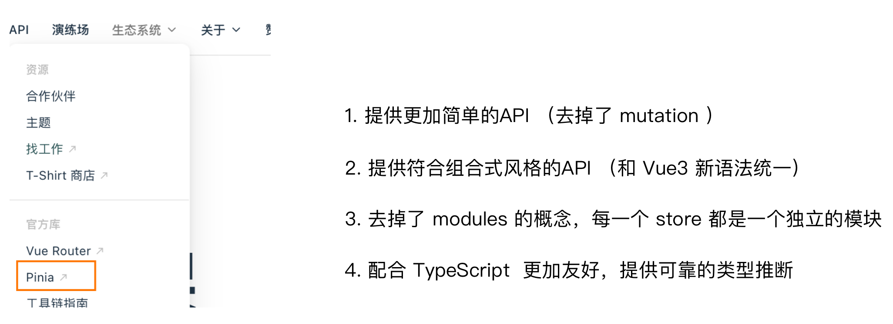

## 什么是Vue

概念：Vue是一套 **构建用户界面** 的 **渐进式** **框架**
### 什么是构建用户界面

**基于数据**渲染出用户可以看到的**界面**

![[Pasted image 20250510164643.png]]
### 什么是渐进式

所谓渐进式就是循序渐进，不一定非得把Vue中的所有API都学完才能开发Vue，可以学一点开发一点
#### Vue的两种开发方式：

![[Pasted image 20250512085240.png]]

1. Vue核心包开发

   场景：局部模块改造

2. Vue核心包&Vue插件&工程化

   场景：整站开发
### 什么是框架

所谓框架：就是一套完整的解决方案

**举个栗子**	

如果把一个完整的项目比喻为一个装修好的房子，那么框架就是一个毛坯房。

我们只需要在“毛坯房”的基础上，增加功能代码即可。

提到框架，不得不提一下库。

- 库，类似工具箱，是一堆方法的集合，比如 axios、lodash、echarts等
- 框架，是一套完整的解决方案，实现了大部分功能，我们只需要按照一定的规则去编码即可。

下图是 库 和 框架的对比。

![[Pasted image 20250510164748.png]]

框架的特点：有一套必须让开发者遵守的**规则**或者**约束**

咱们学框架就是学习的这些规则 [官网](https://v2.cn.vuejs.org/)
## 创建Vue实例

我们已经知道了Vue框架可以 基于数据帮助我们渲染出用户界面，那应该怎么做呢？
![[Pasted image 20250510164831.png]]

比如就上面这个数据，基于提供好的msg 怎么渲染后右侧可展示的数据呢？

**核心步骤（4步）：**

1. 准备容器,即一个盒子,vue需要指定管理的范围
2. 引包（官网） — 开发版本/生产版本
`<script src="https://cdn.jsdelivr.net/npm/vue@2.7.16/dist/vue.js"></script>`
3. 创建Vue实例  new Vue()
4. 指定配置项，渲染数据
   - el:指定挂载点
   - data:提供数据
```html
<div id="app">{{msg}}</div>  
  
<script src="https://cdn.jsdelivr.net/npm/vue@2.7.16/dist/vue.js"></script>  
<script>  
  const app = new Vue({  
    el: "#app",  
    data: {  
      msg: "ciallo~",  
    },  
  });  
</script>
```
## 插值表达式 {{}}

插值表达式是一种Vue的模板语法

我们可以用插值表达式渲染出Vue提供的数据

![[Pasted image 20250510165003.png]]
### 作用：利用表达式进行插值，渲染到页面中

表达式：是可以被求值的代码，JS引擎会讲其计算出一个结果

以下的情况都是表达式：
```js
money + 100
money - 100
money * 10
money / 10 
price >= 100 ? '真贵':'还行'
obj.name
arr[0]
fn()
obj.fn()
```
### 语法

插值表达式语法：`{{ 表达式 }}`
```html
<h3>{{title}}<h3>

<p>{{nickName.toUpperCase()}}</p>

<p>{{age >= 18 ? '成年':'未成年'}}</p>

<p>{{obj.name}}</p>

<p>{{fn()}}</p>
```
### 错误用法
```html
<!--  1.在插值表达式中使用的数据 必须在data中进行了提供-->  
  <p>{{hobby}}</p>  <!--  如果在data中不存在 则会报错-->  
  
<!--  2.支持的是表达式，而非语句，比如：if   for ...-->  
  <p>{{if}}</p>  
  
<!--  3.不能在标签属性中使用 {{  }} 插值 (插值表达式只能标签中间使用)-->  
  <p title="{{username}}">我是P标签</p>
```
## 响应式特性
### 什么是响应式？

​	简单理解就是数据变，视图对应变。 
### 如何访问 和 修改 data中的数据（响应式演示）

data中的数据, 最终会被添加到实例上

① 访问数据： "实例.属性名"

② 修改数据： "实例.属性名"= "值"

![[Pasted image 20250510165019.png]]
## Vue开发者工具安装

[Installation | Vue Devtools](https://devtools-v6.vuejs.org/guide/installation.html)

安装步骤：

![[Pasted image 20250510165034.png]]

安装之后可以F12后看到多一个Vue的调试面板

![[Pasted image 20250510165045.png]]
## Vue中的常用指令

**概念**：指令（Directives）是 Vue 提供的带有 **v- 前缀** 的 特殊 标签**属性**。

vue 中的指令按照不同的用途可以分为如下 6 大类：

-  内容渲染指令（v-html、v-text）
-  条件渲染指令（v-show、v-if、v-else、v-else-if）
-  事件绑定指令（v-on）
-  属性绑定指令 （v-bind）
-  双向绑定指令（v-model）
-  列表渲染指令（v-for）

指令是 vue 开发中最基础、最常用、最简单的知识点。
### 内容渲染指令

内容渲染指令用来辅助开发者渲染 DOM 元素的文本内容。常用的内容渲染指令有如下2 个：

- v-text（类似innerText）

- - 使用语法：`<p v-text="uname">hello</p>`，意思是将 uame 值渲染到 p 标签中
  - 类似 innerText，使用该语法，==会覆盖 p 标签原有内容==

- v-html（类似 innerHTML）

- - 使用语法：`<p v-html="intro">hello</p>`，意思是将 intro 值渲染到 p 标签中
  - 类似 innerHTML，使用该语法，==会覆盖 p 标签原有内容==
  - 类似 innerHTML，使用该语法，能够将HTML标签的样式呈现出来。

>直接使用属性值进行插值不会解析html标签,会直接以纯文本显示

代码演示：
```js
  <div id="app">
    <h2>个人信息</h2>
	// 既然指令是vue提供的特殊的html属性，所以咱们写的时候就当成属性来用即可
    <p v-text="uname">姓名：</p> 
    <p v-html="intro">简介：</p>
  </div> 

<script>
        const app = new Vue({
            el:'#app',
            data:{
                uname:'张三',
                intro:'<h2>这是一个<strong>非常优秀</strong>的boy<h2>'
            }
        })
</script>
```
### 条件渲染指令

条件判断指令，用来辅助开发者按需控制 DOM 的显示与隐藏。条件渲染指令有如下两个，分别是：

1. v-show

   1. 作用：  控制元素显示隐藏
   2. 语法：  v-show = "表达式"   表达式值为 true 显示， false 隐藏
   3. 原理：  ==切换 display:none 控制显示隐藏==
   4. 场景：频繁切换显示隐藏的场景
   ![[Pasted image 20250510165100.png]]

5. v-if

   6. 作用：  控制元素显示隐藏（条件渲染）
   7. 语法：  v-if= "表达式"          表达式值 true显示， false 隐藏
   8. 原理：  ==基于条件判断，是否创建 或 移除元素节点==
   9. 场景：  要么显示，要么隐藏，不频繁切换的场景

   ![[Pasted image 20250510165112.png]]!

   示例代码：

   ```html
	<div id="app">  
	    <div class="box" v-show="flag">我是v-show控制的盒子</div>  
	    <div class="box" v-if="flag">我是v-if控制的盒子</div>  
	</div>

     <script src="https://cdn.jsdelivr.net/npm/vue@2/dist/vue.js"></script>
     <script>
       const app = new Vue({
         el: '#app',
         data: {
           flag: false
         }
       })
     </script>
   ```
   
10. v-else 和 v-else-if

   11. 作用：辅助v-if进行判断渲染
   12. 语法：v-else  v-else-if="表达式"
   13. 需要==紧接着==v-if使用

示例代码：

```html
  <div id="app">
	<p v-if="gender === 1">性别：♂ 男</p>  
	<p v-else>性别：♀ 女</p>  
	<hr>  
	<p v-if="score >= 90">成绩评定A：奖励电脑一台</p>  
	<p v-else-if="score >= 70">成绩评定B：奖励周末郊游</p>  
	<p v-else-if="score >= 60">成绩评定C：奖励零食礼包</p>  
	<p v-else>成绩评定D：惩罚一周不能玩手机</p>
  </div>
  
  <script src="https://cdn.jsdelivr.net/npm/vue@2/dist/vue.js"></script>
  <script>

    const app = new Vue({
      el: '#app',
      data: {
        gender: 2,
        score: 95
      }
    })
  </script>
```
### 事件绑定指令

使用Vue时，如需为DOM注册事件，及其的简单，语法如下：

- `<button v-on:事件名="内联语句">按钮</button>`
- `<button v-on:事件名="处理函数">按钮</button>`
- `<button v-on:事件名="处理函数(实参)">按钮</button>`
- ==`v-on:` 简写为 **@**==

1. 内联语句

   ```js
   <div id="app">
       <button @click="count--">-</button>
       <span>{{ count }}</span>
       <button v-on:click="count++">+</button>
     </div>
     <script src="https://cdn.jsdelivr.net/npm/vue@2/dist/vue.js"></script>
     <script>
       const app = new Vue({
         el: '#app',
         data: {
           count: 100
         }
       })
     </script>
   ```

2. 事件处理函数

   注意：

   - 事件处理函数应该写到一个跟data同级的配置项（methods）中
   - methods中的函数内部的==this都指向Vue实例==,想要在方法中操作data的属性需要通过vue对象访问
```html
<div id="app">  
    <button @click="fn">切换显示隐藏</button>  
    <h1 v-show="isShow">黑马程序员</h1>  
</div>  
<script src="https://cdn.jsdelivr.net/npm/vue@2.7.16/dist/vue.js"></script>  
<script>  
    const app = new Vue({  
        el: '#app',  
        data: {  
            isShow: true  
        },  
        methods: {  
            fn () {  
                this.isShow = !this.isShow  
            }  
        }  
    })  
</script>
```
  3.给事件处理函数传参

- 如果不传递任何参数，则方法无需加小括号；methods方法中可以直接使用 e 当做事件对象
- 如果传递了参数，则实参 `$event` 表示事件对象，固定用法。

```html
<!DOCTYPE html>  
<html lang="en">  
<head>  
    <meta charset="UTF-8">  
    <title>Title</title>  
    <style>        .box {  
            border: 3px solid #000000;  
            border-radius: 10px;  
            padding: 20px;  
            margin: 20px;  
            width: 200px;  
        }  
        h3 {  
            margin: 10px 0 20px 0;  
        }  
        p {  
            margin: 20px;  
        }  
    </style>  
</head>  
<body>  
    <div id="app">  
        <div class="box">  
            <h3>小黑自动售货机</h3>  
            <button @click="fn(5)">可乐5元</button>  
            <button @click="fn(10)">咖啡10元</button>  
            <button @click="fn(8)">牛奶8元</button>  
        </div>        <p>银行卡余额：{{ money }}元</p>  
    </div>    <script src="https://cdn.jsdelivr.net/npm/vue@2.7.16/dist/vue.js"></script>  
    <script>        const app = new Vue({  
            el: '#app',  
            data: {  
                money: 100  
            },  
            methods: {  
              fn(money){  
                  this.money -= money  
              }  
            }  
        })  
    </script>  
</body>  
</html>
```
### 属性绑定指令

1. **作用**：动态设置html的标签属性 比如：src、url、title
2. **语法**：**v-bind**:属性名=“表达式”
3. **v-bind**:可以简写成 =>   **:**

比如，有一个图片，它的 `src` 属性值，是一个图片地址。这个地址在数据 data 中存储。

则可以这样设置属性值：

- ``
- ``   （v-bind可以省略）

```html
<!DOCTYPE html>  
<html lang="en">  
<head>  
    <meta charset="UTF-8">  
    <title>Title</title>  
</head>  
<body>  
    <div id="app">  
          
          
    </div>    <script src="https://cdn.jsdelivr.net/npm/vue@2.7.16/dist/vue.js"></script>  
    <script>        const app = new Vue({  
            el: '#app',  
            data: {  
                imgUrl: './115738312_p0.jpg',  
                msg: 'hello 波仔'  
            }  
        })  
    </script>  
</body>  
</html>
```
### 列表渲染指令

Vue 提供了 v-for 列表渲染指令，用来辅助开发者基于一个数组来循环渲染一个==列表结构==。

v-for 指令需要使用 `(item, index) in arr` 形式的特殊语法，其中：

- item 是数组中的每一项
- index 是每一项的索引，不需要可以省略
- arr 是被遍历的数组

```html
<!DOCTYPE html>  
<html lang="en">  
<head>  
    <meta charset="UTF-8">  
    <title>Title</title>  
</head>  
<body>  
    <div id="app">  
        <ul>            <li v-for="(item,index) in list">  
                  
            </li>        </ul>    </div>    <script src="https://cdn.jsdelivr.net/npm/vue@2.7.16/dist/vue.js"></script>  
    <script>        const app = new Vue({  
            el: '#app',  
            data: {  
                list: [  
                    './109553894_p0.jpg',  
                    './114964970_p0.png',  
                    './115738312_p0.jpg'  
                ],  
            }  
        })  
    </script>  
</body>  
</html>
```

>貌似只能用于列表元素中,再在列表中调用遍历出的对象

此语法也可以遍历**对象和数字**

```html
//遍历对象
<div v-for="(value, key, index) in object">{{value}}</div>
value:对象中的值
key:对象中的键
index:遍历索引从0开始

//遍历数字
<p v-for="item in 10">{{item}}</p>
item从1 开始
```
>v-for遍历时属性可以不写全,不需要的话可以省略,只有一个的时候括号也可以省略
### v-for中的key

**语法：** key="唯一值"

**作用**：给列表项添加的**唯一标识**。便于Vue进行列表项的**正确排序复用**。

**为什么加key**：Vue 的默认行为会尝试原地修改元素（**就地复用**）,如上边的案例,不加key其实是在更新li中的内容,(假如第一个li有背景色,那么删除的时候这个背景色会被顺延到第二个元素)

实例代码：

```html
<ul>
  <li v-for="(item, index) in booksList" :key="item.id">
    <span>{{ item.name }}</span>
    <span>{{ item.author }}</span>
    <button @click="del(item.id)">删除</button>
  </li>
</ul>
```

注意：

1.  key 的值只能是字符串 或 数字类型
2. key 的值必须具有唯一性
3. 推荐使用  id 作为 key（唯一），不推荐使用 index 作为 key（会变化，不对应）
### 双向绑定指令

所谓双向绑定就是：

1. 数据改变后，呈现的页面结果会更新
2. 页面结果更新后，数据也会随之而变

**作用：** 给==表单元素==（input、radio、select）使用，双向绑定数据，可以快速 **获取** 或 **设置** 表单元素内容

**语法**：v-model="变量"(直接写data中的变量名)

**需求**：使用双向绑定实现以下需求

1. 点击登录按钮获取表单中的内容
2. 点击重置按钮清空表单中的内容

![[Pasted image 20250512180408.png]]
```html
<!DOCTYPE html>  
<html lang="en">  
<head>  
    <meta charset="UTF-8">  
    <title>Title</title>  
</head>  
<body>  
    <div id="app">  
        账户：<input type="text" v-model="username"> <br><br>  
        密码：<input type="password" v-model="password"> <br><br>  
        <button @click="login">登录</button>  
        <button @click="username = '' ;password = ''">重置</button>  
    </div>    <script src="https://cdn.jsdelivr.net/npm/vue@2.7.16/dist/vue.js"></script>  
    <script>        const app = new Vue({  
            el: '#app',  
            data: {  
                username: '',  
                password: ''  
            },  
            methods: {  
              login(){  
                  console.log(this.username,this.password)  
              }  
            },  
        })  
    </script>  
</body>  
</html>
```
## 指令修饰符

### 什么是指令修饰符？

​	所谓指令修饰符就是通过“.”指明一些指令**后缀** 不同的**后缀**封装了不同的处理操作  —> 简化代码
### 按键修饰符

- @keyup.enter  —>当点击enter键的时候才触发

>如果只用keyup事件,需要接受事件对象并判断其中的key属性对应的是什么键,想要使用vue接受事件对象可以在绑定时写函数对象(不加括号),在函数定义处写一个参数来接受事件对象

代码演示：

```js
  <div id="app">
    <h3>@keyup.enter  →  监听键盘回车事件</h3>
    <input v-model="username" type="text">
  </div>
  <script src="https://cdn.jsdelivr.net/npm/vue@2/dist/vue.js"></script>
  <script>
    const app = new Vue({
      el: '#app',
      data: {
        username: ''
      },
      methods: {
        
      }
    })
  </script>
```

### v-model修饰符

- v-model.trim  —>去除首位空格
- v-model.number —>转数字

### 事件修饰符

- @事件名.stop —> 阻止冒泡
- @事件名.prevent  —>阻止默认行为
- @事件名.stop.prevent —>可以连用 即阻止事件冒泡也阻止默认行为

```js
 <style>
    .father {
      width: 200px;
      height: 200px;
      background-color: pink;
      margin-top: 20px;
    }
    .son {
      width: 100px;
      height: 100px;
      background-color: skyblue;
    }
  </style>

 <div id="app">
    <h3>v-model修饰符 .trim .number</h3>
    姓名：<input v-model="username" type="text"><br>
    年纪：<input v-model="age" type="text"><br>

    
    <h3>@事件名.stop     →  阻止冒泡</h3>
    <div @click="fatherFn" class="father">
      <div @click="sonFn" class="son">儿子</div>
    </div>

    <h3>@事件名.prevent  →  阻止默认行为</h3>
    <a @click href="http://www.baidu.com">阻止默认行为</a>
  </div>

  <script src="https://cdn.jsdelivr.net/npm/vue@2/dist/vue.js"></script>
  <script>
    const app = new Vue({
      el: '#app',
      data: {
        username: '',
        age: '',
      },
      methods: {
        fatherFn () {
          alert('老父亲被点击了')
        },
        sonFn (e) {
          // e.stopPropagation()
          alert('儿子被点击了')
        }
      }
    })
  </script>
```
## v-bind对样式控制的增强-操作class

为了方便开发者进行样式控制， Vue 扩展了 v-bind 的语法，可以针对 **class 类名** 和 **style 行内样式** 进行控制 。
### 语法

```html
<div> :class = "对象/数组">这是一个div</div>
```
### 对象语法

当class动态绑定的是**对象**时，**键就是类名，值就是布尔值**，如果值是**true**，就有这个类，否则没有这个类

```html
<div class="box" :class="{ 类名1: 布尔值, 类名2: 布尔值 }"></div>
```

​    适用场景：一个类名，来回切换
### 数组语法

当class动态绑定的是**数组**时 → 数组中所有的类，都会添加到盒子上，本质就是一个 class 列表

```html
<div class="box" :class="[ '类名1', '类名2', '类名3' ]"></div>
```

   使用场景:批量添加或删除类
>数组元素必须加引号
## v-bind对有样式控制的增强-操作style

### 语法

```html
<div class="box" :style="{ CSS属性名1: 'CSS属性值', CSS属性名2: 'CSS属性值' }"></div>
```
>属性值需要为字符串,并且如果属性名有中划线,可以转为驼峰或者加引号
### 进度条案例

```html
<div id="app">  
  <div class="progress">  
    <div class="inner" :style="{width:percent+'%'}">  
      <span>{{percent}}%</span>  
    </div>  </div>  <button @click="percent = 25">设置25%</button>  
  <button @click="percent = 50">设置50%</button>  
  <button @click="percent = 75">设置75%</button>  
  <button @click="percent = 100">设置100%</button>  
</div>  
<script src="./vue.js"></script>  
<script>  
  const app = new Vue({  
    el: '#app',  
    data: {  
      percent:0  
    }  
  })  
</script>
```


## v-model在其他表单元素的使用

常见的表单元素都可以用 v-model 绑定关联  →  快速 **获取** 或 **设置** 表单元素的值

它会根据  **控件类型** 自动选取  **正确的方法** 来更新元素

```js
输入框  input:text   ——> value
文本域  textarea	 ——> value
复选框  input:checkbox  ——> checked
单选框  input:radio   ——> checked
下拉菜单 select    ——> value
...
```
### 代码准备

```html
<div id="app">  
  <h3>小黑学习网</h3>  
  
  姓名：  
    <input type="text" v-model="name">  
    <br><br>  
  是否单身：  
    <input type="checkbox" v-model="isSingle">  
    <br><br>  
  <!--   
前置理解：  
      1. name:  给单选框加上 name 属性 可以分组 → 同一组互相会互斥  
      2. value: 给单选框加上 value 属性，用于提交给后台的数据  
    结合 Vue 使用 → v-model  -->  性别:  
    <input type="radio" name="gender" value="0" v-model="gender">男  
    <input type="radio" name="gender" value="1" v-model="gender">女  
    <br><br>  
  
  <!--   
前置理解：  
      3. option 需要设置 value 值，提交给后台  
      4. select 的 value 值，关联了选中的 option 的 value 值  
    结合 Vue 使用 → v-model  -->  所在城市:  
    <select v-model="city">  
      <option value="beijing">北京</option>  
      <option value="shanghai">上海</option>  
      <option value="chengdu">成都</option>  
      <option value="nanjing">南京</option>  
    </select>    <br><br>  
  自我描述：  
    <textarea v-model="intro"></textarea>  
  
  <button>立即注册</button>  
</div>  
<script src="./vue.js"></script>  
<script>  
  const app = new Vue({  
    el: '#app',  
    data: {  
      name:'',  
      isSingle:false,  
      gender:0,  
      city:'',  
      intro:''  
    }  
  })  
</script>
```
## computed计算属性

### 概念

基于**现有的数据**，计算出来的**新属性**。 **依赖**的数据变化，**自动**重新计算。

### 语法

1. 声明在 **computed 配置项**中，一个计算属性对应一个函数
2. 使用起来和普通属性一样使用  {{ 计算属性名}}  

### 注意

1. computed配置项和data配置项是**同级**的
2. computed中的计算属性**虽然是函数的写法**，但他**依然是个属性**
3. computed中的计算属性**不能**和data中的属性**同名**
4. 使用computed中的计算属性和使用data中的属性是一样的用法
5. computed中计算属性内部的**this**依然**指向的是Vue实例**

### 案例

比如我们可以使用计算属性实现下面这个业务场景

![[1682039327858.png]]

### 代码准备

```html
<div id="app">  
  <h3>小黑的礼物清单</h3>  
  <table>    <tr>      <th>名字</th>  
      <th>数量</th>  
    </tr>    <tr v-for="(item, index) in list" :key="item.id">  
      <td>{{ item.name }}</td>  
      <td>{{ item.num }}个</td>  
    </tr>  </table>  
  <!-- 目标：统计求和，求得礼物总数 -->  
  <p>礼物总数：{{total}} 个</p>  
</div>  
<script src="./vue.js"></script>  
<script>  
  const app = new Vue({  
    el: '#app',  
    data: {  
      // 现有的数据  
      list: [  
        { id: 1, name: '篮球', num: 1 },  
        { id: 2, name: '玩具', num: 2 },  
        { id: 3, name: '铅笔', num: 5 },  
      ]  
    },  
    computed:{  
      total(){  
        return this.list.reduce((pre,now)=>pre+now.num,0)  
      }  
    }  
  })  
</script>
```
## computed计算属性 VS methods方法

### computed计算属性

作用：封装了一段对于**数据**的处理，求得一个**结果**

语法：

1. 写在computed配置项中
2. 作为属性，直接使用
   - js中使用计算属性： this.计算属性
   - 模板中使用计算属性：{{计算属性}}
### methods计算属性

作用：给Vue实例提供一个**方法**，调用以**处理业务逻辑**。

语法：

1. 写在methods配置项中
2. 作为方法调用
   - js中调用：this.方法名()
   - 模板中调用 {{方法名()}}  或者 @事件名=“方法名”


### 计算属性的优势

1. 缓存特性（提升性能）

   计算属性会对计算出来的结果缓存，再次使用直接读取缓存，

   依赖项变化了，会自动重新计算 → 并再次缓存

2. methods没有缓存特性
### 总结

1.computed**有缓存特性**，methods**没有缓存**

2.当一个结果依赖其他多个值时，推荐使用计算属性

3.当处理业务逻辑时，推荐使用methods方法，比如事件的处理函数
## 计算属性的完整写法

**既然计算属性也是属性，能访问，应该也能修改了？**

1. 计算属性默认的简写，只能读取访问，不能 "修改"
2. 如果要 "修改"  → 需要写计算属性的完整写法

![[1682041820474.png]]

完整写法代码演示

```html
<div id="app">  
  姓：<input type="text" v-model="firstName"><br>  
  名：<input type="text" v-model="lastName"><br>  
  <p>姓名：{{fullName}}</p>  
  <button @click="fullName = '123123123123123123'">修改姓名</button>  
</div>  
<script src="./vue.js"></script>  
<script>  
  const app = new Vue({  
    el: '#app',  
    data: {  
      firstName:'',  
      lastName:''  
    },  
    computed: {  
      fullName:{  
        get(){  
          return this.firstName+this.lastName  
        },  
        set(value){  
          this.firstName = value.slice(0,1)  
          this.lastName = value.slice(1)  
        }  
      }  
    }  
  })
```
## watch侦听器（监视器）

### 作用：

​	**监视数据变化**，执行一些业务逻辑或异步操作

### 语法：

1. watch同样声明在跟data同级的配置项中

2. 简单写法： 简单类型数据直接监视

3. 完整写法：添加额外配置项

   ```js
   data: { 
     words: '苹果',
     obj: {
       words: '苹果'
     }
   },

   watch: {
     // 该方法会在数据变化时，触发执行
     数据属性名 (newValue, oldValue) {
       一些业务逻辑 或 异步操作。 
     },
     '对象.属性名' (newValue, oldValue) { //别忘了加引号
       一些业务逻辑 或 异步操作。 
     }
   }
   ```
>一般只会用到新值,旧的值很少用到,所以在接受参数时可以不写
### 侦听器代码准备

```html
    <div id="app">

      <!-- 条件选择框 -->

      <div class="query">

        <span>翻译成的语言：</span>

        <select>

          <option value="italy">意大利</option>

          <option value="english">英语</option>

          <option value="german">德语</option>

        </select>

      </div>

  

      <!-- 翻译框 -->

      <div class="box">

        <div class="input-wrap">

          <textarea v-model="obj.words"></textarea>

          <span><i>⌨️</i>文档翻译</span>

        </div>

        <div class="output-wrap">

          <div class="transbox">{{result}}</div>

        </div>

      </div>

    </div>

    <script src="./vue.js"></script>

    <script src="./axios.js"></script>

    <script>

      // 接口地址：https://applet-base-api-t.itheima.net/api/translate

      // 请求方式：get

      // 请求参数：

      // （1）words：需要被翻译的文本（必传）

      // （2）lang： 需要被翻译成的语言（可选）默认值-意大利

      // -----------------------------------------------

  

      const app = new Vue({

        el: '#app',

        data: {

          // words: '',

          obj: {

            words: '',

          },

          result: '',

          timer: '',

        },

        // 具体讲解：(1) watch语法 (2) 具体业务实现

        watch: {

          async 'obj.words'(newValue, oldValue) {

            if(this.timer) clearTimeout(this.timer)

            this.timer = setTimeout(async() => {

            console.log(newValue, oldValue)

            const res = await axios({

              url: 'https://applet-base-api-t.itheima.net/api/translate',

              params: {

                words: newValue,

              },

            })

            this.result = res.data.data

            }, 300)

          },

        },

      })

    </script>
```
>监听器和计算属性都不能写成闭包的形式,所以如果有需要闭包的变量需要临时添加到data中,但是此类不需要动态渲染的数据不需要在data里显式添加,临时添加即可
## watch侦听器

### 语法

完整写法 —>添加额外的配置项

1. deep:true 对复杂类型进行深度监听,即监听对象的每一个属性
2. immdiate:true 初始化 立刻执行一次

```js
data: {
  obj: {
    words: '苹果',
    lang: 'italy'
  },
},

watch: {// watch 完整写法
  对象: {
    deep: true, // 深度监视
    immdiate:true,//立即执行handler函数
    handler (newValue) {
      console.log(newValue)
    }
  }
}

```
>注意方法在定义时使用的是handler(),不是handler:function()
### 需求

![[1682050515722.png]]

- 当文本框输入的时候 右侧翻译内容要时时变化
- 当下拉框中的语言发生变化的时候 右侧翻译的内容依然要时时变化
- 如果文本框中有默认值的话要立即翻译

### 代码实现

```js
    <div id="app">

      <!-- 条件选择框 -->

      <div class="query">

        <span>翻译成的语言：</span>

        <select v-model="obj.lang">

          <option value="italy">意大利</option>

          <option value="english">英语</option>

          <option value="german">德语</option>

        </select>

      </div>

  

      <!-- 翻译框 -->

      <div class="box">

        <div class="input-wrap">

          <textarea v-model="obj.words"></textarea>

          <span><i>⌨️</i>文档翻译</span>

        </div>

        <div class="output-wrap">

          <div class="transbox">{{result}}</div>

        </div>

      </div>

    </div>

    <script src="./vue.js"></script>

    <script src="./axios.js"></script>

    <script>

      // 接口地址：https://applet-base-api-t.itheima.net/api/translate

      // 请求方式：get

      // 请求参数：

      // （1）words：需要被翻译的文本（必传）

      // （2）lang： 需要被翻译成的语言（可选）默认值-意大利

      // -----------------------------------------------

  

      const app = new Vue({

        el: '#app',

        data: {

          // words: '',

          obj: {

            words: '',

            lang:'english'

          },

          result: '',

          timer: '',

        },

        // 具体讲解：(1) watch语法 (2) 具体业务实现

        watch: {

          obj: {

            deep:true,

            immediate:true,

            handler (newValue, oldValue) {

              if (this.timer) clearTimeout(this.timer)

              this.timer = setTimeout(async () => {

                console.log(newValue, oldValue)

                const res = await axios({

                  url: 'https://applet-base-api-t.itheima.net/api/translate',

                  params: {

                    words: newValue,

                    lang:this.lang

                  },

                })

                this.result = res.data.data

              }, 300)

            },

          },

        },

      })

    </script>
```

1.简单写法

```js
watch: {
  数据属性名 (newValue, oldValue) {
    一些业务逻辑 或 异步操作。 
  },
  '对象.属性名' (newValue, oldValue) {
    一些业务逻辑 或 异步操作。 
  }
}
```

2.完整写法

```js
watch: {// watch 完整写法
  数据属性名: {
    deep: true, // 深度监视(针对复杂类型)
    immediate: true, // 是否立刻执行一次handler
    handler (newValue) {
      console.log(newValue)
    }
  }
}
```
## Vue生命周期

思考：什么时候可以发送初始化渲染请求？（越早越好）什么时候可以开始操作dom？（至少dom得渲染出来）

Vue生命周期：就是一个Vue实例从创建 到 销毁 的整个过程。

生命周期四个阶段：① 创建 ② 挂载 ③ 更新 ④ 销毁

1.创建阶段：创建响应式数据

2.挂载阶段：渲染模板

3.更新阶段：(用户)修改数据，更新视图

4.销毁阶段：销毁Vue实例

![[Pasted image 20250725201048.png]]
## Vue生命周期钩子

Vue生命周期过程中，会**自动运行一些函数**，被称为【**生命周期钩子**】→  让开发者可以在【**特定阶段**】运行**自己的代码**

![[Pasted image 20250725201101.png]]

```html
<div id="app">
    <h3>{{ title }}</h3>
    <div>
      <button @click="count--">-</button>
      <span>{{ count }}</span>
      <button @click="count++">+</button>
    </div>
  </div>
  <script src="https://cdn.jsdelivr.net/npm/vue@2/dist/vue.js"></script>
  <script>
    const app = new Vue({
      el: '#app',
      data: {
        count: 100,
        title: '计数器'
      },
        beforeCreate() {
          console.log(1)
        },
        created() {
          console.log(2)
        },
        beforeMount() {
          console.log(3)
        },
        mounted() {
          console.log(4)
        },
        beforeUpdate(){
        },
        updated(){
        },
        beforeDestroy(){
        },
        destroyed
    })
  </script>
```
>通过vue实例的.$destroy()方法可以手动卸载


## 生命周期钩子小案例

### 在created中发送数据

```html
  <div id="app">

    <ul>

      <li class="news" v-for="item in res">

        <div class="left">

          <div class="title">{{item.title}}</div>

          <div class="info">

            <span>{{item.source}}</span>

            <span>{{item.time}}</span>

          </div>

        </div>

        <div class="right">

          

        </div>

      </li>

    </ul>

  </div>

  <script src="./vue.js"></script>

  <script src="./axios.js"></script>

  <script>

    // 接口地址：http://hmajax.itheima.net/api/news

    // 请求方式：get

    const app = new Vue({

      el: '#app',

      data: {

        res:''

      },

      created(){

        axios({

          url:'http://hmajax.itheima.net/api/news'

        }).then(res=>{

          this.res = res.data.data;

          console.log(this.res);

        })

      }

    })

  </script>
```
### 在mounted中获取焦点

```html
    <div class="container" id="app">

      <div class="search-container">

        

        <div class="search-box">

          <input type="text" v-model="words" id="inp" />

          <button>搜索一下</button>

        </div>

      </div>

    </div>

  

    <script src="./vue.js"></script>

    <script>

      const app = new Vue({

        el: '#app',

        data: {

          words: '',

        },

        mounted() {

          document.querySelector('#inp').focus()

        },

      })

    </script>
```
## 案例-小黑记账清单

### 需求图示：
![[Pasted image 20250725204855.png]]
### 需求分析

1.基本渲染
2.添加功能
3.删除功能
4.饼图渲染
### 思路分析

1.基本渲染  

- 立刻发送请求获取数据 created
- 拿到数据，存到data的响应式数据中
- 结合数据，进行渲染 v-for
- 消费统计  —> 计算属性

2.添加功能

- 收集表单数据 v-model，使用指令修饰符处理数据
- 给添加按钮注册点击事件，对输入的内容做非空判断，发送请求
- 请求成功后，对文本框内容进行清空
- 重新渲染列表

3.删除功能

- 注册点击事件，获取当前行的id
- 根据id发送删除请求
- 需要重新渲染

4.饼图渲染

- 初始化一个饼图 echarts.init(dom)    mounted钩子中渲染
- 根据数据试试更新饼图 echarts.setOptions({...})

### 代码准备

```html
    <div id="app">

      <div class="contain">

        <!-- 左侧列表 -->

        <div class="list-box">

          <!-- 添加资产 -->

          <form class="my-form">

            <input

              type="text"

              class="form-control"

              placeholder="消费名称"

              v-model="name"

            />

            <input

              type="text"

              class="form-control"

              placeholder="消费价格"

              v-model="price"

            />

            <button type="button" class="btn btn-primary" @click="add">

              添加账单

            </button>

          </form>

  

          <table class="table table-hover">

            <thead>

              <tr>

                <th>编号</th>

                <th>消费名称</th>

                <th>消费价格</th>

                <th>操作</th>

              </tr>

            </thead>

            <tbody>

              <tr v-for="item in list" :key="item.id">

                <td>{{item.id}}</td>

                <td>{{item.name}}</td>

                <td :class="{red:item.price>=500}">

                  {{item.price.toFixed(2)}}

                </td>

                <td><a href="javascript:;" @click="del(item.id)">删除</a></td>

              </tr>

            </tbody>

            <tfoot>

              <tr>

                <td colspan="4">消费总计： {{totalPrice.toFixed(2)}}</td>

              </tr>

            </tfoot>

          </table>

        </div>

  

        <!-- 右侧图表 -->

        <div class="echarts-box" id="main"></div>

      </div>

    </div>

    <script src="../echarts.min.js"></script>

    <script src="../vue.js"></script>

    <script src="../axios.js"></script>

    <script>

      /**

       * 接口文档地址：

       * https://www.apifox.cn/apidoc/shared-24459455-ebb1-4fdc-8df8-0aff8dc317a8/api-53371058

       *

       * 功能需求：

       * 1. 基本渲染

       * 2. 添加功能

       * 3. 删除功能

       * 4. 饼图渲染

       */

      const app = new Vue({

        el: '#app',

        data: {

          list: [],

          name: '',

          price: '',

          myChart: {},

        },

        computed: {

          totalPrice() {

            return this.list.reduce((pre, now) => pre + now.price, 0)

          },

        },

        methods: {

          async getList() {

            axios({

              url: 'https://applet-base-api-t.itheima.net/bill',

              params: {

                creator: 'SunnyDoll',

              },

            }).then((res) => {

              console.log(res)

              this.list = res.data.data

              this.myChart.setOption({

                series: [

                  {

                    data: this.list.map((item) => ({

                      name: item.name,

                      value: item.price,

                    })),

                  },

                ],

              })

            })

          },

          async add() {

            if (!this.name || !this.price) return

            await axios({

              url: 'https://applet-base-api-t.itheima.net/bill',

              method: 'post',

              data: {

                creator: 'SunnyDoll',

                name: this.name,

                price: this.price,

              },

            }).then((res) => {

              this.name = this.price = ''

              console.log(res)

            })

            this.getList()

          },

          async del(id) {

            await axios({

              url: `https://applet-base-api-t.itheima.net/bill/${id}`,

              method: 'delete',

            })

            this.getList()

          },

        },

        created() {

          this.getList()

        },

        mounted() {

          this.myChart = echarts.init(document.querySelector('#main'))

          this.myChart.setOption({

            title: {

              text: '消费账单列表', //大标题

              subtext: 'Fake Data', //小标题

              left: 'center', //对齐方式

            },

            tooltip: {

              trigger: 'item', //鼠标移到饼图上的提示内容

            },

            legend: {

              //图例

              orient: 'vertical', //对齐方式

              left: 'left',

            },

            series: [

              //数据

              {

                name: '消费账单', //提示内容的标题

                type: 'pie', //饼图

                radius: '50%', //半径

                data: [],

                emphasis: {

                  itemStyle: {

                    shadowBlur: 10,

                    shadowOffsetX: 0,

                    shadowColor: 'rgba(0, 0, 0, 0.5)',

                  },

                },

              },

            ],

          })

        },

      })

    </script>
```
## 工程化开发和脚手架

### 开发Vue的两种方式

- 核心包传统开发模式：基于html / css / js 文件，直接引入核心包，开发 Vue。
- **工程化开发模式：基于构建工具（例如：webpack）的环境中开发Vue。**
![[Pasted image 20250725223033.png]]

工程化开发模式优点：

   提高编码效率，比如使用JS新语法、Less/Sass、Typescript等通过webpack都可以编译成浏览器识别的ES3/ES5/CSS等

工程化开发模式问题：

- webpack配置**不简单**
- **雷同**的基础配置
- 缺乏**统一的标准**

为了解决以上问题，所以我们需要一个工具，生成标准化的配置
### 脚手架Vue CLI

####   基本介绍：

   Vue CLI 是Vue官方提供的一个**全局命令工具**

   可以帮助我们**快速创建**一个开发Vue项目的**标准化基础架子**。【集成了webpack配置】

####    好处：

1. 开箱即用，零配置
2. 内置babel等工具
3. 标准化的webpack配置

####    使用步骤：

1. 全局安装（只需安装一次即可） yarn global add @vue/cli 或者 npm i @vue/cli -g
2. 查看vue/cli版本： vue --version
3. 创建项目架子：**vue create project-name**(项目名不能使用中文)
4. 启动项目：**yarn serve** 或者 **npm run serve**(命令不固定，找package.json)

## 项目目录介绍和运行流程

### 项目目录介绍
![[Pasted image 20250725230109.png]]

虽然脚手架中的文件有很多，目前咱们只需认识三个文件即可

1. main.js  入口文件:导入App.vue,基于App.vue创建结构渲染index.html
2. App.vue  App根组件 
3. index.html 模板文件
### 运行流程

![[Pasted image 20250725232955.png]]

## 组件化开发

​     组件化：一个页面可以拆分成一个个组件，每个组件有着自己独立的结构、样式、行为。

​     好处：便于维护，利于复用 → 提升开发效率。

​     组件分类：普通组件、根组件。

​      比如：下面这个页面，可以把所有的代码都写在一个页面中，但是这样显得代码比较混乱，难易维护。咱们可以按模块进行组件划分

![[Pasted image 20250725233016.png]]
## 根组件 App.vue

### 根组件介绍

整个应用最上层的组件，包裹所有普通小组件

![[Pasted image 20250725234050.png]]
### 组件是由三部分构成

- 三部分构成

  - template：结构 （有且只能一个根元素）
  - script:   js逻辑 (导出的是当前组件的配置项,可以提供data,methods,cmoputed,watch或者生命周期钩子)
  -  style： 样式 (可支持less，需要装包)

- 让组件支持less

  （1） style标签，lang="less" 开启less功能 

  （2） 装包: yarn add less less-loader -D 或者npm i less less-loader -D

## 普通组件的注册使用-局部注册

### 特点：

只能在注册的组件内使用
### 步骤：

1. 创建.vue文件（三个组成部分）
2. 在使用的组件内先导入再注册，最后使用

### 使用方式：

当成html标签使用即可  <组件名></组件名>

### 注意：

组件名规范 —> 大驼峰命名法， 如 HmHeader

### 语法：

![[Pasted image 20250726112405.png]]
```js
// 导入需要注册的组件
import 组件对象 from '.vue文件路径'
import HmHeader from './components/HmHeader'

export default {  // 局部注册
  components: {
   '组件名': 组件对象,
    HmHeader:HmHeaer,
    HmHeader
  }
}
```
## 普通组件的注册使用-全局注册

### 特点：

全局注册的组件，在项目的**任何组件**中都能使用

### 步骤

1. 创建.vue组件（三个组成部分）
2. **main.js**中进行全局注册

### 使用方式

当成HTML标签直接使用

> <组件名></组件名>

### 注意

组件名规范 —> 大驼峰命名法， 如 HmHeader

### 语法

Vue.component('组件名', 组件对象)

例：

```js
// 导入需要全局注册的组件
import HmButton from './components/HmButton'
Vue.component('HmButton', HmButton)
```
## scoped解决样式冲突

### **默认情况**：

写在组件中的样式会 **全局生效** →  因此很容易造成多个组件之间的样式冲突问题。

1. **全局样式**: 默认组件中的样式会作用到全局，任何一个组件中都会受到此样式的影响

2. **局部样式**: 可以给组件加上**scoped** 属性,可以**让样式只作用于当前组件**
### 代码演示
BaseTwo.vue

```vue
<template>
  <div class="base-one">
    BaseTwo
  </div>
</template>

<script>
export default {

}
</script>

<style scoped>  
div{  
  border: 3px solid red;  
  margin: 30px;  
}  
</style>
```
### scoped原理

1. 当前组件内标签都被添加**data-v-hash值** 的属性 
2. css选择器都被添加 **data-v-hash值** 的属性选择器

最终效果: **必须是当前组件的元素**, 才会有这个自定义属性, 才会被这个样式作用到 

![[Pasted image 20250726230705.png]]
## data必须是一个函数

### data为什么要写成函数

一个组件的 **data** 选项必须**是一个函数**。目的是为了：保证每个组件实例，维护**独立**的一份**数据**对象。

每次创建新的组件实例，都会新**执行一次data 函数**，得到一个新对象。

![[Pasted image 20250726230922.png]]
### 代码演示

BaseCount.vue

```vue
<template>
  <div class="base-count">
    <button @click="count--">-</button>
    <span>{{ count }}</span>
    <button @click="count++">+</button>
  </div>
</template>

<script>
export default {
  data: function () {
    return {
      count: 100,
    }
  },
}
</script>

<style>
.base-count {
  margin: 20px;
}
</style>
```
## 组件通信

### 什么是组件通信？

组件通信，就是指**组件与组件**之间的**数据传递**

- 组件的数据是独立的，无法直接访问其他组件的数据。
- 想使用其他组件的数据，就需要组件通信
### 组件关系分类

1. 父子关系
2. 非父子关系

![[Pasted image 20250726232727.png]]
### 通信解决方案

![[Pasted image 20250726232739.png]]
### 父子通信流程

1. 父组件通过 **props** 将数据传递给子组件
2. 子组件利用 **$emit** 通知父组件修改更新

![[Pasted image 20250726232759.png]]
### 父向子通信代码示例

父组件通过**props**将数据传递给子组件

父组件App.vue

```vue
<template>
  <div class="app" style="border: 3px solid #000; margin: 10px">
    我是APP组件 
    <Son :title="myTitle"></Son>
  </div>
</template>

<script>
import Son from './components/Son.vue'
export default {
  name: 'App',
  data() {
    return {
      myTitle: '学前端，就来黑马程序员',
    }
  },
  components: {
    Son,
  },
}
</script>

<style>
</style>
```

子组件Son.vue

```vue
<template>
  <div class="son" style="border:3px solid #000;margin:10px">
    我是Son组件 {{title}}
  </div>
</template>

<script>
export default {
  name: 'Son-Child',
  props:[  
    'title'  
  ]
}
</script>

<style>

</style>
```
>在子组件的标签上添加任何属性都可以被子组件接收,加不加:决定的是这个属性是否会发生变化,加上是变量,不加就没办法根据父组件的属性变化了

![[Pasted image 20250726233445.png]]

父向子传值步骤

1. 给子组件以添加属性的方式传值
2. 子组件内部通过props接收
3. 模板中直接使用 props接收的值
### 子向父通信代码示例

子组件利用 **$emit** 通知父组件，进行修改更新

![[Pasted image 20250726233848.png]]

子向父传值步骤

1. $emit触发事件，给父组件发送消息通知
2. 父组件监听$emit触发的事件
3. 提供处理函数，在函数的性参中获取传过来的参数
## 什么是props

### Props 定义

props就是组件上 注册的一些  自定义属性
### Props 作用

向子组件传递数据

### 特点

1. 可以 传递 **任意数量** 的prop
2. 可以 传递 **任意类型** 的prop

![[Pasted image 20250726235442.png]]

### 代码演示

父组件App.vue

```vue
<template>
	<div class="app">  
	  <UserInfo      :username="username"  
	      :age="age"  
	      :isSingle="isSingle"  
	      :car="car"  
	      :hobby="hobby"></UserInfo>  
	</div>
</template>

<script>
import UserInfo from './components/UserInfo.vue'
export default {
  data() {
    return {
      username: '小帅',
      age: 28,
      isSingle: true,
      car: {
        brand: '宝马',
      },
      hobby: ['篮球', '足球', '羽毛球'],
    }
  },
  components: {
    UserInfo,
  },
}
</script>

<style>
</style>
```

子组件UserInfo.vue

```vue
<template>
  <div class="userinfo">
	<h3>我是个人信息组件</h3>  
	<div>姓名：{{username}}</div>  
	<div>年龄：{{age}}</div>  
	<div>是否单身：{{isSingle?是:否}}</div>  
	<div>座驾：{{car}}</div>  
	<div>兴趣爱好 {{hobby}}</div>
  </div>
</template>

<script>
export default {
  props:['username','age','isSingle','car','hobby']
}
</script>

<style>
.userinfo {
  width: 300px;
  border: 3px solid #000;
  padding: 20px;
}
.userinfo > div {
  margin: 20px 10px;
}
</style>
```
## props校验
### 作用
为组件的 prop 指定**验证要求**，不符合要求，控制台就会有**错误提示**  → 帮助开发者，快速发现错误
### 语法
- **类型校验**
- 非空校验
- 默认值
- 自定义校验

![[Pasted image 20250726235700.png]]
### 代码演示
App.vue
```vue
<template>
  <div class="app">
    <BaseProgress :w="width"></BaseProgress>
  </div>
</template>

<script>
import BaseProgress from './components/BaseProgress.vue'
export default {
  data() {
    return {
      width: 30,
    }
  },
  components: {
    BaseProgress,
  },
}
</script>

<style>
</style>
```
BaseProgress.vue
```vue
<template>
  <div class="base-progress">
    <div class="inner" :style="{ width: w + '%' }">
      <span>{{ w }}%</span>
    </div>
  </div>
</template>

<script>
export default {
  props: {
    w:Number
  }
}
</script>

<style scoped>
.base-progress {
  height: 26px;
  width: 400px;
  border-radius: 15px;
  background-color: #272425;
  border: 3px solid #272425;
  box-sizing: border-box;
  margin-bottom: 30px;
}
.inner {
  position: relative;
  background: #379bff;
  border-radius: 15px;
  height: 25px;
  box-sizing: border-box;
  left: -3px;
  top: -2px;
}
.inner span {
  position: absolute;
  right: 0;
  top: 26px;
}
</style>
```
## props校验完整写法

### 语法

```vue
props: {
  校验的属性名: {
    type: 类型,  // Number String Boolean ...
    required: true, // 是否必填
    default: 默认值, // 默认值
    validator (value) {
      // 自定义校验逻辑
      return 是否通过校验
    }
  }
},
```

### 代码实例

```vue
<script>
export default {
  // 完整写法（类型、默认值、非空、自定义校验）
  props: {
    w: {
      type: Number,
      //required: true,
      default: 0,
      validator(val) {
        // console.log(val)
        if (val >= 100 || val <= 0) {
          console.error('传入的范围必须是0-100之间')
          return false
        } else {
          return true
        }
      },
    },
  },
}
</script>
```
>validator方法返回true校验成功,返回false失败
### 注意

1.default和required一般不同时写（因为当时必填项时，肯定是有值的）

2.default后面如果是简单类型的值，可以直接写默认。如果是复杂类型的值，则需要以==函数==的形式return一个默认值
## props&data、单向数据流

### 共同点

都可以给组件提供数据

### 区别

- data 的数据是**自己**的  →   随便改  
- prop 的数据是**外部**的  →   不能直接改，要遵循 **单向数据流**

### 单向数据流：

父级props 的数据更新，会向下流动，影响子组件。这个数据流动是单向的

![[Pasted image 20250727000514.png]]
## 非父子通信-event bus 事件总线

### 作用

非父子组件之间，进行简易消息传递。(复杂场景→ Vuex)
>这种方法会把接收到的消息转发给每一个消费者,不能指定某一部分消费者
### 步骤

1. 创建一个都能访问的事件总线 （空Vue实例）

   ```js
   import Vue from 'vue'
   const Bus = new Vue()
   export default Bus
   ```

2. A组件（接受方），监听Bus的 $on事件

   ```vue
   created () {
     Bus.$on('sendMsg', (msg) => {
       this.msg = msg
     })
   }
   ```

3. B组件（发送方），触发Bus的$emit事件

   ```vue
   Bus.$emit('sendMsg', '这是一个消息')
   ```

   ![[Pasted image 20250730232142.png]]
### 代码示例

EventBus.js

```js
import Vue from 'vue'
const Bus  =  new Vue()
export default Bus
```

BaseA.vue(接受方)

```vue
<script>
import Bus from '../utils/EventBus'
export default {
  data() {
    return {
      msg: '',
    }
  },
  created() {
    Bus.$on('sendMsg', (msg) => {
      // console.log(msg)
      this.msg = msg
    })
  },
}
</script>
```

BaseB.vue(发送方)

```vue
<script>
import Bus from '../utils/EventBus'
export default {
  methods: {
    sendMsgFn() {
      Bus.$emit('sendMsg', '今天天气不错，适合旅游')
    },
  },
}
</script>
```

App.vue

```vue
<template>
  <div class="app">
    <BaseA></BaseA>
    <BaseB></BaseB> 
  </div>
</template>

<script>
import BaseA from './components/BaseA.vue'
import BaseB from './components/BaseB.vue' 
export default {
  components:{
    BaseA,
    BaseB
  }
}
</script>

<style>

</style>
```

## 非父子通信-provide&inject

### 作用

跨层级共享数据

### 场景

![[Pasted image 20250730233456.png]]

### 语法

1. 父组件 provide提供数据

```js
export default {
  provide () {
    return {
       // 普通类型【非响应式】
       color: this.color, 
       // 复杂类型【响应式】
       userInfo: this.userInfo, 
    }
  }
}
```
>这里的响应式是指接收方接收到的数据是否会实时更新,如字符串在父类更新,子类并不会更新,复杂类型会跟着父类一起变化,所以平时常用复杂类型传递

2.子/孙组件 inject获取数据

```js
export default {
  inject: ['color','userInfo'],
  created () {
    console.log(this.color, this.userInfo)
  }
}
```

### 注意

- provide提供的简单类型的数据不是响应式的，复杂类型数据是响应式。（推荐提供复杂类型数据）
- 子/孙组件通过inject获取的数据，不能在自身组件内修改

## v-model原理

### 原理：

v-model本质上是一个语法糖。例如应用在输入框上，就是value属性 和 input事件 的合写

```vue
<template>
  <div id="app" >
    <input v-model="msg" type="text">

    <input :value="msg" @input="msg = $event.target.value" type="text">
  </div>
</template>
```
>**$event** 用于在模板中，获取事件的形参,即event对象
### 作用：

提供数据的双向绑定

- 数据变，视图跟着变 :value
- 视图变，数据跟着变 @input

### v-model使用在其他表单元素上的原理

不同的表单元素， v-model在底层的处理机制是不一样的。比如给checkbox使用v-model

底层处理的是 checked属性和change事件。

**不过咱们只需要掌握应用在文本框上的原理即可**

## 表单类组件封装

### 需求目标

实现子组件和父组件数据的双向绑定 （实现App.vue中的selectId和子组件选中的数据进行双向绑定）
>父传子: 数据是由父组件props传递过来的,子传父:数据是用事件监听传递给父组件的
### 代码演示

App.vue

```vue
<template>
  <div class="app">
    <BaseSelect :selectId="selectId" @onChange="selectId = $event"></BaseSelect>
  </div>
</template>

<script>
import BaseSelect from './components/BaseSelect.vue'
export default {
  data() {
    return {
      selectId: '102',
    }
  },
  components: {
    BaseSelect,
  },
  methods: {
    handleChange(e) {
      console.log(e);
      this.selectId = e
    }
    
  }
}
</script>

<style>
</style>
```

BaseSelect.vue

```vue
<template>
  <div>
    <select :value="selectId" @change="onChange">
      <option value="101">北京</option>
      <option value="102">上海</option>
      <option value="103">武汉</option>
      <option value="104">广州</option>
      <option value="105">深圳</option>
    </select>
  </div>
</template>

<script>
export default {
  props:{
    selectId:String
  },
  methods:{
    onChange(e){
      this.$emit('onChange',e.target.value)
    }
  }
}
</script>

<style>
</style>
```
## v-model简化代码

### 如何简化：

v-model其实就是 :value和@input事件的简写

- 子组件：props通过value接收数据，事件触发 input
- 父组件：v-model直接绑定数据
1. **v-model工作原理**：
    - 在Vue 3中，`v-model`默认使用`modelValue`作为prop，`update:modelValue`作为事件
    - 当在子组件中修改值时，通过`$emit('update:modelValue', newValue)`通知父组件
2. **多个v-model绑定**:
    - Vue 3支持为单个组件绑定多个`v-model`
    - 语法：`v-model:propName="data"`
    - 子组件通过对应的prop接收，通过`update:propName`事件发送更新
3. **与传统方式的对比**：
    - 传统方式：使用`:value`和`@input`手动绑定
    - v-model方式：更简洁，语义更清晰
### 代码示例

子组件

```vue
<select :value="value" @change="e => this.$emit('input',e.target.value)">
```

父组件

```vue
<BaseSelect v-model="selectId"></BaseSelect>
```
## .sync修饰符

### 作用

可以实现 **子组件** 与 **父组件数据** 的 **双向绑定**，简化代码

简单理解：**子组件可以修改父组件传过来的props值**
>可以自定义props的名字,不再固定为value
### 本质

.sync修饰符 就是 **:属性名** 和 **@update:属性名** 合写

### 语法

父组件

```vue
//.sync写法
<BaseDialog :visible.sync="isShow" />
--------------------------------------
//完整写法
<BaseDialog 
  :visible="isShow" 
  @update:visible="isShow = $event" 
/>
```

子组件

```vue
props: {
  visible: Boolean
},

this.$emit('update:visible', false)
```

### 代码示例

App.vue

```vue
<template>
  <div class="app">
    <button @click="visable = true">退出按钮</button>
    <BaseDialog :visable.sync="visable"></BaseDialog>
  </div>
</template>

<script>
import BaseDialog from "./components/BaseDialog.vue"
export default {
  data() {
    return {
      visable:false
    }
  },
  methods: {
    
  },
  components: {
    BaseDialog,
  },
}
</script>
```

BaseDialog.vue

```vue
<template>
  <div class="base-dialog-wrap" v-show="visable">
    <div class="base-dialog">
      <div class="title">
        <h3>温馨提示：</h3>
        <button class="close" @click="$emit('update:visable',false)">x</button>
      </div>
      <div class="content">
        <p>你确认要退出本系统么？</p>
      </div>
      <div class="footer">
        <button>确认</button>
        <button @click="$emit('update:visable',false)">取消</button>
      </div>
    </div>
  </div>
</template>

<script>
export default {
  props:{
    visable:Boolean
  }
}
</script>
```
## ref和$refs

### 作用

利用ref 和 $refs 可以用于 获取 dom 元素 或 组件实例

### 特点：

查找范围 →  当前组件内(更精确稳定)
>之前只用document.querySelect('.box') 获取的是整个页面中的盒子
### 语法

1.给要获取的盒子添加ref属性

```html
<div ref="chartRef">我是渲染图表的容器</div>
```

2.获取时通过 $refs获取  this.\$refs.chartRef 获取

```html
mounted () {
  console.log(this.$refs.chartRef)
}
```
### 代码示例

App.vue

```vue
<template>
  <div class="app">
    <BaseChart></BaseChart>
  </div>
</template>

<script>
import BaseChart from './components/BaseChart.vue'
export default {
  components:{
    BaseChart
  }
}
</script>

<style>
</style>
```

BaseChart.vue

```vue
<template>
  <div class="base-chart-box" ref="myChart">子组件</div>
</template>

<script>
import * as echarts from 'echarts'

export default {
  mounted() {
    // 基于准备好的dom，初始化echarts实例
    const myChart = echarts.init(this.$refs.myChart)
    // 绘制图表
    myChart.setOption({
      title: {
        text: 'ECharts 入门示例',
      },
      tooltip: {},
      xAxis: {
        data: ['衬衫', '羊毛衫', '雪纺衫', '裤子', '高跟鞋', '袜子'],
      },
      yAxis: {},
      series: [
        {
          name: '销量',
          type: 'bar',
          data: [5, 20, 36, 10, 10, 20],
        },
      ],
    })
  },
}
</script>
```
## 异步更新 & $nextTick

### 需求

编辑标题,  编辑框自动聚焦

1. 点击编辑，显示编辑框
2. 让编辑框，立刻获取焦点
>"显示之后"，立刻获取焦点是不能成功的！
>原因：Vue 是异步更新DOM  (提升性能)
![[Pasted image 20250801010106.png]]
### 代码实现

```vue
<template>
  <div class="app">
    <div v-if="isShowEdit">
      <input type="text" v-model="editValue" ref="inp" />
      <button>确认</button>
    </div>
    <div v-else>
      <span>{{ title }}</span>
      <button @click="edit">编辑</button>
    </div>
  </div>
</template>

<script>
export default {
  data() {
    return {
      title: '大标题',
      isShowEdit: false,
      editValue: '',
    }
  },
  methods: {
    edit() {
      this.isShowEdit = true
      this.$nextTick(() => {
        this.$refs.inp.focus()
      })
    }
  },
}
</script>

<style></style>
```
### 解决方案

$nextTick：**等 DOM更新后**,才会触发执行此方法里的函数体

**语法:** this.$nextTick(函数体)

```js
this.$nextTick(() => {
  this.$refs.inp.focus()
})
```

> **注意：**$nextTick 内的函数体 一定是**箭头函数**，这样才能让函数内部的this指向Vue实例
## 自定义指令

### 指令介绍

- 内置指令：**v-html、v-if、v-bind、v-on**... 这都是Vue给咱们内置的一些指令，可以直接使用

- 自定义指令：同时Vue也支持让开发者，自己注册一些指令。这些指令被称为**自定义指令**

  每个指令都有自己各自独立的功能

### 自定义指令

概念：自己定义的指令，可以**封装一些DOM操作**，扩展额外的功能

### 自定义指令语法

- 全局注册

  ```js
  //在main.js中
  Vue.directive('指令名', {
    "inserted" (el) {
      // 可以对 el 标签，扩展额外功能
      el.focus()
    }
  })
  ```
>这里的inserted是与指令相关的钩子,就比如inserted就是当这个元素被插入到页面中去的时候触发(类似mounted)
>==注意是插入,而不是显示,v-show控制的隐藏和现实不会触发inserted钩子,v-if可以==
- 局部注册

  ```vue
  //在Vue组件的配置项中
  directives: {
    "指令名": {
      inserted () {
        // 可以对 el 标签，扩展额外功能
        el.focus()
      }
    }
  }
  ```

- 使用指令

  注意：在使用指令的时候，一定要**先注册**，**再使用**，否则会报错
  使用指令语法： v-指令名。如：`<input type="text"  v-focus/>`  

  **注册**指令时**不用**加**v-前缀**，但**使用时**一定要**加v-前缀**

### 指令中的配置项介绍

inserted:被绑定元素插入父节点时调用的钩子函数

el：使用指令的那个DOM元素
### 代码示例

需求：当页面加载时，让元素获取焦点（**autofocus在safari浏览器有兼容性**）

App.vue
- 全局
```vue
<template>
  <div>
    <h1>自定义指令</h1>
    <input type="text" ref="inp" v-focus>
  </div>
</template>
```

- 局部

```vue
<template>
  <div>
    <h1>自定义指令</h1>
    <input type="text" ref="inp" v-focus>
  </div>
</template>

<script>
// import { directive } from 'vue/types/umd';

export default {
  // mounted(){
  //   this.$refs.inp.focus()
  // }
  directives:{
    focus:{
      inserted(el){
        el.focus()
      }
    }
  }
}
</script>
```

main.js

```js
import Vue from 'vue'
import App from './App.vue'

Vue.config.productionTip = false

Vue.directive('focus', {
  inserted (el) {
    el.focus()
  }
});

new Vue({
  render: h => h(App),
}).$mount('#app')
```
## 自定义指令-指令的值

### 需求

实现一个 color 指令 - 传入不同的颜色, 给标签设置文字颜色

### 语法

1.在绑定指令时，可以通过“等号”的形式为指令 绑定 具体的参数值

```html
<div v-color="color">我是内容</div>
```

2.通过 binding.value 可以拿到指令值，**指令值修改会 触发 update 函数**

```js
directives: {
  color: {
    inserted (el, binding) {
      el.style.color = binding.value
    },
    update (el, binding) {
      el.style.color = binding.value
    }
  }
}
```
>binding这个变量叫什么或者在哪里不重要,这个方法传递参数是按位置传入的,第一个传入的为el,第二传入的为binding

>这个binding传入的值是一个vue的data变量,不能直接写字面量
### 代码示例

App.vue

```vue
<template>
  <div>
    <h1 v-color='color1'>指令的值1测试</h1>
    <h1 v-color='color2'>指令的值2测试</h1>
  </div>
</template>

<script>

export default {
  data () {
    return {
      color1:'red',
      color2:'blue'
    }
  },
  directives:{
    color:{
      inserted(el,binging){
        el.style.color = binging.value
      },
      update(el,binding){
        el.style.color = binding.value
      }
    }
  }
}
</script>
```
## 自定义指令-v-loading指令的封装

### 场景

实际开发过程中，发送请求需要时间，在请求的数据未回来时，页面会处于**空白状态**  =>  用户体验不好

### 需求

封装一个 v-loading 指令，实现加载中的效果

### 分析

1.本质 loading效果就是一个蒙层，盖在了盒子上

2.数据请求中，开启loading状态，添加蒙层

3.数据请求完毕，关闭loading状态，移除蒙层

### 实现

1.准备一个 loading类，通过伪元素定位，设置宽高，实现蒙层

2.开启关闭 loading状态（添加移除蒙层），本质只需要添加移除类即可

3.结合自定义指令的语法进行封装复用

```css
.loading:before {
  content: "";
  position: absolute;
  left: 0;
  top: 0;
  width: 100%;
  height: 100%;
  background: #fff url("./loading.gif") no-repeat center;
}
```

### 准备代码

```html
<template>
  <div class="main">
    <div class="box" v-loading="isLoading">
      <ul>
        <li v-for="item in list" :key="item.id" class="news">
          <div class="left">
            <div class="title">{{ item.title }}</div>
            <div class="info">
              <span>{{ item.source }}</span>
              <span>{{ item.time }}</span>
            </div>
          </div>

          <div class="right">
            
          </div>
        </li>
      </ul>
    </div>
  </div>
</template>

<script>
// 安装axios =>  yarn add axios
import axios from 'axios'
// import { directive } from 'vue/types/umd'

// 接口地址：http://hmajax.itheima.net/api/news
// 请求方式：get
export default {
  data () {
    return {
      list: [],
      isLoading:true
    }
  },
  async created () {
    // 1. 发送请求获取数据
    const res = await axios.get('http://hmajax.itheima.net/api/news')
    
    setTimeout(() => {
      // 2. 更新到 list 中
      this.list = res.data.data
      this.isLoading = false
    }, 2000)
  },
  directives:{
    loading:{
      inserted (el,binding){
        if(binding.value) el.classList.add('loading')
      },
      update (el,binding){
        if(binding.value) el.classList.add('loading')
        else el.classList.remove('loading')
      }
    }
  }
}
</script>

<style>
.loading:before {
  content: '';
  position: absolute;
  left: 0;
  top: 0;
  width: 100%;
  height: 100%;
  background: #fff url('./loading.gif') no-repeat center;
}

.box2 {
  width: 400px;
  height: 400px;
  border: 2px solid #000;
  position: relative;
}


.box {
  width: 800px;
  min-height: 500px;
  border: 3px solid orange;
  border-radius: 5px;
  position: relative;
}
.news {
  display: flex;
  height: 120px;
  width: 600px;
  margin: 0 auto;
  padding: 20px 0;
  cursor: pointer;
}
.news .left {
  flex: 1;
  display: flex;
  flex-direction: column;
  justify-content: space-between;
  padding-right: 10px;
}
.news .left .title {
  font-size: 20px;
}
.news .left .info {
  color: #999999;
}
.news .left .info span {
  margin-right: 20px;
}
.news .right {
  width: 160px;
  height: 120px;
}
.news .right img {
  width: 100%;
  height: 100%;
  object-fit: cover;
}
</style>
```
## 插槽-默认插槽
### 作用
让组件内部的一些 **结构** 支持 **自定义**

![[Pasted image 20250801190638.png]]
### 需求
将需要多次显示的对话框,封装成一个组件
### 插槽的基本语法
1. 组件内需要定制的结构部分，改用`<slot></slot>`占位
2. 使用组件时, `<MyDialog></MyDialog>`标签内部, 传入结构替换slot
3. 给插槽传入内容时，可以传入**纯文本、html标签、组件**

![[Pasted image 20250801190742.png]]
### 代码示例
MyDialog.vue
```vue
<template>
  <div class="dialog">
    <div class="dialog-header">
      <h3>友情提示</h3>
      <span class="close">✖️</span>
    </div>

    <div class="dialog-content">
      <slot></slot>
    </div>
    <div class="dialog-footer">
      <button>取消</button>
      <button>确认</button>
    </div>
  </div>
</template>

<script>
export default {
  data () {
    return {

    }
  }
}
</script>

<style scoped>
* {
  margin: 0;
  padding: 0;
}
.dialog {
  width: 470px;
  height: 230px;
  padding: 0 25px;
  background-color: #ffffff;
  margin: 40px auto;
  border-radius: 5px;
}
.dialog-header {
  height: 70px;
  line-height: 70px;
  font-size: 20px;
  border-bottom: 1px solid #ccc;
  position: relative;
}
.dialog-header .close {
  position: absolute;
  right: 0px;
  top: 0px;
  cursor: pointer;
}
.dialog-content {
  height: 80px;
  font-size: 18px;
  padding: 15px 0;
}
.dialog-footer {
  display: flex;
  justify-content: flex-end;
}
.dialog-footer button {
  width: 65px;
  height: 35px;
  background-color: #ffffff;
  border: 1px solid #e1e3e9;
  cursor: pointer;
  outline: none;
  margin-left: 10px;
  border-radius: 3px;
}
.dialog-footer button:last-child {
  background-color: #007acc;
  color: #fff;
}
</style>
```
App.vue
```vue
<template>
  <div>
    <MyDialog>
    <h1>hello</h1>
    </MyDialog>
  </div>
</template>

<script>
import MyDialog from './components/MyDialog.vue'
export default {
  data () {
    return {

    }
  },
  components: {
    MyDialog
  }
}
</script>

<style>
body {
  background-color: #b3b3b3;
}
</style>
```
>在组件内需要插槽的地方写上slot标签,在外部使用组件的时候在组件内部写入内容即可填充到slot标签的位置,支持html
## 插槽-后备内容（默认值）
### 问题
通过插槽完成了内容的定制，传什么显示什么, 但是如果不传，则是空白

![[Pasted image 20250801191705.png]]
能否给插槽设置 默认显示内容 呢？
### 插槽的后备内容
封装组件时，可以为预留的 `<slot>` 插槽提供后备内容（默认内容）。
### 语法
在 `<slot>` 标签内，放置内容, 作为默认显示内容

![[Pasted image 20250801191727.png]]
### 效果
- 外部使用组件时，不传东西，则slot会显示后备内容 
- 外部使用组件时，传东西了，则slot整体会被换掉
## 插槽-具名插槽
### 需求
一个组件内有多处结构，需要外部传入标签，进行定制 

![[Pasted image 20250801192042.png]]
上面的弹框中有**三处不同**，但是**默认插槽**只能**定制一个位置**，这时候怎么办呢?
### 具名插槽语法
- 多个slot使用name属性区分名字 

![[Pasted image 20250801192103.png]]
- 在外部组件中使用template配合v-slot:名字来分发对应标签

  ![[Pasted image 20250801192112.png]]
>使用了name的slot必须使用v-slot分发内容,不写不会传入任何一个具名插槽
### v-slot的简写
v-slot写起来太长，vue给我们提供一个简单写法 **v-slot —> #**
MyDialog.vue
```vue
<template>
  <div class="dialog">
    <div class="dialog-header">
      <slot name="head"></slot>
    </div>

    <div class="dialog-content">
      <slot name="body"></slot>
    </div>
    <div class="dialog-footer">
      <button ><slot name="foot"></slot></button>
    </div>
  </div>
</template>
```
App.vue
```vue
<template>
  <div>
    <MyDialog>
      <template #head>header</template>
      <template #body>body</template>
      <template #foot>foot</template>
    </MyDialog>
  </div>
</template>
```
## 作用域插槽
>解决的主要是**插槽内容想使用子组件内部的数据**的问题
>因为插槽内容最终是作用在子组件中的,但是书写在父组件中,无法访问子组件的数据
### 插槽分类
- 默认插槽
- 具名插槽
  >插槽只有两种，作用域插槽不属于插槽的一种分类
### 作用
定义slot 插槽的同时, 是可以**传值**的。给 **插槽** 上可以 **绑定数据**，将来 **使用组件时可以用**
>作用域绑定了父组件传下来的数据的一部分在传上去时可以使用v-mode直接进行双向绑定
### 场景
封装表格组件
### 使用步骤
1. 给 slot 标签, 以 添加属性的方式传值
   ```vue
   <slot :id="item.id" msg="测试文本"></slot>
   ```
2. 所有添加的属性, 都会被收集到一个对象中
   ```vue
   { id: 3, msg: '测试文本' }
   ```
>不论传一个还是多个都会被封装为一个对象
3. 在template中, 通过  ` #插槽名= "obj"` 接收，默认插槽名为 default
   ```vue
   <MyTable :list="list">
     <template #default="obj">
       <button @click="del(obj.id)">删除</button>
     </template>
   </MyTable>
   ```
>用obj.<子组件中向上传递的变量名>访问对应属性
### 代码示例
MyTable.vue
```vue
<template>
  <table class="my-table">
    <thead>
      <tr>
        <th>序号</th>
        <th>姓名</th>
        <th>年纪</th>
        <th>操作</th>
      </tr>
    </thead>
    <tbody>
      <tr v-for="item in data" :key="item.id">
        <td>{{ item.id }}</td>
        <td>{{ item.name }}</td>
        <td>{{ item.age }}</td>
        <td>
          <slot :test="item"></slot>
        </td>
      </tr>
    </tbody>
  </table>
</template>

<script>
export default {
  props: {
    data: Array,
  },
}
</script>

<style scoped>
.my-table {
  width: 450px;
  text-align: center;
  border: 1px solid #ccc;
  font-size: 24px;
  margin: 30px auto;
}
.my-table thead {
  background-color: #1f74ff;
  color: #fff;
}
.my-table thead th {
  font-weight: normal;
}
.my-table thead tr {
  line-height: 40px;
}
.my-table th,
.my-table td {
  border-bottom: 1px solid #ccc;
  border-right: 1px solid #ccc;
}
.my-table td:last-child {
  border-right: none;
}
.my-table tr:last-child td {
  border-bottom: none;
}
.my-table button {
  width: 65px;
  height: 35px;
  font-size: 18px;
  border: 1px solid #ccc;
  outline: none;
  border-radius: 3px;
  cursor: pointer;
  background-color: #ffffff;
  margin-left: 5px;
}
</style>
```
App.vue
```vue
<template>
  <div>
    <MyTable :data="list">
      <template #default="obj">
        <button @click="del(obj)">删除</button>
      </template>
    </MyTable>
    <MyTable :data="list2">
      <template #default="obj">
        <button @click="show(obj)">查看</button>
      </template>
    </MyTable>
  </div>
</template>

<script>
import MyTable from './components/MyTable.vue'
export default {
  data () {
    return {
      list: [
        { id: 1, name: '张小花', age: 18 },
        { id: 2, name: '孙大明', age: 19 },
        { id: 3, name: '刘德忠', age: 17 },
      ],
      list2: [
        { id: 1, name: '赵小云', age: 18 },
        { id: 2, name: '刘蓓蓓', age: 19 },
        { id: 3, name: '姜肖泰', age: 17 },
      ]
    }
  },
  components: {
    MyTable
  },
  methods:{
    del(obj){
      this.list = this.list.filter((item)=> item.id !== obj.test.id)
    },
    show(obj){
      alert(JSON.stringify(obj.test))
    }
  }
}
</script>
```
## 单页应用程序介绍

### 概念

单页应用程序：SPA【Single Page Application】是指所有的功能都在**一个html页面**上实现
### 单页应用 VS 多页面应用

![[Pasted image 20250801232654.png]]

单页应用类网站：系统类网站 / 内部网站 / 文档类网站 / 移动端站点

多页应用类网站：公司官网 / 电商类网站 
## 路由介绍

### 思考

单页面应用程序，之所以开发效率高，性能好，用户体验好

最大的原因就是：**页面按需更新**

![[Pasted image 20250801233034.png]]

比如当点击【发现音乐】和【关注】时，**只是更新下面部分内容**，对于头部是不更新的

要按需更新，首先就需要明确：**访问路径**和 **组件**的对应关系！

访问路径 和 组件的对应关系如何确定呢？ **路由**
### 路由的介绍

生活中的路由：设备和ip的映射关系

![[Pasted image 20250802222339.png]]

Vue中的路由：**路径和组件**的**映射**关系

![[Pasted image 20250802222347.png]]
## 路由的基本使用

>Vue 官方的一个路由插件，是一个第[三方包](<https://v3.router.vuejs.org/zh/>)
### 作用

**修改**地址栏路径时，**切换显示**匹配的**组件** 
### VueRouter的使用（5+2）

固定5个固定的步骤

1. 下载 VueRouter 模块到当前工程，版本3.6.5

   ```bash
   yarn add vue-router@3.6.5
   ```
>vue2对应vuerouter3.x,vuex3.x(233)
>vue3对应~4.x,~4.x(344)
2. main.js中引入VueRouter

   ```vue
   import VueRouter from 'vue-router'
   ```

3. 安装注册

   ```vue
   Vue.use(VueRouter)
   ```

4. 创建路由对象

   ```vue
   const router = new VueRouter()
   ```

5. 注入，将路由对象注入到new Vue实例中，建立关联

   ```vue
   new Vue({
     render: h => h(App),
     router:router
   }).$mount('#app')
   ```

当我们配置完以上5步之后 就可以看到浏览器地址栏中的路由 变成了 /#/的形式。表示项目的路由已经被Vue-Router管理了

![[Pasted image 20250802223556.png]]
### 代码示例

main.js

```vue
// 路由的使用步骤 5 + 2
// 5个基础步骤
// 1. 下载 v3.6.5
// yarn add vue-router@3.6.5
// 2. 引入
// 3. 安装注册 Vue.use(Vue插件)
// 4. 创建路由对象
// 5. 注入到new Vue中，建立关联


import VueRouter from 'vue-router'
Vue.use(VueRouter) // VueRouter插件初始化

const router = new VueRouter()

new Vue({
  render: h => h(App),
  router: router 
}).$mount('#app')
```
### 两个核心步骤

1. 创建需要的组件 (views目录)，配置路由规则

   ![[Pasted image 20250802224111.png]]

2.  配置导航，配置路由出口(路径匹配的组件显示的位置)

   App.vue

   ```vue
   <div class="footer_wrap">
     <a href="#/find">发现音乐</a>
     <a href="#/my">我的音乐</a>
     <a href="#/friend">朋友</a>
   </div>
   <div class="top">
     <router-view></router-view>
   </div>
   ```
   
   >router-view是vuerouter自带的组件,放在哪里哪里就会渲染选中的组件
## 组件的存放目录问题
### 组件分类

 .vue文件分为2类，都是 **.vue文件（本质无区别）**

- 页面组件 （配置路由规则时使用的组件）
- 复用组件（多个组件中都使用到的组件）

![[Pasted image 20250802224512.png]]
### 存放目录

分类开来的目的就是为了 **更易维护**

1. src/views文件夹

   页面组件 - 页面展示 - 配合路由用

2. src/components文件夹

   复用组件 - 展示数据 - 常用于复用
## 路由的封装抽离

问题：所有的路由配置都在main.js中合适吗？

目标：将路由模块抽离出来。  好处：**拆分模块，利于维护**

![[Pasted image 20250802224757.png]]
>在index.js中需要导出router再在main.js中使用,导出时在别的文件导入时导入的是export后的全部,用{}包裹的话导入的对象就是一个封装了router的对象,而不是router本身,外边多套了一层会导致报错

路径简写：

**脚手架环境下** @指代src目录，可以用于快速引入组件
## 声明式导航-导航链接

### 需求

实现导航高亮效果

![[Pasted image 20250802230136.png]]

如果使用a标签进行跳转的话，需要给当前跳转的导航加样式，同时要移除上一个a标签的样式，太麻烦！！！
### 解决方案

vue-router 提供了一个全局组件 router-link (取代 ==a 标签==)

- **能跳转**，配置 to 属性指定路径(**必须**) 。本质还是 a 标签 ，**to 无需 #**
- **能高亮**，默认就会提供**高亮类名**，可以直接设置高亮样式

语法： <router-link to="path的值">发现音乐</router-link>

```vue
  <div>
    <div class="footer_wrap">
      <router-link to="/find">发现音乐</router-link>
      <router-link to="/my">我的音乐</router-link>
      <router-link to="/friend">朋友</router-link>
    </div>
    <div class="top">
      <!-- 路由出口 → 匹配的组件所展示的位置 -->
      <router-view></router-view>
    </div>
  </div>
```
### 通过router-link自带的两个样式进行高亮

使用router-link跳转后，我们发现。当前点击的链接默认加了两个class的值 `router-link-exact-active`和`router-link-active`

我们可以给任意一个class属性添加高亮样式即可实现功能
## 声明式导航-两个类名

当我们使用`<router-link></router-link>`跳转时，自动给当前导航加了**两个类名**

![[Pasted image 20250802233448.png]]
### router-link-active

**模糊匹配（用的多）**

to="/my"  可以匹配 /my    /my/a    /my/b    ....  

只要是以/my开头的路径 都可以和 to="/my"匹配到
### router-link-exact-active

**精确匹配**

to="/my" 仅可以匹配  /my

>这个组件选择增添类不像是我们与按钮的交互(就是我点按钮,触发事件增添样式),而是与路由的交互(我点了按钮.路由切换,再根据路由给匹配的组件增添样式)
## 声明式导航-自定义类名（了解）

### 问题

router-link的**两个高亮类名 太长了**，我们希望能定制怎么办

![[Pasted image 20250802233909.png]]
### 解决方案

我们可以在创建路由对象时，额外配置两个配置项即可。 `linkActiveClass`和`linkExactActiveClass`

```js
const router = new VueRouter({
  routes: [...],
  linkActiveClass: "类名1",
  linkExactActiveClass: "类名2"
})
```

![[Pasted image 20250802233931.png]]
>可以理解为这个定义的是给匹配的组件增加的样式的类名
### 代码演示

```js
// 创建了一个路由对象
const router = new VueRouter({
  routes: [
    ...
  ], 
  linkActiveClass: 'active', // 配置模糊匹配的类名
  linkExactActiveClass: 'exact-active' // 配置精确匹配的类名
})
```
## 声明式导航-查询参数传参

### 目标

在跳转路由时，进行传参

![[Pasted image 20250803184030.png]]

比如：现在我们在搜索页点击了热门搜索链接，跳转到详情页，**需要把点击的内容带到详情页**，改怎么办呢？

### 跳转传参

我们可以通过两种方式，在跳转的时候把所需要的参数传到其他页面中

- 查询参数传参
- 动态路由传参

### 查询参数传参

- 如何传参？

  在router-link的to中直接拼接查询参数,如`to="path?key=value&key2=value2"`
  <router-link to="/path?参数名=值"></router-link>

- 如何接受参数

  固定用法：$router.query.参数名
### 代码演示

App.vue

```vue
<template>
  <div id="app">
    <div class="link">
      <router-link to="/home">首页</router-link>
      <router-link to="/search">搜索页</router-link>
    </div>

    <router-view></router-view>
  </div>
</template>

<script>
export default {};
</script>

<style scoped>
.link {
  height: 50px;
  line-height: 50px;
  background-color: #495150;
  display: flex;
  margin: -8px -8px 0 -8px;
  margin-bottom: 50px;
}
.link a {
  display: block;
  text-decoration: none;
  background-color: #ad2a26;
  width: 100px;
  text-align: center;
  margin-right: 5px;
  color: #fff;
  border-radius: 5px;
}
</style>
```

Home.vue

```vue
<template>
  <div class="home">
    <div class="logo-box"></div>
    <div class="search-box">
      <input type="text">
      <button>搜索一下</button>
    </div>
    <div class="hot-link">
      热门搜索：
      <router-link to="/search?key=黑马程序员">黑马程序员</router-link>
      <router-link to="/search?key=前端培训">前端培训</router-link>
      <router-link to="/search?key=如何成为前端大牛">如何成为前端大牛</router-link>
    </div>
  </div>
</template>

<script>
export default {
  name: 'FindMusic'
}
</script>

<style>
.logo-box {
  height: 150px;
  background: url('@/assets/logo.jpeg') no-repeat center;
}
.search-box {
  display: flex;
  justify-content: center;
}
.search-box input {
  width: 400px;
  height: 30px;
  line-height: 30px;
  border: 2px solid #c4c7ce;
  border-radius: 4px 0 0 4px;
  outline: none;
}
.search-box input:focus {
  border: 2px solid #ad2a26;
}
.search-box button {
  width: 100px;
  height: 36px;
  border: none;
  background-color: #ad2a26;
  color: #fff;
  position: relative;
  left: -2px;
  border-radius: 0 4px 4px 0;
}
.hot-link {
  width: 508px;
  height: 60px;
  line-height: 60px;
  margin: 0 auto;
}
.hot-link a {
  margin: 0 5px;
}
</style>
```

Search.vue

```vue
<template>
  <div class="search">
    <p>搜索关键字: {{ $route.query.key }} </p>
    <p>搜索结果: </p>
    <ul>
      <li>.............</li>
      <li>.............</li>
      <li>.............</li>
      <li>.............</li>
    </ul>
  </div>
</template>

<script>
export default {
  name: 'MyFriend',
  created () {
    // 在created中，获取路由参数
    console.log(this.$route.query.key);
  }
}
</script>

<style>
.search {
  width: 400px;
  height: 240px;
  padding: 0 20px;
  margin: 0 auto;
  border: 2px solid #c4c7ce;
  border-radius: 5px;
}
</style>
```

router/index.js

```js
import Home from '@/views/Home'
import Search from '@/views/Search'
import Vue from 'vue'
import VueRouter from 'vue-router'
Vue.use(VueRouter) // VueRouter插件初始化

// 创建了一个路由对象
const router = new VueRouter({
  routes: [
    { path: '/home', component: Home },
    { path: '/search', component: Search }
  ]
})

export default router
```
>拼接查询参数不会影响路由的跳转

main.js

```
...
import router from './router/index'
...
new Vue({
  render: h => h(App),
  router
}).$mount('#app')
```
## 声明式导航-动态路由传参

### 1.动态路由传参方式

- 配置动态路由

  > 动态路由后面的参数可以随便起名，但要有语义

  ```js
  const router = new VueRouter({
    routes: [
      ...,
      { 
        path: '/search/:words', 
        component: Search 
      }
    ]
  })
  ```

- 配置导航链接

  to="/path/参数值"

- 对应页面组件**接受参数**

  $route.==**params**==.参数名

  > params后面的参数名要和动态路由配置的参数保持一致
### 2.查询参数传参 VS 动态路由传参

1.  查询参数传参  (比较适合传**多个参数**) 

   1. 跳转：to="/path?参数名=值&参数名2=值"
   2. 获取：$route.query.参数名

2. 动态路由传参 (**优雅简洁**，传单个参数比较方便)

   1. 配置动态路由：path: "/path/:参数名" 
   2. 跳转：to="/path/参数值"
   3. 获取：$route.params.参数名 

   注意：动态路由也可以传多个参数，但一般只传一个

### 3.总结

- 查询参数传参（多个参数）
- 动态路由传参（一个参数，优雅简洁）

## 动态路由参数的可选符(了解)

### 1.问题

配了路由 path:"/search/:words"  为什么按下面步骤操作，会未匹配到组件，显示空白？

![[Pasted image 20250803190009.png]]

### 2.原因

/search/:words  表示，**必须要传参数**。如果不传参数，也希望匹配，可以加个可选符"？"

```js
const router = new VueRouter({
  routes: [
 	...
    { path: '/search/:words?', component: Search }
  ]
})
```


## Vue路由-重定向

### 1.问题

网页打开时， url 默认是 / 路径，未匹配到组件时，会出现空白

![[Pasted image 20250803190453.png]]
### 2.解决方案

**重定向** → 匹配 / 后, 强制跳转 /home 路径
### 3.语法

```js
{ path: 匹配路径, redirect: 重定向到的路径 },
//比如：
{ path:'/' ,redirect:'/home' }
```
### 4.代码演示

```
const router = new VueRouter({
  routes: [
    { path: '/', redirect: '/home'},
 	 ...
  ]
})
```
## Vue路由-404

### 1.作用

当路径找不到匹配时，给个提示页面

### 2.位置

404的路由，虽然配置在任何一个位置都可以，但一般都**配置在其他路由规则的最后面**

### 3.语法

`path: "*"`   (任意路径) – 前面不匹配就命中最后这个

```js
import NotFind from '@/views/NotFind'

const router = new VueRouter({
  routes: [
    ...
    { path: '*', component: NotFind } //最后一个
  ]
})
```

### 4.代码示例

NotFound.vue

```vue
<template>
  <div>
    <h1>404 Not Found</h1>
  </div>
</template>

<script>
export default {

}
</script>

<style>

</style>
```

router/index.js

```js
...
import NotFound from '@/views/NotFound'
...

// 创建了一个路由对象
const router = new VueRouter({
  routes: [
     ...
    { path: '*', component: NotFound }
  ]
})

export default router
```
## Vue路由-模式设置

### 1.问题

路由的路径看起来不自然, 有#，能否切成真正路径形式?

- hash路由(默认)        例如:  http://localhost:8080/#/home
- history路由(常用)     例如: http://localhost:8080/home   (以后上线需要服务器端支持，开发环境webpack给规避掉了history模式的问题)

### 2.语法

```js
const router = new VueRouter({
    mode:'histroy', //默认是hash
    routes:[]
})
```


## 编程式导航-两种路由跳转方式

### 1.问题

点击按钮跳转如何实现？

![[Pasted image 20250803191506.png]]
### 2.方案

编程式导航：用JS代码来进行跳转

### 3.语法

两种语法：

- path 路径跳转 （简易方便）
- name 命名路由跳转 (适合 path 路径长的场景)

### 4.path路径跳转语法

特点：简易方便

```js
//简单写法
this.$router.push('路由路径')

//完整写法
this.$router.push({
  path: '路由路径'
})
```
>如果想要返回上一页,调用$router.back()即可
### 5.代码演示 path跳转方式

```vue
<template>
  <div class="home">
    <div class="logo-box"></div>
    <div class="search-box">
      <input type="text" v-model="key">
      <button @click="goSearch">搜索一下</button>
    </div>
    <div class="hot-link">
      热门搜索：
      <router-link to="/search/黑马程序员">黑马程序员</router-link>
      <router-link to="/search/前端培训">前端培训</router-link>
      <router-link to="/search/如何成为前端大牛">如何成为前端大牛</router-link>
    </div>
  </div>
</template>

<script>
export default {
  name: 'FindMusic',
  data() {
    return {
      key: ''
    }
  },
  methods: {
    goSearch() {
      this.$router.push('/search/'+this.key)
    }
  }
}

</script>
```

### 6.name命名路由跳转

特点：适合 path 路径长的场景

语法：

- 路由规则，必须配置name配置项

  ```js
  { name: '路由名', path: '/path/xxx', component: XXX },
  ```

- 通过name来进行跳转

  ```js
  this.$router.push({
    name: '路由名'
  })
  ```

### 7.代码演示通过name命名路由跳转

Search.vue

```vue
<template>
  <div class="home">
    <div class="logo-box"></div>
    <div class="search-box">
      <input type="text" v-model="key">
      <button @click="goSearch">搜索一下</button>
    </div>
    <div class="hot-link">
      热门搜索：
      <router-link to="/search/黑马程序员">黑马程序员</router-link>
      <router-link to="/search/前端培训">前端培训</router-link>
      <router-link to="/search/如何成为前端大牛">如何成为前端大牛</router-link>
    </div>
  </div>
</template>

<script>

export default {
  name: 'FindMusic',
  data() {
    return {
      key: ''
    }
  },
  methods: {
    goSearch() {
      this.$router.push({
        name:'search',
      })
    }
  }
}

</script>
```

index.js

```vue
const router = new VueRouter({
  mode: "history",
  routes: [
    { path: "/", redirect: "/home" },
    { path: "/home", component: Home },
    { name:"search" , path: "/search/:word?", component: Search },
    { path: "*", component: NotFound },
  ],
});
```
## 编程式导航-path路径跳转传参

### 1.问题

点击搜索按钮，跳转需要把文本框中输入的内容传到下一个页面如何实现？

![[Pasted image 20250803193026.png]]
### 2.两种传参方式

1.查询参数 

2.动态路由传参
### 3.传参

两种跳转方式，对于两种传参方式都支持：

① path 路径跳转传参

② name 命名路由跳转传参
### 4.path路径跳转传参（query传参）

```js
//简单写法
this.$router.push('/路径?参数名1=参数值1&参数2=参数值2')
//完整写法
this.$router.push({
  path: '/路径',
  query: {
    参数名1: '参数值1',
    参数名2: '参数值2'
  }
})
```

接受参数的方式依然是：$route.query.参数名
### 5.path路径跳转传参（动态路由传参）

```
//简单写法
this.$router.push('/路径/参数值')
//完整写法
this.$router.push({
  path: '/路径/参数值'
})
```

接受参数的方式依然是：$route.params.参数值

==**注意**：path不能配合params使用==

## 编程式导航-name命名路由传参

### 1.name 命名路由跳转传参 (query传参)

```js
this.$router.push({
  name: '路由名字',
  query: {
    参数名1: '参数值1',
    参数名2: '参数值2'
  }
})
```

### 2.name 命名路由跳转传参 (动态路由传参)

```js
this.$router.push({
  name: '路由名字',
  params: {
    参数名: '参数值',
  }
})
```

### 3.总结

1.path路径跳转

- query传参

  ```js
  this.$router.push('/路径?参数名1=参数值1&参数2=参数值2')
  this.$router.push({
    path: '/路径',
    query: {
      参数名1: '参数值1',
      参数名2: '参数值2'
    }
  })
  ```

- 动态路由传参

  ```js
  this.$router.push('/路径/参数值')
  this.$router.push({
    path: '/路径/参数值'
  })
  ```

2.name命名路由跳转

- query传参

  ```js
  this.$router.push({
    name: '路由名字',
    query: {
      参数名1: '参数值1',
      参数名2: '参数值2'
    }
  })
  ```

- 动态路由传参 (需要配动态路由)

  ```js
  this.$router.push({
    name: '路由名字',
    params: {
      参数名: '参数值',
    }
  })
  ```
## 二级路由配置

二级路由也叫嵌套路由，当然也可以嵌套三级、四级...

### 1.使用场景

当在页面中点击链接跳转，只是部分内容切换时，我们可以使用嵌套路由

### 2.语法

- 在一级路由下，配置children属性即可
- 配置二级路由的出口

 1.在一级路由下，配置children属性

 **注意**:一级的路由path 需要加 `/`   二级路由的path不需要加 `/`

```js
const router = new VueRouter({
  routes: [
    {
      path: '/',
      component: Layout,
      children:[
        //children中的配置项 跟一级路由中的配置项一模一样 
        {path:'xxxx',component:xxxx.vue},
        {path:'xxxx',component:xxxx.vue},
      ]
    }
  ]
})
```

技巧：二级路由应该配置到哪个一级路由下呢？

**这些二级路由对应的组件渲染到哪个一级路由下，children就配置到哪个路由下边**

2.配置二级路由的出口 `<router-view></router-view>`

**注意：** 配置了嵌套路由，一定配置对应的路由出口，否则不会渲染出对应的组件

Layout.vue

```vue
<template>
  <div class="h5-wrapper">
    <div class="content">
      <router-view></router-view>
    </div>
  ....
  </div>
</template>
```

### 3.代码实现

router/index.js

```js
...
import Article from '@/views/Article.vue'
import Collect from '@/views/Collect.vue'
import Like from '@/views/Like.vue'
import User from '@/views/User.vue'
...

const router = new VueRouter({
  routes: [
    {
      path: '/',
      component: Layout,
      redirect: '/article',
      children:[
        {
          path:'/article',
          component:Article
        },
        {
          path:'/collect',
          component:Collect
        },
        {
          path:'/like',
          component:Like
        },
        {
          path:'/user',
          component:User
        }
      ]
    },
    ....
  ]
})

```

Layout.vue

```vue
<template>
  <div class="h5-wrapper">
    <div class="content">
      <!-- 内容部分 -->
      <router-view></router-view>
    </div>
    <nav class="tabbar">
      <a href="#/article">面经</a>
      <a href="#/collect">收藏</a>
      <a href="#/like">喜欢</a>
      <a href="#/user">我的</a>
    </nav>
  </div>
</template>
```
## 缓存组件

### 1.问题

从面经列表 点到 详情页，又点返回，数据重新加载了 →  **希望回到原来的位置**

![[Pasted image 20250803205925.png]]
### 2.原因

当路由被**跳转**后，原来所看到的组件就**被销毁**了（会执行组件内的beforeDestroy和destroyed生命周期钩子），**重新返回**后组件又被**重新创建**了（会执行组件内的beforeCreate,created,beforeMount,Mounted生命周期钩子），**所以数据被加载了**

### 3.解决方案

利用keep-alive把原来的组件给缓存下来

### 4.什么是keep-alive

keep-alive 是 Vue 的内置组件，当它包裹动态组件时，**会缓存不活动的组件实例，而不是销毁**它们。

keep-alive 是一个抽象组件：它自身不会渲染成一个 DOM 元素，也不会出现在父组件中。

**优点：**

在组件切换过程中把切换出去的组件保留在内存中，防止重复渲染DOM，

减少加载时间及性能消耗，提高用户体验性。

App.vue

```vue
<template>
  <div class="h5-wrapper">
    <keep-alive>
      <router-view></router-view>
    </keep-alive>
  </div>
</template>
```
>这个只会缓存直接关联的一级路径,这个出口的子组件不会被缓存

**问题：**

缓存了所有被切换的组件,文章详情被缓存了就不会被再次请求新的文章
### 5.keep-alive的三个属性

① include  ： 组件名数组，只有匹配的组件**会被缓存**

② exclude ： 组件名数组，任何匹配的组件都**不会被缓存**

③ max       ： 最多可以**缓存多少**组件实例

App.vue

```vue
<template>
  <div class="h5-wrapper">
    <keep-alive :include="['LayoutPage']">
      <router-view></router-view>
    </keep-alive>
  </div>
</template>
```
>也可以把数组对象放data里,然后引用即可
### 6.额外的两个生命周期钩子

**keep-alive的使用会触发两个生命周期函数**

**activated** 当组件被激活（使用）的时候触发 →  进入这个页面的时候触发

**deactivated** 当组件不被使用的时候触发      →  离开这个页面的时候触发

组件**缓存后**就**不会执行**组件的**created, mounted, destroyed** 等钩子了

所以其提供了**actived 和deactived**钩子，帮我们实现业务需求。

## VueCli 自定义创建项目

1.安装脚手架 (已安装)

```
npm i @vue/cli -g
```

2.创建项目

```
vue create hm-exp-mobile
```

+ 选项选择自定义(==空格是选中,回车是下一步==)

```js
Vue CLI v5.0.8
? Please pick a preset:
  Default ([Vue 3] babel, eslint)
  Default ([Vue 2] babel, eslint)
> Manually select features     选自定义
```

+ 手动选择功能

![[Pasted image 20250804163443.png]]

+ 选择vue的版本

```jsx
  3.x
> 2.x
```

+ 是否使用history模式

![[Pasted image 20250804163850.png]]

+ 选择css预处理

![[Pasted image 20250804163901.png]]

+ 选择eslint的风格 （eslint 代码规范的检验工具，检验代码是否符合规范）
+ 比如：const age = 18;   =>  报错！多加了分号！后面有工具，一保存，全部格式化成最规范的样子

![[Pasted image 20250804163932.png]]

+ 选择校验的时机 （直接回车）

![[Pasted image 20250804164056.png]]

+ 选择配置文件的生成方式 （直接回车）

![[Pasted image 20250804164106.png]]

- 是否保存预设，下次直接使用？  =>   不保存，输入 N

![[Pasted image 20250804164122.png]]

+ 等待安装，项目初始化完成

![[Pasted image 20250804164138.png]]

+ 启动项目

```
npm run serve
```
## ESlint代码规范及手动修复

代码规范：一套写代码的约定规则。例如：赋值符号的左右是否需要空格？一句结束是否是要加;？... 

>  没有规矩不成方圆  

ESLint:是一个代码检查工具，用来检查你的代码是否符合指定的规则(你和你的团队可以自行约定一套规则)。在创建项目时，我们使用的是 [JavaScript Standard Style](https://standardjs.com/readme-zhcn.html) 代码风格的规则。

#### 1.JavaScript Standard Style 规范说明

建议把：https://standardjs.com/rules-zhcn.html 看一遍，然后在写的时候,  遇到错误就查询解决。

下面是这份规则中的一小部分：

- *字符串使用单引号* – 需要转义的地方除外
- *无分号* – [这没什么不好.不骗你!](https://www.youtube.com/watch?v=gsfbh17Ax9I)
- *关键字后加空格* `if (condition) { ... }`
- *函数名后加空格* `function name (arg) { ... }`
- 坚持使用全等 `===` 摒弃 `==` 一但在需要检查 `null || undefined` 时可以使用 `obj == null`
- ......

#### 2.代码规范错误

如果你的代码不符合standard的要求，eslint会跳出来刀子嘴，豆腐心地提示你。

下面我们在main.js中随意做一些改动：添加一些空行，空格。

```js
import Vue from 'vue'
import App from './App.vue'

import './styles/index.less'
import router from './router'
Vue.config.productionTip = false

new Vue ( {
  render: h => h(App),
  router
}).$mount('#app')
```

按下保存代码之后：

你将会看在控制台中输出如下错误：

![[Pasted image 20250804185121.png]]

> eslint 是来帮助你的。心态要好，有错，就改。
#### 3.手动修正

根据错误提示来一项一项手动修正。

如果你不认识命令行中的语法报错是什么意思，你可以根据错误代码（func-call-spacing, space-in-parens,.....）去 ESLint 规则列表中查找其具体含义。

打开 [ESLint 规则表](https://zh-hans.eslint.org/docs/latest/rules/)，使用页面搜索（Ctrl + F）这个代码，查找对该规则的一个释义。

![[Pasted image 20250804185825.png]]
## 通过eslint插件来实现自动修正

> 1. eslint会自动高亮错误显示
> 2. 通过配置，eslint会自动帮助我们修复错误

+ 如何安装

![[Pasted image 20250804185841.png]]

+ 如何配置

```js
// 当保存的时候，eslint自动帮我们修复错误
"editor.codeActionsOnSave": {
    "source.fixAll": true
},
// 保存代码，不自动格式化
"editor.formatOnSave": false
```

+ 注意：eslint的配置文件必须在根目录下，这个插件才能才能生效。打开项目必须以根目录打开，一次打开一个项目
+ 注意：使用了eslint校验之后，把vscode带的那些格式化工具全禁用了 Beatify
## [Vuex](https://vuex.vuejs.org/zh/) 概述 

### 1.是什么

Vuex 是一个 Vue 的 状态管理工具，状态就是数据。

大白话：Vuex 是一个插件，可以帮我们管理 Vue 通用的数据 (多组件共享的数据)。例如：购物车数据   个人信息数
### 2.使用场景

- 某个状态 在 很多个组件 来使用 (个人信息)
- 多个组件 共同维护 一份数据 (购物车)

![[Pasted image 20250804191004.png]]
### 3.优势

- 共同维护一份数据，**数据集中化管理**
-  **响应式变化**
- 操作简洁 (vuex提供了一些辅助函数)

![[Pasted image 20250804191031.png]]
### 4.注意：

官方原文：

- 不是所有的场景都适用于vuex，只有在必要的时候才使用vuex
- 使用了vuex之后，会附加更多的框架中的概念进来，增加了项目的复杂度  （数据的操作更便捷，数据的流动更清晰）
## 需求: 多组件共享数据

目标：基于脚手架创建项目，构建 vuex 多组件数据共享环境

![[Pasted image 20250804191721.png]]

效果是三个组件共享一份数据:

- 任意一个组件都可以修改数据
- 三个组件的数据是同步的

### 1.创建项目

```
vue create vuex-demo
```

### 2.创建三个组件, 目录如下

```
|-components
|--Son1.vue
|--Son2.vue
|-App.vue
```

### 3.源代码如下

`App.vue`在入口组件中引入 Son1 和 Son2 这两个子组件

```html
<template>
  <div id="app">
    <h1>根组件</h1>
    <input type="text">
    <Son1></Son1>
    <hr>
    <Son2></Son2>
  </div>
</template>

<script>
import Son1 from './components/Son1.vue'
import Son2 from './components/Son2.vue'

export default {
  name: 'app',
  data: function () {
    return {

    }
  },
  components: {
    Son1,
    Son2
  }
}
</script>

<style>
#app {
  width: 600px;
  margin: 20px auto;
  border: 3px solid #ccc;
  border-radius: 3px;
  padding: 10px;
}
</style>

```

`main.js`

```js
import Vue from 'vue'
import App from './App.vue'

Vue.config.productionTip = false

new Vue({
  render: h => h(App)
}).$mount('#app')
```

`Son1.vue`

```html
<template>
  <div class="box">
    <h2>Son1 子组件</h2>
    从vuex中获取的值: <label></label>
    <br>
    <button>值 + 1</button>
  </div>
</template>

<script>
export default {
  name: 'Son1Com'
}
</script>

<style lang="css" scoped>
.box{
  border: 3px solid #ccc;
  width: 400px;
  padding: 10px;
  margin: 20px;
}
h2 {
  margin-top: 10px;
}
</style>

```

`Son2.vue`

```html
<template>
  <div class="box">
    <h2>Son2 子组件</h2>
    从vuex中获取的值:<label></label>
    <br />
    <button>值 - 1</button>
  </div>
</template>

<script>
export default {
  name: 'Son2Com'
}
</script>

<style lang="css" scoped>
.box {
  border: 3px solid #ccc;
  width: 400px;
  padding: 10px;
  margin: 20px;
}
h2 {
  margin-top: 10px;
}
</style>
```
## vuex 的使用 - 创建仓库

![[Pasted image 20250804200356.png]]
### 1.安装 vuex

安装vuex与vue-router类似，vuex是一个独立存在的插件，如果脚手架初始化没有选 vuex，就需要额外安装。

```bash
yarn add vuex@3 或者 npm i vuex@3
```

### 2.新建 `store/index.js` 专门存放 vuex

​为了维护项目目录的整洁，在src目录下新建一个store目录其下放置一个index.js文件。 (和 `router/index.js` 类似)

​![[Pasted image 20250823211450.png]]

### 3.创建仓库 `store/index.js` 

```jsx
// 导入 vue
import Vue from 'vue'
// 导入 vuex
import Vuex from 'vuex'
// vuex也是vue的插件, 需要use一下, 进行插件的安装初始化
Vue.use(Vuex)

// 创建仓库 store
const store = new Vuex.Store()

// 导出仓库
export default store
```

### 4 在 main.js 中导入挂载到 Vue 实例上

```js
import Vue from 'vue'
import App from './App.vue'
import store from './store'

Vue.config.productionTip = false

new Vue({
  render: h => h(App),
  store
}).$mount('#app')
```

此刻起, 就成功创建了一个 **空仓库!!**
## 核心概念 - state 状态

### 1.目标

明确如何给仓库 提供 数据，如何 使用 仓库的数据

### 2.提供数据

State提供唯一的公共数据源，所有共享的数据都要统一放到Store中的State中存储。

打开项目中的store.js文件，在state对象中可以添加我们要共享的数据。

```jsx
// 创建仓库 store
const store = new Vuex.Store({
  // state 状态, 即数据, 类似于vue组件中的data,
  // 区别：
  // 1.data 是组件自己的数据, 
  // 2.state 中的数据整个vue项目的组件都能访问到
  state: {
    count: 101
  }
})
```

### 3.访问Vuex中的数据

问题: 如何在组件中获取count?

1. 通过$store直接访问  —>  {{  $store.state.count  }}
2. 通过辅助函数mapState 映射计算属性  —>  {{ count  }}
### 4.通过$store访问的语法

```js
获取 store：
 1.Vue模板中获取 this.$store
 2.js文件中获取 import 导入 store


模板中：     {{ $store.state.xxx }}
组件逻辑中：  this.$store.state.xxx
JS模块中：   store.state.xxx
```

### 5.代码实现

#### 5.1模板中使用

组件中可以使用  **$store** 获取到vuex中的store对象实例，可通过**state**属性属性获取**count**， 如下

```vue
<h1>state的数据 - {{ $store.state.count }}</h1>
```

#### 5.2组件逻辑中使用

将state属性定义在计算属性中 https://vuex.vuejs.org/zh/guide/state.html

```js
<h1>state的数据 - {{ count }}</h1>

// 把state中数据，定义在组件内的计算属性中
  computed: {
    count () {
      return this.$store.state.count
    }
  }
```

#### 5.3 js文件中使用

```vue
//main.js

import store from "@/store"

console.log(store.state.count)
```

## 通过辅助函数  - mapState获取 state中的数据

>mapState是辅助函数，帮助我们把store中的数据映射到 组件的计算属性中, 它属于一种方便的用法

用法 ：

![[Pasted image 20250823214248.png]] 
### 1.第一步：导入mapState (mapState是vuex中的一个函数)

```js
import { mapState } from 'vuex'
```

### 2.第二步：采用数组形式引入state属性

```js
mapState(['count']) 
```

> 上面代码的最终得到的是 **类似于**

```js
count () {
    return this.$store.state.count
}
```

### 3.第三步：利用**展开运算符**将导出的状态映射给计算属性

```js
  computed: {
    ...mapState(['count'])
  }
```

```vue
 <div> state的数据：{{ count }}</div>
```
## 开启严格模式及Vuex的单项数据流

### 1.目标

明确 vuex 同样遵循单向数据流，组件中不能直接修改仓库的数据

### 2.直接在组件中修改Vuex中state的值

![[Pasted image 20250823214324.png]]

Son1.vue

```vue
button @click="handleAdd">值 + 1</button>


methods:{
	 handleAdd (n) {
      // 错误代码(vue默认不会监测，监测需要成本)
       this.$store.state.count++
      // console.log(this.$store.state.count) 
    },
}
```

### 3.开启严格模式

通过 `strict: true` 可以开启严格模式,开启严格模式后，直接修改state中的值会报错

> **state数据的修改只能通过mutations，并且mutations必须是同步的**

![[Pasted image 20250823214545.png]]
## mutations

### 1.定义mutations

```js
const store  = new Vuex.Store({
  state: {
    count: 0
  },
  // 定义mutations
  mutations: {
     
  }
})
```

### 2.格式说明

mutations是一个对象，对象中存放修改state的方法

```js
mutations: {
    // 方法里参数 第一个参数是当前store的state属性
    // payload 载荷 运输参数 调用mutaiions的时候 可以传递参数 传递载荷
    addCount (state) {
      state.count += 1
    }
  },
```

### 3.组件中提交 mutations

```jsx
this.$store.commit('addCount')
```
## 带参数的 mutations

### 1.目标：

掌握 mutations 传参语法

### 2.语法

看下面这个案例，每次点击不同的按钮，加的值都不同，每次都要定义不同的mutations处理吗？

![[Pasted image 20250823220220.png]]

提交 mutation 是可以传递参数的  `this.$store.commit('xxx',  参数)`

#### 2.1 提供mutation函数（带参数）

```js
mutations: {
  ...
  addCount (state, count) {
    state.count = count
  }
},
```

#### 2.2 提交mutation

```jsx
handle ( ) {
  this.$store.commit('addCount', 10)
}
```

**小tips: 提交的参数只能是一个, 如果有多个参数要传, 可以传递一个对象**

```jsx
this.$store.commit('addCount', {
  count: 10
})
```

## 练习-mutations的减法功能

![[Pasted image 20250823221221.png]]
### 1.步骤

![[Pasted image 20250823221227.png]]
### 2.代码实现

Son2.vue

```vue
    <button @click="subCount(1)">值 - 1</button>
    <button @click="subCount(5)">值 - 5</button>
    <button @click="subCount(10)">值 - 10</button>

    export default {
        methods:{
             subCount (n) { 
                this.$store.commit('subCount', n)
	        },
        }
    }
```

store/index.js

```js
mutations:{
    subCount (state, n) {
      state.count -= n
    },
}
```
## 练习-Vuex中的值和组件中的input双向绑定

### 1.目标

实时输入，实时更新，巩固 mutations 传参语法

![[Pasted image 20250823221255.png]]
### 2.实现步骤

![[Pasted image 20250823221305.png]]
### 3.代码实现

App.vue

```vue
<input :value="count" @input="handleInput" type="text">

export default {
  methods: {
    handleInput (e) {
      // 1. 实时获取输入框的值
      const num = +e.target.value
      // 2. 提交mutation，调用mutation函数
      this.$store.commit('changeCount', num)
    }
  }
}
```

store/index.js

```js
mutations: { 
   changeCount (state, newCount) {
      state.count = newCount
   }
},
```
## 辅助函数- mapMutations

> mapMutations和mapState很像，它把位于mutations中的方法提取了出来，我们可以将它导入

```js
import  { mapMutations } from 'vuex'
methods: {
    ...mapMutations(['addCount'])
}
```

> 上面代码的含义是将mutations的方法导入了methods中，等价于

```js
methods: {
      // commit(方法名, 载荷参数)
      addCount () {
          this.$store.commit('addCount')
      }
 }
```

此时，就可以直接通过this.addCount调用了

```jsx
<button @click="addCount">值+1</button>
```

但是请注意： Vuex中mutations中要求不能写异步代码，如果有异步的ajax请求，应该放置在actions中
## 核心概念 - actions

> state是存放数据的，mutations是同步更新数据 (便于监测数据的变化, 更新视图等, 方便于调试工具查看变化)，
>
> actions则负责进行异步操作

**说明：mutations必须是同步的**

**需求: 一秒钟之后, 要给一个数 去修改state**

![[Pasted image 20250823224547.png]]
### 1.定义actions 

```js
mutations: {
  changeCount (state, newCount) {
    state.count = newCount
  }
}


actions: {
  setAsyncCount (context, num) {
    // 一秒后, 给一个数, 去修改 num
    setTimeout(() => {
      context.commit('changeCount', num)
    }, 1000)
  }
},
```
>actions中无法直接修改status,如要修改则需要调用mutations中的方法或者commit
### 2.组件中通过dispatch调用 

```js
setAsyncCount () {
  this.$store.dispatch('setAsyncCount', 666)
}
```

![[Pasted image 20250823225649.png]]
## 辅助函数 -mapActions

1.目标：掌握辅助函数 mapActions，映射方法

> mapActions 是把位于 actions中的方法提取了出来，映射到组件methods中

Son2.vue

```js
import { mapActions } from 'vuex'
methods: {
   ...mapActions(['changeCountAction'])
}

//mapActions映射的代码 本质上是以下代码的写法
//methods: {
//  changeCountAction (n) {
//    this.$store.dispatch('changeCountAction', n)
//  },
//}
```

直接通过 this.方法 就可以调用

```vue
<button @click="changeCountAction(200)">+异步</button>
```
## 核心概念 - getters

> 除了state之外，有时我们还需要从state中**筛选出符合条件的一些数据**，这些数据是依赖state的，此时会用到getters

例如，state中定义了list，为1-10的数组，

```js
state: {
    list: [1, 2, 3, 4, 5, 6, 7, 8, 9, 10]
}
```

组件中，需要显示所有大于5的数据，正常的方式，是需要list在组件中进行再一步的处理，但是getters可以帮助我们实现它

### 1.定义getters

```js
  getters: {
    // getters函数的第一个参数是 state
    // 必须要有返回值
     filterList:  state =>  state.list.filter(item => item > 5)
  }
```

### 2.使用getters

#### 2.1原始方式-$store

```vue
<div>{{ $store.getters.filterList }}</div>
```

#### 2.2辅助函数 - mapGetters

```js
computed: {
    ...mapGetters(['filterList'])
}
```

```vue
 <div>{{ filterList }}</div>
```

## 使用小结

![[Pasted image 20250823231932.png]]

## 核心概念 - module

### 1.目标

掌握核心概念 module 模块的创建

### 2.问题

由于使用**单一状态树**，应用的所有状态**会集中到一个比较大的对象**。当应用变得非常复杂时，store 对象就有可能变得相当臃肿。

这句话的意思是，如果把所有的状态都放在state中，当项目变得越来越大的时候，Vuex会变得越来越难以维护

由此，又有了Vuex的模块化

![[Pasted image 20250823232214.png]]
### **3.模块定义** - 准备 state

定义两个模块   **user** 和  **setting**

user中管理用户的信息状态  userInfo  `modules/user.js`

```jsx
const state = {
  userInfo: {
    name: 'zs',
    age: 18
  }
}

const mutations = {}

const actions = {}

const getters = {}

export default {
  state,
  mutations,
  actions,
  getters
}

```
>这里的state也可以写成类似data的函数形式,目的和data是一样的

```js
export default {
  namespace: true,
  state () {
    return {
      list: []
    }
  },
  mutations: {

  },
  actions: {

  },
  getters: {

  }
}
```

setting中管理项目应用的  主题色 theme，描述 desc， `modules/setting.js`

```jsx
const state = {
  theme: 'dark'
  desc: '描述真呀真不错'
}

const mutations = {}

const actions = {}

const getters = {}

export default {
  state,
  mutations,
  actions,
  getters
}
```

在`store/index.js`文件中的modules配置项中，注册这两个模块

```js
import user from './modules/user'
import setting from './modules/setting'

const store = new Vuex.Store({
    modules:{
        user,
        setting
    }
})
```

使用模块中的数据,  可以直接通过模块名访问 `$store.state.模块名.xxx`  => `$store.state.setting.desc`

也可以通过 mapState 映射
## 获取模块内的state数据

### 1.目标：

掌握模块中 state 的访问语法

尽管已经分模块了，但其实子模块的状态，还是会挂到根级别的 state 中，属性名就是模块名

![[Pasted image 20250824164721.png]]
### 2.使用模块中的数据

1.  直接通过模块名访问 $store.state.模块名.xxx
2.  通过 mapState 映射：
   1.  默认根级别的映射  mapState([ 'xxx' ])     
   2. 子模块的映射 ：mapState('模块名', ['xxx'])  -  需要开启命名空间 **namespaced:true**

`modules/user.js`

```jsx
const state = {
  userInfo: {
    name: 'zs',
    age: 18
  },
  myMsg: '我的数据'
}

const mutations = {
  updateMsg (state, msg) {
    state.myMsg = msg
  }
}

const actions = {}

const getters = {}

export default {
  namespaced: true,
  state,
  mutations,
  actions,
  getters
}
```

### 3.代码示例

$store直接访问

```js
$store.state.user.userInfo.name
```

mapState辅助函数访问

```js
...mapState('user', ['userInfo']),
...mapState('setting', ['theme', 'desc']),
```
## 获取模块内的getters数据

### 1.目标：

掌握模块中 getters 的访问语

### 2.语法：

使用模块中 getters 中的数据： 

1. 直接通过模块名访问` $store.getters['模块名/xxx ']`
2. 通过 mapGetters 映射      
   1. 默认根级别的映射  `mapGetters([ 'xxx' ]) `
   2. 子模块的映射  `mapGetters('模块名', ['xxx'])` -  需要开启命名空间

### 3.代码演示

`modules/user.js`

```js
const getters = {
  // 分模块后，state指代子模块的state
  UpperCaseName (state) {
    return state.userInfo.name.toUpperCase()
  }
}
```

Son1.vue 直接访问getters

```html
<!-- 测试访问模块中的getters - 原生 -->
<div>{{ $store.getters['user/UpperCaseName'] }}</div>
```

Son2.vue 通过命名空间访问

```js
computed:{
  ...mapGetters('user', ['UpperCaseName'])
}
```
## 获取模块内的mutations方法

### 1.目标：

掌握模块中 mutation 的调用语法

### 2.注意：

默认模块中的 mutation 和 actions 会被挂载到全局，**需要开启命名空间**，才会挂载到子模块。

### 3.调用方式：

1. 直接通过 store 调用   $store.commit('模块名/xxx ',  额外参数)
2. 通过 mapMutations 映射    
   1. 默认根级别的映射  mapMutations([ 'xxx' ])     
   2. 子模块的映射 mapMutations('模块名', ['xxx'])  -  需要开启命名空间

### 4.代码实现

`modules/user.js`

```js
const mutations = {
  setUser (state, newUserInfo) {
    state.userInfo = newUserInfo
  }
}
```

`modules/setting.js`

```js
const mutations = {
  setTheme (state, newTheme) {
    state.theme = newTheme
  }
}
```

Son1.vue

```vue
<button @click="updateUser">更新个人信息</button> 
<button @click="updateTheme">更新主题色</button>


export default {
  methods: {
    updateUser () {
      // $store.commit('模块名/mutation名', 额外传参)
      this.$store.commit('user/setUser', {
        name: 'xiaowang',
        age: 25
      })
    }, 
    updateTheme () {
      this.$store.commit('setting/setTheme', 'pink')
    }
  }
}
```


Son2.vue

```vue
<button @click="setUser({ name: 'xiaoli', age: 80 })">更新个人信息</button>
<button @click="setTheme('skyblue')">更新主题</button>

methods:{
// 分模块的映射
...mapMutations('setting', ['setTheme']),
...mapMutations('user', ['setUser']),
}
```


## 获取模块内的actions方法

### 1.目标：

掌握模块中 action 的调用语法 (同理 - 直接类比 mutation 即可)

### 2.注意：

默认模块中的 mutation 和 actions 会被挂载到全局，**需要开启命名空间**，才会挂载到子模块。

### 3.调用语法：

1. 直接通过 store 调用   $store.dispatch('模块名/xxx ',  额外参数)
2. 通过 mapActions 映射     
   1.  默认根级别的映射  mapActions([ 'xxx' ])     
   2. 子模块的映射 mapActions('模块名', ['xxx'])  -  需要开启命名空间

### 4.代码实现

需求：

![[Pasted image 20250824175202.png]]

`modules/user.js`

```js
const actions = {
  setUserSecond (context, newUserInfo) {
    // 将异步在action中进行封装
    setTimeout(() => {
      // 调用mutation   context上下文，默认提交的就是自己模块的action和mutation
      context.commit('setUser', newUserInfo)
    }, 1000)
  }
}
```

Son1.vue  直接通过store调用

```vue
<button @click="updateUser2">一秒后更新信息</button>

methods:{
    updateUser2 () {
      // 调用action dispatch
      this.$store.dispatch('user/setUserSecond', {
        name: 'xiaohong',
        age: 28
      })
    },
}
```


Son2.vue mapActions映射

```js
<button @click="setUserSecond({ name: 'xiaoli', age: 80 })">一秒后更新信息</button>

methods:{
  ...mapActions('user', ['setUserSecond'])
}
```

## Vuex模块化的使用小结

### 1.直接使用

1. state --> `$store.state.模块名.数据项名
2. getters --> `$store.getters[模块名/属性名]`
3. mutations --> `$store.commit('模块名/方法名', 其他参数)
4. actions --> `$store.dispatch('模块名/方法名', 其他参数)

### 2.借助辅助方法使用
```js
1.
import { mapXxxx, mapXxx } from 'vuex'
computed、methods: {
​     // **...mapState、...mapGetters放computed中；**
​    //  **...mapMutations、...mapActions放methods中；**
​    ...mapXxxx(**'模块名'**, ['数据项|方法']),
​    ...mapXxxx(**'模块名'**, { 新的名字: 原来的名字 }),
}
```

2.组件中直接使用 属性 `{{ age }}` 或 方法 `@click="updateAge(2)"`
##  json-server

1. 安装全局工具 json-server （全局工具仅需要安装一次）

```
yarn global add json-server 或 npm i json-server  -g
```

2. 代码根目录新建一个 db 目录
3. 将资料 index.json 移入 db 目录
4. 进入 db 目录，执行命令，启动后端接口服务 (使用--watch 参数 可以实时监听 json 文件的修改)

```shell
json-server  --watch  index.json
```

#  智慧商城 - 授课大纲

接口文档：https://apifox.com/apidoc/shared-12ab6b18-adc2-444c-ad11-0e60f5693f66/doc-2221080

演示地址：http://cba.itlike.com/public/mweb/#/

## 01. 项目功能演示

### 1.明确功能模块

启动准备好的代码，演示移动端面经内容，明确功能模块

![[Pasted image 20250824220339.png]]
### 2.项目收获

![[Pasted image 20250824220346.png]]
## 02. 项目创建目录初始化

### vue-cli 建项目 

1.安装脚手架 (已安装)

```
npm i @vue/cli -g
```

2.创建项目

```
vue create hm-shopping
```

+ 选项

```js
Vue CLI v5.0.8
? Please pick a preset:
  Default ([Vue 3] babel, eslint)
  Default ([Vue 2] babel, eslint)
> Manually select features     选自定义
```

+ 手动选择功能

![[Pasted image 20250824220401.png]]

+ 选择vue的版本

```jsx
  3.x
> 2.x
```

+ 是否使用history模式


![[Pasted image 20250824220413.png]]

+ 选择css预处理

![[Pasted image 20250824220421.png]]

+ 选择eslint的风格 （eslint 代码规范的检验工具，检验代码是否符合规范）
+ 比如：const age = 18;   =>  报错！多加了分号！后面有工具，一保存，全部格式化成最规范的样子

![[Pasted image 20250824220441.png]]

+ 选择校验的时机 （直接回车）

![[Pasted image 20250824220446.png]]

+ 选择配置文件的生成方式 （直接回车）

![[Pasted image 20250824220456.png]]

- 是否保存预设，下次直接使用？  =>   不保存，输入 N

![[Pasted image 20250824220500.png]]

+ 等待安装，项目初始化完成

![[Pasted image 20250824220505.png]]


+ 启动项目

```
npm run serve
```


## 03. 调整初始化目录结构

> 强烈建议大家严格按照老师的步骤进行调整，为了符合企业规范

为了更好的实现后面的操作，我们把整体的目录结构做一些调整。

目标:

1. 删除初始化的一些默认文件
2. 修改没删除的文件
3. 新增我们需要的目录结构

### 1.删除文件

- src/assets/logo.png
- src/components/HelloWorld.vue
- src/views/AboutView.vue
- src/views/HomeView.vue

### 2.修改文件

`main.js` 不需要修改

`router/index.js`

删除默认的路由配置

```js
import Vue from 'vue'
import VueRouter from 'vue-router'

Vue.use(VueRouter)

const routes = [
]

const router = new VueRouter({
  routes
})

export default router

```

`App.vue`

```html
<template>
  <div id="app">
    <router-view/>
  </div>
</template>
```

### 3.新增目录

- src/api 目录
  - 存储接口模块 (发送ajax请求接口的模块)
- src/utils 目录
  - 存储一些工具模块 (自己封装的方法)

目录效果如下:

![[Pasted image 20250824220537.png]]
## 04. vant组件库及Vue周边的其他组件库

> 组件库：第三方封装好了很多很多的组件，整合到一起就是一个组件库。
>
> https://vant-contrib.gitee.io/vant/v2/#/zh-CN/
> 
>Vue2用Vant2,Vie3用Vant4

![[Pasted image 20250824220546.png]]

比如日历组件、键盘组件、打分组件、下拉筛选组件等

组件库并不是唯一的，常用的组件库还有以下几种：

pc:  [element-ui](https://element.eleme.cn/#/zh-CN)    [element-plus](https://element-plus.gitee.io/zh-CN/)  [iview](https://iview.github.io/)      **[ant-design](https://antdv.com/components/overview-cn)**

移动：[vant-ui](https://vant-contrib.gitee.io/vant/v2/#/zh-CN/)     [Mint UI](http://mint-ui.github.io/docs/#/zh-cn2) (饿了么)    [Cube UI](https://didi.github.io/cube-ui/#/zh-CN/) (滴滴)

## 05. 全部导入和按需导入的区别

目标：明确 **全部导入** 和 **按需导入** 的区别

![[Pasted image 20250824221459.png]]

区别：

1.全部导入会引起项目打包后的体积变大，进而影响用户访问网站的性能

2.按需导入只会导入你使用的组件，进而节约了资源
## 06. 全部导入

+ 安装vant-ui

```
yarn add vant@latest-v2
```

+ 在main.js中

```js
import Vant from 'vant';
import 'vant/lib/index.css';
// 把vant中所有的组件都导入了
Vue.use(Vant)
```

- 即可使用

```jsx
<van-button type="primary">主要按钮</van-button>
<van-button type="info">信息按钮</van-button>
```

![[Pasted image 20250824222834.png]]

vant-ui提供了很多的组件，全部导入，会导致项目打包变得很大。
## 07. 按需导入

+ 安装vant-ui

```
yarn add vant@latest-v2
```

+ 安装一个插件

```jsd
yarn add babel-plugin-import -D
```

+ 在`babel.config.js`中配置

```js
module.exports = {
  presets: [
    '@vue/cli-plugin-babel/preset'
  ],
  plugins: [
    ['import', {
      libraryName: 'vant',
      libraryDirectory: 'es',
      style: true
    }, 'vant']
  ]
}
```

+ 按需加载，在`main.js`

```js
import { Button, Icon } from 'vant'

Vue.use(Button)
Vue.use(Icon)
```

+ `app.vue`中进行测试

```js
<van-button type="primary">主要按钮</van-button>
<van-button type="info">信息按钮</van-button>
<van-button type="default">默认按钮</van-button>
<van-button type="warning">警告按钮</van-button>
<van-button type="danger">危险按钮</van-button>
```

+ 把引入组件的步骤抽离到单独的js文件中比如 `utils/vant-ui.js`

```js
import { Button, Icon } from 'vant'

Vue.use(Button)
Vue.use(Icon)
```

main.js中进行导入

```js
// 导入按需导入的配置文件
import '@/utils/vant-ui'
```
## 08. 项目中的vw适配

官方说明：https://vant-contrib.gitee.io/vant/v2/#/zh-CN/advanced-usage

```shell
yarn add postcss-px-to-viewport@1.1.1 -D
```

+ 项目根目录， 新建postcss的配置文件`postcss.config.js`

```jsx
// postcss.config.js
module.exports = {
  plugins: {
    'postcss-px-to-viewport': {
      viewportWidth: 375,
    },
  },
};
```

viewportWidth:设计稿的视口宽度

1. vant-ui中的组件就是按照375的视口宽度设计的
2. 恰好面经项目中的设计稿也是按照375的视口宽度设计的，所以此时 我们只需要配置375就可以了
3. 如果设计稿不是按照375而是按照750的宽度设计，[那此时这个值该怎么填呢？](https://zhuanlan.zhihu.com/p/366664788)
## 09. 路由配置 - 一级路由

**但凡是单个页面，独立展示的，都是一级路由**

路由设计：

- 登录页
- 首页架子
  - 首页 - 二级
  - 分类页 - 二级
  - 购物车 - 二级
  - 我的 - 二级
- 搜索页
- 搜索列表页
- 商品详情页
- 结算支付页
- 我的订单页

`router/index.js` 配置一级路由，新建对应的页面文件

```jsx
import Vue from 'vue'
import VueRouter from 'vue-router'
import Layout from '@/views/layout'
import Search from '@/views/search'
import SearchList from '@/views/search/list'
import ProDetail from '@/views/prodetail'
import Login from '@/views/login'
import Pay from '@/views/pay'
import MyOrder from '@/views/myorder'

Vue.use(VueRouter)

const router = new VueRouter({
  routes: [
    {
      path: '/login',
      component: Login
    },
    {
      path: '/',
      component: Layout
    },
    {
      path: '/search',
      component: Search
    },
    {
      path: '/searchlist',
      component: SearchList
    },
    {
      path: '/prodetail/:id',
      component: ProDetail
    },
    {
      path: '/pay',
      component: Pay
    },
    {
      path: '/myorder',
      component: MyOrder
    }
  ]
})

export default router
```
## 10. 路由配置-tabbar标签页

![[Pasted image 20250825184204.png]]
https://vant-contrib.gitee.io/vant/v2/#/zh-CN/tabbar

`vant-ui.js` 引入组件

```jsx
import { Tabbar, TabbarItem } from 'vant'
Vue.use(Tabbar)
Vue.use(TabbarItem)
```

`layout.vue`

1. 复制官方代码
2. 修改显示文本及显示的图标
2. 配置高亮颜色

```jsx
<template>
  <div>
    <!-- 二级路由出口 -->
    <van-tabbar active-color="#ee0a24" inactive-color="#000">
      <van-tabbar-item icon="wap-home-o">首页</van-tabbar-item>
      <van-tabbar-item icon="apps-o">分类页</van-tabbar-item>
      <van-tabbar-item icon="shopping-cart-o">购物车</van-tabbar-item>
      <van-tabbar-item icon="user-o">我的</van-tabbar-item>
    </van-tabbar>
  </div>
</template>
```
## 11. 路由配置 - 二级路由

1. `router/index.js`配置二级路由

```jsx
import Vue from 'vue'
import VueRouter from 'vue-router'
import Layout from '@/views/layout'
import Search from '@/views/search'
import SearchList from '@/views/search/list'
import ProDetail from '@/views/prodetail'
import Login from '@/views/login'
import Pay from '@/views/pay'
import MyOrder from '@/views/myorder'

import Home from '@/views/layout/home'
import Category from '@/views/layout/category'
import Cart from '@/views/layout/cart'
import User from '@/views/layout/user'

Vue.use(VueRouter)

const router = new VueRouter({
  routes: [
    {
      path: '/login',
      component: Login
    },
    {
      path: '/',
      component: Layout,
      redirect: '/home',
      children: [
        {
          path: 'home',
          component: Home
        },
        {
          path: 'category',
          component: Category
        },
        {
          path: 'cart',
          component: Cart
        },
        {
          path: 'user',
          component: User
        }
      ]
    },
    {
      path: '/search',
      component: Search
    },
    {
      path: '/searchlist',
      component: SearchList
    },
    {
      path: '/prodetail/:id',
      component: ProDetail
    },
    {
      path: '/pay',
      component: Pay
    },
    {
      path: '/myorder',
      component: MyOrder
    }
  ]
})

export default router
```

2. 准备对应的组件文件
   - `layout/home.vue`
   - `layout/category.vue`
   - `layout/cart.vue`
   - `layout/user.vue`

3. `layout.vue` 配置路由出口,  配置 tabbar

```jsx
<template>
  <div>
    <router-view></router-view>
    <van-tabbar route active-color="#ee0a24" inactive-color="#000">
      <van-tabbar-item to="/home" icon="wap-home-o">首页</van-tabbar-item>
      <van-tabbar-item to="/category" icon="apps-o">分类页</van-tabbar-item>
      <van-tabbar-item to="/cart" icon="shopping-cart-o">购物车</van-tabbar-item>
      <van-tabbar-item to="/user" icon="user-o">我的</van-tabbar-item>
    </van-tabbar>
  </div>
</template>
```
## 12. 登录页静态布局

### (1) 准备工作

1. 新建  `styles/common.less` 重置默认样式

```less
// 重置默认样式
* {
  margin: 0;
  padding: 0;
  box-sizing: border-box;
}

// 文字溢出省略号
.text-ellipsis-2 {
  overflow: hidden;
  -webkit-line-clamp: 2;
  text-overflow: ellipsis;
  display: -webkit-box;
  -webkit-box-orient: vertical;
}
```

2. main.js 中导入应用

```jsx
import '@/styles/common.less'
```

3. 将准备好的一些图片素材拷贝到 assets 目录【备用】

![[Pasted image 20250825190525.png]]
### (2) 登录静态布局

![[Pasted image 20250825190533.png]]

使用组件

- van-nav-bar

`vant-ui.js` 注册

```jsx
import { NavBar } from 'vant'
Vue.use(NavBar)
```

`Login.vue` 使用

```jsx
<template>
  <div class="login">
    <van-nav-bar title="会员登录" left-arrow @click-left="$router.go(-1)" />
    <div class="container">
      <div class="title">
        <h3>手机号登录</h3>
        <p>未注册的手机号登录后将自动注册</p>
      </div>

      <div class="form">
        <div class="form-item">
          <input class="inp" maxlength="11" placeholder="请输入手机号码" type="text">
        </div>
        <div class="form-item">
          <input class="inp" maxlength="5" placeholder="请输入图形验证码" type="text">
          
        </div>
        <div class="form-item">
          <input class="inp" placeholder="请输入短信验证码" type="text">
          <button>获取验证码</button>
        </div>
      </div>

      <div class="login-btn">登录</div>
    </div>
  </div>
</template>

<script>
export default {
  name: 'LoginPage'
}
</script>

<style lang="less" scoped>
.container {
  padding: 49px 29px;

  .title {
    margin-bottom: 20px;
    h3 {
      font-size: 26px;
      font-weight: normal;
    }
    p {
      line-height: 40px;
      font-size: 14px;
      color: #b8b8b8;
    }
  }

  .form-item {
    border-bottom: 1px solid #f3f1f2;
    padding: 8px;
    margin-bottom: 14px;
    display: flex;
    align-items: center;
    .inp {
      display: block;
      border: none;
      outline: none;
      height: 32px;
      font-size: 14px;
      flex: 1;
    }
    img {
      width: 94px;
      height: 31px;
    }
    button {
      height: 31px;
      border: none;
      font-size: 13px;
      color: #cea26a;
      background-color: transparent;
      padding-right: 9px;
    }
  }

  .login-btn {
    width: 100%;
    height: 42px;
    margin-top: 39px;
    background: linear-gradient(90deg,#ecb53c,#ff9211);
    color: #fff;
    border-radius: 39px;
    box-shadow: 0 10px 20px 0 rgba(0,0,0,.1);
    letter-spacing: 2px;
    display: flex;
    justify-content: center;
    align-items: center;
  }
}
</style>
```

**添加通用样式**

`styles/common.less` 设置导航条，返回箭头颜色

```jsx
// 设置导航条 返回箭头 颜色
.van-nav-bar {
  .van-icon-arrow-left {
    color: #333;
  }
}
```

## 13. request模块 - axios封装

接口文档：https://apifox.com/apidoc/shared-12ab6b18-adc2-444c-ad11-0e60f5693f66/doc-2221080

演示地址：http://cba.itlike.com/public/mweb/#/

基地址：http://cba.itlike.com/public/index.php?s=/api/

我们会使用 axios 来请求**后端接口**, 一般都会对 axios 进行**一些配置** (比如: 配置基础地址,请求响应拦截器等等)

一般项目开发中, 都会对 axios 进行基本的**二次封装**, 单独封装到一个模块中, 便于使用

**目标：将 axios 请求方法，封装到 request 模块**

1. 安装 axios

```
npm i axios
```

2. 新建 `utils/request.js` 封装 axios 模块

   利用 axios.create 创建一个自定义的 axios 来使用

   http://www.axios-js.com/zh-cn/docs/#axios-create-config

```js
/* 封装axios用于发送请求 */
import axios from 'axios'

// 创建一个新的axios实例
const request = axios.create({
  baseURL: 'http://cba.itlike.com/public/index.php?s=/api/',
  timeout: 5000
})

// 添加请求拦截器
request.interceptors.request.use(function (config) {
  // 在发送请求之前做些什么
  return config
}, function (error) {
  // 对请求错误做些什么
  return Promise.reject(error)
})

// 添加响应拦截器
request.interceptors.response.use(function (response) {
  // 对响应数据做点什么
  return response.data
}, function (error) {
  // 对响应错误做点什么
  return Promise.reject(error)
})

export default request
```

3. 获取图形验证码，请求测试

```js
import request from '@/utils/request'
export default {
  name: 'LoginPage',
  async created () {
    const res = await request.get('/captcha/image')
    console.log(res)
  }
}
```
![[Pasted image 20250825221057.png]]
## 14. 图形验证码功能完成

![[Pasted image 20250825221116.png]]

1. 准备数据，获取图形验证码后存储图片路径，存储图片唯一标识

```jsx
async created () {
  this.getPicCode()
},
data () {
  return {
    picUrl: '',
    picKey: ''
  }
},
methods: {
  // 获取图形验证码
  async getPicCode () {
    const { data: { base64, key } } = await request.get('/captcha/image')
    this.picUrl = base64
    this.picKey = key
  }
}
```

2. 动态渲染图形验证码，并且点击时要重新刷新验证码

```jsx

```


## 15. 封装api接口 - 图片验证码接口

**1.目标**：将请求封装成方法，统一存放到 api 模块，与页面分离

**2.原因**：以前的模式

![[Pasted image 20250825223337.png]]

- 页面中充斥着请求代码

- 可阅读性不高

- **相同的请求没有复用请求没有统一管理**

**3.期望：**

![[Pasted image 20250825223404.png]]

- 请求与页面逻辑分离
- 相同的请求可以直接复用请求
- 进行了统一管理

**4.具体实现**

新建 `api/login.js` 提供获取图形验证码 Api 函数

```jsx
import request from '@/utils/request'

// 获取图形验证码
export const getPicCode = () => {
  return request.get('/captcha/image')
}
```

`login/index.vue`页面中调用测试

```jsx
async getPicCode () {
  const { data: { base64, key } } = await getPicCode()
  this.picUrl = base64
  this.picKey = key
},
```
## 16. toast 轻提示

https://vant-contrib.gitee.io/vant/v2/#/zh-CN/toast

两种使用方式

1. 导入调用 ( **组件内** 或 **非组件中均可** ) 

```jsx
import { Toast } from 'vant';
Toast('提示内容');
```

2. 通过this直接调用 ( **组件内 **)

main.js 注册绑定到原型

```js
import { Toast } from 'vant';
Vue.use(Toast)
```

```jsx
this.$toast('提示内容')
```
## 17. 短信验证倒计时功能

![[Pasted image 20250825223423.png]]
### (1) 倒计时基础效果

1. 准备 data 数据

```jsx
data () {
  return {
    totalSecond: 60, // 总秒数
    second: 60, // 倒计时的秒数
    timer: null // 定时器 id
  }
},
```

2. 给按钮注册点击事件

```jsx
<button @click="getCode">
  {{ second === totalSecond ? '获取验证码' : second + `秒后重新发送`}}
</button>
```

3. 开启倒计时时

```jsx
async getCode () {
  if (!this.timer && this.second === this.totalSecond) {
    // 开启倒计时
    this.timer = setInterval(() => {
      this.second--

      if (this.second < 1) {
        clearInterval(this.timer)
        this.timer = null
        this.second = this.totalSecond
      }
    }, 1000)

    // 发送请求，获取验证码
    this.$toast('发送成功，请注意查收')
  }
}
```

4. 离开页面销毁定时器

```jsx
destroyed () {
  clearInterval(this.timer)
}
```
### (2) 验证码请求校验处理

1. 输入框 v-model 绑定变量

```jsx
data () {
  return {
    mobile: '', // 手机号
    picCode: '' // 图形验证码
  }
},
    
<input v-model="mobile" class="inp" maxlength="11" placeholder="请输入手机号码" type="text">
<input v-model="picCode" class="inp" maxlength="5" placeholder="请输入图形验证码" type="text">
```

2. methods中封装校验方法

```jsx
// 校验输入框内容
validFn () {
  if (!/^1[3-9]\d{9}$/.test(this.mobile)) {
    this.$toast('请输入正确的手机号')
    return false
  }
  if (!/^\w{4}$/.test(this.picCode)) {
    this.$toast('请输入正确的图形验证码')
    return false
  }
  return true
},
```

3. 请求倒计时前进行校验

```jsx
// 获取短信验证码
async getCode () {
  if (!this.validFn()) {
    return
  }
  ...
}
```
### (3) 封装接口，请求获取验证码

1. 封装接口 `api/login.js`

```jsx
// 获取短信验证码
export const getMsgCode = (captchaCode, captchaKey, mobile) => {
  return request.post('/captcha/sendSmsCaptcha', {
    form: {
      captchaCode,
      captchaKey,
      mobile
    }
  })
}
```

2. 调用接口，添加提示

```jsx
// 获取短信验证码
async getCode () {
  if (!this.validFn()) {
    return
  }

  if (!this.timer && this.second === this.totalSecond) {
    // 发送请求，获取验证码
    await getMsgCode(this.picCode, this.picKey, this.mobile)
    this.$toast('发送成功，请注意查收')
    
    // 开启倒计时
    ...
  }
}
```
## 18. 封装api接口 - 登录功能

`api/login.js` 提供登录 Api 函数

```jsx
// 验证码登录
export const codeLogin = (mobile, smsCode) => {
  return request.post('/passport/login', {
    form: {
      isParty: false,
      mobile,
      partyData: {},
      smsCode
    }
  })
}
```

`login/index.vue` 登录功能

```jsx
<input class="inp" v-model="msgCode" maxlength="6" placeholder="请输入短信验证码" type="text">
<div class="login-btn" @click="login">登录</div>

data () {
  return {
    msgCode: '',
  }
},
methods: {
  async login () {
    if (!this.validFn()) {
      return
    }
    if (!/^\d{6}$/.test(this.msgCode)) {
      this.$toast('请输入正确的手机验证码')
      return
    }
    await codeLogin(this.mobile, this.msgCode)
    this.$router.push('/')
    this.$toast('登录成功')
  }
}
```
## 19. 响应拦截器统一处理错误提示

>response是promise有封装过的对象,其中的data属性才是后端返回的响应

响应拦截器是咱们拿到数据的 **第一个** “数据流转站”，可以在里面统一处理错误，只要不是 200 默认给提示，抛出错误

`utils/request.js`

```jsx
import { Toast } from 'vant'

...

// 添加响应拦截器
request.interceptors.response.use(function (response) {
  const res = response.data
  if (res.status !== 200) {
    Toast(res.message)
    return Promise.reject(res.message)
  }
  // 对响应数据做点什么
  return res
}, function (error) {
  // 对响应错误做点什么
  return Promise.reject(error)
})
```
## 20. 将登录权证信息存入 vuex

1. 新建 vuex user 模块  store/modules/user.js

```jsx
export default {
  namespaced: true,
  state () {
    return {
      userInfo: {
        token: '',
        userId: ''
      },
    }
  },
  mutations: {},
  actions: {}
}
```

2. 挂载到 vuex 上

```jsx
import Vue from 'vue'
import Vuex from 'vuex'
import user from './modules/user'

Vue.use(Vuex)

export default new Vuex.Store({
  modules: {
    user,
  }
})
```

3. 提供 mutations

```jsx
mutations: {
  setUserInfo (state, obj) {
    state.userInfo = obj
  },
},
```

4. 页面中 commit 调用

```jsx
// 登录按钮（校验 & 提交）
async login () {
  if (!this.validFn()) {
    return
  }
  ...
  const res = await codeLogin(this.mobile, this.msgCode)
  this.$store.commit('user/setUserInfo', res.data)
  this.$router.push('/')
  this.$toast('登录成功')
}
```
## 21. vuex持久化处理

>实际上就是把用户信息存放在浏览器中,当页面刷新时会调用方法在把数据再读取到vuex中

1. 新建 `utils/storage.js` 封装方法

```jsx
const INFO_KEY = 'hm_shopping_info'

// 获取个人信息
export const getInfo = () => {
  const result = localStorage.getItem(INFO_KEY)
  return result ? JSON.parse(result) : {
    token: '',
    userId: ''
  }
}

// 设置个人信息
export const setInfo = (info) => {
  localStorage.setItem(INFO_KEY, JSON.stringify(info))
}

// 移除个人信息
export const removeInfo = () => {
  localStorage.removeItem(INFO_KEY)
}
```

2. vuex user 模块持久化处理

```jsx
import { getInfo, setInfo } from '@/utils/storage'
export default {
  namespaced: true,
  state () {
    return {
      userInfo: getInfo()
    }
  },
  mutations: {
    setUserInfo (state, obj) {
      state.userInfo = obj
      setInfo(obj)
    }
  },
  actions: {}
}
```
## 22. 优化：添加请求 loading 效果

>Toast提示同时只能存在一个,后来的会替换掉之前的,也可以打开多例模式(不常用)

1. 请求时，打开 loading

```jsx
// 添加请求拦截器
request.interceptors.request.use(function (config) {
  // 在发送请求之前做些什么
  Toast.loading({
    message: '请求中...',
    forbidClick: true,
    loadingType: 'spinner', // 加载图标样式
    duration: 0 // 持续时间,0为不自动关闭,需要之后调用Toast.clear手动关闭
  })
  return config
}, function (error) {
  // 对请求错误做些什么
  return Promise.reject(error)
})
```

2. 响应时，关闭 loading

```jsx
// 添加响应拦截器
request.interceptors.response.use(function (response) {
  const res = response.data
  if (res.status !== 200) {
    Toast(res.message)
    return Promise.reject(res.message)
  } else {
    // 清除 loading 中的效果
    Toast.clear()
  }
  // 对响应数据做点什么
  return res
}, function (error) {
  // 对响应错误做点什么
  return Promise.reject(error)
})
```
## 23. 登录访问拦截 - 路由前置守卫

**目标：基于全局前置守卫，进行页面访问拦截处理**

说明：智慧商城项目，大部分页面，游客都可以直接访问, 如遇到需要登录才能进行的操作，提示并跳转到登录

但是：对于支付页，订单页等，必须是登录的用户才能访问的，游客不能进入该页面，需要做拦截处理

![[Pasted image 20250827173050.png]]

路由导航守卫 - [全局前置守卫](https://v3.router.vuejs.org/zh/guide/advanced/navigation-guards.html)

1.所有的路由一旦被匹配到，都会先经过全局前置守卫

2.只有全局前置守卫放行，才会真正解析渲染组件，才能看到页面内容

```jsx
router.beforeEach((to, from, next) => {
  // 1. to   往哪里去， 到哪去的路由信息对象  
  // 2. from 从哪里来， 从哪来的路由信息对象
  // 3. next() 是否放行
  //    如果next()调用，就是放行
  //    next(路径) 拦截到某个路径页面
})
```

![[Pasted image 20250827174916.png]]

```jsx
const authUrl = ['/pay', '/myorder']
router.beforeEach((to, from, next) => {
  const token = store.getters.token
  if (!authUrl.includes(to.path)) {
    next()
    return
  }

  if (token) {
    next()
  } else {
    next('/login')
  }
})
```
## 24. 首页 - 静态结构准备

![[Pasted image 20250827213641.png]]

1. 静态结构和样式 `layout/home.vue`

```jsx
<template>
  <div class="home">
    <!-- 导航条 -->
    <van-nav-bar title="智慧商城" fixed />

    <!-- 搜索框 -->
    <van-search
      readonly
      shape="round"
      background="#f1f1f2"
      placeholder="请在此输入搜索关键词"
      @click="$router.push('/search')"
    />

    <!-- 轮播图 -->
    <van-swipe class="my-swipe" :autoplay="3000" indicator-color="white">
      <van-swipe-item>
        
      </van-swipe-item>
      <van-swipe-item>
        
      </van-swipe-item>
      <van-swipe-item>
        
      </van-swipe-item>
    </van-swipe>

    <!-- 导航 -->
    <van-grid column-num="5" icon-size="40">
      <van-grid-item
        v-for="item in 10" :key="item"
        icon="http://cba.itlike.com/public/uploads/10001/20230320/58a7c1f62df4cb1eb47fe83ff0e566e6.png"
        text="新品首发"
        @click="$router.push('/category')"
      />
    </van-grid>

    <!-- 主会场 -->
    <div class="main">
      
    </div>

    <!-- 猜你喜欢 -->
    <div class="guess">
      <p class="guess-title">—— 猜你喜欢 ——</p>

      <div class="goods-list">
        <GoodsItem v-for="item in 10" :key="item"></GoodsItem>
      </div>
    </div>
  </div>
</template>

<script>
import GoodsItem from '@/components/GoodsItem.vue'
export default {
  name: 'HomePage',
  components: {
    GoodsItem
  }
}
</script>

<style lang="less" scoped>
// 主题 padding
.home {
  padding-top: 100px;
  padding-bottom: 50px;
}

// 导航条样式定制
.van-nav-bar {
  z-index: 999;
  background-color: #c21401;
  ::v-deep .van-nav-bar__title {
    color: #fff;
  }
}

// 搜索框样式定制
.van-search {
  position: fixed;
  width: 100%;
  top: 46px;
  z-index: 999;
}

// 分类导航部分
.my-swipe .van-swipe-item {
  height: 185px;
  color: #fff;
  font-size: 20px;
  text-align: center;
  background-color: #39a9ed;
}
.my-swipe .van-swipe-item img {
  width: 100%;
  height: 185px;
}

// 主会场
.main img {
  display: block;
  width: 100%;
}

// 猜你喜欢
.guess .guess-title {
  height: 40px;
  line-height: 40px;
  text-align: center;
}

// 商品样式
.goods-list {
  background-color: #f6f6f6;
}
</style>
```

2. 新建`components/GoodsItem.vue`

```jsx
<template>
  <div class="goods-item" @click="$router.push('/prodetail')">
    <div class="left">
      
    </div>
    <div class="right">
      <p class="tit text-ellipsis-2">
        三星手机 SAMSUNG Galaxy S23 8GB+256GB 超视觉夜拍系统 超清夜景 悠雾紫
        5G手机 游戏拍照旗舰机s23
      </p>
      <p class="count">已售104件</p>
      <p class="price">
        <span class="new">¥3999.00</span>
        <span class="old">¥6699.00</span>
      </p>
    </div>
  </div>
</template>

<script>
export default {}
</script>

<style lang="less" scoped>
.goods-item {
  height: 148px;
  margin-bottom: 6px;
  padding: 10px;
  background-color: #fff;
  display: flex;
  .left {
    width: 127px;
    img {
      display: block;
      width: 100%;
    }
  }
  .right {
    flex: 1;
    font-size: 14px;
    line-height: 1.3;
    padding: 10px;
    display: flex;
    flex-direction: column;
    justify-content: space-evenly;

    .count {
      color: #999;
      font-size: 12px;
    }
    .price {
      color: #999;
      font-size: 16px;
      .new {
        color: #f03c3c;
        margin-right: 10px;
      }
      .old {
        text-decoration: line-through;
        font-size: 12px;
      }
    }
  }
}
</style>

```

3. 组件按需引入

```jsx
import { Search, Swipe, SwipeItem, Grid, GridItem } from 'vant'

Vue.use(GridItem)
Vue.use(Search)
Vue.use(Swipe)
Vue.use(SwipeItem)
Vue.use(Grid)
```


## 25. 首页 - 动态渲染

1. 封装准备接口 `api/home.js`

```jsx
import request from '@/utils/request'

// 获取首页数据
export const getHomeData = () => {
  return request.get('/page/detail', {
    params: {
      pageId: 0
    }
  })
}
```

2. 页面中请求调用

```jsx
import GoodsItem from '@/components/GoodsItem.vue'
import { getHomeData } from '@/api/home'
export default {
  name: 'HomePage',
  components: {
    GoodsItem
  },
  data () {
    return {
      bannerList: [],
      navList: [],
      proList: []
    }
  },
  async created () {
    const { data: { pageData } } = await getHomeData()
    this.bannerList = pageData.items[1].data
    this.navList = pageData.items[3].data
    this.proList = pageData.items[6].data
  }
}
```

3. 轮播图、导航、猜你喜欢渲染

```jsx
<!-- 轮播图 -->
<van-swipe class="my-swipe" :autoplay="3000" indicator-color="white">
  <van-swipe-item v-for="item in bannerList" :key="item.imgUrl">
    
  </van-swipe-item>
</van-swipe>

<!-- 导航 -->
<van-grid column-num="5" icon-size="40">
  <van-grid-item
    v-for="item in navList" :key="item.imgUrl"
    :icon="item.imgUrl"
    :text="item.text"
    @click="$router.push('/category')"
  />
</van-grid>
    
<!-- 猜你喜欢 -->
<div class="guess">
  <p class="guess-title">—— 猜你喜欢 ——</p>

  <div class="goods-list">
    <GoodsItem v-for="item in proList"  :item="item" :key="item.goods_id"></GoodsItem>
  </div>
</div>
```

4. 商品组件内，动态渲染

```jsx
<template>
  <div v-if="item.goods_name" class="goods-item" @click="$router.push(`/prodetail/${item.goods_id}`)">
    <div class="left">
      
    </div>
    <div class="right">
      <p class="tit text-ellipsis-2">
        {{ item.goods_name }}
      </p>
      <p class="count">已售 {{ item.goods_sales }}件</p>
      <p class="price">
        <span class="new">¥{{ item.goods_price_min }}</span>
        <span class="old">¥{{ item.goods_price_max }}</span>
      </p>
    </div>
  </div>
</template>

<script>
export default {
  props: {
    item: {
      type: Object,
      default: () => {
        return {}
      }
    }
  }
}
</script>
```


## 26. 搜索 - 静态布局准备

![[Pasted image 20250827221704.png]]

1. 静态结构和代码

```jsx
<template>
  <div class="search">
    <van-nav-bar title="商品搜索" left-arrow @click-left="$router.go(-1)" />

    <van-search show-action placeholder="请输入搜索关键词" clearable>
      <template #action>
        <div>搜索</div>
      </template>
    </van-search>

    <!-- 搜索历史 -->
    <div class="search-history">
      <div class="title">
        <span>最近搜索</span>
        <van-icon name="delete-o" size="16" />
      </div>
      <div class="list">
        <div class="list-item" @click="$router.push('/searchlist')">炒锅</div>
        <div class="list-item" @click="$router.push('/searchlist')">电视</div>
        <div class="list-item" @click="$router.push('/searchlist')">冰箱</div>
        <div class="list-item" @click="$router.push('/searchlist')">手机</div>
      </div>
    </div>
  </div>
</template>

<script>
export default {
  name: 'SearchIndex'
}
</script>

<style lang="less" scoped>
.search {
  .searchBtn {
    background-color: #fa2209;
    color: #fff;
  }
  ::v-deep .van-search__action {
    background-color: #c21401;
    color: #fff;
    padding: 0 20px;
    border-radius: 0 5px 5px 0;
    margin-right: 10px;
  }
  ::v-deep .van-icon-arrow-left {
    color: #333;
  }
  .title {
    height: 40px;
    line-height: 40px;
    font-size: 14px;
    display: flex;
    justify-content: space-between;
    align-items: center;
    padding: 0 15px;
  }
  .list {
    display: flex;
    justify-content: flex-start;
    flex-wrap: wrap;
    padding: 0 10px;
    gap: 5%;
  }
  .list-item {
    width: 30%;
    text-align: center;
    padding: 7px;
    line-height: 15px;
    border-radius: 50px;
    background: #fff;
    font-size: 13px;
    border: 1px solid #efefef;
    overflow: hidden;
    white-space: nowrap;
    text-overflow: ellipsis;
    margin-bottom: 10px;
  }
}
</style>
```

2. 组件按需导入

```jsx
import { Icon } from 'vant'
Vue.use(Icon)
```
## 27. 搜索 - 历史记录 - 基本管理

1. data 中提供数据，和搜索框双向绑定 (实时获取用户内容)

```jsx
data () {
  return {
    search: ''
  }
}

<van-search v-model="search" show-action placeholder="请输入搜索关键词" clearable>
  <template #action>
    <div>搜索</div>
  </template>
</van-search>
```

2. 准备假数据，进行基本的历史纪录渲染

```jsx
data () {
  return {
    ...
    history: ['手机', '空调', '白酒', '电视']
  }
},
    
<div class="search-history" v-if="history.length > 0">
  ...
  <div class="list">
    <div v-for="item in history" :key="item" @click="goSearch(item)" class="list-item">
      {{ item }}
    </div>
  </div>
</div>
```

3. 点击搜索，或者下面搜索历史按钮，都要进行搜索历史记录更新 (去重，新搜索的内容置顶)

```jsx
<div @click="goSearch(search)">搜索</div>

<div class="list">
  <div v-for="item in history" :key="item" @click="goSearch(item)" class="list-item">
    {{ item }}
  </div>
</div>

goSearch (key) {
  const index = this.history.indexOf(key)
  if (index !== -1) {
    this.history.splice(index, 1)
  }
  this.history.unshift(key)
  this.$router.push(`/searchlist?search=${key}`)
}
```

4. 清空历史

```jsx
<van-icon @click="clear" name="delete-o" size="16" />

clear () {
  this.history = []
}
```
## 28. 搜索 - 历史记录 - 持久化

1. 持久化到本地 - 封装方法

```jsx
const HISTORY_KEY = 'hm_history_list'

// 获取搜索历史
export const getHistoryList = () => {
  const result = localStorage.getItem(HISTORY_KEY)
  return result ? JSON.parse(result) : []
}

// 设置搜索历史
export const setHistoryList = (arr) => {
  localStorage.setItem(HISTORY_KEY, JSON.stringify(arr))
}
```

2. 页面中调用 - 实现持久化

```jsx
data () {
  return {
    search: '',
    history: getHistoryList()
  }
},
methods: {
  goSearch (key) {
    ...
    setHistoryList(this.history)
    this.$router.push(`/searchlist?search=${key}`)
  },
  clear () {
    this.history = []
    setHistoryList([])
    this.$toast.success('清空历史成功')
  }
}
```
## 29. 搜索列表 - 静态布局

![[Pasted image 20250827224842.png]]

```jsx
<template>
  <div class="search">
    <van-nav-bar fixed title="商品列表" left-arrow @click-left="$router.go(-1)" />

    <van-search
      readonly
      shape="round"
      background="#ffffff"
      value="手机"
      show-action
      @click="$router.push('/search')"
    >
      <template #action>
        <van-icon class="tool" name="apps-o" />
      </template>
    </van-search>

    <!-- 排序选项按钮 -->
    <div class="sort-btns">
      <div class="sort-item">综合</div>
      <div class="sort-item">销量</div>
      <div class="sort-item">价格 </div>
    </div>

    <div class="goods-list">
      <GoodsItem v-for="item in 10" :key="item"></GoodsItem>
    </div>
  </div>
</template>

<script>
import GoodsItem from '@/components/GoodsItem.vue'
export default {
  name: 'SearchIndex',
  components: {
    GoodsItem
  }
}
</script>

<style lang="less" scoped>
.search {
  padding-top: 46px;
  ::v-deep .van-icon-arrow-left {
    color: #333;
  }
  .tool {
    font-size: 24px;
    height: 40px;
    line-height: 40px;
  }

  .sort-btns {
    display: flex;
    height: 36px;
    line-height: 36px;
    .sort-item {
      text-align: center;
      flex: 1;
      font-size: 16px;
    }
  }
}

// 商品样式
.goods-list {
  background-color: #f6f6f6;
}
</style>
```
## 30. 搜索列表 - 动态渲染

### (1) 搜索关键字搜索

![[Pasted image 20250828192951.png]]
1. 计算属性，基于query 解析路由参数

```jsx
computed: {
  querySearch () {
    return this.$route.query.search
  }
}
```

2. 根据不同的情况，设置输入框的值

```jsx
<van-search
  ...
  :value="querySearch || '搜索商品'"
></van-search>
```

3. `api/product.js` 封装接口，获取搜索商品

```jsx
import request from '@/utils/request'

// 获取搜索商品列表数据
export const getProList = (paramsObj) => {
  const { categoryId, goodsName, page } = paramsObj
  return request.get('/goods/list', {
    params: {
      categoryId,
      goodsName,
      page
    }
  })
}
```

4. 页面中基于 goodsName 发送请求，动态渲染

```jsx
data () {
  return {
    page: 1,
    proList: []
  }
},
async created () {
  const { data: { list } } = await getProList({
    goodsName: this.querySearch,
    page: this.page
  })
  this.proList = list.data
}

<div class="goods-list">
  <GoodsItem v-for="item in proList" :key="item.goods_id" :item="item"></GoodsItem>
</div>
```
### (2) 分类id搜索

![[Pasted image 20250828193016.png]]

1 封装接口 `api/category.js`

```jsx
import request from '@/utils/request'

// 获取分类数据
export const getCategoryData = () => {
  return request.get('/category/list')
}
```

2 分类页静态结构

```jsx
<template>
  <div class="category">
    <!-- 分类 -->
    <van-nav-bar title="全部分类" fixed />

    <!-- 搜索框 -->
    <van-search
      readonly
      shape="round"
      background="#f1f1f2"
      placeholder="请输入搜索关键词"
      @click="$router.push('/search')"
    />

    <!-- 分类列表 -->
    <div class="list-box">
      <div class="left">
        <ul>
          <li v-for="(item, index) in list" :key="item.category_id">
            <a :class="{ active: index === activeIndex }" @click="activeIndex = index" href="javascript:;">{{ item.name }}</a>
          </li>
        </ul>
      </div>
      <div class="right">
        <div @click="$router.push(`/searchlist?categoryId=${item.category_id}`)" v-for="item in list[activeIndex]?.children" :key="item.category_id" class="cate-goods">
          
          <p>{{ item.name }}</p>
        </div>
      </div>
    </div>
  </div>
</template>

<script>
import { getCategoryData } from '@/api/category'
export default {
  name: 'CategoryPage',
  created () {
    this.getCategoryList()
  },
  data () {
    return {
      list: [],
      activeIndex: 0
    }
  },
  methods: {
    async getCategoryList () {
      const { data: { list } } = await getCategoryData()
      this.list = list
    }
  }
}
</script>

<style lang="less" scoped>
// 主题 padding
.category {
  padding-top: 100px;
  padding-bottom: 50px;
  height: 100vh;
  .list-box {
    height: 100%;
    display: flex;
    .left {
      width: 85px;
      height: 100%;
      background-color: #f3f3f3;
      overflow: auto;
      a {
        display: block;
        height: 45px;
        line-height: 45px;
        text-align: center;
        color: #444444;
        font-size: 12px;
        &.active {
          color: #fb442f;
          background-color: #fff;
        }
      }
    }
    .right {
      flex: 1;
      height: 100%;
      background-color: #ffffff;
      display: flex;
      flex-wrap: wrap;
      justify-content: flex-start;
      align-content: flex-start;
      padding: 10px 0;
      overflow: auto;

      .cate-goods {
        width: 33.3%;
        margin-bottom: 10px;
        img {
          width: 70px;
          height: 70px;
          display: block;
          margin: 5px auto;
        }
        p {
          text-align: center;
          font-size: 12px;
        }
      }
    }
  }
}

// 导航条样式定制
.van-nav-bar {
  z-index: 999;
}

// 搜索框样式定制
.van-search {
  position: fixed;
  width: 100%;
  top: 46px;
  z-index: 999;
}
</style>
```

3 搜索页，基于分类 ID 请求

```jsx
async created () {
  const { data: { list } } = await getProList({
    categoryId: this.$route.query.categoryId,
    goodsName: this.querySearch,
    page: this.page
  })
  this.proList = list.data
}
```
## 31. 商品详情 - 静态布局

![[Pasted image 20250828215017.png]]

静态结构 和 样式

```jsx
<template>
  <div class="prodetail">
    <van-nav-bar fixed title="商品详情页" left-arrow @click-left="$router.go(-1)" />

    <van-swipe :autoplay="3000" @change="onChange">
      <van-swipe-item v-for="(image, index) in images" :key="index">
        
      </van-swipe-item>

      <template #indicator>
        <div class="custom-indicator">{{ current + 1 }} / {{ images.length }}</div>
      </template>
    </van-swipe>

    <!-- 商品说明 -->
    <div class="info">
      <div class="title">
        <div class="price">
          <span class="now">￥0.01</span>
          <span class="oldprice">￥6699.00</span>
        </div>
        <div class="sellcount">已售1001件</div>
      </div>
      <div class="msg text-ellipsis-2">
        三星手机 SAMSUNG Galaxy S23 8GB+256GB 超视觉夜拍系统 超清夜景 悠雾紫 5G手机 游戏拍照旗舰机s23
      </div>

      <div class="service">
        <div class="left-words">
          <span><van-icon name="passed" />七天无理由退货</span>
          <span><van-icon name="passed" />48小时发货</span>
        </div>
        <div class="right-icon">
          <van-icon name="arrow" />
        </div>
      </div>
    </div>

    <!-- 商品评价 -->
    <div class="comment">
      <div class="comment-title">
        <div class="left">商品评价 (5条)</div>
        <div class="right">查看更多 <van-icon name="arrow" /> </div>
      </div>
      <div class="comment-list">
        <div class="comment-item" v-for="item in 3" :key="item">
          <div class="top">
            
            <div class="name">神雕大侠</div>
            <van-rate :size="16" :value="5" color="#ffd21e" void-icon="star" void-color="#eee"/>
          </div>
          <div class="content">
            质量很不错 挺喜欢的
          </div>
          <div class="time">
            2023-03-21 15:01:35
          </div>
        </div>
      </div>
    </div>

    <!-- 商品描述 -->
    <div class="desc">
      
      
      
      
    </div>

    <!-- 底部 -->
    <div class="footer">
      <div class="icon-home">
        <van-icon name="wap-home-o" />
        <span>首页</span>
      </div>
      <div class="icon-cart">
        <van-icon name="shopping-cart-o" />
        <span>购物车</span>
      </div>
      <div class="btn-add">加入购物车</div>
      <div class="btn-buy">立刻购买</div>
    </div>
  </div>
</template>

<script>
export default {
  name: 'ProDetail',
  data () {
    return {
      images: [
        'https://img01.yzcdn.cn/vant/apple-1.jpg',
        'https://img01.yzcdn.cn/vant/apple-2.jpg'
      ],
      current: 0
    }
  },
  methods: {
    onChange (index) {
      this.current = index
    }
  }
}
</script>

<style lang="less" scoped>
.prodetail {
  padding-top: 46px;
  ::v-deep .van-icon-arrow-left {
    color: #333;
  }
  img {
    display: block;
    width: 100%;
  }
  .custom-indicator {
    position: absolute;
    right: 10px;
    bottom: 10px;
    padding: 5px 10px;
    font-size: 12px;
    background: rgba(0, 0, 0, 0.1);
    border-radius: 15px;
  }
  .desc {
    width: 100%;
    overflow: scroll;
    ::v-deep img {
      display: block;
      width: 100%!important;
    }
  }
  .info {
    padding: 10px;
  }
  .title {
    display: flex;
    justify-content: space-between;
    .now {
      color: #fa2209;
      font-size: 20px;
    }
    .oldprice {
      color: #959595;
      font-size: 16px;
      text-decoration: line-through;
      margin-left: 5px;
    }
    .sellcount {
      color: #959595;
      font-size: 16px;
      position: relative;
      top: 4px;
    }
  }
  .msg {
    font-size: 16px;
    line-height: 24px;
    margin-top: 5px;
  }
  .service {
    display: flex;
    justify-content: space-between;
    line-height: 40px;
    margin-top: 10px;
    font-size: 16px;
    background-color: #fafafa;
    .left-words {
      span {
        margin-right: 10px;
      }
      .van-icon {
        margin-right: 4px;
        color: #fa2209;
      }
    }
  }

  .comment {
    padding: 10px;
  }
  .comment-title {
    display: flex;
    justify-content: space-between;
    .right {
      color: #959595;
    }
  }

  .comment-item {
    font-size: 16px;
    line-height: 30px;
    .top {
      height: 30px;
      display: flex;
      align-items: center;
      margin-top: 20px;
      img {
        width: 20px;
        height: 20px;
      }
      .name {
        margin: 0 10px;
      }
    }
    .time {
      color: #999;
    }
  }

  .footer {
    position: fixed;
    left: 0;
    bottom: 0;
    width: 100%;
    height: 55px;
    background-color: #fff;
    border-top: 1px solid #ccc;
    display: flex;
    justify-content: space-evenly;
    align-items: center;
    .icon-home, .icon-cart {
      display: flex;
      flex-direction: column;
      align-items: center;
      justify-content: center;
      font-size: 14px;
      .van-icon {
        font-size: 24px;
      }
    }
    .btn-add,
    .btn-buy {
      height: 36px;
      line-height: 36px;
      width: 120px;
      border-radius: 18px;
      background-color: #ffa900;
      text-align: center;
      color: #fff;
      font-size: 14px;
    }
    .btn-buy {
      background-color: #fe5630;
    }
  }
}
    
.tips {
  padding: 10px;
}
</style>
```

`Lazyload` 是 `Vue` 指令，使用前需要对指令进行注册。

```jsx
import { Lazyload } from 'vant'
Vue.use(Lazyload)
```
## 32. 商品详情 - 动态渲染介绍

1. 动态路由参数，获取商品 id

```jsx
computed: {
  goodsId () {
    return this.$route.params.id
  }
},
```

2. 封装 api 接口 `api/product.js`

```jsx
// 获取商品详情数据
export const getProDetail = (goodsId) => {
  return request.get('/goods/detail', {
    params: {
      goodsId
    }
  })
}
```

3. 一进入页面发送请求，获取商品详情数据

```jsx
data () {
  return {
    images: [
      'https://img01.yzcdn.cn/vant/apple-1.jpg',
      'https://img01.yzcdn.cn/vant/apple-2.jpg'
    ],
    current: 0,
    detail: {},
  }
},

async created () {
  this.getDetail()
},

methods: {
  ...
  async getDetail () {
    const { data: { detail } } = await getProDetail(this.goodsId)
    this.detail = detail
    this.images = detail.goods_images
  }
}
```

4. 动态渲染

```jsx
<div class="prodetail" v-if="detail.goods_name">

<van-swipe :autoplay="3000" @change="onChange">
  <van-swipe-item v-for="(image, index) in images" :key="index">
    
  </van-swipe-item>

  <template #indicator>
    <div class="custom-indicator">{{ current + 1 }} / {{ images.length }}</div>
  </template>
</van-swipe>

<!-- 商品说明 -->
<div class="info">
  <div class="title">
    <div class="price">
      <span class="now">￥{{ detail.goods_price_min }}</span>
      <span class="oldprice">￥{{ detail.goods_price_max }}</span>
    </div>
    <div class="sellcount">已售{{ detail.goods_sales }}件</div>
  </div>
  <div class="msg text-ellipsis-2">
    {{ detail.goods_name }}
  </div>

  <div class="service">
    <div class="left-words">
      <span><van-icon name="passed" />七天无理由退货</span>
      <span><van-icon name="passed" />48小时发货</span>
    </div>
    <div class="right-icon">
      <van-icon name="arrow" />
    </div>
  </div>
</div>

<!-- 商品描述 -->
<div class="tips">商品描述</div>
<div class="desc" v-html="detail.content"></div>
```
## 33. 商品详情 - 动态渲染评价

1. 封装接口 `api/product.js`

```jsx
// 获取商品评价
export const getProComments = (goodsId, limit) => {
  return request.get('/comment/listRows', {
    params: {
      goodsId,
      limit
    }
  })
}
```

2. 页面调用获取数据

```jsx
import defaultImg from '@/assets/default-avatar.png'

data () {
  return {
    ...
    total: 0,
    commentList: [],
    defaultImg
},

async created () {
  ...
  this.getComments()
},
    
async getComments () {
  const { data: { list, total } } = await getProComments(this.goodsId, 3)
  this.commentList = list
  this.total = total
},
```

3. 动态渲染评价

```jsx
<!-- 商品评价 -->
<div class="comment" v-if="total > 0">
  <div class="comment-title">
    <div class="left">商品评价 ({{ total }}条)</div>
    <div class="right">查看更多 <van-icon name="arrow" /> </div>
  </div>
  <div class="comment-list">
    <div class="comment-item" v-for="item in commentList" :key="item.comment_id">
      <div class="top">
        
        <div class="name">{{ item.user.nick_name }}</div>
        <van-rate :size="16" :value="item.score / 2" color="#ffd21e" void-icon="star" void-color="#eee"/>
      </div>
      <div class="content">
        {{ item.content }}
      </div>
      <div class="time">
        {{ item.create_time }}
      </div>
    </div> 
  </div>
</div>
```
## 34. 加入购物车 - 唤起弹窗

![[Pasted image 20250829200119.png]]

1. 按需导入 van-action-sheet

```jsx
import { ActionSheet } from 'vant'
Vue.use(ActionSheet)
```

2. 准备 van-action-sheet 基本结构

```jsx
<van-action-sheet v-model="showPannel" :title="mode === 'cart' ? '加入购物车' : '立刻购买'">
	111
</van-action-sheet>
    
data () {
  return {
    ...
    mode: 'cart'
    showPannel: false
  }
},
```

3. 注册点击事件，点击时唤起弹窗

```jsx
<div class="btn-add" @click="addFn">加入购物车</div>
<div class="btn-buy" @click="buyFn">立刻购买</div>

addFn () {
  this.mode = 'cart'
  this.showPannel = true
},
buyFn () {
  this.mode = 'buyNow'
  this.showPannel = true
}
```

4. 完善结构

```jsx
<van-action-sheet v-model="showPannel" :title="mode === 'cart' ? '加入购物车' : '立刻购买'">
  <div class="product">
    <div class="product-title">
      <div class="left">
        
      </div>
      <div class="right">
        <div class="price">
          <span>¥</span>
          <span class="nowprice">9.99</span>
        </div>
        <div class="count">
          <span>库存</span>
          <span>55</span>
        </div>
      </div>
    </div>
    <div class="num-box">
      <span>数量</span>
      数字框占位
    </div>
    <div class="showbtn" v-if="true">
      <div class="btn" v-if="true">加入购物车</div>
      <div class="btn now" v-else>立刻购买</div>
    </div>
    <div class="btn-none" v-else>该商品已抢完</div>
  </div>
</van-action-sheet>
```

```css
.product {
  .product-title {
    display: flex;
    .left {
      img {
        width: 90px;
        height: 90px;
      }
      margin: 10px;
    }
    .right {
      flex: 1;
      padding: 10px;
      .price {
        font-size: 14px;
        color: #fe560a;
        .nowprice {
          font-size: 24px;
          margin: 0 5px;
        }
      }
    }
  }

  .num-box {
    display: flex;
    justify-content: space-between;
    padding: 10px;
    align-items: center;
  }

  .btn, .btn-none {
    height: 40px;
    line-height: 40px;
    margin: 20px;
    border-radius: 20px;
    text-align: center;
    color: rgb(255, 255, 255);
    background-color: rgb(255, 148, 2);
  }
  .btn.now {
    background-color: #fe5630;
  }
  .btn-none {
    background-color: #cccccc;
  }
}
```

5. 动态渲染

```jsx
<van-action-sheet v-model="showPannel" :title="mode === 'cart' ? '加入购物车' : '立刻购买'">
  <div class="product">
    <div class="product-title">
      <div class="left">
        
      </div>
      <div class="right">
        <div class="price">
          <span>¥</span>
          <span class="nowprice">{{ detail.goods_price_min }}</span>
        </div>
        <div class="count">
          <span>库存</span>
          <span>{{ detail.stock_total }}</span>
        </div>
      </div>
    </div>
    <div class="num-box">
      <span>数量</span>
      数字框组件
    </div>
    <div class="showbtn" v-if="detail.stock_total > 0">
      <div class="btn" v-if="mode === 'cart'">加入购物车</div>
      <div class="btn now" v-if="mode === 'buyNow'">立刻购买</div>
    </div>
    <div class="btn-none" v-else>该商品已抢完</div>
  </div>
</van-action-sheet>
```
## 35. 加入购物车 - 封装数字框组件

![[Pasted image 20250829200213.png]]

1. 封装组件 `components/CountBox.vue`

```jsx
<template>
  <div class="count-box">
    <button @click="handleSub" class="minus">-</button>
    <input :value="value" @change="handleChange" class="inp" type="text">
    <button @click="handleAdd" class="add">+</button>
  </div>
</template>

    
<script>
export default {
  props: {
    value: {
      type: Number,
      default: 1
    }
  },
  methods: {
    handleSub () {
      if (this.value <= 1) {
        return
      }
      this.$emit('input', this.value - 1)
    },
    handleAdd () {
      this.$emit('input', this.value + 1)
    },
    handleChange (e) {
      // console.log(e.target.value)
      const num = +e.target.value // 转数字处理 (1) 数字 (2) NaN

      // 输入了不合法的文本 或 输入了负值，回退成原来的 value 值
      if (isNaN(num) || num < 1) {
        e.target.value = this.value
        return
      }

      this.$emit('input', num)
    }
  }
}
</script>
    

<style lang="less" scoped>
.count-box {
  width: 110px;
  display: flex;
  .add, .minus {
    width: 30px;
    height: 30px;
    outline: none;
    border: none;
    background-color: #efefef;
  }
  .inp {
    width: 40px;
    height: 30px;
    outline: none;
    border: none;
    margin: 0 5px;
    background-color: #efefef;
    text-align: center;
  }
}
</style>

```

2. 使用组件

```jsx
import CountBox from '@/components/CountBox.vue'

export default {
  name: 'ProDetail',
  components: {
    CountBox
  },
  data () {
    return {
      addCount: 1
      ...
    }
  },
}

<div class="num-box">
  <span>数量</span>
  <CountBox v-model="addCount"></CountBox>
</div>
```
## 36. 加入购物车 - 判断 token 登录提示

说明：加入购物车，是一个登录后的用户才能进行的操作，所以需要进行鉴权判断，判断用户 token 是否存在

1. 若存在：继续加入购物车操作
2. 不存在：提示用户未登录，引导到登录页

![[Pasted image 20250830185350.png]]

1. 按需注册 dialog 组件

```jsx
import { Dialog } from 'vant'
Vue.use(Dialog)
```

2. 按钮注册点击事件

```jsx
<div class="btn" v-if="mode === 'cart'" @click="addCart">加入购物车</div>
```

3. 添加 token 鉴权判断，跳转携带回跳地址

```jsx
async addCart () {
  // 判断用户是否有登录
  if (!this.$store.getters.token) {
    this.$dialog.confirm({
      title: '温馨提示',
      message: '此时需要先登录才能继续操作哦',
      confirmButtonText: '去登录',
      cancelButtonText: '再逛逛'
    })
      .then(() => {
        this.$router.replace({
          path: '/login',
          query: {
            backUrl: this.$route.fullPath
          }
        })
      })
      .catch(() => {})
    return
  }
  console.log('进行加入购物车操作')
}
```

4. 登录后，若有回跳地址，则回跳页面

```jsx
// 判断有无回跳地址
const url = this.$route.query.backUrl || '/'
this.$router.replace(url)
```
## 37. 加入购物车 - 封装接口进行请求

![[Pasted image 20250830185410.png]]

1. 封装接口 `api/cart.js`

```jsx
// 加入购物车
export const addCart = (goodsId, goodsNum, goodsSkuId) => {
  return request.post('/cart/add', {
    goodsId,
    goodsNum,
    goodsSkuId
  })
}
```

2. 页面中调用请求

```jsx
data () {
  return {
      cartTotal: 0
  }  
},

async addCart () {
  ...
  const { data } = await addCart(this.goodsId, this.addCount, this.detail.skuList[0].goods_sku_id)
  this.cartTotal = data.cartTotal
  this.$toast('加入购物车成功')
  this.showPannel = false
},
```

![[Pasted image 20250830185427.png]]

3. 请求拦截器中，统一携带 token

```jsx
// 自定义配置 - 请求/响应 拦截器
// 添加请求拦截器
instance.interceptors.request.use(function (config) {
  ...
  const token = store.getters.token
  if (token) {
    config.headers['Access-Token'] = token
    config.headers.platform = 'H5'
  }
  return config
}, function (error) {
  // 对请求错误做些什么
  return Promise.reject(error)
})
```

4. 准备小图标

```jsx
<div class="icon-cart">
  <span v-if="cartTotal > 0" class="num">{{ cartTotal }}</span>
  <van-icon name="shopping-cart-o" />
  <span>购物车</span>
</div>
```

5. 定制样式

```css
.footer .icon-cart {
  position: relative;
  padding: 0 6px;
  .num {
    z-index: 999;
    position: absolute;
    top: -2px;
    right: 0;
    min-width: 16px;
    padding: 0 4px;
    color: #fff;
    text-align: center;
    background-color: #ee0a24;
    border-radius: 50%;
  }
}
```
## 38. 购物车 - 静态布局

![[Pasted image 20250830185445.png]]

1. 基本结构

```jsx
<template>
  <div class="cart">
    <van-nav-bar title="购物车" fixed />
    <!-- 购物车开头 -->
    <div class="cart-title">
      <span class="all">共<i>4</i>件商品</span>
      <span class="edit">
        <van-icon name="edit" />
        编辑
      </span>
    </div>

    <!-- 购物车列表 -->
    <div class="cart-list">
      <div class="cart-item" v-for="item in 10" :key="item">
        <van-checkbox></van-checkbox>
        <div class="show">
          
        </div>
        <div class="info">
          <span class="tit text-ellipsis-2">新Pad 14英寸 12+128 远峰蓝 M6平板电脑 智能安卓娱乐十核游戏学习二合一 低蓝光护眼超清4K全面三星屏5GWIFI全网通 蓝魔快本平板</span>
          <span class="bottom">
            <div class="price">¥ <span>1247.04</span></div>
            <div class="count-box">
              <button class="minus">-</button>
              <input class="inp" :value="4" type="text" readonly>
              <button class="add">+</button>
            </div>
          </span>
        </div>
      </div>
    </div>

    <div class="footer-fixed">
      <div  class="all-check">
        <van-checkbox  icon-size="18"></van-checkbox>
        全选
      </div>

      <div class="all-total">
        <div class="price">
          <span>合计：</span>
          <span>¥ <i class="totalPrice">99.99</i></span>
        </div>
        <div v-if="true" class="goPay">结算(5)</div>
        <div v-else class="delete">删除</div>
      </div>
    </div>
  </div>
</template>

<script>
export default {
  name: 'CartPage'
}
</script>

<style lang="less" scoped>
// 主题 padding
.cart {
  padding-top: 46px;
  padding-bottom: 100px;
  background-color: #f5f5f5;
  min-height: 100vh;
  .cart-title {
    height: 40px;
    display: flex;
    justify-content: space-between;
    align-items: center;
    padding: 0 10px;
    font-size: 14px;
    .all {
      i {
        font-style: normal;
        margin: 0 2px;
        color: #fa2209;
        font-size: 16px;
      }
    }
    .edit {
      .van-icon {
        font-size: 18px;
      }
    }
  }

  .cart-item {
    margin: 0 10px 10px 10px;
    padding: 10px;
    display: flex;
    justify-content: space-between;
    background-color: #ffffff;
    border-radius: 5px;

    .show img {
      width: 100px;
      height: 100px;
    }
    .info {
      width: 210px;
      padding: 10px 5px;
      font-size: 14px;
      display: flex;
      flex-direction: column;
      justify-content: space-between;

      .bottom {
        display: flex;
        justify-content: space-between;
        .price {
          display: flex;
          align-items: flex-end;
          color: #fa2209;
          font-size: 12px;
          span {
            font-size: 16px;
          }
        }
        .count-box {
          display: flex;
          width: 110px;
          .add,
          .minus {
            width: 30px;
            height: 30px;
            outline: none;
            border: none;
          }
          .inp {
            width: 40px;
            height: 30px;
            outline: none;
            border: none;
            background-color: #efefef;
            text-align: center;
            margin: 0 5px;
          }
        }
      }
    }
  }
}

.footer-fixed {
  position: fixed;
  left: 0;
  bottom: 50px;
  height: 50px;
  width: 100%;
  border-bottom: 1px solid #ccc;
  background-color: #fff;
  display: flex;
  justify-content: space-between;
  align-items: center;
  padding: 0 10px;

  .all-check {
    display: flex;
    align-items: center;
    .van-checkbox {
      margin-right: 5px;
    }
  }

  .all-total {
    display: flex;
    line-height: 36px;
    .price {
      font-size: 14px;
      margin-right: 10px;
      .totalPrice {
        color: #fa2209;
        font-size: 18px;
        font-style: normal;
      }
    }

    .goPay, .delete {
      min-width: 100px;
      height: 36px;
      line-height: 36px;
      text-align: center;
      background-color: #fa2f21;
      color: #fff;
      border-radius: 18px;
      &.disabled {
        background-color: #ff9779;
      }
    }
  }

}
</style>
```

2. 按需导入组件

```jsx
import { Checkbox } from 'vant'
Vue.use(Checkbox)
```
## 39. 购物车 - 构建 vuex 模块 - 获取数据存储

![[Pasted image 20250830192159.png]]

1. 新建 `modules/cart.js` 模块

```jsx
export default {
  namespaced: true,
  state () {
    return {
      cartList: []
    }
  },
  mutations: {
  },
  actions: {
  },
  getters: {
  }
}
```

2. 挂载到 store 上面

```jsx
import Vue from 'vue'
import Vuex from 'vuex'
import user from './modules/user'
import cart from './modules/cart'

Vue.use(Vuex)

export default new Vuex.Store({
  getters: {
    token: state => state.user.userInfo.token
  },
  modules: {
    user,
    cart
  }
})
```

3. 封装 API 接口 `api/cart.js`

```jsx
// 获取购物车列表数据
export const getCartList = () => {
  return request.get('/cart/list')
}
```

4. 封装 action 和 mutation

```jsx
mutations: {
  setCartList (state, newList) {
    state.cartList = newList
  },
},
actions: {
  async getCartAction (context) {
    const { data } = await getCartList()
    data.list.forEach(item => {
      item.isChecked = true
    })
    context.commit('setCartList', data.list)
  }
},
```

5. 页面中 dispatch 调用

```jsx
computed: {
  isLogin () {
    return this.$store.getters.token
  }
},
created () {
  if (this.isLogin) {
    this.$store.dispatch('cart/getCartAction')
  }
},
```
## 40. 购物车 - mapState - 渲染购物车列表

1. 将数据映射到页面

```jsx
import { mapState } from 'vuex'

computed: {
  ...mapState('cart', ['cartList'])
}
```

2. 动态渲染

```jsx
<!-- 购物车列表 -->
<div class="cart-list">
  <div class="cart-item" v-for="item in cartList" :key="item.goods_id">
    <van-checkbox icon-size="18" :value="item.isChecked"></van-checkbox>
    <div class="show" @click="$router.push(`/prodetail/${item.goods_id}`)">
      
    </div>
    <div class="info">
      <span class="tit text-ellipsis-2">{{ item.goods.goods_name }}</span>
      <span class="bottom">
        <div class="price">¥ <span>{{ item.goods.goods_price_min }}</span></div>
        <CountBox :value="item.goods_num"></CountBox>
      </span>
    </div>
  </div>
</div>
```
## 41. 购物车 - 封装 getters - 动态计算展示

1. 封装 getters：商品总数  / 选中的商品列表  /   选中的商品总数  /   选中的商品总价

```jsx
getters: {
  cartTotal (state) {
    return state.cartList.reduce((sum, item, index) => sum + item.goods_num, 0)
  },
  selCartList (state) {
    return state.cartList.filter(item => item.isChecked)
  },
  selCount (state, getters) {
    return getters.selCartList.reduce((sum, item, index) => sum + item.goods_num, 0)
  },
  selPrice (state, getters) {
    return getters.selCartList.reduce((sum, item, index) => {
      return sum + item.goods_num * item.goods.goods_price_min
    }, 0).toFixed(2)
  }
}
```

2. 页面中 mapGetters 映射使用

```jsx
computed: {
  ...mapGetters('cart', ['cartTotal', 'selCount', 'selPrice']),
},
    
<!-- 购物车开头 -->
<div class="cart-title">
  <span class="all">共<i>{{ cartTotal || 0 }}</i>件商品</span>
  <span class="edit">
    <van-icon name="edit"  />
    编辑
  </span>
</div>


<div class="footer-fixed">
  <div  class="all-check">
    <van-checkbox  icon-size="18"></van-checkbox>
    全选
  </div>
  <div class="all-total">
    <div class="price">
      <span>合计：</span>
      <span>¥ <i class="totalPrice">{{ selPrice }}</i></span>
    </div>
    <div v-if="true" :class="{ disabled: selCount === 0 }" class="goPay">
      结算({{ selCount }})
    </div>
    <div v-else  :class="{ disabled: selCount === 0 }" class="delete">
      删除({{ selCount }})
    </div>
  </div>
</div>
```
## 42. 购物车 - 全选反选功能

1. 全选 getters

```jsx
getters: {
  isAllChecked (state) {
    return state.cartList.every(item => item.isChecked)
  }
}
    
...mapGetters('cart', ['isAllChecked']),

<div class="all-check">
  <van-checkbox :value="isAllChecked" icon-size="18"></van-checkbox>
  全选
</div>
```

2. 点击小选，修改状态

```jsx
<van-checkbox @click="toggleCheck(item.goods_id)" ...></van-checkbox>
    
toggleCheck (goodsId) {
  this.$store.commit('cart/toggleCheck', goodsId)
},
    
mutations: {
  toggleCheck (state, goodsId) {
    const goods = state.cartList.find(item => item.goods_id === goodsId)
    goods.isChecked = !goods.isChecked
  },
}
```

3. 点击全选，重置状态

```jsx
<div @click="toggleAllCheck" class="all-check">
  <van-checkbox :value="isAllChecked" icon-size="18"></van-checkbox>
  全选
</div>

toggleAllCheck () {
  this.$store.commit('cart/toggleAllCheck', !this.isAllChecked)
},

mutations: {
  toggleAllCheck (state, flag) {
    state.cartList.forEach(item => {
      item.isChecked = flag
    })
  },
}
```
## 43. 购物车 - 数字框修改数量

1. 封装 api 接口

```jsx
// 更新购物车商品数量
export const changeCount = (goodsId, goodsNum, goodsSkuId) => {
  return request.post('/cart/update', {
    goodsId,
    goodsNum,
    goodsSkuId
  })
}
```

2. 页面中注册点击事件，传递数据

```jsx
<CountBox :value="item.goods_num" @input="value => changeCount(value, item.goods_id, item.goods_sku_id)"></CountBox>

changeCount (value, goodsId, skuId) {
  this.$store.dispatch('cart/changeCountAction', {
    value,
    goodsId,
    skuId
  })
},
```

3. 提供 action 发送请求， commit mutation

```jsx
mutations: {
  changeCount (state, { goodsId, value }) {
    const obj = state.cartList.find(item => item.goods_id === goodsId)
    obj.goods_num = value
  }
},
actions: {
  async changeCountAction (context, obj) {
    const { goodsId, value, skuId } = obj
    context.commit('changeCount', {
      goodsId,
      value
    })
    await changeCount(goodsId, value, skuId)
  },
}
```
## 44. 购物车 - 编辑切换状态

1. data 提供数据, 定义是否在编辑删除的状态

```jsx
data () {
  return {
    isEdit: false
  }
},
```

2. 注册点击事件，修改状态

```jsx
<span class="edit" @click="isEdit = !isEdit">
  <van-icon name="edit"  />
  编辑
</span>
```

3. 底下按钮根据状态变化

```jsx
<div v-if="!isEdit" :class="{ disabled: selCount === 0 }" class="goPay">
    去结算（{{ selCount }}）
</div>
<div v-else :class="{ disabled: selCount === 0 }" class="delete">删除</div>
```

4. 监视编辑状态，动态控制复选框状态

```jsx
watch: {
  isEdit (value) {
    if (value) {
      this.$store.commit('cart/toggleAllCheck', false)
    } else {
      this.$store.commit('cart/toggleAllCheck', true)
    }
  }
}
```
## 45. 购物车 - 删除功能完成

1. 查看接口，封装 API ( 注意：此处 id 为获取回来的购物车数据的 id )

```jsx
// 删除购物车
export const delSelect = (cartIds) => {
  return request.post('/cart/clear', {
    cartIds
  })
}
```

2. 注册删除点击事件

```jsx
<div v-else :class="{ disabled: selCount === 0 }" @click="handleDel" class="delete">
  删除({{ selCount }})
</div>

async handleDel () {
  if (this.selCount === 0) return
  await this.$store.dispatch('cart/delSelect')
  this.isEdit = false
},
```

3. 提供 actions

```jsx
actions: {
    // 删除购物车数据
    async delSelect (context) {
      const selCartList = context.getters.selCartList
      const cartIds = selCartList.map(item => item.id)
      await delSelect(cartIds)
      Toast('删除成功')

      // 重新拉取最新的购物车数据 (重新渲染)
      context.dispatch('getCartAction')
    }
},
```
## 46. 购物车 - 空购物车处理

1. 外面包个大盒子，添加 v-if 判断

```jsx
<div class="cart-box" v-if="isLogin && cartList.length > 0">
  <!-- 购物车开头 -->
  <div class="cart-title">
    ...
  </div>
  <!-- 购物车列表 -->
  <div class="cart-list">
    ...
  </div>
  <div class="footer-fixed">
    ...
  </div>
</div>

<div class="empty-cart" v-else>
  
  <div class="tips">
    您的购物车是空的, 快去逛逛吧
  </div>
  <div class="btn" @click="$router.push('/')">去逛逛</div>
</div>
```

2. 相关样式

```css
.empty-cart {
  padding: 80px 30px;
  img {
    width: 140px;
    height: 92px;
    display: block;
    margin: 0 auto;
  }
  .tips {
    text-align: center;
    color: #666;
    margin: 30px;
  }
  .btn {
    width: 110px;
    height: 32px;
    line-height: 32px;
    text-align: center;
    background-color: #fa2c20;
    border-radius: 16px;
    color: #fff;
    display: block;
    margin: 0 auto;
  }
}
```
## 47. 订单结算台

所谓的 “立即结算”，本质就是跳转到订单结算台，并且跳转的同时，需要携带上对应的订单参数。

而具体需要哪些参数，就需要基于 【订单结算台】 的需求来定。

### (1) 静态布局

![[Pasted image 20250831182836.png]]

准备静态页面

```jsx
<template>
  <div class="pay">
    <van-nav-bar fixed title="订单结算台" left-arrow @click-left="$router.go(-1)" />

    <!-- 地址相关 -->
    <div class="address">

      <div class="left-icon">
        <van-icon name="logistics" />
      </div>

      <div class="info" v-if="true">
        <div class="info-content">
          <span class="name">小红</span>
          <span class="mobile">13811112222</span>
        </div>
        <div class="info-address">
          江苏省 无锡市 南长街 110号 504
        </div>
      </div>

      <div class="info" v-else>
        请选择配送地址
      </div>

      <div class="right-icon">
        <van-icon name="arrow" />
      </div>
    </div>

    <!-- 订单明细 -->
    <div class="pay-list">
      <div class="list">
        <div class="goods-item">
            <div class="left">
              
            </div>
            <div class="right">
              <p class="tit text-ellipsis-2">
                 三星手机 SAMSUNG Galaxy S23 8GB+256GB 超视觉夜拍系统 超清夜景 悠雾紫 5G手机 游戏拍照旗舰机s23
              </p>
              <p class="info">
                <span class="count">x3</span>
                <span class="price">¥9.99</span>
              </p>
            </div>
        </div>
      </div>

      <div class="flow-num-box">
        <span>共 12 件商品，合计：</span>
        <span class="money">￥1219.00</span>
      </div>

      <div class="pay-detail">
        <div class="pay-cell">
          <span>订单总金额：</span>
          <span class="red">￥1219.00</span>
        </div>

        <div class="pay-cell">
          <span>优惠券：</span>
          <span>无优惠券可用</span>
        </div>

        <div class="pay-cell">
          <span>配送费用：</span>
          <span v-if="false">请先选择配送地址</span>
          <span v-else class="red">+￥0.00</span>
        </div>
      </div>

      <!-- 支付方式 -->
      <div class="pay-way">
        <span class="tit">支付方式</span>
        <div class="pay-cell">
          <span><van-icon name="balance-o" />余额支付（可用 ¥ 999919.00 元）</span>
          <!-- <span>请先选择配送地址</span> -->
          <span class="red"><van-icon name="passed" /></span>
        </div>
      </div>

      <!-- 买家留言 -->
      <div class="buytips">
        <textarea placeholder="选填：买家留言（50字内）" name="" id="" cols="30" rows="10"></textarea>
      </div>
    </div>

    <!-- 底部提交 -->
    <div class="footer-fixed">
      <div class="left">实付款：<span>￥999919</span></div>
      <div class="tipsbtn">提交订单</div>
    </div>
  </div>
</template>

<script>
export default {
  name: 'PayIndex',
  data () {
    return {
    }
  },
  methods: {
  }
}
</script>

<style lang="less" scoped>
.pay {
  padding-top: 46px;
  padding-bottom: 46px;
  ::v-deep {
    .van-nav-bar__arrow {
      color: #333;
    }
  }
}
.address {
  display: flex;
  align-items: center;
  justify-content: flex-start;
  padding: 20px;
  font-size: 14px;
  color: #666;
  position: relative;
  background: url(@/assets/border-line.png) bottom repeat-x;
  background-size: 60px auto;
  .left-icon {
    margin-right: 20px;
  }
  .right-icon {
    position: absolute;
    right: 20px;
    top: 50%;
    transform: translateY(-7px);
  }
}
.goods-item {
  height: 100px;
  margin-bottom: 6px;
  padding: 10px;
  background-color: #fff;
  display: flex;
  .left {
    width: 100px;
    img {
      display: block;
      width: 80px;
      margin: 10px auto;
    }
  }
  .right {
    flex: 1;
    font-size: 14px;
    line-height: 1.3;
    padding: 10px;
    padding-right: 0px;
    display: flex;
    flex-direction: column;
    justify-content: space-evenly;
    color: #333;
    .info {
      margin-top: 5px;
      display: flex;
      justify-content: space-between;
      .price {
        color: #fa2209;
      }
    }
  }
}

.flow-num-box {
  display: flex;
  justify-content: flex-end;
  padding: 10px 10px;
  font-size: 14px;
  border-bottom: 1px solid #efefef;
  .money {
    color: #fa2209;
  }
}

.pay-cell {
  font-size: 14px;
  padding: 10px 12px;
  color: #333;
  display: flex;
  justify-content: space-between;
  .red {
    color: #fa2209;
  }
}
.pay-detail {
  border-bottom: 1px solid #efefef;
}

.pay-way {
  font-size: 14px;
  padding: 10px 12px;
  border-bottom: 1px solid #efefef;
  color: #333;
  .tit {
    line-height: 30px;
  }
  .pay-cell {
    padding: 10px 0;
  }
  .van-icon {
    font-size: 20px;
    margin-right: 5px;
  }
}

.buytips {
  display: block;
  textarea {
    display: block;
    width: 100%;
    border: none;
    font-size: 14px;
    padding: 12px;
    height: 100px;
  }
}

.footer-fixed {
  position: fixed;
  background-color: #fff;
  left: 0;
  bottom: 0;
  width: 100%;
  height: 46px;
  line-height: 46px;
  border-top: 1px solid #efefef;
  font-size: 14px;
  display: flex;
  .left {
    flex: 1;
    padding-left: 12px;
    color: #666;
    span {
      color:#fa2209;
    }
  }
  .tipsbtn {
    width: 121px;
    background: linear-gradient(90deg,#f9211c,#ff6335);
    color: #fff;
    text-align: center;
    line-height: 46px;
    display: block;
    font-size: 14px;
  }
}
</style>
```

### (2) 获取收货地址列表

1 封装获取地址的接口

```jsx
import request from '@/utils/request'

// 获取地址列表
export const getAddressList = () => {
  return request.get('/address/list')
}
```

2 页面中 - 调用获取地址

```jsx
data () {
  return {
    addressList: []
  }
},
computed: {
  selectAddress () {
    // 这里地址管理不是主线业务，直接获取默认第一条地址
    return this.addressList[0] 
  }
},
async created () {
  this.getAddressList()
},
methods: {
  async getAddressList () {
    const { data: { list } } = await getAddressList()
    this.addressList = list
  }
}
```

3 页面中 - 进行渲染

```jsx
computed: {
  longAddress () {
    const region = this.selectAddress.region
    return region.province + region.city + region.region + this.selectAddress.detail
  }
},

<div class="info" v-if="selectAddress?.address_id">
  <div class="info-content">
    <span class="name">{{ selectAddress.name }}</span>
    <span class="mobile">{{ selectAddress.phone }}</span>
  </div>
  <div class="info-address">
    {{ longAddress }}
  </div>
</div>
```

### (3) 订单结算 - 封装通用接口

**思路分析：**这里的订单结算，有两种情况：

1. 购物车结算，需要两个参数

   ① mode="cart"

   ② cartIds="cartId, cartId"

2. 立即购买结算，需要三个参数

   ① mode="buyNow"

   ② goodsId="商品id" 

   ③ goodsSkuId="商品skuId"

都需要跳转时将参数传递过来

---

封装通用 API 接口 `api/order` 

```jsx
import request from '@/utils/request'

export const checkOrder = (mode, obj) => {
  return request.get('/checkout/order', {
    params: {
      mode,
      delivery: 0,
      couponId: 0,
      isUsePoints: 0,
      ...obj
    }
  })
}
```
### (4) 订单结算 - 购物车结算

1 跳转时，传递查询参数

`layout/cart.vue`

```jsx
<div @click="goPay">结算({{ selCount }})</div>

goPay () {
  if (this.selCount > 0) {
    this.$router.push({
      path: '/pay',
      query: {
        mode: 'cart',
        cartIds: this.selCartList.map(item => item.id).join(',')
      }
    })
  }
}
```

2 页面中接收参数,   调用接口，获取数据

```jsx
data () {
  return {
    order: {},
    personal: {}
  }
},
    
computed: {
  mode () {
    return this.$route.query.mode
  },
  cartIds () {
    return this.$route.query.cartIds
  }
}

async created () {
  this.getOrderList()
},

async getOrderList () {
  if (this.mode === 'cart') {
    const { data: { order, personal } } = await checkOrder(this.mode, { cartIds: this.cartIds })
    this.order = order
    this.personal = personal
  }
}
```

3 基于数据进行渲染

```jsx
<!-- 订单明细 -->
<div class="pay-list" v-if="order.goodsList">
  <div class="list">
    <div class="goods-item" v-for="item in order.goodsList" :key="item.goods_id">
        <div class="left">
          
        </div>
        <div class="right">
          <p class="tit text-ellipsis-2">
            {{ item.goods_name }}
          </p>
          <p class="info">
            <span class="count">x{{ item.total_num }}</span>
            <span class="price">¥{{ item.total_pay_price }}</span>
          </p>
        </div>
    </div>
  </div>

  <div class="flow-num-box">
    <span>共 {{ order.orderTotalNum }} 件商品，合计：</span>
    <span class="money">￥{{ order.orderTotalPrice }}</span>
  </div>

  <div class="pay-detail">
    <div class="pay-cell">
      <span>订单总金额：</span>
      <span class="red">￥{{ order.orderTotalPrice }}</span>
    </div>

    <div class="pay-cell">
      <span>优惠券：</span>
      <span>无优惠券可用</span>
    </div>

    <div class="pay-cell">
      <span>配送费用：</span>
      <span v-if="!selectAddress">请先选择配送地址</span>
      <span v-else class="red">+￥0.00</span>
    </div>
  </div>

  <!-- 支付方式 -->
  <div class="pay-way">
    <span class="tit">支付方式</span>
    <div class="pay-cell">
      <span><van-icon name="balance-o" />余额支付（可用 ¥ {{ personal.balance }} 元）</span>
      <!-- <span>请先选择配送地址</span> -->
      <span class="red"><van-icon name="passed" /></span>
    </div>
  </div>

  <!-- 买家留言 -->
  <div class="buytips">
    <textarea placeholder="选填：买家留言（50字内）" name="" id="" cols="30" rows="10"></textarea>
  </div>
</div>

<!-- 底部提交 -->
<div class="footer-fixed">
  <div class="left">实付款：<span>￥{{ order.orderTotalPrice }}</span></div>
  <div class="tipsbtn">提交订单</div>
</div>
```


### (5) 订单结算 - 立即购买结算

1 点击跳转传参

`prodetail/index.vue`

```jsx
<div class="btn" v-if="mode === 'buyNow'" @click="goBuyNow">立刻购买</div>

goBuyNow () {
  this.$router.push({
    path: '/pay',
    query: {
      mode: 'buyNow',
      goodsId: this.goodsId,
      goodsSkuId: this.detail.skuList[0].goods_sku_id,
      goodsNum: this.addCount
    }
  })
}
```

2 计算属性处理参数

```jsx
computed: {
  ...
  goodsId () {
    return this.$route.query.goodsId
  },
  goodsSkuId () {
    return this.$route.query.goodsSkuId
  },
  goodsNum () {
    return this.$route.query.goodsNum
  }
}
```

3 基于请求时携带参数发请求渲染

```jsx
async getOrderList () {
  ...
  
  if (this.mode === 'buyNow') {
    const { data: { order, personal } } = await checkOrder(this.mode, {
      goodsId: this.goodsId,
      goodsSkuId: this.goodsSkuId,
      goodsNum: this.goodsNum
    })
    this.order = order
    this.personal = personal
  }
}
```

### (6) mixins 复用 - 处理登录确认框的弹出

1 新建一个 mixin 文件   `mixins/loginConfirm.js`

```jsx
export default {
  methods: {
    // 是否需要弹登录确认框
    // (1) 需要，返回 true，并直接弹出登录确认框
    // (2) 不需要，返回 false
    loginConfirm () {
      if (!this.$store.getters.token) {
        this.$dialog.confirm({
          title: '温馨提示',
          message: '此时需要先登录才能继续操作哦',
          confirmButtonText: '去登陆',
          cancelButtonText: '再逛逛'
        })
          .then(() => {
            // 如果希望，跳转到登录 => 登录后能回跳回来，需要在跳转去携带参数 (当前的路径地址)
            // this.$route.fullPath (会包含查询参数)
            this.$router.replace({
              path: '/login',
              query: {
                backUrl: this.$route.fullPath
              }
            })
          })
          .catch(() => {})
        return true
      }
      return false
    }
  }
}

```

2 页面中导入，混入方法

```jsx
import loginConfirm from '@/mixins/loginConfirm'

export default {
  name: 'ProDetail',
  mixins: [loginConfirm],
  ...
}
```

3 页面中调用 混入的方法

```jsx
async addCart () {
  if (this.loginConfirm()) {
    return
  }
  const { data } = await addCart(this.goodsId, this.addCount, this.detail.skuList[0].goods_sku_id)
  this.cartTotal = data.cartTotal
  this.$toast('加入购物车成功')
  this.showPannel = false
  console.log(this.cartTotal)
},

goBuyNow () {
  if (this.loginConfirm()) {
    return
  }
  this.$router.push({
    path: '/pay',
    query: {
      mode: 'buyNow',
      goodsId: this.goodsId,
      goodsSkuId: this.detail.skuList[0].goods_sku_id,
      goodsNum: this.addCount
    }
  })
}
```
## 48. 提交订单并支付

1 封装 API 通用方法（统一余额支付）

```jsx
// 提交订单
export const submitOrder = (mode, params) => {
  return request.post('/checkout/submit', {
    mode,
    delivery: 10, // 物流方式  配送方式 (10快递配送 20门店自提)
    couponId: 0, // 优惠券 id
    payType: 10, // 余额支付
    isUsePoints: 0, // 是否使用积分
    ...params
  })
}
```

2 买家留言绑定

```jsx
data () {
  return {
    remark: ''
  }
},
<div class="buytips">
  <textarea v-model="remark" placeholder="选填：买家留言（50字内）" name="" id="" cols="30" rows="10">
  </textarea>
</div>
```

3 注册点击事件，提交订单并支付 

```jsx
<div class="tipsbtn" @click="submitOrder">提交订单</div>

// 提交订单
async submitOrder () {
  if (this.mode === 'cart') {
    await submitOrder(this.mode, {
      remark: this.remark,
      cartIds: this.cartIds
    })
  }
  if (this.mode === 'buyNow') {
    await submitOrder(this.mode, {
      remark: this.remark,
      goodsId: this.goodsId,
      goodsSkuId: this.goodsSkuId,
      goodsNum: this.goodsNum
    })
  }
  this.$toast.success('支付成功')
  this.$router.replace('/myorder')
}
```
## 49. 订单管理

### (1) 静态布局

1 基础静态结构

```jsx
<template>
  <div class="order">
    <van-nav-bar title="我的订单" left-arrow @click-left="$router.go(-1)" />
    <van-tabs v-model="active">
      <van-tab title="全部"></van-tab>
      <van-tab title="待支付"></van-tab>
      <van-tab title="待发货"></van-tab>
      <van-tab title="待收货"></van-tab>
      <van-tab title="待评价"></van-tab>
    </van-tabs>

    <OrderListItem></OrderListItem>
  </div>
</template>

<script>
import OrderListItem from '@/components/OrderListItem.vue'
export default {
  name: 'OrderPage',
  components: {
    OrderListItem
  },
  data () {
    return {
      active: 0
    }
  }
}
</script>

<style lang="less" scoped>
.order {
  background-color: #fafafa;
}
.van-tabs {
  position: sticky;
  top: 0;
}
</style>
```

2 `components/OrderListItem`

```jsx
<template>
  <div class="order-list-item">
    <div class="tit">
      <div class="time">2023-07-01 12:02:13</div>
      <div class="status">
        <span>待支付</span>
      </div>
    </div>
    <div class="list">
      <div class="list-item">
        <div class="goods-img">
          
        </div>
        <div class="goods-content text-ellipsis-2">
          Apple iPhone 14 Pro Max 256G 银色 移动联通电信5G双卡双待手机
        </div>
        <div class="goods-trade">
          <p>¥ 1299.00</p>
          <p>x 3</p>
        </div>
      </div>
      <div class="list-item">
        <div class="goods-img">
          
        </div>
        <div class="goods-content text-ellipsis-2">
          Apple iPhone 14 Pro Max 256G 银色 移动联通电信5G双卡双待手机
        </div>
        <div class="goods-trade">
          <p>¥ 1299.00</p>
          <p>x 3</p>
        </div>
      </div>
      <div class="list-item">
        <div class="goods-img">
          
        </div>
        <div class="goods-content text-ellipsis-2">
          Apple iPhone 14 Pro Max 256G 银色 移动联通电信5G双卡双待手机
        </div>
        <div class="goods-trade">
          <p>¥ 1299.00</p>
          <p>x 3</p>
        </div>
      </div>
    </div>
    <div class="total">
      共12件商品，总金额 ¥29888.00
    </div>
    <div class="actions">
      <span v-if="false">立刻付款</span>
      <span v-if="true">申请取消</span>
      <span v-if="false">确认收货</span>
      <span v-if="false">评价</span>
    </div>
  </div>
</template>

<script>
export default {

}
</script>

<style lang="less" scoped>
.order-list-item {
  margin: 10px auto;
  width: 94%;
  padding: 15px;
  background-color: #ffffff;
  box-shadow: 0 0.5px 2px 0 rgba(0,0,0,.05);
  border-radius: 8px;
  color: #333;
  font-size: 13px;

  .tit {
    height: 24px;
    line-height: 24px;
    display: flex;
    justify-content: space-between;
    margin-bottom: 20px;
    .status {
      color: #fa2209;
    }
  }

  .list-item {
    display: flex;
    .goods-img {
      width: 90px;
      height: 90px;
      margin: 0px 10px 10px 0;
      img {
        width: 100%;
        height: 100%;
      }
    }
    .goods-content {
      flex: 2;
      line-height: 18px;
      max-height: 36px;
      margin-top: 8px;
    }
    .goods-trade {
      flex: 1;
      line-height: 18px;
      text-align: right;
      color: #b39999;
      margin-top: 8px;
    }
  }

  .total {
    text-align: right;
  }
  .actions {
    text-align: right;
    span {
      display: inline-block;
      height: 28px;
      line-height: 28px;
      color: #383838;
      border: 0.5px solid #a8a8a8;
      font-size: 14px;
      padding: 0 15px;
      border-radius: 5px;
      margin: 10px 0;
    }
  }
}
</style>
```

3 导入注册

```jsx
import { Tab, Tabs } from 'vant'
Vue.use(Tab)
Vue.use(Tabs)
```
### (2) 点击 tab 切换渲染

1 封装获取订单列表的 API 接口

```jsx
// 订单列表
export const getMyOrderList = (dataType, page) => {
  return request.get('/order/list', {
    params: {
      dataType,
      page
    }
  })
}
```

2 给 tab 绑定 name 属性

```jsx
<van-tabs v-model="active" sticky>
  <van-tab name="all" title="全部"></van-tab>
  <van-tab name="payment" title="待支付"></van-tab>
  <van-tab name="delivery" title="待发货"></van-tab>
  <van-tab name="received" title="待收货"></van-tab>
  <van-tab name="comment" title="待评价"></van-tab>
</van-tabs>

data () {
  return {
    active: this.$route.query.dataType || 'all',
    page: 1,
    list: []
  }
},
```

3 封装调用接口获取数据

```jsx
methods: {
  async getOrderList () {
    const { data: { list } } = await getMyOrderList(this.active, this.page)
    list.data.forEach((item) => {
      item.total_num = 0
      item.goods.forEach(goods => {
        item.total_num += goods.total_num
      })
    })
    this.list = list.data
  }
},
watch: {
  active: {
    immediate: true,
    handler () {
      this.getOrderList()
    }
  }
}
```

4 动态渲染

```jsx
<OrderListItem v-for="item in list" :key="item.order_id" :item="item"></OrderListItem>

<template>
  <div class="order-list-item" v-if="item.order_id">
    <div class="tit">
      <div class="time">{{ item.create_time }}</div>
      <div class="status">
        <span>{{ item.state_text }}</span>
      </div>
    </div>
    <div class="list" >
      <div class="list-item" v-for="(goods, index) in item.goods" :key="index">
        <div class="goods-img">
          
        </div>
        <div class="goods-content text-ellipsis-2">
          {{ goods.goods_name }}
        </div>
        <div class="goods-trade">
          <p>¥ {{ goods.total_pay_price }}</p>
          <p>x {{ goods.total_num }}</p>
        </div>
      </div>
    </div>
    <div class="total">
      共 {{ item.total_num }} 件商品，总金额 ¥{{ item.total_price }}
    </div>
    <div class="actions">
      <div v-if="item.order_status === 10">
        <span v-if="item.pay_status === 10">立刻付款</span>
        <span v-else-if="item.delivery_status === 10">申请取消</span>
        <span v-else-if="item.delivery_status === 20 || item.delivery_status === 30">确认收货</span>
      </div>
      <div v-if="item.order_status === 30">
        <span>评价</span>
      </div>
    </div>
  </div>
</template>

<script>
export default {
  props: {
    item: {
      type: Object,
      default: () => {
        return {}
      }
    }
  }
}
</script>
```
## 50. 个人中心 - 基本渲染

1 封装获取个人信息 - API接口

```jsx
import request from '@/utils/request'

// 获取个人信息
export const getUserInfoDetail = () => {
  return request.get('/user/info')
}
```

2 调用接口，获取数据进行渲染

```jsx
<template>
  <div class="user">
    <div class="head-page" v-if="isLogin">
      <div class="head-img">
        
      </div>
      <div class="info">
        <div class="mobile">{{ detail.mobile }}</div>
        <div class="vip">
          <van-icon name="diamond-o" />
          普通会员
        </div>
      </div>
    </div>

    <div v-else class="head-page" @click="$router.push('/login')">
      <div class="head-img">
        
      </div>
      <div class="info">
        <div class="mobile">未登录</div>
        <div class="words">点击登录账号</div>
      </div>
    </div>

    <div class="my-asset">
      <div class="asset-left">
        <div class="asset-left-item">
          <span>{{ detail.pay_money || 0 }}</span>
          <span>账户余额</span>
        </div>
        <div class="asset-left-item">
          <span>0</span>
          <span>积分</span>
        </div>
        <div class="asset-left-item">
          <span>0</span>
          <span>优惠券</span>
        </div>
      </div>
      <div class="asset-right">
        <div class="asset-right-item">
          <van-icon name="balance-pay" />
          <span>我的钱包</span>
        </div>
      </div>
    </div>
    <div class="order-navbar">
      <div class="order-navbar-item" @click="$router.push('/myorder?dataType=all')">
        <van-icon name="balance-list-o" />
        <span>全部订单</span>
      </div>
      <div class="order-navbar-item" @click="$router.push('/myorder?dataType=payment')">
        <van-icon name="clock-o" />
        <span>待支付</span>
      </div>
      <div class="order-navbar-item" @click="$router.push('/myorder?dataType=delivery')">
        <van-icon name="logistics" />
        <span>待发货</span>
      </div>
      <div class="order-navbar-item" @click="$router.push('/myorder?dataType=received')">
        <van-icon name="send-gift-o" />
        <span>待收货</span>
      </div>
    </div>

    <div class="service">
      <div class="title">我的服务</div>
      <div class="content">
        <div class="content-item">
          <van-icon name="records" />
          <span>收货地址</span>
        </div>
        <div class="content-item">
          <van-icon name="gift-o" />
          <span>领券中心</span>
        </div>
        <div class="content-item">
          <van-icon name="gift-card-o" />
          <span>优惠券</span>
        </div>
        <div class="content-item">
          <van-icon name="question-o" />
          <span>我的帮助</span>
        </div>
        <div class="content-item">
          <van-icon name="balance-o" />
          <span>我的积分</span>
        </div>
        <div class="content-item">
          <van-icon name="refund-o" />
          <span>退换/售后</span>
        </div>
      </div>
    </div>

    <div class="logout-btn">
     <button>退出登录</button>
    </div>
  </div>
</template>

<script>
import { getUserInfoDetail } from '@/api/user.js'
export default {
  name: 'UserPage',
  data () {
    return {
      detail: {}
    }
  },
  created () {
    if (this.isLogin) {
      this.getUserInfoDetail()
    }
  },
  computed: {
    isLogin () {
      return this.$store.getters.token
    }
  },
  methods: {
    async getUserInfoDetail () {
      const { data: { userInfo } } = await getUserInfoDetail()
      this.detail = userInfo
      console.log(this.detail)
    }
  }
}
</script>

<style lang="less" scoped>
.user {
  min-height: 100vh;
  background-color: #f7f7f7;
  padding-bottom: 50px;
}

.head-page {
  height: 130px;
  background: url("http://cba.itlike.com/public/mweb/static/background/user-header2.png");
  background-size: cover;
  display: flex;
  align-items: center;
  .head-img {
    width: 50px;
    height: 50px;
    border-radius: 50%;
    overflow: hidden;
    margin: 0 10px;
    img {
      width: 100%;
      height: 100%;
      object-fit: cover;
    }
  }
}
.info {
  .mobile {
    margin-bottom: 5px;
    color: #c59a46;
    font-size: 18px;
    font-weight: bold;
  }
  .vip {
    display: inline-block;
    background-color: #3c3c3c;
    padding: 3px 5px;
    border-radius: 5px;
    color: #e0d3b6;
    font-size: 14px;
    .van-icon {
      font-weight: bold;
      color: #ffb632;
    }
  }
}

.my-asset {
  display: flex;
  padding: 20px 0;
  font-size: 14px;
  background-color: #fff;
  .asset-left {
    display: flex;
    justify-content: space-evenly;
    flex: 3;
    .asset-left-item {
      display: flex;
      flex-direction: column;
      justify-content: center;
      align-items: center;
      span:first-child {
        margin-bottom: 5px;
        color: #ff0000;
        font-size: 16px;
      }
    }
  }
  .asset-right {
    flex: 1;
    .asset-right-item {
      display: flex;
      flex-direction: column;
      justify-content: center;
      align-items: center;
      .van-icon {
        font-size: 24px;
        margin-bottom: 5px;
      }
    }
  }
}

.order-navbar {
  display: flex;
  padding: 15px 0;
  margin: 10px;
  font-size: 14px;
  background-color: #fff;
  border-radius: 5px;
  .order-navbar-item {
    display: flex;
    flex-direction: column;
    justify-content: center;
    align-items: center;
    width: 25%;
    .van-icon {
      font-size: 24px;
      margin-bottom: 5px;
    }
  }
}

.service {
  font-size: 14px;
  background-color: #fff;
  border-radius: 5px;
  margin: 10px;
  .title {
    height: 50px;
    line-height: 50px;
    padding: 0 15px;
    font-size: 16px;
  }
  .content {
    display: flex;
    justify-content: flex-start;
    flex-wrap: wrap;
    font-size: 14px;
    background-color: #fff;
    border-radius: 5px;
    .content-item {
      display: flex;
      flex-direction: column;
      justify-content: center;
      align-items: center;
      width: 25%;
      margin-bottom: 20px;

      .van-icon {
        font-size: 24px;
        margin-bottom: 5px;
        color: #ff3800;
      }
    }
  }
}

.logout-btn {
  button {
    width: 60%;
    margin: 10px auto;
    display: block;
    font-size: 13px;
    color: #616161;
    border-radius: 9px;
    border: 1px solid #dcdcdc;
    padding: 7px 0;
    text-align: center;
    background-color: #fafafa;
  }
}
</style>
```
## 51. 个人中心 - 退出功能

1 注册点击事件

```jsx
<button @click="logout">退出登录</button>
```

2 提供方法

```jsx
methods: {
  logout () {
    this.$dialog.confirm({
      title: '温馨提示',
      message: '你确认要退出么？'
    })
      .then(() => {
        this.$store.dispatch('user/logout')
      })
      .catch(() => {

      })
  }
}

actions: {
  logout (context) {
    context.commit('setUserInfo', {})
    context.commit('cart/setCartList', [], { root: true })
  }
},
```
## 52. 项目打包优化

vue脚手架只是开发过程中，协助开发的工具，当真正开发完了 => 脚手架不参与上线

参与上线的是 => 打包后的源代码

打包：

- 将多个文件压缩合并成一个文件
- 语法降级
- less sass ts 语法解析, 解析成css
- ....

打包后，可以生成，浏览器能够直接运行的网页 => 就是需要上线的源码！

### (1) 打包命令

vue脚手架工具已经提供了打包命令，直接使用即可。

```bash
yarn build
```

在项目的根目录会自动创建一个文件夹`dist`,dist中的文件就是打包后的文件，只需要放到服务器中即可。

### (2) 配置publicPath

```js
module.exports = {
  // 设置获取.js,.css文件时，是以相对地址为基准的。
  // https://cli.vuejs.org/zh/config/#publicpath
  publicPath: './'
}
```

### (3) 路由懒加载

路由懒加载 & 异步组件， 不会一上来就将所有的组件都加载，而是访问到对应的路由了，才加载解析这个路由对应的所有组件

官网链接：https://router.vuejs.org/zh/guide/advanced/lazy-loading.html#%E4%BD%BF%E7%94%A8-webpack

> 当打包构建应用时，JavaScript 包会变得非常大，影响页面加载。如果我们能把不同路由对应的组件分割成不同的代码块，然后当路由被访问的时候才加载对应组件，这样就更加高效了。

```js
const ProDetail = () => import('@/views/prodetail')
const Pay = () => import('@/views/pay')
const MyOrder = () => import('@/views/myorder')
```

# 认识Vue3
> Vue2的vs插件为vetur,Vue3的为volar
## 1. Vue2 选项式 API vs Vue3 组合式API

```vue
<script>
export default {
  data(){
    return {
      count:0
    }
  },
  methods:{
    addCount(){
      this.count++
    }
  }
}
</script>
```

```vue
<script setup>
import { ref } from 'vue'
const count = ref(0)
const addCount = ()=> count.value++
</script>
```

特点：

1. 代码量变少
2. 分散式维护变成集中式维护
## 2. Vue3的优势

![[Pasted image 20250902095705.png]]

# 使用create-vue搭建Vue3项目
## 1. 认识create-vue
> create-vue是Vue官方新的脚手架工具，底层切换到了 vite （下一代前端工具链），为开发提供极速响应

![[Pasted image 20250902101802.png]]
## 2. 使用create-vue创建项目
> 前置条件 - 已安装16.0或更高版本的Node.js

执行如下命令，这一指令将会安装并执行 create-vue
```bash
npm init vue@latest
```

![[Pasted image 20250902101810.png]]
# 熟悉项目和关键文件

![[Pasted image 20250902101823.png]]
>现在template中不再要求只能有一个根元素了

```js
import './assets/main.css'
  
import { createApp } from 'vue'
import App from './App.vue'
  
createApp(App).mount('#app')
```
>这里的.mount函数是用在设置挂载点的,括号里的意思是id为app的盒子,这个盒子在根目录下的index.html中
# 组合式API - setup选项
>组合式API的入口
## 1. setup选项的写法和执行时机

写法

```vue
<script>
  export default {
    setup(){
      
    },
    beforeCreate(){
      
    }
  }
</script>
```

执行时机

> 在beforeCreate钩子之前执行,所以拿不到this,此时的this是undefined

![[Pasted image 20250902101832.png]]
## 2. setup中写代码的特点
> 在setup函数中写的数据和方法需要在末尾以对象的方式return，才能给模版使用

```vue
<script>
  export default {
    setup(){
      const message = 'this is message'
      const logMessage = ()=>{
        console.log(message)
      }
      // 必须return才可以
      return {
        message,
        logMessage
      }
    }
  }
</script>
```
## 3. `<script setup>语法糖`
> script标签添加 setup标记，不需要再写导出语句，默认会添加导出语句,和上边的原理是一样的,只是不需要显式编写return了

```vue
<script setup>
  const message = 'this is message'
  const logMessage = ()=>{
    console.log(message)
  }
</script>
```

# 组合式API - reactive和ref函数
>Vue中的==对象==默认不是响应式的,即实时修改对象中的数据并不会反应到页面中,reactive方法可以将传入对象改造为一个响应式的对象
>使用setup导入的基本类型也不是响应式的了,需要用ref返回一个响应式的对象
## 1. reactive
> 接受对象类型数据的参数传入并返回一个响应式的对象
```vue
<script setup>
 // 导入
 import { reactive } from 'vue'
 // 执行函数 传入参数 变量接收
 const state = reactive({
   msg:'this is msg'
 })
 const setSate = ()=>{
   // 修改数据更新视图
   state.msg = 'this is new msg'
 }
</script>

<template>
  {{ state.msg }}
  <button @click="setState">change msg</button>
</template>
```
## 2. ref
> 接收简单类型或者对象类型的数据传入并返回一个响应式的==对象==(在原有传入数据的基础上包了一层对象,再借助reactive实现响应式,==即使传入的是对象也还是会再封装一层==,其中的.value就是你传入的参数)
> 但是这个.value只是在脚本中需要调用,在模版中直接写<对象>.<值>即可
```vue
<script setup>
 // 导入
 import { ref } from 'vue'
 // 执行函数 传入参数 变量接收
 const count = ref(0)
 const setCount = ()=>{
   // 修改数据更新视图必须加上.value
   count.value++
 }
</script>

<template>
  <button @click="setCount">{{count}}</button>
</template>
```
## 3. reactive 对比 ref
1. 都是用来生成响应式数据
2. 不同点
   1. reactive不能处理简单类型的数据
   2. ref参数类型支持更好，但是必须通过.value做访问修改
   3. ref函数内部的实现依赖于reactive函数
3. 在实际工作中的推荐
   1. 推荐使用ref函数，减少记忆负担，小兔鲜项目都使用ref
# 组合式API - computed
> 计算属性基本思想和Vue2保持一致，组合式API下的计算属性只是修改了API写法
```vue
<script setup>
// 导入
import {ref, computed } from 'vue'
// 原始数据
const count = ref(0)
// 计算属性
const doubleCount = computed(()=>count.value * 2)

// 原始数据
const list = ref([1,2,3,4,5,6,7,8])
// 计算属性list
const filterList = computed(item=>item > 2)
</script>
```
如果需要可写的计算属性,那么可以向computed中传入一个对象,对象中有get和set方法来实现读写
```vue
const plusOne = computed({
	get:() => count.value++,
	set:(val => {
		count.value = val - 1
	})
})
```
>计算属性不应该修改数据,只应该包含对现有数据的加工
# 组合式API - watch
> 侦听一个或者多个数据的变化，数据变化时执行回调函数，俩个额外参数 immediate控制立刻执行，deep开启深度侦听
## 1. 侦听单个数据
>注意传入的需要是响应式的对象
```vue
<script setup>
  // 1. 导入watch
  import { ref, watch } from 'vue'
  const count = ref(0)
  // 2. 调用watch 侦听变化
  watch(count, (newValue, oldValue)=>{
    console.log(`count发生了变化，老值为${oldValue},新值为${newValue}`)
  })
</script>
```
## 2. 侦听多个数据
> 侦听多个数据，第一个参数可以改写成数组的写法
```vue
<script setup>
  // 1. 导入watch
  import { ref, watch } from 'vue'
  const count = ref(0)
  const name = ref('cp')
  // 2. 调用watch 侦听变化
  watch([count, name], ([newCount, newName],[oldCount,oldName])=>{
    console.log(`count或者name变化了，[newCount, newName],[oldCount,oldName])
  })
</script>
```
## 3. immediate
> 在侦听器创建时立即出发回调，响应式数据变化之后继续执行回调
```vue
<script setup>
  // 1. 导入watch
  import { ref, watch } from 'vue'
  const count = ref(0)
  // 2. 调用watch 侦听变化
  watch(count, (newValue, oldValue)=>{
    console.log(`count发生了变化，老值为${oldValue},新值为${newValue}`)
  },{
    immediate: true
  })
</script>
```
## 4. deep
> 通过watch监听的ref对象默认是浅层侦听的，即监听的为ref.value这个属性,当该值为对象时,只有修改对象的地址才会触发回调,直接修改嵌套的对象属性不会触发回调执行，需要开启deep
```vue
<script setup>
  // 1. 导入watch
  import { ref, watch } from 'vue'
  const state = ref({ count: 0 })
  // 2. 监听对象state
  watch(state, ()=>{
    console.log('数据变化了')
  })
  const changeStateByCount = ()=>{
    // 直接修改不会引发回调执行
    state.value.count++
  }
</script>

<script setup>
  // 1. 导入watch
  import { ref, watch } from 'vue'
  const state = ref({ count: 0 })
  // 2. 监听对象state 并开启deep
  watch(state, ()=>{
    console.log('数据变化了')
  },{deep:true})
  const changeStateByCount = ()=>{
    // 此时修改可以触发回调
    state.value.count++
  }
</script>

```
深度监听时value对象中的一个属性发生了变化都会触发回调,如果我们需要精确监听value对象的某一个属性,则需要将要监听的属性封装到一个函数中,作为ref传入watch
```vue
watch(()
```
# 组合式API - 生命周期函数
![[Pasted image 20250902220702.png]]
## 1. 选项式对比组合式

![[Pasted image 20250902211628.png]]
其中beforeUnmount和unmounted对应Vue2中的beforeDestory和destoryed
## 2. 生命周期函数基本使用
> 1. 导入生命周期函数
> 2. 执行生命周期函数，传入回调
```vue
<scirpt setup>
import { onMounted } from 'vue'
onMounted(()=>{
  // 自定义逻辑
})
</script>
```
## 3. 执行多次
> 生命周期函数执行多次的时候，会按照顺序依次执行
```vue
<scirpt setup>
import { onMounted } from 'vue'
onMounted(()=>{
  // 自定义逻辑
})

onMounted(()=>{
  // 自定义逻辑
})
</script>
```
# 组合式API - 父子通信
>Vue3中的子组件只需要导入就可以使用,不需要注册为组件
## 1. 父传子
> 基本思想
> 1. 父组件中给子组件绑定属性
> 2. 子组件内部通过props选项接收数据

![[Pasted image 20250902220817.png]]
## 2. 子传父
> 基本思想
> 1. 父组件中给子组件标签通过@绑定事件
> 2. 子组件内部通过 emit 方法触发事件

![[Pasted image 20250902220916.png]]
>因为setup函数中没有this.所以无法使用this.$emit,需要使用编译宏来定义emit来使用,其中需要传入一个数组定义会发生的事件,只有定义了的事件才能被触发并回调

这里的编译器宏传递过来的数据在脚本中需要使用props.<属性名>来调用,但是在模板中可以直接使用<属性名>来调用
## defineProps的原理
这个方法就是编译阶段的一个标识,时机编译器解析时,遇到后会进行编译转换,本质上还是使用的props属性
![[Pasted image 20250902223655.png]]
# 组合式API - 模版引用
> 概念：通过 ref标识 获取真实的 dom对象或者组件实例对象
## 1. 基本使用
> 实现步骤：
> 1. 调用ref函数生成一个ref对象
> 2. 通过ref标识绑定ref对象到标签

![[Pasted image 20250902224706.png]]
## 2. defineExpose
> 默认情况下在 `<script setup>`语法糖下组件内部的属性和方法是不开放给父组件访问的，可以通过defineExpose编译宏指定哪些属性和方法容许访问
> 说明：指定testMessage属性可以被访问到

![[Pasted image 20250902224856.png]]
# 组合式API - provide和inject
## 1. 作用和场景
> 顶层组件向任意的底层组件传递数据和方法，实现跨层组件通信

![[Pasted image 20250903202348.png]]
## 2. 跨层传递普通数据
实现步骤
1. 顶层组件通过 `provide` 函数提供数据
2. 底层组件通过 `inject` 函数提供数据
>从上层传递简单类型数据时,函数采用的是值传递,底层接收到的只是一个字面量,底层修改这个值并不会对上层造成任何影响

![[Pasted image 20250903202400.png]]
## 3. 跨层传递响应式数据
在调用provide函数时，第二个参数设置为ref对象
>此时是引用传递,底层修改引用中的数据会影响上层,但是底层也可以自己修改这个指针的值,如指向另一个引用,或是直接改为一个简单类型(js的变量没有类型,是把指针直接改为简单类型),==但是底层修改了引用后只有当当前组件重新渲染时才会修改页面中显示的引用的值,而不会立刻显示出来==

![[Pasted image 20250903202415.png]]
## 4. 跨层传递方法
顶层组件可以向底层组件传递方法，底层组件调用方法修改顶层组件的数据

![[Pasted image 20250903202425.png]]
# Vue3.3 新特性-defineOptions
背景说明：
有 `<script setup>` 之前，如果要定义 props, emits 可以轻而易举地添加一个与 setup 平级的属性。 
但是用了 `<script setup>` 后，就没法这么干了 setup 属性已经没有了，自然无法添加与其平级的属性。

---

为了解决这一问题，引入了 defineProps 与 defineEmits 这两个宏。但这只解决了 props 与 emits 这两个属性。
如果我们要定义组件的 name 或其他自定义的属性，还是得回到最原始的用法——再添加一个普通的 `<script>` 标签。
这样就会存在两个 `<script>` 标签。让人无法接受。

---

所以在 Vue 3.3 中新引入了 defineOptions 宏。顾名思义，主要是用来定义 Options API 的选项。可以用 defineOptions 定义任意的选项， props, emits, expose, slots 除外（因为这些可以使用 defineXXX 来做到）

![[Pasted image 20250903222604.png]]
# Vue3.3新特性-defineModel
在Vue3中，自定义组件上使用v-model, 相当于传递一个modelValue属性，同时触发 update:modelValue 事件

![[Pasted image 20250903223110.png]]
我们需要先定义 props，再定义 emits 。其中有许多重复的代码。如果需要修改此值，还需要手动调用 emit 函数。
于是乎 defineModel 诞生了。

![[Pasted image 20250903223137.png]]
生效需要配置 vite.config.js
```jsx
import { fileURLToPath, URL } from 'node:url'

import { defineConfig } from 'vite'
import vue from '@vitejs/plugin-vue'

// https://vitejs.dev/config/
export default defineConfig({
  plugins: [
    vue({
      script: {
        defineModel: true
      }
    }),
  ],
  resolve: {
    alias: {
      '@': fileURLToPath(new URL('./src', import.meta.url))
    }
  }
})
```

# Vue3 状态管理 - Pinia
## 1. 什么是Pinia
Pinia 是 Vue 的专属的最新状态管理库 ，是 Vuex 状态管理工具的替代品


>1. action可以直接修改state.也就是说同时支持异步和修改数据了
## 2. 手动添加Pinia到Vue项目

后面在实际开发项目的时候，Pinia可以在项目创建时自动添加，现在我们初次学习，从零开始：

1.  使用 Vite 创建一个空的 Vue3项目

```bash
npm init vite@latest
```

2.  按照官方文档安装 pinia 到项目中 

```js
import { createApp } from 'vue'
import App from './App.vue'
import { createPinia } from 'pinia'

const pinia = createPinia()
const app = createApp(App)

app.use(pinia).mount('#app') //链式调用
```
## 3. Pinia基础使用

1. 定义store
```js
import { defineStore } from 'pinia'

//  `defineStore()` 的返回值的命名是自由的
// 但最好含有 store 的名字，且以 `use` 开头，以 `Store` 结尾。
// (比如 `useUserStore`，`useCartStore`，`useProductStore`)
// 第一个参数是你的应用中 Store 的唯一 ID。
export const useAlertsStore = defineStore('alerts', {
  // 其他配置...(可以是组合式也可以是选项式)
})
```
>与vuex相同,每个模块都会挂载到主分支下

- 选项式API(第二个形参传入一个对象)
```js
export const useCounterStore = defineStore('counter', {
  state: () => ({ count: 0, name: 'Eduardo' }),
  getters: {
    doubleCount: (state) => state.count * 2,
  },
  actions: {
    increment() { //而且也不需要传入state了,可以使用this访问
      this.count++
    },
  },
})
```
- 组合式API(第二个形参传入一个函数)
```js
export const useCounterStore = defineStore('counter', () => {
  const count = ref(0)
  const name = ref('Eduardo')
  const doubleCount = computed(() => count.value * 2)
  function increment() {
    count.value++
  }

  return { count, name, doubleCount, increment }
})
```
>在 _Setup Store_ 中：
	`ref()` 就是 `state` 属性
	`computed()` 就是 `getters`
	`function()` 就是 `actions`

2. 组件使用store


- 定义Store
```js
import { defineStore } from "pinia";
import { computed, ref } from "vue";

export const useCounterStore = defineStore("counter", () => {
  const count = ref(0);
  const addCount = () => count.value++;
  const double = computed(() => count.value * 2);

  const msg = ref("test");

  return { count, msg, addCount, double };
});
```
- 组件使用Store
```vue
<script setup>
import { useCounterStore } from '@/store/counter';

const CounterStore = useCounterStore()
</script>

<template>
  <div>
    SonCom1 - {{ CounterStore.count }}
    <button @click="CounterStore.addCount">+1</button>
  </div>
</template>

<style lang="less" scoped>

</style>
```
>在组件中引入store时不要直接解构需要的数据,这样会导致得到的数据丢失响应式,或者你可以在导入时在函数外套一个storeToRefs(),这样就会为每一个数据创建响应式,但是如果解构的属性中有方法存在,则方法需要额外再解构一次,而不是从stroeToRefs()解构
```vue
<template>
  <div>
    App.vue根组件 - {{ count }} - {{ msg }}
    <SonCom1></SonCom1>
    <SonCom2></SonCom2>
  </div>
  <hr />
  <button @click="getList">获取频道数据</button>
  <div v-for="item in channelList" :key="item.id">{{ item.name }}</div>
</template>

<script setup>
import { storeToRefs } from "pinia";
import SonCom1 from "./components/SonCom1.vue";
import SonCom2 from "./components/SonCom2.vue";
import { useChannelStore } from "./store/channel";
import { useCounterStore } from "./store/counter";

const { count, msg } = storeToRefs(useCounterStore());
const ChannelStore = useChannelStore();
const { channelList } = storeToRefs(ChannelStore);
const { getList } = ChannelStore;
</script>

<style scoped></style>
```
## 4. getters实现
Pinia中的 getters 直接使用 computed函数 进行模拟, 组件中需要使用需要把 getters return出去


## 5. action异步实现
方式：异步action函数的写法和组件中获取异步数据的写法完全一致
- 接口地址：http://geek.itheima.net/v1_0/channels
- 请求方式：get
- 请求参数：无


需求：在Pinia中获取频道列表数据并把数据渲染App组件的模板中


## 6. storeToRefs工具函数
使用storeToRefs函数可以辅助保持数据（state + getter）的响应式解构


## 7. Pinia的调试
Vue官方的 dev-tools 调试工具 对 Pinia直接支持，可以直接进行调试


## 8. Pinia持久化插件
>官方文档：https://prazdevs.github.io/pinia-plugin-persistedstate/zh/

1. 安装插件 pinia-plugin-persistedstate

```shell
npm i pinia-plugin-persistedstate
```

2. 在main.js中导入并在pinia中使用

```jsx
import { createPinia } from 'pinia'
import piniaPluginPersistedstate from 'pinia-plugin-persistedstate'

const pinia = createPinia()
pinia.use(piniaPluginPersistedstate)
```

3. 配置 store/counter.js
- 选项式API
```js
import { defineStore } from 'pinia'

export const useStore = defineStore('main', {
  state: () => {
    return {
      someState: 'hello pinia',
    }
  },
  persist: true,
})
```
- 组合式API
```jsx
import { defineStore } from 'pinia'
import { ref } from 'vue'

export const useStore = defineStore(
  'main',
  () => {
    const someState = ref('hello pinia')
    return { someState }
  },
  {
    persist: true,
  },
)
```
>默认还是使用localStorage进行持久化,相当于之前手写的封装,默认使用`store.$id`(即仓库的名字)作为key持久化整个仓库

4. 自定义选项
有些配置可以自己更改,只需要在persist属性中配置即可,可用属性有
- `key:'my-custom-key`修改key的值
- `storage:sessionStorage` 修改存储方式,可以是任何一个具有getItem和setItem方法的对象
- `path:['<属性名1>',...]` 指定具体需要持久化的属性,如`user.id`,`count`等,`[]`表示不持久化任何数据
- ...

>把原先的persist:true改为persist:{},不用在传true了
- 选项式APi
```js
import { defineStore } from 'pinia'

export const useStore = defineStore('main', {
  state: () => ({
    someState: 'hello pinia',
  }),
  persist: {
    // CONFIG OPTIONS HERE
  },
})
```
- 组合式API
```js
import { defineStore } from 'pinia'
import { ref } from 'vue'

export const useStore = defineStore('main', () => {
  const someState = ref('hello pinia')
  return { someState }
}, {
  persist: {
    // CONFIG OPTIONS HERE
  }
})
```
# pnpm 包管理器
一些优势：比同类工具快 2倍 左右、节省磁盘空间... [https://www.pnpm.cn/](https://www.pnpm.cn/)
安装方式：
`npm install -g pnpm
创建项目：
`pnpm create vue

![[Pasted image 20250906172534.png]]
# 基于 husky 的代码检查工作流
husky 是一个 git hooks 工具 ( git的钩子工具，可以在特定时机执行特定的命令 )
**husky 配置**
1. git初始化 git init
2. 初始化 husky 工具配置 [https://typicode.github.io/husky/](https://typicode.github.io/husky/)
	`pnpm dlx husky-init`
	`pnpm install`
>之后会生成一个.husky文件夹,里边有相关的配置
3. 修改 .husky/pre-commit 文件
```shell
#!/usr/bin/env sh
. "$(dirname -- "$0")/_/husky.sh"

# npm test --删除这一行
pnpm lint # 换成这个
```
**问题**：默认进行的是全量检查，耗时问题，历史问题。
>本质就是在每次提交git时执行这个命令,这个命令在package.json里是定义好的,类似`pnpm dev`
```json
  "scripts": {
    "dev": "vite",
    "build": "vite build",
    "preview": "vite preview",
    "lint": "eslint . --fix",
    "format": "prettier --write src/",
    "prepare": "husky install"
  },
```
**lint-staged 配置**(暂存区eslint校验)
>用这个是因为之前的全量检查会因为之前的或者别人的代码导致自己的也提交不上去,所以用这个只关注于当前的提交内容
4. 安装
	`pnpm i lint-staged -D`
5. 配置 `package.json`
```js
{  
  // ... 省略 ...  加在对象的第一层,和原先的内容并列
  "lint-staged": {  
    "*.{js,ts,vue}": [  
      "eslint --fix"  
    ]  
  }  
}  
​  
{  
  "scripts": {  
    // ... 省略 ...  
    "lint-staged": "lint-staged"  
  }  
}
```
6. 修改 .husky/pre-commit 文件(和上边的那个只用留一个,效果是一样的)
    `pnpm lint-staged`
# 调整项目目录
默认生成的目录结构不满足我们的开发需求，所以这里需要做一些自定义改动。主要是两个工作：
- 删除初始化的默认文件
- 修改剩余代码内容
- 新增调整我们需要的目录结构
- 拷贝初始化资源文件，安装预处理器插件
	1. 删除文件
	2. 修改内容
`src/router/index.js`
```js
import { createRouter, createWebHistory } from 'vue-router'  
​  
const router = createRouter({  
  history: createWebHistory(import.meta.env.BASE_URL),  
  routes: []  
})  
​  
export default router
```
`src/App.vue`
```vue
<script setup></script>  
​  
<template>  
  <div>  
    <router-view></router-view>  
  </div>  
</template>  
​  
<style scoped></style>
```
`src/main.js`
```js
import { createApp } from 'vue'  
import { createPinia } from 'pinia'  
​  
import App from './App.vue'  
import router from './router'  
​  
const app = createApp(App)  
​  
app.use(createPinia())  
app.use(router)  
app.mount('#app')
```
	3. 新增需要目录 api utils


	4. 将项目需要的全局样式 和 图片文件，复制到 assets 文件夹中, 并将全局样式在main.js中引入
`import '@/assets/main.scss'`
最后的结构

![[Pasted image 20250908194618.png]]
# VueRouter4 路由代码解析
>在组合式API中,因为拿不到this,$router也拿不到了,所以要用的时候使用useRouter()方法来获取并接收使用,获取路由参数的route也使用useRoute()来获取

对比

![[Pasted image 20250908194949.png]]
基础代码解析
```js
import { createRouter, createWebHistory } from 'vue-router'

// createRouter 创建路由实例，===> new VueRouter()
// 1. history模式: createWebHistory()   http://xxx/user
// 2. hash模式: createWebHashHistory()  http://xxx/#/user

// vite 的配置 import.meta.env.BASE_URL 是路由的基准地址，默认是 ’/‘
// https://vitejs.dev/guide/build.html#public-base-path

// 如果将来你部署的域名路径是：http://xxx/my-path/user
// vite.config.ts  添加配置  base: my-path，路由这就会加上 my-path 前缀了

const router = createRouter({
  history: createWebHistory(import.meta.env.BASE_URL),
  routes: []
})

export default router
```
>import.meta.env.BASE_URL 是Vite 环境变量：[https://cn.vitejs.dev/guide/env-and-mode.html](https://cn.vitejs.dev/guide/env-and-mode.html)
```js
export default defineConfig({
  plugins: [vue(), vueDevTools()],
  base: '/test', //这个就是对应那个参数,默认没有,就是'/'
  resolve: {
    alias: {
      '@': fileURLToPath(new URL('./src', import.meta.url)),
    },
  },
})
```
# 引入 element-ui 组件库
>官方文档： https://element-plus.org/zh-CN/

安装
```shell
pnpm add element-plus
```
## 自动按需导入
安装插件
```shell
pnpm add -D unplugin-vue-components unplugin-auto-import
```
然后把下列代码插入到你的 Vite 或 Webpack 的配置文件中
```js
...
import AutoImport from 'unplugin-auto-import/vite'
import Components from 'unplugin-vue-components/vite'
import { ElementPlusResolver } from 'unplugin-vue-components/resolvers'
​
// https://vitejs.dev/config/
export default defineConfig({
  plugins: [
    ...
    AutoImport({
      resolvers: [ElementPlusResolver()]
    }),
    Components({
      resolvers: [ElementPlusResolver()]
    })
  ]
})
```
直接使用组件即可
```vue
<template>
  <div>
    <el-button type="primary">Primary</el-button>
    <el-button type="success">Success</el-button>
    <el-button type="info">Info</el-button>
    <el-button type="warning">Warning</el-button>
    <el-button type="danger">Danger</el-button>
    ...
  </div>
</template>
```
>彩蛋：默认 components 下的文件也会被自动注册,也就是说自定义组件也不用导入了

还有一个element-plus的图标库,要是用的话也可以装
```shell
pnpm i @element-plus/icons-vue
```
要自动按需导入还得安装一个插件
```shell
pnpm i -D unplugin-icons
```
# Pinia - 配置仓库统一管理
pinia 独立维护
- 现在：初始化代码在 main.js 中，仓库代码在 stores 中，代码分散职能不单一
- 优化：由 stores 统一维护，在 stores/index.js 中完成 pinia 初始化，交付 main.js 使用
仓库 统一导出
- 现在：使用一个仓库 import { useUserStore } from `./stores/user.js` 不同仓库路径不一致
- 优化：由 stores/index.js 统一导出，导入路径统一 `./stores`，而且仓库维护在 stores/modules 中
	**index.js**
```js
import { createPinia } from 'pinia'
import piniaPluginPersistedstate from 'pinia-plugin-persistedstate'

const pinia = createPinia()
pinia.use(piniaPluginPersistedstate)

export default pinia

export * from './user'
```